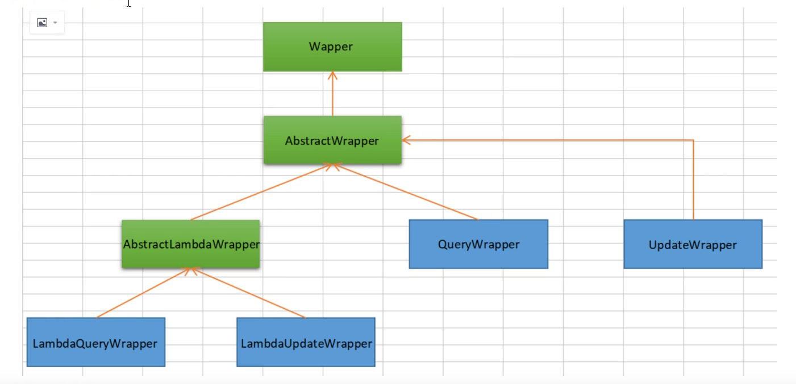

# 六、Wrapper条件构造器


> - 以下出现的第一个入参`boolean condition`表示该条件**是否**加入最后生成的sql中，例如：query.like(StringUtils.isNotBlank(name), Entity::getName, name) .eq(age!=null && age >= 0, Entity::getAge, age)
> - 以下代码块内的多个方法均为从上往下补全个别`boolean`类型的入参,默认为`true`
> - 以下出现的泛型`Param`均为`Wrapper`的子类实例(均具有`AbstractWrapper`的所有方法)
> - 以下方法在入参中出现的`R`为泛型,在普通wrapper中是`String`,在LambdaWrapper中是**函数**(例:`Entity::getId`,`Entity`为实体类,`getId`为字段`id`的**getMethod**)
> - 以下方法入参中的`R column`均表示数据库字段,当`R`具体类型为`String`时则为数据库字段名(**字段名是数据库关键字的自己用转义符包裹!**)!而不是实体类数据字段名!!!,另当`R`具体类型为`SFunction`时项目runtime不支持eclipse自家的编译器!!!
> - 以下举例均为使用普通wrapper,入参为`Map`和`List`的均以`json`形式表现!
> - 使用中如果入参的`Map`或者`List`为**空**,则不会加入最后生成的sql中!!!


## 6.1：uml图




## 6.2：代码


```java
 @Autowired
    private UserMapper userMapper;

    //    1、测试一，记住查看输出的SQL进行分析
    @Test
    void contextLoads() {
// 查询name不为空的用户，并且邮箱不为空的用户，年龄大于等于12
        QueryWrapper<Users> wrapper = new QueryWrapper<>();
        wrapper
                .isNotNull("name")

                .isNotNull("email")
                .ge("age", 12);
        userMapper.selectList(wrapper).forEach(System.out::println); // 和我们刚才学习


    }

    @Test
    void test2() {
        QueryWrapper<Users> wrapper = new QueryWrapper<>();
        wrapper.eq("name", "admin");
        Users user = userMapper.selectOne(wrapper); // 查询一个数据，出现多个结果使用List
        System.out.println(user);

    }


    @Test
    void test3() {
// 查询年龄在 20 ~ 30 岁之间的用户
        QueryWrapper<Users> wrapper = new QueryWrapper<>();
        wrapper.between("age", 20, 30); // 区间
        Long aLong = userMapper.selectCount(wrapper);// 查询结果数
        System.out.println(aLong);

    }


    // 模糊查询
    @Test
    void test4() {
// 查询年龄在 20 ~ 30 岁之间的用户
        QueryWrapper<Users> wrapper = new QueryWrapper<>();

        wrapper
                .notLike("name", "e")
                .likeRight("email", "t")
                .likeLeft("email", "t")
        ;
        wrapper.like("email", "abc");
        List<Map<String, Object>> maps = userMapper.selectMaps(wrapper);

        maps.forEach(System.out::println);

    }

    // 模糊查询
    @Test
    void test5() {
        QueryWrapper<Users> wrapper = new QueryWrapper<>();
        // id 在子查询中查出来
        wrapper.inSql("id", "select id from users where id<3");
        List<Object> objects = userMapper.selectObjs(wrapper);
        objects.forEach(System.out::println);
    }

    //测试六
    @Test
    void test6() {
        QueryWrapper<Users> wrapper = new QueryWrapper<>();
        // 通过id进行排序
        wrapper.orderByAsc("id");
        List<Users> users = userMapper.selectList(wrapper);
        users.forEach(System.out::println);
    }
```


