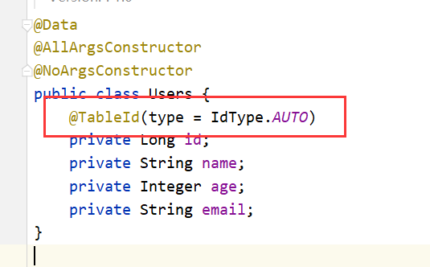
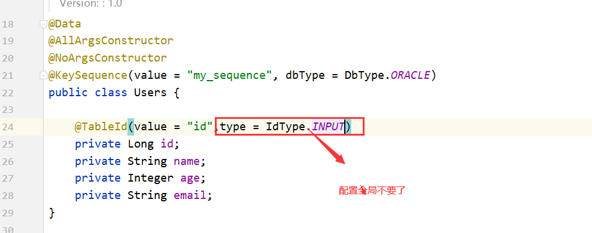
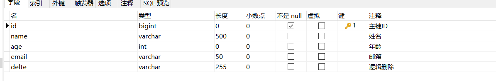
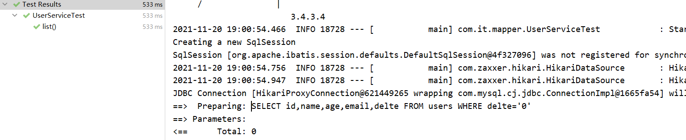
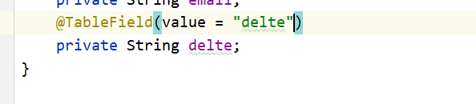
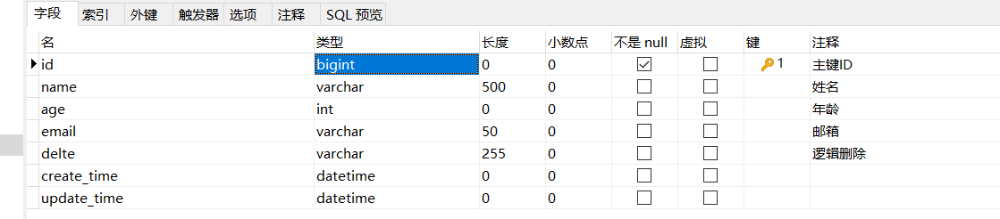
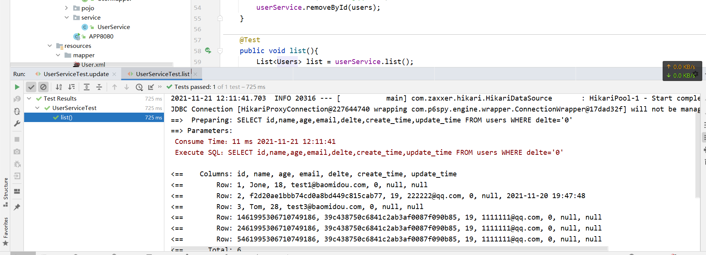

# 七、扩展


## 1.主键生成策略


### 1.1：全局设置


```yaml
mybatis-plus:
  global-config:
    db-config:
      id-type: auto
```


这里的idtype属性：


|     值      |                             描述                             |
| :---------: | :----------------------------------------------------------: |
|    auto     |                         数据库ID自增                         |
|    none     | 无状态,该类型为未设置主键类型(注解里等于跟随全局,全局里约等于 INPUT) |
|    input    |                    insert前自行set主键值                     |
|  assign_id  | 分配ID(主键类型为Number(Long和Integer)或String)(since 3.3.0),使用接口`IdentifierGenerator`的方法`nextId`(默认实现类为`DefaultIdentifierGenerator`雪花算法) |
| assign_uuid | 分配UUID,主键类型为String(since 3.3.0),使用接口`IdentifierGenerator`的方法`nextUUID`(默认default方法) |


### 2.2：单一设置





@IdType注释看注解遍


### 2.3：orcale使用序列处理主键


#### 修改全局主键配置


```yaml
mybatis-plus:
  global-config:
    db-config:
      id-type: input
```


#### 配置主键使用序列





## 2.逻辑删除


### 描述


> 物理删除 ：从数据库中直接移除 
>
> 逻辑删除 ：再数据库中没有被移除，而是通过一个变量来让他失效！ deleted = 0 => deleted = 1


### 数据库增加字段





### 全局配置


```yaml
mybatis-plus:
  global-config:
    db-config:
      id-type: input
      logic-delete-field: delete  # 全局逻辑删除的实体字段名(since 3.3.0,配置后可以忽略不配置步骤2)
      logic-delete-value: 1 # 逻辑已删除值(默认为 1)
      logic-not-delete-value: 0 # 逻辑未删除值(默认为 0)
```

还有其他配置项查看源码





### 注解配置


注解配置优先级高于全局配置




## 3.使用配置文件


我们知道mybatis-plus的底层是mybatis，所以我们使用映射文件


### 配置


```yaml
mybatis-plus:
  mapper-locations: classpath*:/mapper/**/*.xml
```


### UserMapper.java


```java
@Repository
public interface UserMapper  extends BaseMapper<Users> {

    List<Users> selectName( String name);
}
```


### UserMapper.xml


```java
<?xml version="1.0" encoding="utf-8" ?>
<!DOCTYPE mapper
        PUBLIC "-//mybatis.org//DTD Mapper 3.0//EN"
        "http://mybatis.org/dtd/mybatis-3-mapper.dtd">
<mapper namespace="com.it.mapper.UserMapper">
    <select id="selectName" resultType="com.it.pojo.Users">
        SELECT id, name
        FROM users
        WHERE name = #{name}
    </select>
</mapper>
```


### 测试


```java
   @Test
    public void testsss() {
        userMapper.selectName("admin");
    }
```


## 4.分页查询-配置类


### 配置类


```java
@Configuration
public class MybatisPlusConfig {
    // 旧版
    @Bean
    public PaginationInterceptor paginationInterceptor() {
        PaginationInterceptor paginationInterceptor = new PaginationInterceptor();
        // 设置请求的页面大于最大页后操作， true调回到首页，false 继续请求  默认false
        // paginationInterceptor.setOverflow(false);
        // 设置最大单页限制数量，默认 500 条，-1 不受限制
        // paginationInterceptor.setLimit(500);
        // 开启 count 的 join 优化,只针对部分 left join
        paginationInterceptor.setCountSqlParser(new JsqlParserCountOptimize(true));
        return paginationInterceptor;
    }

    // 最新版
    @Bean
    public MybatisPlusInterceptor mybatisPlusInterceptor() {
        MybatisPlusInterceptor interceptor = new MybatisPlusInterceptor();
        interceptor.addInnerInterceptor(new PaginationInnerInterceptor(DbType.MySql));
        return interceptor;
    }
}
```


### 代码


```java
    @Test
    public void pages() {
        Page page = new Page(1, 1);
        //mapper
        userMapper.selectPage(page, null);
        //service
        Page page1 = userService.page(page, null);
        //两种获取对象的方法
        List orders = page1.getOrders();
        List records = page1.getRecords();
    }
```


## 5.分页查询-xml格式


### UserMapper.java


```java
@Repository
public interface UserMapper  extends BaseMapper<Users> {

       /**
     * <p>
     * 查询 : 根据state状态查询用户列表，分页显示
     * </p>
     *
     * @param page 分页对象,xml中可以从里面进行取值,传递参数 Page 即自动分页,必须放在第一位(你可以继承Page实现自己的分页对象)
     * @paras state 状态
     * @return 分页对象
     */
    IPage<Users> selectPageVo(Page<?> page, String name);
}
```


### UserMapper.xml


```java
<?xml version="1.0" encoding="utf-8" ?>
<!DOCTYPE mapper
        PUBLIC "-//mybatis.org//DTD Mapper 3.0//EN"
        "http://mybatis.org/dtd/mybatis-3-mapper.dtd">
<mapper namespace="com.it.mapper.UserMapper">
    <select id="selectPageVo" resultType="com.it.pojo.Users">
        SELECT id, name
        FROM users
        WHERE name = #{name}
    </select>
</mapper>
```


### 测试


```java
   @Test
    public void testsss() {
        Page page = new Page(1, 1);
        userMapper.selectPageVo(page,"admin");
    }
```


## 6.自动填充


> 创建时间、修改时间！这些个操作一遍都是自动化完成的，我们不希望手动更新！
>
> 阿里巴巴开发手册：所有的数据库表：gmt_create、gmt_modifified几乎所有的表都要配置上！而且需
>
> 要自动化


### 数据库添加字段





### 完善实体类


```java
   @TableField(fill = FieldFill.INSERT)
    private Date createTime;
    @TableField(fill = FieldFill.INSERT_UPDATE)
    private LocalDateTime updateTime;
```


### 配置类


```java

    /**
     * 设置自动填充
     *
     * @return
     */
    @Bean
    public MetaObjectHandler myMetaObjectHandler() {

        return new MetaObjectHandler() {
            @Override
            public void insertFill(MetaObject metaObject) {
                log.info("start insert fill ....");
                this.strictInsertFill(metaObject, "createTime", Date.class, new Date()); // 起始版本 3.3.0(推荐使用)
                // 或者
                this.strictInsertFill(metaObject, "createTime", () -> new Date(), Date.class); // 起始版本 3.3.3(推荐)
                // 或者
                this.fillStrategy(metaObject, "createTime", new Date()); // 也可以使用(3.3.0 该方法有bug)
            }

            @Override
            public void updateFill(MetaObject metaObject) {
                log.info("start update fill ....");
                this.strictUpdateFill(metaObject, "updateTime", LocalDateTime.class, LocalDateTime.now()); // 起始版本 3.3.0(推荐)
                // 或者
                this.strictUpdateFill(metaObject, "updateTime", () -> LocalDateTime.now(), LocalDateTime.class); // 起始版本 3.3.3(推荐)
                // 或者
                this.fillStrategy(metaObject, "updateTime", LocalDateTime.now()); // 也可以使用(3.3.0 该方法有bug)
            }
        };
    }
}
```


### 测试


执行添加修改删除操作查看数据库时间字段数据变化


## 7.sql分析打印


> 该功能依赖 `p6spy` 组件，完美的输出打印 SQL 及执行时长 `3.1.0` 以上版本


### pom


```java
        <dependency>
            <groupId>p6spy</groupId>
            <artifactId>p6spy</artifactId>
            <version>3.9.1</version>
        </dependency>
```


### 配置文件


```java
spring:
  datasource:
    driver-class-name: com.p6spy.engine.spy.P6SpyDriver
    username: root
    password: 123456
    url:  jdbc:p6spy:mysql://localhost:3306/test?useSSL=false&useUnicode=true&characterEncoding=utf-8&serverTimezone=GMT%2B8
```


### spy.properties


```properties
#3.2.1以上使用
modulelist=com.baomidou.mybatisplus.extension.p6spy.MybatisPlusLogFactory,com.p6spy.engine.outage.P6OutageFactory
#3.2.1以下使用或者不配置
#modulelist=com.p6spy.engine.logging.P6LogFactory,com.p6spy.engine.outage.P6OutageFactory
# 自定义日志打印
logMessageFormat=com.baomidou.mybatisplus.extension.p6spy.P6SpyLogger
#日志输出到控制台
appender=com.baomidou.mybatisplus.extension.p6spy.StdoutLogger
# 使用日志系统记录 sql
#appender=com.p6spy.engine.spy.appender.Slf4JLogger
# 设置 p6spy driver 代理
deregisterdrivers=true
# 取消JDBC URL前缀
useprefix=true
# 配置记录 Log 例外,可去掉的结果集有error,info,batch,debug,statement,commit,rollback,result,resultset.
excludecategories=info,debug,result,commit,resultset
# 日期格式
dateformat=yyyy-MM-dd HH:mm:ss
# 实际驱动可多个
#driverlist=org.h2.Driver
# 是否开启慢SQL记录
outagedetection=true
# 慢SQL记录标准 2 秒
outagedetectioninterval=2
```


### 测试





## 8.数据安全保护


> 该功能为了保护数据库配置及数据安全，在一定的程度上控制开发人员流动导致敏感信息泄露。


https://mp.baomidou.com/guide/safety.html


## 9.乐观锁


### 简介


> 乐观锁 : 故名思意十分乐观，它总是认为不会出现问题，无论干什么不去上锁！如果出现了问题，再次更新值测试
>
> 悲观锁：故名思意十分悲观，它总是认为总是出现问题，无论干什么都会上锁！再去操作！


> ##### OptimisticLockerInnerInterceptor
>
> > 当要更新一条记录的时候，希望这条记录没有被别人更新
> > 乐观锁实现方式：
> >
> > > - 取出记录时，获取当前version
> > > - 更新时，带上这个version
> > > - 执行更新时， set version = newVersion where version = oldVersion
> > > - 如果version不对，就更新失败

- **支持的数据类型只有:int,Integer,long,Long,Date,Timestamp,LocalDateTime**

### 配置类


```java
// Spring Boot 方式
@Configuration
@MapperScan("按需修改")
public class MybatisPlusConfig {
    /**
     * 旧版
     */
    @Bean
    public OptimisticLockerInterceptor optimisticLockerInterceptor() {
        return new OptimisticLockerInterceptor();
    }
    
    /**
     * 新版
     */
    @Bean
    public MybatisPlusInterceptor mybatisPlusInterceptor() {
        MybatisPlusInterceptor mybatisPlusInterceptor = new MybatisPlusInterceptor();
        mybatisPlusInterceptor.addInnerInterceptor(new OptimisticLockerInnerInterceptor());
        return mybatisPlusInterceptor;
    }
}
```


### pojo


```java
    @Version
    private Integer version;
```


### 代码


```java
// 测试乐观锁失败！多线程下 
@Test
public void testOptimisticLocker2(){ 
    // 线程 1
    User user = userMapper.selectById(1L); user.setName("kuangshen111"); 
    user.setEmail("24736743@qq.com"); 
    // 模拟另外一个线程执行了插队操作 
    User user2 = userMapper.selectById(1L); user2.setName("kuangshen222"); user2.setEmail("24736743@qq.com"); userMapper.updateById(user2); 
    // 自旋锁来多次尝试提交！
    userMapper.updateById(user); 
    // 如果没有乐观锁就会覆盖插队线程的值！
}
```


## 10.代码生成器


### pom


```java
       <dependency>
            <groupId>com.baomidou</groupId>
            <artifactId>mybatis-plus-generator</artifactId>
            <version>3.5.1</version>
        </dependency>
        <dependency>
            <groupId>org.apache.velocity</groupId>
            <artifactId>velocity-engine-core</artifactId>
            <version>2.2</version>
        </dependency>
```


### java


```java
package com.it.mapper;

import com.baomidou.mybatisplus.generator.FastAutoGenerator;
import com.baomidou.mybatisplus.generator.config.DataSourceConfig;
import com.baomidou.mybatisplus.generator.config.OutputFile;
import com.baomidou.mybatisplus.generator.engine.FreemarkerTemplateEngine;
import org.apache.ibatis.jdbc.ScriptRunner;

import java.io.InputStream;
import java.io.InputStreamReader;
import java.sql.Connection;
import java.sql.SQLException;
import java.util.Collections;

/**
 * 描述 ：
 *
 * @author : 小糊涂
 * @version : 1.0
 * @createTime :  2021/11/21 12:55
 **/
public class Test {

    /**
     * 执行初始化数据库脚本
     */
    public static void before() throws SQLException {
        Connection conn = DATA_SOURCE_CONFIG.build().getConn();
        InputStream inputStream = Test.class.getResourceAsStream("/sql/init.sql");
        ScriptRunner scriptRunner = new ScriptRunner(conn);
        scriptRunner.setAutoCommit(true);
        scriptRunner.runScript(new InputStreamReader(inputStream));
        conn.close();
    }

    /**
     * 数据源配置
     */
    private static final DataSourceConfig.Builder DATA_SOURCE_CONFIG = new DataSourceConfig
            .Builder("jdbc:mysql://localhost:3306/test?useSSL=false&useUnicode=true&characterEncoding=utf-8&serverTimezone=GMT%2B8", "root", "123456");

    /**
     * 执行 run
     */
    public static void main(String[] args) throws SQLException {
     //   before();
        FastAutoGenerator.create("url", "username", "password")
                .globalConfig(builder -> {
                    builder.author("baomidou") // 设置作者
                            .enableSwagger() // 开启 swagger 模式
                            .fileOverride() // 覆盖已生成文件
                            .outputDir("D://"); // 指定输出目录
                })
                .packageConfig(builder -> {
                    builder.parent("com.baomidou.mybatisplus.samples.generator") // 设置父包名
                            .moduleName("system") // 设置父包模块名
                            .pathInfo(Collections.singletonMap(OutputFile.mapperXml, "D://")); // 设置mapperXml生成路径
                })
                .strategyConfig(builder -> {
                    builder
                            .addInclude("t_simple") // 设置需要生成的表名
                            .addTablePrefix("t_", "c_"); // 设置过滤表前缀

                })
                .templateEngine(new FreemarkerTemplateEngine()) // 使用Freemarker引擎模板，默认的是Velocity引擎模板
                .execute();
    }
}
```


