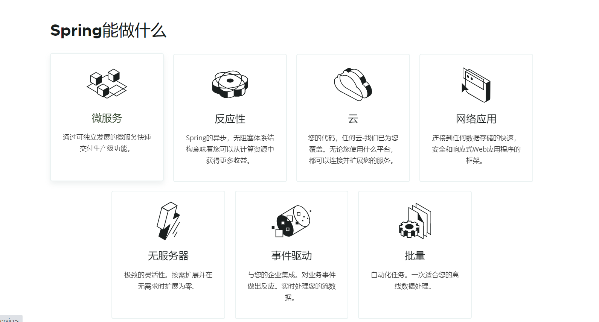
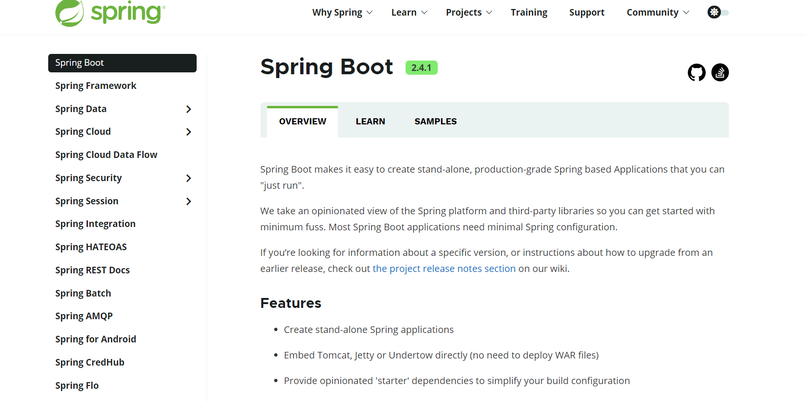
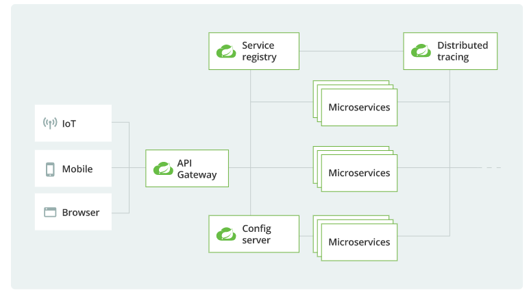
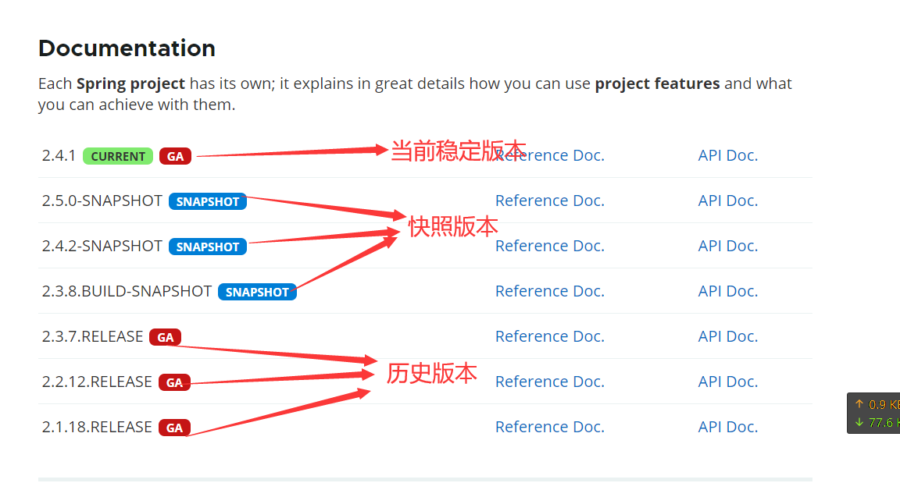
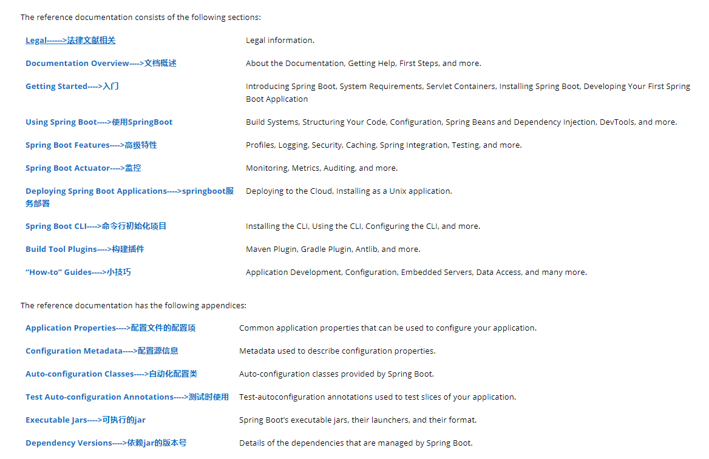
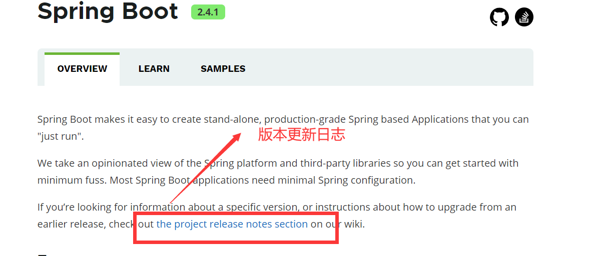

# 一、简介

## 1.1：Spring能做什么

## 1.2：Spring生态圈

官网：https://spring.io/projects/spring-boot

覆盖了：

+ web开发

+ 数据访问

+ 安全控制

+ 分布式

+ 消息服务

+ 移动开发

+ 批处理

+ ......

## 1.3：微服务

怎么说，先看一下[James Lewis and Martin Fowler (2014)])  提出微服务完整概念。https://martinfowler.com/microservices/

> In short, the **microservice architectural style** is an approach to developing a single application as a **suite of
small services**, each **running in its own process** and communicating with **lightweight** mechanisms, often an **HTTP
** resource API. These services are **built around business capabilities** and **independently deployable** by fully *
*automated deployment** machinery. There is a **bare minimum of centralized management** of these services, which may be
**written in different programming languages** and use different data storage
> technologies.-- [James Lewis and Martin Fowler (2014)]()

上面一段话大概的意思就是

> 简而言之，**微服务架构风格**是一种将单个应用程序开发为一套小型服务的方法，每个服务运行在自己的进程中，并与**轻量级**机制(
> 通常是**HTTP**资源API)通信。这些服务**围绕业务能力**构建，**通过完全**自动化部署**机器**独立部署。这些服务可能使用不同的编程语言
**编写，使用不同的数据存储技术**，但对这些服务的集中管理**是最低限度的。——[詹姆斯·刘易斯和马丁·福勒(2014)]()

+ 微服务是一种架构风格

+ 一个应用拆分为一组小型服务

+ 每个服务运行在自己的进程内，也就是可独立部署和升级

+ 服务之间使用轻量级HTTP交互

+ 服务围绕业务功能拆分

+ 可以由全自动部署机制独立部署

+ 去中心化，服务自治。服务可以使用不同的语言、不同的存储技术

> + 个人理解
    >
    >
    微服务，可以简单的来说，我们把一个大型的项目，拆分成一个一个小的项目，部署在一个一个服务器上，虽然这样我们可以通过监控软件来看到每一个服务的运行状态，来对服务的管理；但是呢？正因为我们的服务是一个一个分开的部署，我们的服务与服务之间又有了很多问题，比如服务之间的链路断裂，服务之间的数据同步等等都牵涉到了很多问题！而这个时候分布式的概念就与之而来了？

## 1.4：分布式

### 1.是什么

“分布式计算是近年提出的一种新的计算方式，所谓分布式计算就是在两个或多个软件互相共享信息，这些软件既可以在同一台计算机上运行，也可以在通过网络连接起来的多台计算机上运行。”

### 2.分布式困难之处

+ 远程调用
+ 服务发现
+ 负载均衡
+ 服务容错
+ 配置管理
+ 服务监控
+ 链路追踪
+ 日志管理
+ 任务调度
+ 部署困难等等

### 3.解决方案

spring boot +spring cloud

## 1.5：云原生

### 1.是什么

原生应用如何上云。 Cloud Native

云原生从字面意思上来看可以分成**云**和**原生**两个部分。

云是和本地相对的，传统的应用必须跑在本地服务器上，现在流行的应用都跑在云端，云包含了IaaS,、PaaS和SaaS。

原生就是土生土长的意思，我们在开始设计应用的时候就考虑到应用将来是运行云环境里面的，要充分利用云资源的优点，比如️云服务的*
*弹性**和**分布式**优势。

### 2.上云的困难

- 服务自愈
- 弹性伸缩
- 服务隔离
- 自动化部署
- 灰度发布
- 流量治理
- ......

### 3.解决方案

现在主流的应该是，docker容器化部署，和k8s这一套，目前没学过，后续更新笔记。

## 1.6：官方文档

https://spring.io/projects/spring-boot#learn

我们看最新的稳定版本就可以，点击`Reference Doc.`链接进入以下页面：

==（上面的翻译是修改html页面加的，并不是官网的）==

## 1.7：2.4更新内容

https://github.com/spring-projects/spring-boot/wiki/Spring-Boot-2.4-Release-Notes

