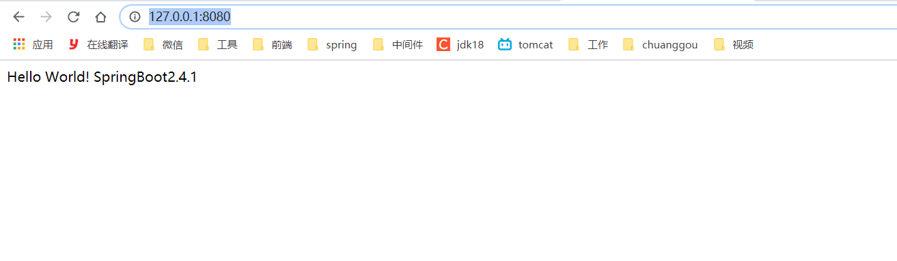
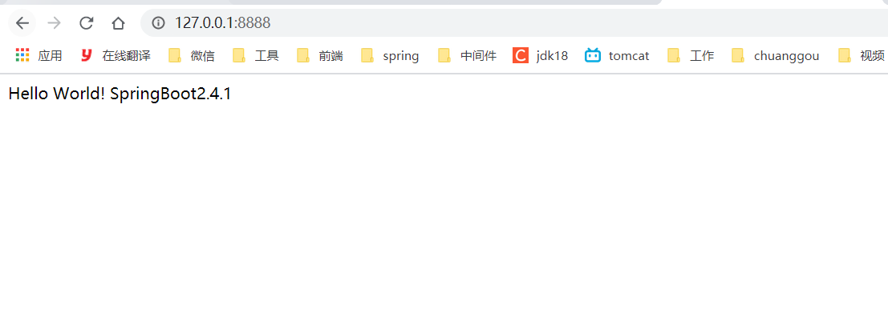

# 二、HelloWorld

## 2.1：环境要求

> Spring Boot 2.4.1 requires [Java 8]() and is compatible up to Java 15 (
> included). [Spring Framework 5.3.2](https://docs.spring.io/spring/docs/5.3.2/reference/html/) or above is also
> required.
>
> Explicit build support is provided for the following build tools:
>
> | Build Tool | Version                                                      |
> | :--------- | :----------------------------------------------------------- |
> | Maven      | 3.3+                                                         |
> | Gradle     | 6 (6.3 or later). 5.6.x is also supported but in a deprecated form |
>
> jdk版本必须是8以上
>
> Spring Boot supports the following embedded servlet containers:
>
> | Name         | Servlet Version |
> | :----------- | :-------------- |
> | Tomcat 9.0   | 4.0             |
> | Jetty 9.4    | 3.1             |
> | Undertow 2.0 | 4.0             |

## 2.2：创建maven工程引入pom

==第一次下载可能比较慢==

```xml
<!--springboot父工程-->
<parent>
    <groupId>org.springframework.boot</groupId>
    <artifactId>spring-boot-starter-parent</artifactId>
    <version>2.4.1</version>
</parent>
<dependencies>
<!--springboot web启动器-->
<dependency>
    <groupId>org.springframework.boot</groupId>
    <artifactId>spring-boot-starter-web</artifactId>
</dependency>
</dependencies>
```

## 2.3：创建启动类

```java

@SpringBootApplication
public class HelloWorldMain {
    public static void main(String[] args) {
        SpringApplication.run(HelloWorldMain.class);
    }
}
```

## 2.4：创建controller

```java

@RestController
public class HelloWorldController {

    @GetMapping
    public String hello() {
        System.out.println("Hello World! SpringBoot2.4.1 ");
        return "Hello World! SpringBoot2.4.1 ";
    }
}
```

## 2.5：测试

启动项目，访问：http://127.0.0.1:8080/




## 2.6：更改端口号

在`resource`目录下新建立`application.properties`文件写入以下内容

```properties
server.port=8888
```

重新运行项目访问：http://127.0.0.1:8888/




## 2.7：简化部署

pom文件加入以下插件：

```xml

<build>
    <plugins>
        <plugin>
            <groupId>org.springframework.boot</groupId>
            <artifactId>spring-boot-maven-plugin</artifactId>
        </plugin>
    </plugins>
</build>
```

运行

```powershell
 mvn clean package
```

打成jar包，执行以下命令启动项目

```powershell
java -jar jar包名字
```

注意点：

- 取消掉cmd的快速编辑模式


