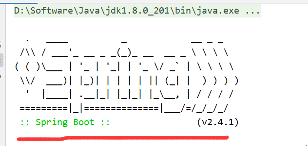
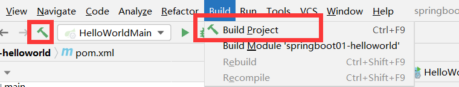
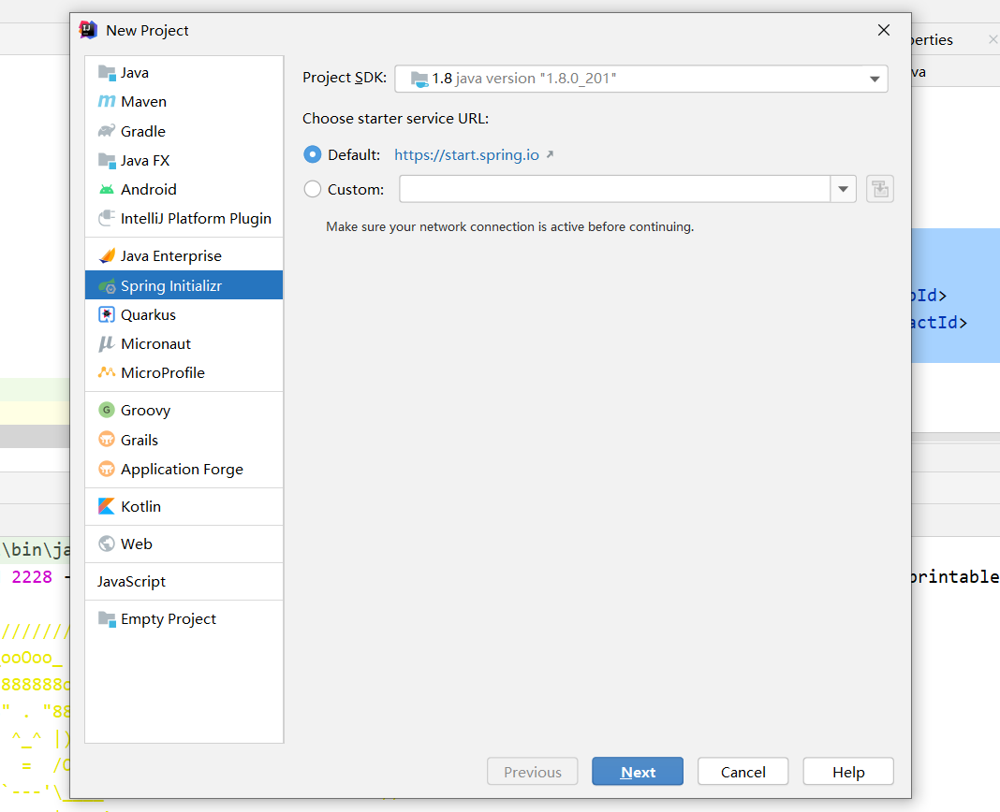

# 三、基础

## 3.1：依赖管理

```xml
<!--springboot父工程-->
<parent>
    <groupId>org.springframework.boot</groupId>
    <artifactId>spring-boot-starter-parent</artifactId>
    <version>2.4.1</version>
</parent>
<!--spring-boot-starter-parent的父项目-->
  <parent>
    <groupId>org.springframework.boot</groupId>
    <artifactId>spring-boot-dependencies</artifactId>
    <version>2.4.1</version>
  </parent>
```

上面的是springboot的父项目—–`spring-boot-dependencies`我们打开后发现他**几乎声明了所有开发中常用的依赖的版本号,自动版本仲裁机制
**

- 无需关注版本号，自动版本仲裁

```
1、引入依赖默认都可以不写版本
2、引入非版本仲裁的jar，要写版本号。
```

## 3.2：修改默认依赖版本

```xml
<!-- 1、查看spring-boot-dependencies里面规定当前依赖的版本 用的 key -->
<!-- 2、在当前项目里面重写配置 -->
<properties>
    <mysql.version>5.1.43</mysql.version>
</properties>
```

## 3.3：start场景启动器

启动器是一组方便的依赖描述符，可以包含在应用程序中。您可以一站式购买所需的所有Spring和相关技术，而不必遍历示例代码并复制粘贴依赖描述符。例如，如果您想开始使用Spring和JPA来访问数据库，那么在您的项目中包含Spring
-boot-starter-data- JPA依赖项。

启动器包含大量的依赖项，您需要这些依赖项才能使项目启动并快速运行，并具有一致的、受支持的托管传递依赖项集。


> 有正式启动者都遵循类似的命名模式;`spring-boot-starter-`，其中`*`
> 是一种特殊类型的应用程序。这种命名结构是为了帮助您找到一个初学者。许多`idea`中的`Maven`
> 集成允许您按名称搜索依赖项。例如，安装了适当的`Eclipse`或`STS`插件后，您可以在`POM`编辑器中按`ctrl-space`
> 并键入`“spring-boot-starter”`来获得完整的列表。
>
>
>
> 正如“创建自己的启动器”一节中所解释的，第三方启动器不应该使用Spring - Boot，因为它是为正式的Spring
> Boot工件保留的。相反，第三方启动者通常从项目的名称开始。例如，*
*一个名为thirdpartyproject的第三方启动项目通常被命名为thirdpartyproject-spring-boot-starter。**


更多关于start启动器请查看下面网址：

https://docs.spring.io/spring-boot/docs/current/reference/html/using-spring-boot.html#using-boot-starter

## 3.4：自定义bannber

### 1.操作




springboot启动时，这个图标就是bananer，我们可以修改一下：

`resource`下面建立`bananer.txt`文件写入以下内容：

```text
${AnsiColor.BRIGHT_YELLOW}
////////////////////////////////////////////////////////////////////
//                          _ooOoo_                               //
//                         o8888888o                              //
//                         88" . "88                              //
//                         (| ^_^ |)                              //
//                         O\  =  /O                              //
//                      ____/`---'\____                           //
//                    .'  \\|     |//  `.                         //
//                   /  \\|||  :  |||//  \                        //
//                  /  _||||| -:- |||||-  \                       //
//                  |   | \\\  -  /// |   |                       //
//                  | \_|  ''\---/''  |   |                       //
//                  \  .-\__  `-`  ___/-. /                       //
//                ___`. .'  /--.--\  `. . ___                     //
//              ."" '<  `.___\_<|>_/___.'  >'"".                  //
//            | | :  `- \`.;`\ _ /`;.`/ - ` : | |                 //
//            \  \ `-.   \_ __\ /__ _/   .-` /  /                 //
//      ========`-.____`-.___\_____/___.-`____.-'========         //
//                           `=---='                              //
//      ^^^^^^^^^^^^^^^^^^^^^^^^^^^^^^^^^^^^^^^^^^^^^^^^^^        //
//            佛祖保佑       永不宕机     永无BUG                  //
////////////////////////////////////////////////////////////////////
${AnsiColor.BRIGHT_RED}
Application Version: ${application.version}${application.formatted-version}
Spring Boot Version: ${spring-boot.version}${spring-boot.formatted-version}
```

### 2.配置文件

```properties
spring.banner.charset=utf-8
spring.banner.image.location=classpath:banner.txt
```

### 3.在线生成banner地址

https://www.bootschool.net/ascii;bsid=EAE08493039D20222BA17B48A919C903

当然可以直接放一个图片

## 3.5：lomback

### 1.引入依赖

```xml
<!--lombok-->
<dependency>
    <groupId>org.projectlombok</groupId>
    <artifactId>lombok</artifactId>
</dependency>
```

### 2.测试

```java
//===============================简化JavaBean开发===================================
@NoArgsConstructor
//@AllArgsConstructor
@Data
@ToString
@EqualsAndHashCode
public class User {

    private String name;
    private Integer age;

    private Pet pet;

    public User(String name,Integer age){
        this.name = name;
        this.age = age;
    }

}

//================================简化日志开发===================================
@Slf4j
@RestController
public class HelloController {
    @RequestMapping("/hello")
    public String handle01(@RequestParam("name") String name){
        log.info("请求进来了....");
        return "Hello, Spring Boot 2!"+"你好："+name;
    }
}
```

## 3.6：dev-tools

### 1.官方地址

https://docs.spring.io/spring-boot/docs/current/reference/html/using-spring-boot.html#using-boot-devtools

### 2.pom

```xml
<!--热部署devtools-->
<dependency>
    <groupId>org.springframework.boot</groupId>
    <artifactId>spring-boot-devtools</artifactId>
    <optional>true</optional>
</dependency>
```

### 3.使用

项目或者页面修改以后：Ctrl+F9；

或者点击：



## 3.7：Spring Initailizr

+ 自动依赖引入
+ 自动创建项目结构
+ 自动编写好主配置类




