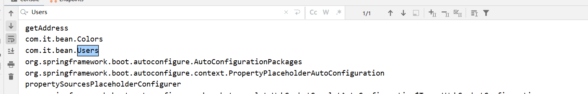
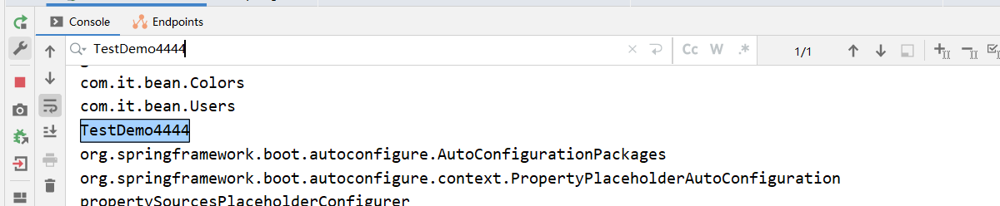
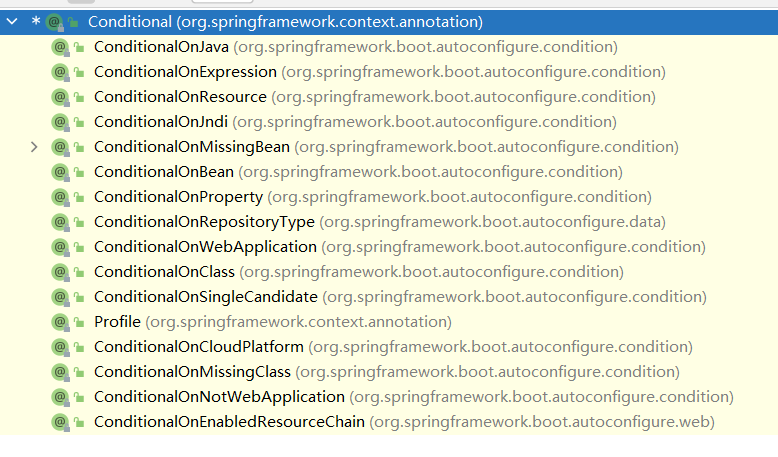
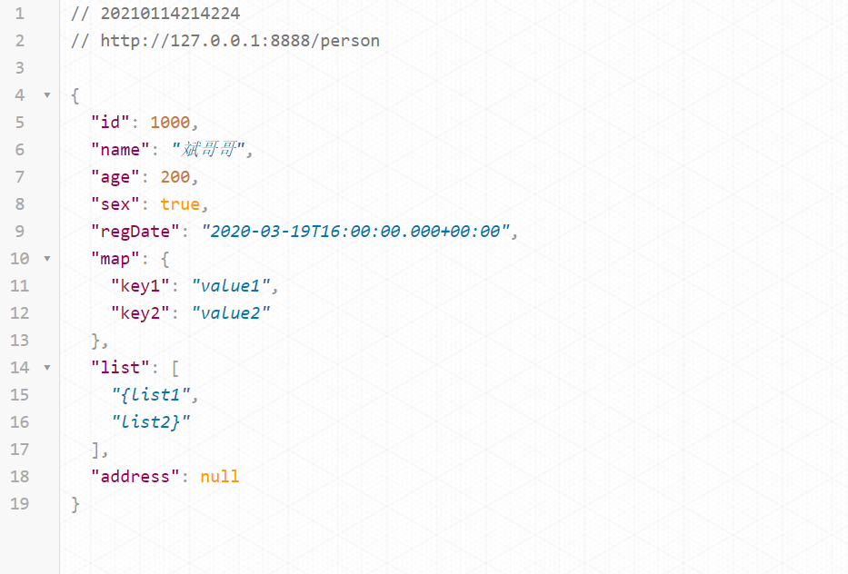
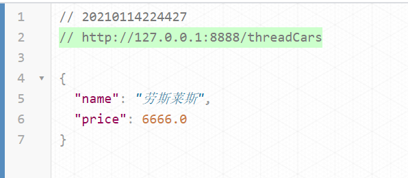
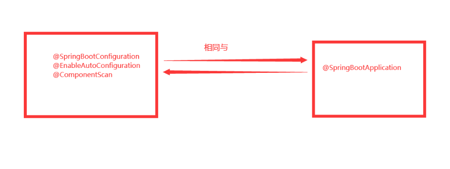
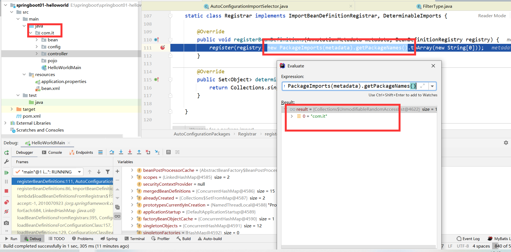
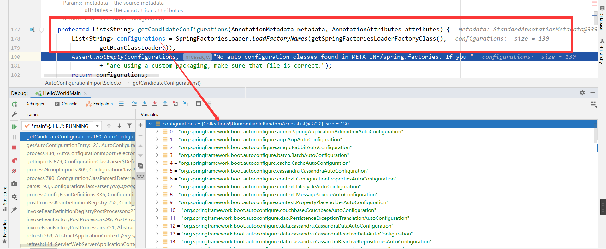
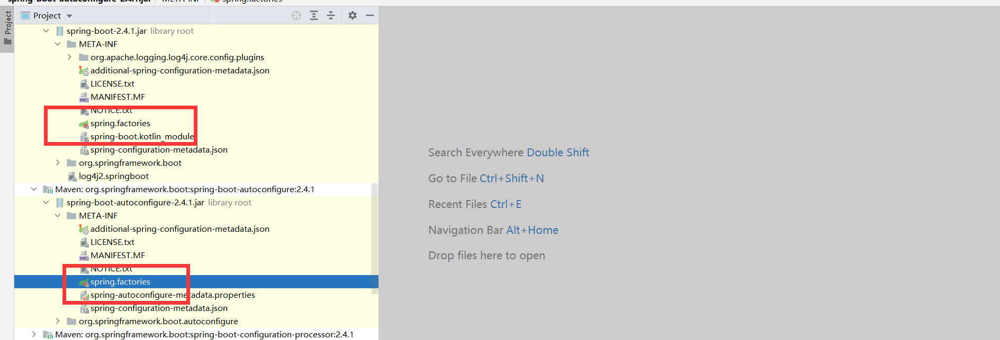

# 四、自动装配

## 4.1：简介

在前面使用[SSM集成]()
时，我们可以使用注解实现无配置化注入，但是这种依赖被进行“人工干预了的”，换句话就是说我们手动进行装配，那么此时还没有达到SpringBoot这种自动装配的效果，那么究竟SpringBoot如何进行自动装配的呢?下面我们就一探究竟


> 举个可能不是很恰当的例子，SpringBoot的自动配置原理，跟餐厅的机制很类似。如果将SpringBoot比喻成餐厅，把吃饭比做我们的餐厅点菜小程序应用，我们来到探鱼吃饭的时候（
**相当于在应用中加入了@SpringBootApplication**），服务员会引导我们开始在菜单点餐纸上点餐（*
*菜单点餐纸是预先定义好的，就相当于spring.factories文件，预先定义了我们可以使用的自动配置信息**
> ），餐厅既可以自行搭配烤鱼口味，也可以直接点店家为我们搭配好的口味（*
*springboot也是如此，比如消息中间件，就有好多种口味可以选，比如rabbitmq，kafka，根据业务场景而定**），我们在喜欢的菜上进行勾选（
**相当于在pom文件中引入所需框架的starter**），然后确定下单（**启动springboot应用**
> ）。我很喜欢吃花菜，可惜餐厅没有这道辅菜，但是我们可以自己准备然后带过去啊，烤鱼上了就加进去煮，真是骚操作（*
*这就是加入自定义的自动配置了，这一步比较麻烦，需要自行封装starter**）。

## 4.2：@SpringBootApplication

源码如下：

```java

@Target({ElementType.TYPE})
@Retention(RetentionPolicy.RUNTIME)
@Documented
@Inherited
@SpringBootConfiguration
@EnableAutoConfiguration
@ComponentScan(
        excludeFilters = {@Filter(
                type = FilterType.CUSTOM,
                classes = {TypeExcludeFilter.class}
        ), @Filter(
                type = FilterType.CUSTOM,
                classes = {AutoConfigurationExcludeFilter.class}
        )}
)
public @interface SpringBootApplication {
    //代码请参考源码，我们关注这个注解使用了那些复合注解
}
```

我们发现去掉一些`jdk`本身的注解，我们发现重要的注解是这三个：

```java
@SpringBootConfiguration
@EnableAutoConfiguration
@ComponentScan
```

并且在这个类中的注释和官网文档中都有一句相似但是又很重要的话：<font color='red'>@SpringBootApplication same as
@Configuration @EnableAutoConfiguration @ComponentScan，</font>就是说我们这个`@SpringBootApplication`注解**等价**
与`@Configuration `、`@EnableAutoConfiguration` 、`@ComponentScan`

## 4.3：@Configuration

### 1.准备实体类

```java
/**
 * 用户
 */
public class Users {
    private String name;
    private int age;
    private Address address;
    //get、set
}

/**
 *地址
 */
public class Address {
    private String address;
}
```

### 2.spring配置

我们使用spring的时候我们是使用spring.xml的方式来配置这一些类

```xml

<beans>
    <bean id="user" class="com.it.bena.Users">
        <property name="address" ref="address"/>
        <property name="name" value="tom"/>
        <property name="age" value="12"/>
    </bean>
    <bean id="address" class="com.it.bena.Address">
        <property name="address" value="火星"/>
    </bean>
</beans>
```

### 3.SpringBoot方式

* `@Configuration` 这个注解等同与我们`spring`中的配置文件
* `@Bean`和被`@Bean`标注的方法 相当与我们`spring`配置文件中`bean标签`

```java

@Configuration
public class BeansConfig {

    @Bean
    public Users getUsers() {
        Users users = new Users();
        users.setName("admin");
        users.setAge(10);
        users.setAddress(getAddress());
        return users;
    }

    @Bean
    public Address getAddress() {
        Address address = new Address();
        address.setAddress(UUID.randomUUID().toString());
        return address;
    }
}
```

### 4.测试

```java

@SpringBootApplication
public class HelloWorldMain {

    public static void main(String[] args) {
        ConfigurableApplicationContext run = SpringApplication.run(HelloWorldMain.class);
        String[] beanDefinitionNames = run.getBeanDefinitionNames();
        System.out.println("======================SpringBoot加载了那些组件======================");
        Arrays.stream(beanDefinitionNames).forEach(System.out::println);
        System.out.println("======================SpringBoot======================");
        Users user1 = run.getBean("user1", Users.class);
        System.out.println(user1);
        Users user2 = run.getBean("user2", Users.class);
        System.out.println(user2);
    }
}
/**
 ======================SpringBoot======================
 Users{name='admin', age=10, address=Address{address='83f7d34c-bb26-4c90-8e31-58a55a71910b'}}
 Users{name='admin', age=10, address=Address{address='83f7d34c-bb26-4c90-8e31-58a55a71910b'}}
 **/
```

### 5.proxyBeanMethods属性

springboot2.0后`@Configuration`出现了一个新的属性，    `proxyBeanMthodes`

它的默认值默认是`true`

+ true的时候加载了一次，
+ 而为false的时候加载了两次

| 模式   | 属性值                      | 简介                           |
|------|--------------------------|------------------------------|
| Full | proxyBeanMethods = true  | 保证每个@Bean方法被调用多少次返回的组件都是单实例的 |
| Lite | proxyBeanMethods = false | 每个@Bean方法被调用多少次返回的组件都是新创建的   |

<font color='red'>表格中说的方法被调用的时候不是我们获取bean去调用，而是spring的application容器被加载的时候调用的</font>

### 6.最佳实战

-
    -
        - 配置 类组件之间无依赖关系用Lite模式加速容器启动过程，减少判断
- 配置类组件之间有依赖关系，方法会被调用得到之前单实例组件，用Full模式

## 4.4：常用组件注解

| name           | message |
|----------------|---------|
| @Bean          | 组件      |
| @Component     | 实体类组件   |
| @Controller    | 控制器组件   |
| @Repository    | 数据库组件   |
| @ComponentScan | 包扫描     |
| @Service       | 业务逻辑组件  |

## 4.5：@Import

### 1.重点

+ spring3.0之后出现的新注解

+ springboot使用的时候必须配合组件类注解使用，否则不生效

+ 给容器中自动创建出这两个类型的组件、默认组件的名字就是全类名

使用方法：

+ 1、直接填class数组方式
+ 2、ImportSelector方式【重点】
+ 3、ImportBeanDefinitionRegistrar方式

### 2.直接填class数组方式

```java
//==================颜色类=================
public class Colors {
    public void getColor() {
        System.out.println("获取颜色");
    }
}

//==================配置类=================
@Import(value = {Colors.class})
@Configuration
public class ColorsConfig {

}
```

> 测试

```java

@SpringBootApplication
public class HelloWorldMain {
    public static void main(String[] args) {
        ConfigurableApplicationContext run = SpringApplication.run(HelloWorldMain.class);
        Colors bean = run.getBean(Colors.class.getName(), Colors.class);
        bean.getColor();
    }
}
/**
 获取颜色
 **/
```

### 3.ImportSelector方式

这种方式的前提就是一个类要实现`ImportSelector`接口，假如我要用这种方法，目标对象是`Myclass`
这个类，分析具体如下：创建`Myclass`类并实现`ImportSelector`接口

分析实现接口的selectImports方法中的：

- 1、返回值： 就是我们实际上要导入到容器中的组件全类名【**重点** 】
- 2、参数： AnnotationMetadata表示当前被@Import注解给标注的所有注解信息【不是重点】

<font color='red'>需要注意的是selectImports方法可以返回空数组但是不能返回null，否则会报空指针异常！></font>


> 第一步：创建Myclass类并实现ImportSelector接口，这里用于演示就添加一个全类名给其返回值

```java
public class MyClass implements ImportSelector {
    @Override
    public String[] selectImports(AnnotationMetadata importingClassMetadata) {
        System.out.println("===============");
        //这里写入我们注入的全类名
        return new String[]{Users.class.getName()};
    }
}
```

> 第二步：编写TestDemo 类，并标注上使用ImportSelector方式的Myclass类

```java

@Import(MyClass.class)
@Configuration
public class MyClassConfig {
}
```

> 第三步：编写打印容器中的组件测试类

```java

@SpringBootApplication
public class HelloWorldMain {
    public static void main(String[] args) {
        ConfigurableApplicationContext run = SpringApplication.run(HelloWorldMain.class);
        String[] beanDefinitionNames = run.getBeanDefinitionNames();
        System.out.println("======================SpringBoot加载了那些组件======================");
        Arrays.stream(beanDefinitionNames).forEach(System.out::println);
        System.out.println("======================SpringBoot======================");
    }
}
```



### 4.ImportBeanDefinitionRegistrar方式

同样是一个接口，类似于第二种ImportSelector用法，相似度80%，只不过这种用法比较自定义化注册，具体如下：

> 第一步：创建Myclass2类并实现ImportBeanDefinitionRegistrar接口

```java
public class Myclass2 implements ImportBeanDefinitionRegistrar {

    /**
     * 第一个参数：annotationMetadata 和之前的ImportSelector参数一样都是表示当前被@Import注解给标注的所有注解信息
     * 第二个参数表示用于注册定义一个bean
     */
    @Override
    public void registerBeanDefinitions(AnnotationMetadata importingClassMetadata, BeanDefinitionRegistry registry) {
//指定bean定义信息（包括bean的类型、作用域...）
        RootBeanDefinition rootBeanDefinition = new RootBeanDefinition(Address.class);
        //注册一个bean指定bean名字（id）
        registry.registerBeanDefinition("TestDemo4444", rootBeanDefinition);
    }
}
```

> 第二步：编写代码，自定义注册bean

```java

@Import(Myclass2.class)
@Configuration
public class Myclass2Config {
}
```

> 第三步：测试

```java

@SpringBootApplication
public class HelloWorldMain {
    public static void main(String[] args) {
        ConfigurableApplicationContext run = SpringApplication.run(HelloWorldMain.class);
        String[] beanDefinitionNames = run.getBeanDefinitionNames();
        System.out.println("======================SpringBoot加载了那些组件======================");
        Arrays.stream(beanDefinitionNames).forEach(System.out::println);
        System.out.println("======================SpringBoot======================");
    }
}
```



### 5.总结

> 第一种用法：`@Import`（{ 要导入的容器中的组件 } ）：容器会自动注册这个组件，**id默认是全类名**
>
> 第二种用法：`ImportSelector`：返回需要导入的组件的全类名数组，springboot底层用的特别多【**重点** 】
>
> 第三种用法：`ImportBeanDefinitionRegistrar`：手动注册bean到容器

**以上三种用法方式皆可混合在一个@Import中使用，特别注意第一种和第二种都是以全类名的方式注册，而第三中可自定义方式。**

@Import注解本身在springboot中用的很多，特别是其中的第二种用法ImportSelector方式在springboot中使用的特别多，尤其要掌握！

## 4.6：@Conditional

### 1.简介

+ 条件装配：满足Conditional指定的条件，则进行组件注入

+ @Conditional是Spring4新提供的注解，它的作用是按照一定的条件进行判断，满足条件给容器注册bean。



### 2.案例

```java
=====================测试条件装配==========================

@Configuration(proxyBeanMethods = false)
//@ConditionalOnBean(name = "tom")//当存在tom这个实例对象才可以使用此配置类
@ConditionalOnMissingBean(name = "tom")//当tom被实例化才可以初始化此配置类
public class MyConfig {

    @Bean
    public User user01() {
        User zhangsan = new User("zhangsan", 18);
        //user组件依赖了Pet组件
        zhangsan.setPet(tomcatPet());
        return zhangsan;
    }

    @Bean("tom22")
    public Pet tomcatPet() {
        return new Pet("tomcat");
    }
}

    public static void main(String[] args) {
        //1、返回我们IOC容器
        ConfigurableApplicationContext run = SpringApplication.run(MainApplication.class, args);

        //2、查看容器里面的组件
        String[] names = run.getBeanDefinitionNames();
        for (String name : names) {
            System.out.println(name);
        }

        boolean tom = run.containsBean("tom");
        System.out.println("容器中Tom组件：" + tom);

        boolean user01 = run.containsBean("user01");
        System.out.println("容器中user01组件：" + user01);

        boolean tom22 = run.containsBean("tom22");
        System.out.println("容器中tom22组件：" + tom22);
    }
```

## 4.7：@ImportResource

主要是引入我们的spring配置文件

### 1.创建spring配置文件

```text
<?xml version="1.0" encoding="UTF-8"?>
<beans xmlns="http://www.springframework.org/schema/beans"
       xmlns:xsi="http://www.w3.org/2001/XMLSchema-instance"
       xsi:schemaLocation="http://www.springframework.org/schema/beans http://www.springframework.org/schema/beans/spring-beans.xsd">

    <bean id="haha" class="com.it.bean.Users">
        <property name="name" value="zhangsan"></property>
        <property name="age" value="18"></property>
    </bean>

    <bean id="hehe" class="com.it.bean.Address">
        <property name="address" value="tomcat"></property>
    </bean>
</beans>
```

### 2.在启动类或者配置类上面加上注解：

```java
  @ImportResource("classpath:bean.xml")//引入spring配置文件
```

### 3.测试

```java

@SpringBootApplication
@ImportResource("classpath:bean.xml")
public class HelloWorldMain {
    public static void main(String[] args) {
        ConfigurableApplicationContext run = SpringApplication.run(HelloWorldMain.class);
        boolean haha = run.containsBean("haha");
        boolean hehe = run.containsBean("hehe");
        System.out.println("haha：" + haha);//true
        System.out.println("hehe：" + hehe);//true
    }
}
/**
 打印结果：
 haha：true
 hehe：true
 **/
```

## 4.8：@ConfigurationProperties

### 1.简介

主要用于数据绑定，我们在需要的绑定数据的类上加上`组件型`注解，然后使用`@ConfigurationProperties`
注解标明我们数据绑定的前缀。当然我们还可以使用：`@EnableConfigurationProperties`

注意：

+ 如果使用yaml文件来进行数据绑定我们需要一个新的start启动器

+ 注解中prefix中不能出现**大写字母**

```xml

<dependency>
    <groupId>org.springframework.boot</groupId>
    <artifactId>spring-boot-configuration-processor</artifactId>
    <optional>true</optional>
</dependency>
```

### 2.实体类

> Person

```java

@Component("person")
@ConfigurationProperties(prefix = "person")
public class Person {
    private int id;
    private String name;
    private int age;
    private boolean sex;
    private Date regDate;
    private Map<String, Object> map = new HashMap<>();
    private List<Object> list;
    private Son address;
    //get、set自己写
}
```

> Son

```java

@Component
@ConfigurationProperties(prefix = "son")
public class Son {
    private int id;
    private String name;
    //get、set自己写
}
```

### 3.proterties类型配置

```properties
person.id=1000
person.name=斌哥哥
person.sex=true
person.reg-date=2020/03/20
person.age=200
person.map.key1=value1
person.map.key2=value2
person.list=list1,list2
person.son.id=1
person.son.name=河南洛阳
```

### 4.ymal类型配置

```yaml
user:
  id: 1000
  name: bingege
  age: 21
  sex: true
  reg-date: 2020/03/20
  map: { key1: value1,key2: value2,key3: value3 }
  list:
    - a
    - b
    - c
    - d
    - e
  address:
    id: 1
    name: 河南省洛阳市
```

### 5.测试

```java
    @Autowired
private Person person;

@GetMapping("/person")
public Person person(){
        return person;
        }
```

游览器访问：http://127.0.0.1:8888/person



### 6.@EnableConfigurationProperties

我们可以使用：`@EnableConfigurationProperties`注解，但是注意这个注解我们要么在**启动类**上使用，要么在**配置类上**使用。

并且**实体类**上必须有`@ConfigurationProperties`注解

看案例：


> 实体类

```java

@ConfigurationProperties(prefix = "threacar")
public class ThreadCars {
    private String name;
    private Double price;
}
```

> 配置类

```java

@Configuration
@EnableConfigurationProperties(value = {ThreadCars.class})
//1、开启ThreadCars配置绑定功能
//2、把这个ThreadCars这个组件自动注册到容器中
public class ThreadCarsConfig {

}
```

> 配置文件

```properties
threaCar.name=劳斯莱斯
threaCar.price=6666
```

> 测试

```Java
@Autowired
private ThreadCars threadCars;

@GetMapping("/threadCars")
public ThreadCars threadCars(){
        return threadCars;
        }
```

访问：http://127.0.0.1:8888/threadCars




## 4.9：源码解析

### 1.先看@SpringBootApplicatio

#### 1.1：源码

```java

@SpringBootConfiguration
@EnableAutoConfiguration
@ComponentScan(excludeFilters = {@Filter(type = FilterType.CUSTOM, classes = TypeExcludeFilter.class),
        @Filter(type = FilterType.CUSTOM, classes = AutoConfigurationExcludeFilter.class)})
public @interface SpringBootApplication {
```

我们前面说：



接下来我们开始一个一个注解开始查看

#### 1.2：@SpringBootConfiguration

```java

@Target(ElementType.TYPE)
@Retention(RetentionPolicy.RUNTIME)
@Documented
@Configuration
public @interface SpringBootConfiguration {
}
```

我们发现只有一个`@Configuration`这个注解,这个注解是一个**标明springboot配置类的注解**，被他标明的类标明当前的类是一个配置类，而我们的
**启动类**是一个特别重要的配置类。

#### 1.3：@ComponentScan

这个注解就不多说了，学习spring的时候学过这个注解，他指定扫描哪些，Spring注解；

```java
@ComponentScan(excludeFilters = {@Filter(type = FilterType.CUSTOM, classes = TypeExcludeFilter.class),
        @Filter(type = FilterType.CUSTOM, classes = AutoConfigurationExcludeFilter.class)})
```

它这里使用spring官方定义的规范。

#### 1.4：@EnableAutoConfiguration

请查看下一章节 [四、自动装配—>4.9:源码分析—–>2.@EnableAutoConfiguration][]


------

### 2.@EnableAutoConfiguration

#### 2.1：源码

```java

@AutoConfigurationPackage
@Import(AutoConfigurationImportSelector.class)
public @interface EnableAutoConfiguration {
}
```

#### 2.2：@AutoConfigurationPackage

`AutoConfigurationPackage`翻译过来就是`自动配置包`

```java

@Target(ElementType.TYPE)
@Retention(RetentionPolicy.RUNTIME)
@Documented
@Inherited
@Import(AutoConfigurationPackages.Registrar.class)
public @interface AutoConfigurationPackage {
}
```

在这个注解上面也有一个`@Import`注解，我们查看一下源码这个注解帮我们导入了那些配置类，
**（源码位置在AutoConfigurationPackages的107行）**

```java
static class Registrar implements ImportBeanDefinitionRegistrar, DeterminableImports {

    @Override
    public void registerBeanDefinitions(AnnotationMetadata metadata, BeanDefinitionRegistry registry) {
        register(registry, new PackageImports(metadata).getPackageNames().toArray(new String[0]));
    }

    @Override
    public Set<Object> determineImports(AnnotationMetadata metadata) {
        return Collections.singleton(new PackageImports(metadata));
    }

}
```

#### 2.3：debug调试

先看`new PackageImports(metadata).getPackageNames()`这个方法得到了什么，`com.it`
这个包名是我们主启动类所在包下以及子包的目录，这也证明了，我们在写springboot程序时，不可以在**主程序所在包，以及子包外去写我们的组件类
**

+ 总结一下

> ```java
> @Import(AutoConfigurationPackages.Registrar.class)  //给容器中导入一个组件
> public @interface AutoConfigurationPackage {}
> ```
>
> + **利用Registrar给容器中导入一系列组件**
> + **将指定的一个包下的所有组件导入进来？主程序 所在包下**




#### 2.4：@Import(AutoConfigurationImportSelector.class)

查看`AutoConfigurationImportSelector`的源码：

```java
public class AutoConfigurationImportSelector implements DeferredImportSelector, BeanClassLoaderAware,
        ResourceLoaderAware, BeanFactoryAware, EnvironmentAware, Ordered {
    /**
     省略一些代码
     **/
    /**
     将我们springboot的配置类，注册到我们的apllication容器中
     **/
    @Override
    public String[] selectImports(AnnotationMetadata annotationMetadata) {
        if (!isEnabled(annotationMetadata)) {
            return NO_IMPORTS;
        }
        AutoConfigurationEntry autoConfigurationEntry = getAutoConfigurationEntry(annotationMetadata);
        return StringUtils.toStringArray(autoConfigurationEntry.getConfigurations());
    }

    //源码118行  我们getCandidateConfigurations(annotationMetadata, attributes);获取到的全部的配置类，但是有一些配置类不需要，通过这个这个方法筛选出来我们需要的配置类
    protected AutoConfigurationEntry getAutoConfigurationEntry(AnnotationMetadata annotationMetadata) {
        if (!isEnabled(annotationMetadata)) {
            return EMPTY_ENTRY;
        }
        AnnotationAttributes attributes = getAttributes(annotationMetadata);
        List<String> configurations = getCandidateConfigurations(annotationMetadata, attributes);
        configurations = removeDuplicates(configurations);
        Set<String> exclusions = getExclusions(annotationMetadata, attributes);
        checkExcludedClasses(configurations, exclusions);
        configurations.removeAll(exclusions);
        configurations = getConfigurationClassFilter().filter(configurations);
        fireAutoConfigurationImportEvents(configurations, exclusions);
        return new AutoConfigurationEntry(configurations, exclusions);
    }

    //源码152行  获取AnnotationAttributes对象的，这里面
    protected AnnotationAttributes getAttributes(AnnotationMetadata metadata) {
        String name = getAnnotationClass().getName();
        AnnotationAttributes attributes = AnnotationAttributes.fromMap(metadata.getAnnotationAttributes(name, true));
        Assert.notNull(attributes, () -> "No auto-configuration attributes found. Is " + metadata.getClassName()
                + " annotated with " + ClassUtils.getShortName(name) + "?");
        return attributes;
    }

    //源码117行  从META-INF/spring.factories获取到加载的配置类	
    protected List<String> getCandidateConfigurations(AnnotationMetadata metadata, AnnotationAttributes attributes) {
        List<String> configurations = SpringFactoriesLoader.loadFactoryNames(getSpringFactoriesLoaderFactoryClass(),
                getBeanClassLoader());
        Assert.notEmpty(configurations, "No auto configuration classes found in META-INF/spring.factories. If you "
                + "are using a custom packaging, make sure that file is correct.");
        return configurations;
    }
}          
```

#### 2.5：debug

我们发现它实现了 `DeferredImportSelector`这个接口，他是`ImportSelector`的子类 **（可以查看前面的@import注解的使用）**
，我们来在<font color='red'>源码95行打上断点，debug来进行</font>

+ 总结一下

> 1、利用getAutoConfigurationEntry(annotationMetadata);给容器中批量导入一些组件
>
> 2、调用`List<String> configurations = getCandidateConfigurations(annotationMetadata, attributes)`获取到所有需要导入到容器中的配置类
>
> 3、利用工厂加载`Map<String, List<String>> loadSpringFactories(@Nullable ClassLoader classLoader)`;得到所有的组件
>
> 4、从`META-INF/spring.factories`位置来加载一个文件。
>
> 默认扫描我们当前系统里面所有META-INF/spring.factories位置的文件
> spring-boot-autoconfigure-2.3.4.RELEASE.jar包里面也有META-INF/spring.factories




### 3.META-INF/spring.factories所在位置

springboot启动时会通过`@Import`这个注解，扫描所有的包下面的`META-INF/spring.factories`这个文件

文件里面写死了spring-boot一启动就要给容器中加载的所有配置类，他把所有的启动类写死了




### 4.按需装配

我们查看一下有多少个场景配置类

```java
ConfigurableApplicationContext run=SpringApplication.run(HelloWorldMain.class);
        System.out.println("一共有几个组件加载："+run.getBeanDefinitionCount());
/**
 打印结果：
 一共有几个组件加载：147
 */
```

+ 虽然我们127个场景的所有自动配置启动的时候默认全部加载。xxxxAutoConfiguration
+ 按照条件装配规则（`@Conditiona`），最终会按需配置。

### 5.修改默认配置

#### 1.简介

springboot几乎帮我们配置了所有的配置，但是我们实际开发中可能需要修改这一些配置，这个时候我们就需要自己来配置这些配置类。

+ 例如

```java
@Bean
@ConditionalOnBean(MultipartResolver.class)  //容器中有这个类型组件
@ConditionalOnMissingBean(name = DispatcherServlet.MULTIPART_RESOLVER_BEAN_NAME) //容器中没有这个名字 multipartResolver 的组件
public MultipartResolver multipartResolver(MultipartResolver resolver){
        //给@Bean标注的方法传入了对象参数，这个参数的值就会从容器中找。
        //SpringMVC multipartResolver。防止有些用户配置的文件上传解析器不符合规范
        // Detect if the user has created a MultipartResolver but named it incorrectly
        return resolver;
        }
//给容器中加入了文件上传解析器；
```

#### 2.总结

SpringBoot默认会在底层配好所有的组件。但是如果用户自己配置了以用户的优先

- SpringBoot先加载所有的自动配置类 xxxxxAutoConfiguration
- 每个自动配置类按照条件进行生效，默认都会绑定配置文件指定的值。xxxxProperties里面拿。xxxProperties和配置文件进行了绑定
- 生效的配置类就会给容器中装配很多组件
- 只要容器中有这些组件，相当于这些功能就有了
- 定制化配置

-
    - 用户直接自己@Bean替换底层的组件
- 用户去看这个组件是获取的配置文件什么值就去修改。

**xxxxxAutoConfiguration ---> 组件 --->** **xxxxProperties里面拿值 ----> application.properties**

## 4.10：实战案例

- 引入场景依赖

-
    - https://docs.spring.io/spring-boot/docs/current/reference/html/using-spring-boot.html#using-boot-starter

- 查看自动配置了哪些（选做）

-
    - 自己分析，引入场景对应的自动配置一般都生效了
- 配置文件中`debug=true`开启自动配置报告。Negative（不生效）\Positive（生效）

- 是否需要修改

-
    - 参照文档修改配置项

-
    -
        - https://docs.spring.io/spring-boot/docs/current/reference/html/appendix-application-properties.html#common-application-properties
- 自己分析。xxxxProperties绑定了配置文件的哪些。

-
    - 自定义加入或者替换组件

-
    -
        - @Bean、@Component。。。

-
    - 自定义器  **XXXXXCustomizer**；
- ......


