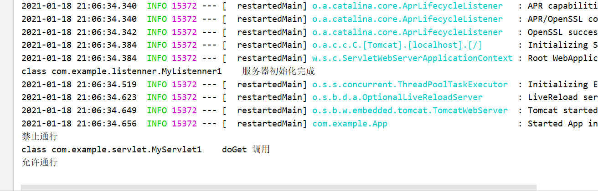
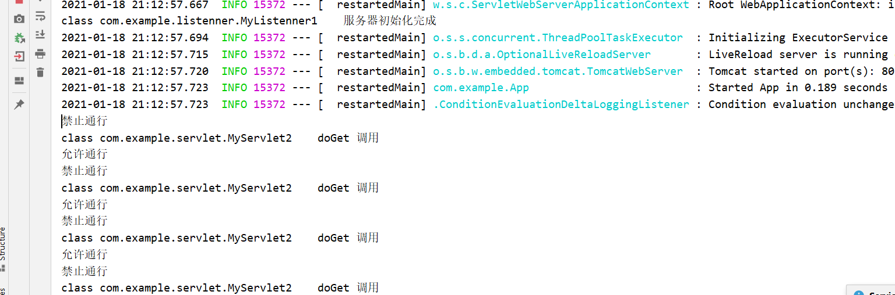
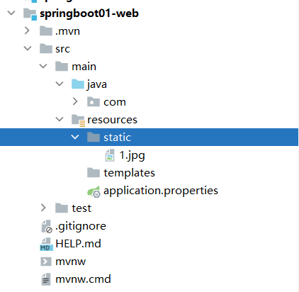
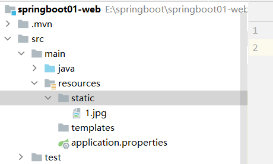
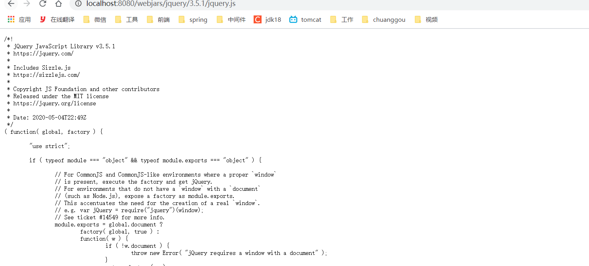
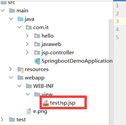
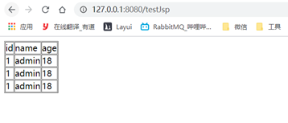
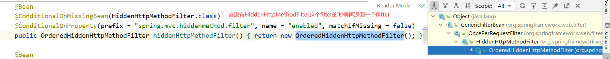
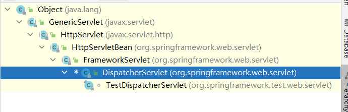
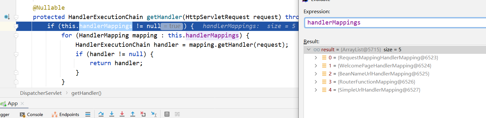

# 六、web开发

## 6.1：整合servlet/listenner/filter(方式1)

### 1.创建servlet、Linstenner、Filter

```java
===================Servlet===================================
@WebServlet(name = "MyServlet1",urlPatterns = "/servlet1")
public class MyServlet1  extends HttpServlet {
    @Override
    protected void doGet(HttpServletRequest req, HttpServletResponse resp) throws ServletException, IOException {
        System.out.println(MyServlet1.class+  "\tdoGet 调用");
        resp.getOutputStream().write("hello servlet1".getBytes());
    }
}
===================Linstenner===================================
 @WebListener
public class MyListenner1 implements ServletContextListener {
    @Override
    public void contextInitialized(ServletContextEvent sce) {
        System.out.println(MyListenner1.class+"\t服务器初始化完成");
    }

    @Override
    public void contextDestroyed(ServletContextEvent sce) {
        System.out.println(MyListenner1.class+"\t服务器死亡回调");
    }
}
===================Filter===================================
@WebFilter
public class MyFilter1 extends HttpFilter {
    public MyFilter1() {
        super();
    }

    @Override
    public void doFilter(ServletRequest request, ServletResponse response, FilterChain chain) throws IOException, ServletException {
        System.out.println("禁止通行");
        chain.doFilter(request, response);
        System.out.println("允许通行");
    }

    @Override
    protected void doFilter(HttpServletRequest request, HttpServletResponse response, FilterChain chain) throws IOException, ServletException {
        super.doFilter(request, response, chain);
    }
}

```

### 2.启动类

```java
@SpringBootApplication
//扫描servlet/listenner/filter所在的包
@ServletComponentScan(basePackages = {"com.example.servlet","com.example.listenner","com.example.filter"})
public class App {

    public static void main(String[] args) {
        SpringApplication.run(App.class, args);
    }

}
```

### 3.测试

http://127.0.0.1:8080/servlet1



## 6.2：整合servlet/listenner/filter(方式2)

### 1.前言

+ 常用的Web事件的监听接口如下：

| name                             | message                    |
|----------------------------------|----------------------------|
| ServletContextListener：          | 用于监听Web的启动及关闭              |
| ServletContextAttributeListener： | 用于监听ServletContext范围内属性的改变 |
| ServletRequestListener：          | 用于监听用户请求                   |
| ServletRequestAttributeListener： | 用于监听ServletR               |
| equest                           | 范围属性的改变                    |
| HttpSessionListener：             | 用于监听用户session的开始及结束        |
| HttpSessionAttributeListener：    | 用于监听HttpSession范围内的属性改变    |

### 1.创建servlet、Linstenner、Filter

```java
===================Servlet===================================

public class MyServlet2  extends HttpServlet {
    @Override
    protected void doGet(HttpServletRequest req, HttpServletResponse resp) throws ServletException, IOException {
        System.out.println(MyServlet2.class+  "\tdoGet 调用");
        resp.getOutputStream().write("hello servlet1".getBytes());
    }
}
===================Linstenner===================================

public class MyListenner2 implements ServletContextListener {
    @Override
    public void contextInitialized(ServletContextEvent sce) {
        System.out.println(MyListenner1.class+"\t服务器初始化完成");
    }

    @Override
    public void contextDestroyed(ServletContextEvent sce) {
        System.out.println(MyListenner2.class+"\t服务器死亡回调");
    }
}
===================Filter===================================

public class MyFilter2 extends HttpFilter {
    public MyFilter1() {
        super();
    }

    @Override
    public void doFilter(ServletRequest request, ServletResponse response, FilterChain chain) throws IOException, ServletException {
        System.out.println("禁止通行");
        chain.doFilter(request, response);
        System.out.println("允许通行");
    }

    @Override
    protected void doFilter(HttpServletRequest request, HttpServletResponse response, FilterChain chain) throws IOException, ServletException {
        super.doFilter(request, response, chain);
    }
}

```

### 2.启动类

```java
@SpringBootApplication
public class App {
    public static void main(String[] args) {
        SpringApplication.run(App.class, args);
    }
}
```

### 3.配置类

```java
@Configuration
public class WebConfig {

    	@Bean
    public ServletRegistrationBean getServlet(){
        ServletRegistrationBean<HttpServlet> registrationBean = new ServletRegistrationBean<>(new MyServlet2());
        registrationBean.addUrlMappings("/servlet2");
        return  registrationBean;
    }
        @Bean
    public ServletListenerRegistrationBean<MyListenner2> getListenner() {
        ServletListenerRegistrationBean<MyListenner2> registrationBean = new ServletListenerRegistrationBean(new MyListenner2());
        return registrationBean;
    }
    	@Bean
    public FilterRegistrationBean<MyFilter2> getFilter(){
        FilterRegistrationBean servletRegistrationBean = new FilterRegistrationBean(new MyFilter2());
        return servletRegistrationBean;
    }
}
```

### 4.测试

http://127.0.0.1:8080/servlet2




## 6.3：SpringMvc自动配置概述

Spring Boot provides auto-configuration for Spring MVC that **works well with most applications.(
大多场景我们都无需自定义配置)**

The auto-configuration adds the following features on top of Spring’s defaults:

- Inclusion of `ContentNegotiatingViewResolver` and `BeanNameViewResolver` beans.

-
    - 内容协商视图解析器和BeanName视图解析器

- Support for serving static resources, including support for WebJars (
  covered [later in this document](https://docs.spring.io/spring-boot/docs/current/reference/html/spring-boot-features.html#boot-features-spring-mvc-static-content))).

-
    - 静态资源（包括webjars）

- Automatic registration of `Converter`, `GenericConverter`, and `Formatter` beans.

-
    - 自动注册 `Converter，GenericConverter，Formatter `

- Support for `HttpMessageConverters` (
  covered [later in this document](https://docs.spring.io/spring-boot/docs/current/reference/html/spring-boot-features.html#boot-features-spring-mvc-message-converters)).

-
    - 支持 `HttpMessageConverters` （后来我们配合内容协商理解原理）

- Automatic registration of `MessageCodesResolver` (
  covered [later in this document](https://docs.spring.io/spring-boot/docs/current/reference/html/spring-boot-features.html#boot-features-spring-message-codes)).

-
    - 自动注册 `MessageCodesResolver` （国际化用）

- Static `index.html` support.

-
    - 静态index.html 页支持

- Custom `Favicon` support (
  covered [later in this document](https://docs.spring.io/spring-boot/docs/current/reference/html/spring-boot-features.html#boot-features-spring-mvc-favicon)).

-
    - 自定义 `Favicon`

- Automatic use of a `ConfigurableWebBindingInitializer` bean (
  covered [later in this document](https://docs.spring.io/spring-boot/docs/current/reference/html/spring-boot-features.html#boot-features-spring-mvc-web-binding-initializer)).

-
    - 自动使用 `ConfigurableWebBindingInitializer` ，（DataBinder负责将请求数据绑定到JavaBean上）

> If you want to keep those Spring Boot MVC customizations and make
> more [MVC customizations](https://docs.spring.io/spring/docs/5.2.9.RELEASE/spring-framework-reference/web.html#mvc) (
> interceptors, formatters, view controllers, and other features), you can add your own `@Configuration` class of
> type `WebMvcConfigurer` but **without** `@EnableWebMvc`.
>
> **不用@EnableWebMvc注解。使用** **`@Configuration`** **+** **`WebMvcConfigurer`** **自定义规则**


> If you want to provide custom instances of `RequestMappingHandlerMapping`, `RequestMappingHandlerAdapter`,
> or `ExceptionHandlerExceptionResolver`, and still keep the Spring Boot MVC customizations, you can declare a bean of
> type `WebMvcRegistrations` and use it to provide custom instances of those components.
>
> **声明** **`WebMvcRegistrations`** **改变默认底层组件**


> If you want to take complete control of Spring MVC, you can add your own `@Configuration` annotated
> with `@EnableWebMvc`, or alternatively add your own `@Configuration`-annotated `DelegatingWebMvcConfiguration` as
> described in the Javadoc of `@EnableWebMvc`.
>
> **使用** **`@EnableWebMvc+@Configuration+DelegatingWebMvcConfiguration 全面接管SpringMVC`**

## 6.4：静态资源访问

### 1.静态资源目录

+ classpath:/META-INF/resources/
+ classpath:/resources/
+ classpath:/static/ 这个是工具自动帮我们生成目录，用的最多的目录
+ classpath:/public/
+ / 当前项目的跟路径
+ src/main/webapp/

**访问 ： 当前项目根路径/ + 静态资源名**

原理： 静态映射/**。

请求进来，先去找Controller看能不能处理。不能处理的所有请求又都交给静态资源处理器。静态资源也找不到则响应404页面

改变默认的静态资源路径:

```properties
spring.resources.static-locations=classpath:resources,classpath:static 
```

例如：

照片在static文件中，游览器访问：http://127.0.0.1:8080/1.jpg



### 2.静态资源访问前缀

默认无前缀

```yaml
spring:
  mvc:
    static-path-pattern: /res/**
```

当前项目 + static-path-pattern + 静态资源名 = 静态资源文件夹下找

例如：http://127.0.0.1:8080/res/1.jpg



### 3.webjar

自动映射 /[webjars]()/**

http://www.webjars.org 这个网站上提供了常用的静态资源的jar包的maven依赖：

```xml
 <dependency>
    <groupId>org.webjars</groupId>
    <artifactId>jquery</artifactId>
    <version>3.5.1</version>
</dependency>
```

访问地址：[http://localhost:8080/webjars/**jquery/3.5.1/jquery.js**](http://localhost:8080/webjars/jquery/3.5.1/jquery.js)
后面地址要按照依赖里面的包路径




## 6.5：欢迎页支持

- 静态资源路径下 index.html

-
    - 可以配置静态资源路径
        - 但是不可以配置静态资源的访问前缀。否则导致 index.html不能被默认访问

```yaml
spring:
#  mvc:
#    static-path-pattern: /res/**   这个会导致welcome page功能失效

  resources:
    static-locations: [classpath:/haha/]
```

+ controller能处理/index

## 6.6、自定义 Favicon

favicon.ico 放在静态资源目录下即可。

```yaml
spring:
#  mvc:
#    static-path-pattern: /res/**   这个会导致 Favicon 功能失效
```

## 6.7：整合jsp

### 1.导入依赖

```xml
<dependency>
    <groupId>org.apache.taglibs</groupId>
    <artifactId>taglibs-standard-spec</artifactId>
    <version>1.2.5</version>
</dependency>
<dependency>
    <groupId>org.apache.taglibs</groupId>
    <artifactId>taglibs-standard-impl</artifactId>
    <version>1.2.5</version>
</dependency>
<dependency>
    <groupId>org.apache.tomcat.embed</groupId>
    <artifactId>tomcat-embed-jasper</artifactId>
    <version>8.5.34</version>
</dependency>
```

### 2.配置文件

````properties
spring.mvc.view.prefix=/WEB-INF/view/
spring.mvc.view.suffix=.jsp
````

### 3.创建配置文件



```text
<%@ page contentType="text/html;charset=UTF-8" language="java" %>
<%@taglib prefix="c" uri="http://java.sun.com/jsp/jstl/core" %>
<html>
<head>
    <meta charset="UTF-8">
    <title>主页</title>
</head>
<body>
<table border="1" cellpadding="0" cellspacing="1">
    <tr>
        <td>id</td>
        <td>name</td>
        <td>age</td>
    </tr>
    <c:forEach var="user" items="${requestScope.users}">
        <tr>
            <td>${user.id}</td>
            <td>${user.name}</td>
            <td>${user.age}</td>
        </tr>
    </c:forEach>
</table>
</body>
</html>
```

### 4.controller

```java
@Controller
public class TestController {
    @RequestMapping("/testJsp")
    public  String testJsp(Model model){
        Users users1 = new Users();
        users1.setId(1);
        users1.setName("admin");
        users1.setAge(18); Users users2 = new Users();
        users2.setId(1);
        users2.setName("admin");
        users2.setAge(18); Users users3 = new Users();
        users3.setId(1);
        users3.setName("admin");
        users3.setAge(18);
        List<Users> lists = new ArrayList<>();
        lists.add(users1);
        lists.add(users2);
        lists.add(users3);
        model.addAttribute("users",lists);
        return  "testJsp";
    }
}
```

### 5.测试



## 6.8：静态资源配置原理

### 1.前言

```java
@Configuration(proxyBeanMethods = false)
@ConditionalOnWebApplication(type = Type.SERVLET)
@ConditionalOnClass({ Servlet.class, DispatcherServlet.class, WebMvcConfigurer.class })
@ConditionalOnMissingBean(WebMvcConfigurationSupport.class)
@AutoConfigureOrder(Ordered.HIGHEST_PRECEDENCE + 10)
@AutoConfigureAfter({ DispatcherServletAutoConfiguration.class, TaskExecutionAutoConfiguration.class,
		ValidationAutoConfiguration.class })
public class WebMvcAutoConfiguration {
```

+ 看看容器中配置了那些

```java
@Configuration(proxyBeanMethods = false)
    @Import(EnableWebMvcConfiguration.class)
    @EnableConfigurationProperties({ WebMvcProperties.class, ResourceProperties.class })
    @Order(0)
    public static class WebMvcAutoConfigurationAdapter implements WebMvcConfigurer {}
```

+ 陪置文件的相关属性和xxx进行了绑定。
+ WebMvcProperties==**spring.mvc**、ResourceProperties==**spring.resources**

### 2.静态类WebMvcAutoConfigurationAdapter

配置类只有一个有参构造器

```java
//有参构造器所有参数的值都会从容器中确定
//ResourceProperties resourceProperties；获取和spring.resources绑定的所有的值的对象
//WebMvcProperties mvcProperties 获取和spring.mvc绑定的所有的值的对象
//ListableBeanFactory beanFactory Spring的beanFactory
//HttpMessageConverters 找到所有的HttpMessageConverters
//ResourceHandlerRegistrationCustomizer 找到 资源处理器的自定义器。=========
//DispatcherServletPath  DispatcherServlet能处理的路径
//ServletRegistrationBean   给应用注册Servlet、Filter....
@Configuration(proxyBeanMethods = false)
@Import(EnableWebMvcConfiguration.class)
@EnableConfigurationProperties({ WebMvcProperties.class,
			org.springframework.boot.autoconfigure.web.ResourceProperties.class, WebProperties.class })
@Order(0)
public static class WebMvcAutoConfigurationAdapter implements WebMvcConfigurer {
//****************************省略代码*************************************
public WebMvcAutoConfigurationAdapter(
      org.springframework.boot.autoconfigure.web.ResourceProperties resourceProperties,
      WebProperties webProperties, WebMvcProperties mvcProperties, ListableBeanFactory beanFactory,
      ObjectProvider<HttpMessageConverters> messageConvertersProvider,
      ObjectProvider<ResourceHandlerRegistrationCustomizer> resourceHandlerRegistrationCustomizerProvider,
      ObjectProvider<DispatcherServletPath> dispatcherServletPath,
      ObjectProvider<ServletRegistrationBean<?>> servletRegistrations) {
   this.resourceProperties = resourceProperties.hasBeenCustomized() ? resourceProperties
         : webProperties.getResources();
   this.mvcProperties = mvcProperties;
   this.beanFactory = beanFactory;
   this.messageConvertersProvider = messageConvertersProvider;
   this.resourceHandlerRegistrationCustomizer = resourceHandlerRegistrationCustomizerProvider.getIfAvailable();
   this.dispatcherServletPath = dispatcherServletPath;
   this.servletRegistrations = servletRegistrations;
   this.mvcProperties.checkConfiguration();
}
//****************************省略代码*************************************
```

### 3.资源处理的默认规则

```java
@Override
public void addResourceHandlers(ResourceHandlerRegistry registry) {
   if (!this.resourceProperties.isAddMappings()) {
      logger.debug("Default resource handling disabled");
      return;
   }
   Duration cachePeriod = this.resourceProperties.getCache().getPeriod();
   CacheControl cacheControl = this.resourceProperties.getCache().getCachecontrol().toHttpCacheControl();
   if (!registry.hasMappingForPattern("/webjars/**")) {
      customizeResourceHandlerRegistration(registry.addResourceHandler("/webjars/**")
            .addResourceLocations("classpath:/META-INF/resources/webjars/")
            .setCachePeriod(getSeconds(cachePeriod)).setCacheControl(cacheControl)
            .setUseLastModified(this.resourceProperties.getCache().isUseLastModified()));
   }
   String staticPathPattern = this.mvcProperties.getStaticPathPattern();
   if (!registry.hasMappingForPattern(staticPathPattern)) {
      customizeResourceHandlerRegistration(registry.addResourceHandler(staticPathPattern)
            .addResourceLocations(getResourceLocations(this.resourceProperties.getStaticLocations()))
            .setCachePeriod(getSeconds(cachePeriod)).setCacheControl(cacheControl)
            .setUseLastModified(this.resourceProperties.getCache().isUseLastModified()));
   }
}
```

```yaml
spring:
#  mvc:
#    static-path-pattern: /res/**

  resources:
    add-mappings: false   禁用所有静态资源规则
```

```java
@ConfigurationProperties(prefix = "spring.resources", ignoreUnknownFields = false)
public class ResourceProperties {
	//这里就是静态资源的默认位置
    private static final String[] CLASSPATH_RESOURCE_LOCATIONS = { "classpath:/META-INF/resources/",
            "classpath:/resources/", "classpath:/static/", "classpath:/public/" };

    /**
     * Locations of static resources. Defaults to classpath:[/META-INF/resources/,
     * /resources/, /static/, /public/].
     */
    private String[] staticLocations = CLASSPATH_RESOURCE_LOCATIONS;
```

### 4.欢迎页处理

```java
 HandlerMapping：处理器映射。保存了每一个Handler能处理哪些请求。  

    @Bean
        public WelcomePageHandlerMapping welcomePageHandlerMapping(ApplicationContext applicationContext,
                FormattingConversionService mvcConversionService, ResourceUrlProvider mvcResourceUrlProvider) {
            WelcomePageHandlerMapping welcomePageHandlerMapping = new WelcomePageHandlerMapping(
                    new TemplateAvailabilityProviders(applicationContext), applicationContext, getWelcomePage(),
                    this.mvcProperties.getStaticPathPattern());
            welcomePageHandlerMapping.setInterceptors(getInterceptors(mvcConversionService, mvcResourceUrlProvider));
            welcomePageHandlerMapping.setCorsConfigurations(getCorsConfigurations());
            return welcomePageHandlerMapping;
        }

//=======================================================================

    WelcomePageHandlerMapping(TemplateAvailabilityProviders templateAvailabilityProviders,
            ApplicationContext applicationContext, Optional<Resource> welcomePage, String staticPathPattern) {
        if (welcomePage.isPresent() && "/**".equals(staticPathPattern)) {
            //要用欢迎页功能，必须是/**
            logger.info("Adding welcome page: " + welcomePage.get());
            setRootViewName("forward:index.html");
        }
        else if (welcomeTemplateExists(templateAvailabilityProviders, applicationContext)) {
            // 调用Controller  /index
            logger.info("Adding welcome page template: index");
            setRootViewName("index");
        }
    }
```

## 6.9：Rest映射与源码解析

### 1.rest是什么

rest：REST即表述性状态传递（英文：Representational State Transfer，简称REST）是Roy
Fielding博士在2000年他的博士论文中提出来的一种软件架构风格。它是一种针对网络应用的设计和开发方式，可以降低开发的复杂性，提高系统的可伸缩性。

restful：一种软件架构风格、设计风格，而不是标准，只是提供了一组设计原则和约束条件。它主要用于客户端和服务器交互类的软件。基于这个风格设计的软件可以更简洁，更有层次，更易于实现缓存等机制。

| **URL**                                                                              | **请求方式** | **操作**   |
|--------------------------------------------------------------------------------------|----------|----------|
| `http://localhost:8080/myweb/queryById?id=1或 http://localhost:8080/myweb/query?id=1` | GET      | 根据id查询数据 |
| `http://localhost:8080/myweb/save或 http://localhost:8080/myweb/add`                  | POST     | 新增数据     |
| `http://localhost:8080/myweb/modify或 http://localhost:8080/myweb/update`             | POST     | 修改数据     |
| `http://localhost:8080/myweb/removeById?id=1`                                        | GET/POST | 根据id删除数据 |

> 一看之下是不是很不爽，同样的操作对应这各种不同的url，而且用到的Http 的请求方式要么是GET 要么是POST，然后实际上Http
> 的请求方式有八种！
>
> 正如此，restful强调的是，一种资源（操作）在网络上对应的有且仅有一个url，而用Http 自身的请求方式来阐述要进行的操作。

| **URL**                                | **请求方式** | **操作**   |
|----------------------------------------|----------|----------|
| `http://localhost:8080/myweb/query/1`  | GET      | 根据id查询数据 |
| `http://localhost:8080/myweb/add `     | POST     | 新增数据     |
| `http://localhost:8080/myweb/modify`   | PUT      | 修改数据     |
| `http://localhost:8080/myweb/remove/1` | DELETE   | 根据id删除数据 |

两个表格对比之下就简单明了，restful 风格的url 中是不带“动词”的，用请求的方式来描述“动词”，这样的话GET 请求就是查询，POST
请求就是新增，PUT 请求就是修改，DELETE 请求就是删除。

如果按照以前的话，一个查询就可以有多种url，命名不规范，不能很好的统一，这就是为什么有**restful** 的原因。

### 2.rest案例

#### 1.代码

```java
@Controller
public class RestTestController {
    @GetMapping
    public String getIndex() {
        return "rest";
    }
    @ResponseBody
    @RequestMapping(value = "/user", method = RequestMethod.GET)
    public String getUser() {
        return "GET-张三";
    }
    @ResponseBody
    @RequestMapping(value = "/user", method = RequestMethod.POST)
    public String saveUser() {
        return "POST-张三";
    }

    @ResponseBody
    @RequestMapping(value = "/user", method = RequestMethod.PUT)
    public String putUser() {
        return "PUT-张三";
    }
    @ResponseBody
    @RequestMapping(value = "/user", method = RequestMethod.DELETE)
    public String deleteUser() {
        return "DELETE-张三";
    }
}
```

#### 2.配置文件

```properties
spring.mvc.hiddenmethod.filter.enabled=true
```

这里为什么设置true的原因在`WebMvcAutoConfiguration`文件的163行：这个配置bean就是rest风格的配置bean，他这里的默认值是false

```java
@Bean
@ConditionalOnMissingBean(HiddenHttpMethodFilter.class)
@ConditionalOnProperty(prefix = "spring.mvc.hiddenmethod.filter", name = "enabled", matchIfMissing = false)
public OrderedHiddenHttpMethodFilter hiddenHttpMethodFilter() {
	return new OrderedHiddenHttpMethodFilter();
}
```

#### 3.测试

+ postman等工具测试的时候请选择请求方式,可以不配置以下代码

```yaml
spring:
  mvc:
    hiddenmethod:
      filter:
        enabled: true   #开启页面表单的Rest功能
```

+ 代码测试
    + 表单中需要配置一个`表单method=post，隐藏域 _method=put`

```html
    <form method="get" action="/user">
        <input type="hidden" value="get" name="_method">
        <input type="submit" value="提交get">
    </form>
    <form method="post" action="/user">
        <input type="hidden" value="post" name="_method">
        <input type="submit" value="提交post">
    </form>
    <form method="post" action="/user">
        <input type="hidden" value="put" name="_method">
        <input type="submit" value="提交put">
    </form>
    <form method="post" action="/user">
        <input type="hidden" value="delete" name="_method">
        <input type="submit" value="提交delete">
    </form>
```

### 3.rest请求原理

- 表单提交会带上**_method=PUT**
- **请求过来被**`HiddenHttpMethodFilter`拦截

-
    - 请求是否正常，并且是POST

-
    -
        - 获取到**_method**的值。
        - 兼容以下请求；**PUT**.**DELETE**.**PATCH**
        - **原生request（post），包装模式requesWrapper重写了getMethod方法，返回的是传入的值。**
        - **过滤器链放行的时候用wrapper。以后的方法调用getMethod是调用requesWrapper的。**

```java
public class HiddenHttpMethodFilter extends OncePerRequestFilter {
   private static final List<String> ALLOWED_METHODS =
         Collections.unmodifiableList(Arrays.asList(HttpMethod.PUT.name(),
               HttpMethod.DELETE.name(), HttpMethod.PATCH.name()));

   /** Default method parameter: {@code _method}. */
   public static final String DEFAULT_METHOD_PARAM = "_method";

   private String methodParam = DEFAULT_METHOD_PARAM;
   /**
    * Set the parameter name to look for HTTP methods.
    * @see #DEFAULT_METHOD_PARAM
    */
   public void setMethodParam(String methodParam) {
      Assert.hasText(methodParam, "'methodParam' must not be empty");
      this.methodParam = methodParam;
   }

   @Override
   protected void doFilterInternal(HttpServletRequest request, HttpServletResponse response, FilterChain filterChain)
         throws ServletException, IOException {

      HttpServletRequest requestToUse = request;

      if ("POST".equals(request.getMethod()) && request.getAttribute(WebUtils.ERROR_EXCEPTION_ATTRIBUTE) == null) {
         String paramValue = request.getParameter(this.methodParam);
         if (StringUtils.hasLength(paramValue)) {
            String method = paramValue.toUpperCase(Locale.ENGLISH);
            if (ALLOWED_METHODS.contains(method)) {
               requestToUse = new HttpMethodRequestWrapper(request, method);
            }
         }
      }

      filterChain.doFilter(requestToUse, response);
   }


   /**
    * Simple {@link HttpServletRequest} wrapper that returns the supplied method for
    * {@link HttpServletRequest#getMethod()}.
    */
   private static class HttpMethodRequestWrapper extends HttpServletRequestWrapper {

      private final String method;

      public HttpMethodRequestWrapper(HttpServletRequest request, String method) {
         super(request);
         this.method = method;
      }

      @Override
      public String getMethod() {
         return this.method;
      }
   }
}
```

### 4.更改 _method

#### 1.先看源码



#### 2.自定义

```java
@Configuration(proxyBeanMethods = false)
public class RestWebConfig {
    @Bean
    public HiddenHttpMethodFilter getHiddenHttpMethodFilter() {
        HiddenHttpMethodFilter hiddenHttpMethodFilter = new HiddenHttpMethodFilter();
        hiddenHttpMethodFilter.setMethodParam("method");
        return hiddenHttpMethodFilter;
    }
}
```

## 6.10：请求映射原理

### 1.前言

我们的每一次请求，都是怎么进入到每一个Handler里面呢？

我们知道springboot还是springmvc那么我们看源码的时候还是看`DispatcherServlet`这个类

查看继承关系我们`DispatcherServlet`这个类也是一个`Servlet`,那么这里面也有`doGet`或者`doPost`方法，但是`DispatcherServlet`
没有重写这两个方法，我们需要到他的父类`FrameworkServlet`里面找，**源码895行左右，源码在下面**
，他们里面都调用了一个方法`processRequest`;



```java
/**
 * Delegate GET requests to processRequest/doService.
 * <p>Will also be invoked by HttpServlet's default implementation of {@code doHead},
 * with a {@code NoBodyResponse} that just captures the content length.
 * @see #doService
 * @see #doHead
 */
@Override
protected final void doGet(HttpServletRequest request, HttpServletResponse response)
      throws ServletException, IOException {
   processRequest(request, response);
}
/**
 * Delegate POST requests to {@link #processRequest}.
 * @see #doService
 */
@Override
protected final void doPost(HttpServletRequest request, HttpServletResponse response)
      throws ServletException, IOException {
   processRequest(request, response);
}

/**
 * Delegate PUT requests to {@link #processRequest}.
 * @see #doService
 */
@Override
protected final void doPut(HttpServletRequest request, HttpServletResponse response)
      throws ServletException, IOException {
   processRequest(request, response);
}
/**
 * Delegate DELETE requests to {@link #processRequest}.
 * @see #doService
 */
@Override
protected final void doDelete(HttpServletRequest request, HttpServletResponse response)
      throws ServletException, IOException {

   processRequest(request, response);
}
```

### 2.processRequest方法

我们从上面知道springboot再`FrameworkServlet`重写了`doGet、doPost、doPut`的方法，并且里面都调用了`processRequest`方法：*
*（源码988行）**

```java
protected final void processRequest(HttpServletRequest request, HttpServletResponse response)
      throws ServletException, IOException {
	//省略代码
   try {
       //调用doService方法，这个方法也是最重要的方法
      doService(request, response);
   }
   catch (ServletException | IOException ex) {
      failureCause = ex;
      throw ex;
   }
	//省略代码
}
```

### 3.doService方法

我们查看上方的源码，发现他最终带上了`request`,`reponse`这两个参数去调用`doService`
这个方法，但是这个方法是我们的`DispatcherServlet`重写的方法**(源码923行)**

```java
@Override
protected void doService(HttpServletRequest request, HttpServletResponse response) throws Exception {
	//省略代码
   try {
      doDispatch(request, response);
   }
	//省略代码
}
```

> **doDispatch**
>
> + 这个方法的名字是转发
> + 我们来查看`DispatcherServlet`的**源码(1021行)**

```java
protected void doDispatch(HttpServletRequest request, HttpServletResponse response) throws Exception {
   HttpServletRequest processedRequest = request;//这个request对象
   HandlerExecutionChain mappedHandler = null;//springboot对异常的处理
   boolean multipartRequestParsed = false;//是否上传文件请求
   WebAsyncManager asyncManager = WebAsyncUtils.getAsyncManager(request);//异步处理
   try {
      ModelAndView mv = null;
      Exception dispatchException = null;
      try {
         processedRequest = checkMultipart(request);//检查是否文件上传
         multipartRequestParsed = (processedRequest != request);
         // Determine handler for the current request.
         mappedHandler = getHandler(processedRequest);//重要的方法，这里面封装了我们所有的Handler的请求，他里面帮我们决定了到底是哪个handler来处理请求的
        /**
        *下方省略代码，具体查看源码1021行
        **/
   }
}
```

### 4.getHandler方法

```java
@Nullable
protected HandlerExecutionChain getHandler(HttpServletRequest request) throws Exception {
   if (this.handlerMappings != null) {
      for (HandlerMapping mapping : this.handlerMappings) {
         HandlerExecutionChain handler = mapping.getHandler(request);
         if (handler != null) {
            return handler;
         }
      }
   }
   return null;
}
```




这里面封装了五个springboot自己的`HandlerMapping`:

+ RequestMappingHandlerMapping**保存了所有@RequestMapping 和handler的映射规则**
+ WelcomePageHandlerMapping
+ BeanNameUrlHandlerMapping
+ RouterFunctionMapping
+ SimpleUrlHandlerMapping

> <font color='red'>**所有的请求映射都在HandlerMapping中。**               </font>
>
> <font color='red'>SpringBoot自动配置欢迎页的 WelcomePageHandlerMapping 。访问 /能访问到index.html；</font>
>
> <font color='red'>SpringBoot自动配置了默认 的 RequestMappingHandlerMapping</font>
>
> <font color='red'>请求进来，挨个尝试所有的HandlerMapping看是否有请求信息。</font>
>
> <font color='red'>如果有就找到这个请求对应的handler</font>
>
> <font color='red'>如果没有就是下一个 HandlerMapping</font>
>
> <font color='red'>我们需要一些自定义的映射处理，我们也可以自己给容器中放HandlerMapping。自定义 HandlerMapping</font>f

### 5.提醒看源码流程


