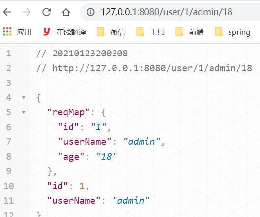
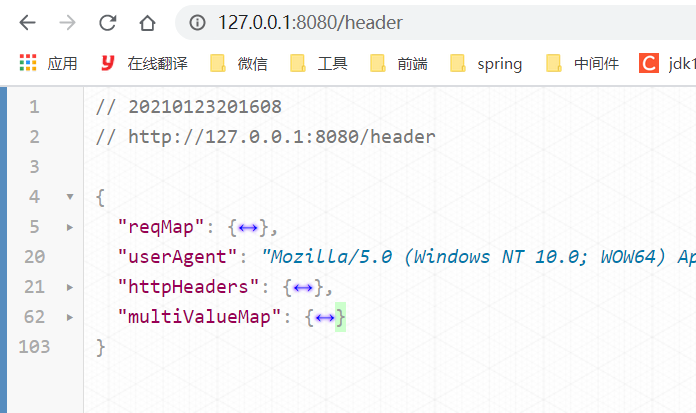
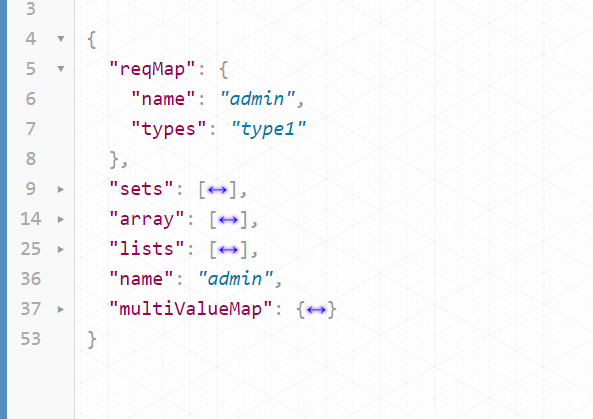
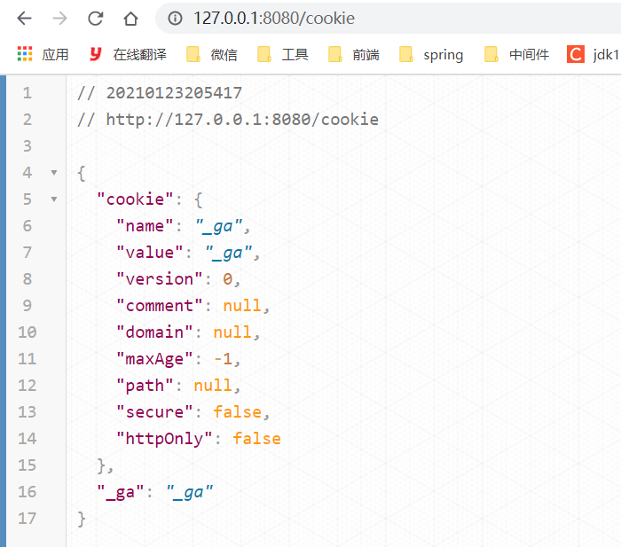
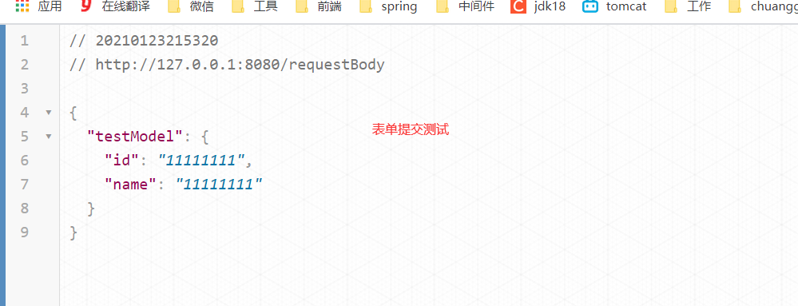
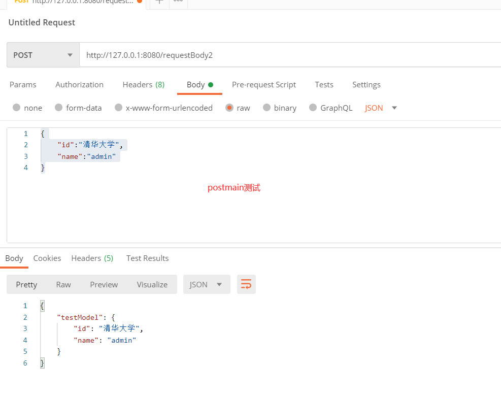
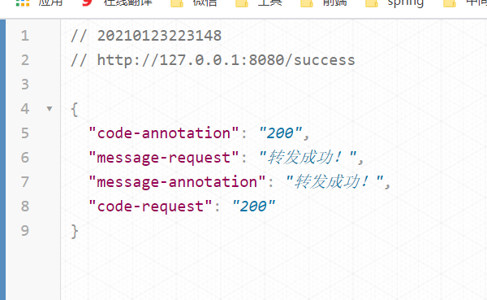
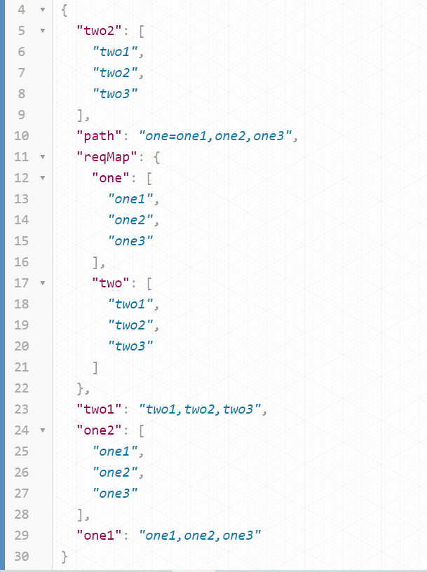

# 七、web开发

## 7.1：@PathVariable请求参数

> <font color='black'>注释，指示方法参数应该绑定到URI模板变量。支持RequestMapping带注释的处理程序方法。**如果方法参数是Map，那么Map将使用所有路径变量名和值填充。**</font>

+ 绑定方式

| 请求方式 | 代码                                          | 请求地址                        |
|------|---------------------------------------------|-----------------------------|
| 原方式  | `@GetMapping("user")`                       | user?id=1&name=admin&age=18 |
| 现方式  | `@GetMapping("user/{id}/{userName}/{age}")` | user/1/admin/18             |

```java
@GetMapping("user/{id}/{userName}/{age}")
public Map<Object, Object> getUser(
@PathVariable(value = "id") Integer id,
@PathVariable(value = "userName") String userName,
@PathVariable Map<Object, Object> reqMap){
        Map<Object, Object> result=new HashMap<>();
        result.put("id",id);
        result.put("userName",userName);
        result.put("reqMap",reqMap);
        return result;
}
// ==========================html代码====================================
<li><a href="user/1/admin/18">user/{id}/{userName}/{age}</a></li>
```



## 7.2：@RequestHeader请求头

> <font color='black'>注释，指示方法参数应该绑定到web请求头。支持Spring MVC和Spring WebFlux中的带注释的处理器方法。**如果方法参数是Map， MultiValueMap，或HttpHeaders，那么Map将被填充所有的头名和值。**</font>

```java
@GetMapping("header")
public Map<Object, Object> getHeader(
@RequestHeader("User-Agent")String userAgent,
@RequestHeader Map<String, Object> reqMap,
@RequestHeader MultiValueMap<String, Object> multiValueMap,
@RequestHeader  HttpHeaders httpHeaders
        ){
        Map<Object, Object> result=new HashMap<>();
        result.put("userAgent",userAgent);
        result.put("reqMap",reqMap);
        result.put("multiValueMap",multiValueMap);
        result.put("httpHeaders",httpHeaders);
        return result;
 }
//==========================html代码====================================
// <li><a href="header">header</a></li>
```



## 7.3：@RequestParam请求参数

> 标注，指示方法参数应该绑定到web请求参数。
>
> 在Spring MVC和Spring WebFlux中支持注解的处理器方法，如下所示:
>
> 在Spring MVC中，“请求参数”映射到查询参数、表单数据和多部分请求中的部件。这是因为Servlet
> API将查询参数和表单数据组合到一个称为“参数”的单一映射中，其中包括对请求体的自动解析。
>
> 在Spring WebFlux中，“请求参数”只映射到查询参数。要处理所有3种数据(查询数据、表单数据和多部分数据)
> ，您可以使用数据绑定到带ModelAttribute注释的命令对象。
>
> + 如果方法参数类型是Map，并且指定了请求参数名称，那么将请求参数值转换为Map，假设有合适的转换策略可用。
>
> + 如果方法参数是Map或MultiValueMap，并且没有指定参数名，那么Map参数将填充所有请求参数名和值。
> + 如果方法参数是多个我们可以使用数据或者list/set集合来接受
> + <font color='red'>**注意:**这里不推荐使用map和MultiValueMap</font>

```java
@GetMapping("param")
public Map<Object, Object> getParam(
@RequestParam("name")String name,
@RequestParam("types")List<String> lists,
@RequestParam("types") Set<String> sets,
@RequestParam("types") String[]array,
@RequestParam Map<String, String> reqMap,
@RequestParam MultiValueMap<String, String> multiValueMap
        ){
        Map<Object, Object> result=new HashMap<>();
        result.put("name",name);
        result.put("lists",lists);
        result.put("sets",sets);
        result.put("array",array);
        result.put("reqMap",reqMap);
        result.put("multiValueMap",multiValueMap);
        System.out.println(multiValueMap);
        multiValueMap.forEach((key,value)->{
        System.out.println(key+"============"+value);
        });
        return result;
        }
        ==========================html代码====================================
<li><a href="param?name=admin&types=type1&types=type2&types=type3">param</a></li>
```



## 7.4：@CookieValue获取cookie

> 注释，指示方法参数应该绑定到HTTP cookie。
>
> 方法参数可以声明为类型javax.servlet.http。Cookie值类型
>
> + <font color='red'>注意：如果没有cookie的时候，我们的程序是会出500的错误</font>

```java
@GetMapping("cookie")
public Map<Object, Object> getcookie(
@CookieValue("_ga") String _ga,
@CookieValue("_ga") Cookie cookie

        ){
        Map<Object, Object> result=new HashMap<>();
        result.put("_ga",_ga);
        result.put("cookie",cookie);
        return result;
        }
```



## 7.5：@RequestBody接受json/对象

> 指示方法参数的注释应该绑定到web请求体。请求体通过HttpMessageConverter传递，以根据请求的内容类型解析方法参数。可选地，自动验证可以通过用@Valid注释参数来应用。
>
> 支持带注释的处理程序方法。
>
> + 提交方式必须post提交
> + 后台接收model的时候必须是ajax提交，否则去掉@RequestBody注解，或者接受类型改成String

```java
/**
 * 错误的写法
 *     @PostMapping(value = "/requestBody")
 *     public Map requestBody(
 *       @RequestBody TestModel testModel
 *     ) {
 *         Map<Object, Object> result = new HashMap<>();
 *         result.put("testModel",testModel);
 *         return result;
 *     }
 * @param testModel
 * @return
 */
@PostMapping(value = "/requestBody")
public Map requestBody(
        TestModel testModel
        ){
        Map<Object, Object> result=new HashMap<>();
        result.put("testModel",testModel);
        return result;
        }
@PostMapping(value = "/requestBody2")
public Map requestBody2(
@RequestBody  TestModel testModel
        ){
        Map<Object, Object> result=new HashMap<>();
        result.put("testModel",testModel);
        return result;
        }
        ------------------------html代码------------------------------
<form action="/requestBody"method="post"model="testModel">
<input type="text"name="id"value="11111111">
<input type="text"name="name"value="11111111">
<input type="submit"value="提交requestBody">
</form>
```






## 7.6：@RequestAttribute获取域对象

> 将方法参数绑定到请求属性的注释。
>
> 主要动机是通过可选/必需的检查和对目标方法参数类型的强制转换，方便地访问控制器方法的请求属性。

```java

@Controller
public class TestRequestAttribute {

    @GetMapping("success")
    public String success(Model model) {
        model.addAttribute("message", "转发成功！");
        model.addAttribute("code", "200");
        return "forward:/requestAttribute";
    }

    @ResponseBody
    @GetMapping(value = "/requestAttribute")
    public Map requestAttribute(
            @RequestAttribute(value = "message") String message,
            @RequestAttribute(value = "code") String code,
            HttpServletRequest request
    ) {
        Map<Object, Object> result = new HashMap<>();
        request.getParameter("message");
        result.put("message-annotation", message);
        result.put("code-annotation", code);
        result.put("message-request", request.getAttribute("message"));
        result.put("code-request", request.getAttribute("code"));
        return result;
    }

}
```



## 7.7：@MatrixVariable接收矩阵变量

### 1.什么是矩阵变量

根据 URI 规范 RFC 3986 中 URL 的定义，路径片段中可以包含键值对。规范中没有对应的术语…在 Spring MVC 它被成为矩阵变量.

### 2.springboot开启矩阵变量

```java

@Configuration
public class WebMVCConfig implements WebMvcConfigurer {

    @Override
    public void configurePathMatch(PathMatchConfigurer configurer) {
        UrlPathHelper urlPathHelper = new UrlPathHelper();
        urlPathHelper.setRemoveSemicolonContent(false);
        configurer.setUrlPathHelper(urlPathHelper);
    }
}
```

> **或者**

```java
    @Bean
    public WebMvcConfigurer webMvcConfigurer(){
        return new WebMvcConfigurer(){
            @Override
            public void configurePathMatch(PathMatchConfigurer configurer){
                UrlPathHelper urlPathHelper=new UrlPathHelper();
                urlPathHelper.setRemoveSemicolonContent(false);
                configurer.setUrlPathHelper(urlPathHelper);
            }
        };
    }
```

> **配置文件**

```properties
spring.mvc.hiddenmethod.filter.enabled=true
```

### 3.controller

```java
/**\
 * 1、语法： 请求路径：/cars/sell;low=34;brand=byd,audi,yd
 * 2、SpringBoot默认是禁用了矩阵变量的功能
 *    手动开启：原理。对于路径的处理。UrlPathHelper进行解析。
 *     removeSemicolonContent（移除分号内容）支持矩阵变量的
 * 3、矩阵变量必须有url路径变量才能被解析
 * @param one1
 * @param one2
 * @param two1
 * @param two2
 * @param reqMap
 * @param path
 * @return
 */
@GetMapping(value = "/testMatrixVariable/{path}")
public Map TestMatrixVariable(
@MatrixVariable(value = "one") String one1,
@MatrixVariable(value = "one") List<String> one2,
@MatrixVariable(value = "two") String two1,
@MatrixVariable(value = "two") List<String> two2,
@MatrixVariable Map<String, List<String>>reqMap,
@PathVariable(value = "path") String path
        ){
        Map<Object, Object> result=new HashMap<>();
        result.put("one1",one1);
        result.put("one2",one2);
        result.put("two1",two1);
        result.put("two2",two2);
        result.put("path",path);
        result.put("reqMap",reqMap);
        return result;
        }
        ================================html=====================================

<li><a href="testMatrixVariable/one=one1,one2,one3;two=two1,two2,two3;">testMatrixVariable</a></li>
```

### 4.测试

http://127.0.0.1:8080/testMatrixVariable/one=one1,one2,one3;two=two1,two2,two3;



## 7.8：拦截器


