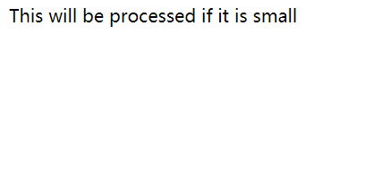
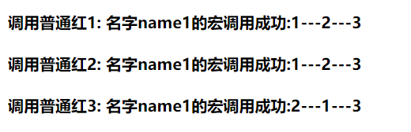
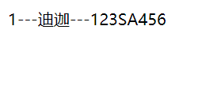
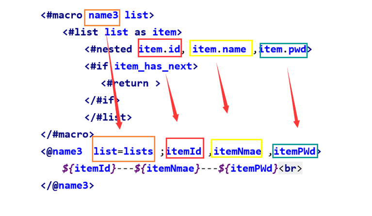
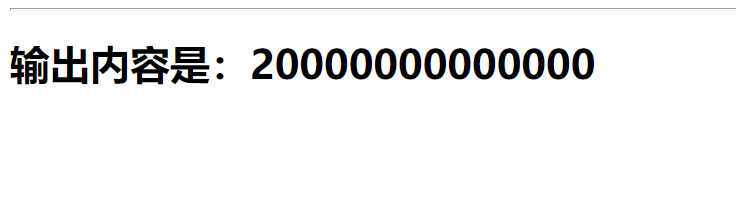
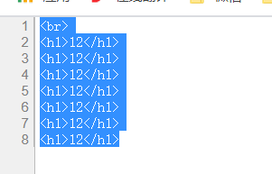
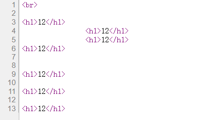
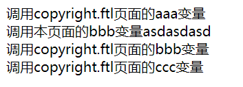
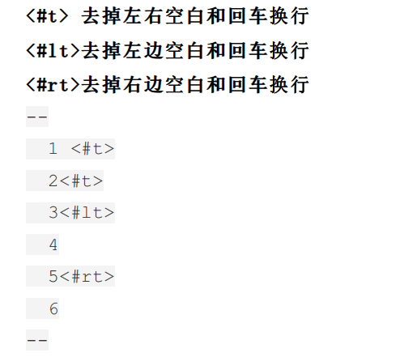

# 附录·FreeMarker

## F.1：简介

FreeMarker 是一款 模板引擎： 即一种基于模板和要改变的数据， 并用来生成输出文本(**HTML网页，电子邮件，配置文件，源代码等**)
的通用工具。 它不是面向最终用户的，而是一个Java类库，是一款程序员可以嵌入他们所开发产品的组件。

模板编写为FreeMarker Template Language (FTL)。它是简单的，专用的语言， *不是* 像PHP那样成熟的编程语言。
那就意味着要准备数据在真实编程语言中来显示，比如数据库查询和业务运算， 之后模板显示已经准备好的数据。在模板中，你可以专注于如何展现数据，
而在模板之外可以专注于要展示什么数据。

+ FreeMarker 是 [免费的]()， 基于Apache许可证2.0版本发布。
+ Freemarker后缀名`ftl`
+ 模板文件必须放在`src/resources/templates`目录下

## F.2：参考手册

http://freemarker.foofun.cn/index.html

## F.3：启动器

```xml

<dependency>
    <groupId>org.springframework.boot</groupId>
    <artifactId>spring-boot-starter-freemarker</artifactId>
</dependency>
```

## F.4：HelloWorld

### 1.加入start

```xml

<dependency>
    <groupId>org.springframework.boot</groupId>
    <artifactId>spring-boot-starter-freemarker</artifactId>
</dependency>
```

### 2.配置文件

```properties
spring.freemarker.charset=utf-8
spring.freemarker.suffix=.ftl
```

### 3.controller

```java

@Controller
public class TestController {

    @GetMapping("/")
    public String hello(Model model) {
        model.addAttribute("msg", "Hello FreeMark!");
        System.out.println("============");
        return "hello";
    }
}
```

### 4.hello.ftl

```html

<html lang="en">
<head>
    <meta charset="UTF-8">
    <title>Hello</title>
</head>
<body>
<h1>${msg}</h1>
</body>
</html>
```

## F.5：配置文件内容(全)

### 1.properties

```properties
# 是否允许HttpServletRequest属性覆盖(隐藏)控制器生成的同名模型属性。
spring.freemarker.allow-request-override=false
# 是否允许HttpSession属性覆盖(隐藏)控制器生成的同名模型属性。
spring.freemarker.allow-session-override=false
# 是否启用模板缓存。
spring.freemarker.cache=false
# 模板编码。
spring.freemarker.charset=UTF-8
# 是否检查模板位置是否存在。
spring.freemarker.check-template-location=true
# Content-Type value.
spring.freemarker.content-type=text/html
# 是否启用freemarker
spring.freemarker.enabled=true
# 设定所有request的属性在merge到模板的时候，是否要都添加到model中.
spring.freemarker.expose-request-attributes=false
# 是否在merge模板的时候，将HttpSession属性都添加到model中
spring.freemarker.expose-session-attributes=false
# 设定是否以springMacroRequestContext的形式暴露RequestContext给Spring’s macro library使用
spring.freemarker.expose-spring-macro-helpers=true
# 是否优先从文件系统加载template，以支持热加载，默认为true
spring.freemarker.prefer-file-system-access=true
# 设定模板的后缀.
spring.freemarker.suffix=.ftl
# 设定模板的加载路径，多个以逗号分隔，默认:
spring.freemarker.template-loader-path=classpath:/templates/
# 设定FreeMarker keys.
spring.freemarker.settings.template_update_delay=0
spring.freemarker.settings.default_encoding=UTF-8
#处理空值
spring.freemarker.settings.classic_compatible=true 
spring.freemarker.settings.datetime_format=yyy-MM-dd HH:mm
spring.freemarker.settings.number_format=0.##
```

### 2.yaml

```yaml
spring:
  freemarker:
    allow-request-override: false # 是否允许HttpServletRequest属性覆盖(隐藏)控制器生成的同名模型属性。
    allow-session-override: false # 是否允许HttpSession属性覆盖(隐藏)控制器生成的同名模型属性
    cache: false # 是否启用模板缓存。
    charset: UTF-8 # 模板编码。
    check-template-location: true # 是否检查模板位置是否存在。
    content-type: text/html # Content-Type value.
    enabled: true # 是否启用freemarker
    expose-request-attributes: false # 设定所有request的属性在merge到模板的时候，是否要都添加到model中.
    expose-session-attributes: false # 是否在merge模板的时候，将HttpSession属性都添加到model中
    expose-spring-macro-helpers: true # 设定是否以springMacroRequestContext的形式暴露RequestContext给Spring’s macro library使用
    prefer-file-system-access: true # 是否优先从文件系统加载template，以支持热加载，默认为true
    settings: # 设定FreeMarker keys.
      classic_compatible: true #处理空值
      default_encoding: UTF-8
      template_update_delay: 0
      datetime_format: yyy-MM-dd HH:mm
      number_format: 0.##
    suffix: .ftl # 设定模板的后缀.
    template-loader-path: classpath:/templates/ # 设定模板的加载路径，多个以逗号分隔，默认:
```

## F.6：字符串函数

| 函数          | 介绍                                                     | 源码                                                                                     | 结果                                                                                                                     |
|-------------|--------------------------------------------------------|----------------------------------------------------------------------------------------|------------------------------------------------------------------------------------------------------------------------|
| substring   | 截取子字符串的函数，类似Java的String.substring字符串函数                 |                                                                                        |                                                                                                                        |
|             | substring(n) 截取字符串n位置开始到结尾，n大于等于0，小<br>于等于字符串的长度       | `${abcdfg"?substring(2)}`                                                              | cdfg                                                                                                                   |
|             | substring(m,n) 截取字符串m位置开始到n位置，m,n大于等于<br/>0，小于等于字符串的长度 | `${"abcdfg"?substring(2,4)}`                                                           | cd                                                                                                                     |
| upperCase   | 变大写                                                    | `${"SAbcdfg"?upperCase}`                                                               | SABCDFG                                                                                                                |
| uncapFirst  | 一行文本的首字母小写                                             | `${"SAbcdfg"?uncapFirst}`                                                              | sAbcdfg                                                                                                                |
| capFirst    | 一行文本的首字母大写                                             | `${"abcdfg"?capFirst}`                                                                 | Abcdfg                                                                                                                 |
| capitalize  | 每个单词首字母小写改大写，大写改小写                                     | `${"abcdfg"?capitalize} ${"ABDCDFG"?capitalize}`                                       | Abcdfg Abdcdfg                                                                                                         |
| endsWith    | 判断字符串使用以某字符串结尾                                         | `${"abcdfg"?endsWith("g")} ${"abcdfg"?endsWith("G")}`                                  | true                                                                                                                   |
| startsWith  | 判断字符串使用以某字符串开头                                         | `${"abcdfg"?startsWith("a")} ${"abcdfg"?startsWith("A")}`                              | true                                                                                                                   |
| indexOf     | 返回某字符串第一次出现的位置                                         | `${"abcdfg"?indexOf("f")}`                                                             | 4                                                                                                                      |
| lastIndexOf | 返回某字符串最后一次出现的位置                                        | `${"abcdfga"?lastIndexOf("a")}`                                                        | 6                                                                                                                      |
| length      | 返回字符串的长度                                               | `${"abcdfg"?length}`                                                                   | 6                                                                                                                      |
| leftPad     | 左侧补齐空格或指定的字符                                           |                                                                                        |                                                                                                                        |
|             | leftPad(n) n小于字符串的长度，返回全部字符串                           | `${"abcdfg"?leftPad(3)}`                                                               | abcdfg                                                                                                                 |
|             | 如果leftPad(n) n大于字符串的长度，左侧补充空格或指定字符串                    | `${"abcdfg"?leftPad(20)} ${"abcdfg"?leftPad(20,"*")}`                                  | `abcdfg} **************abcdfg`                                                                                         |
| rightPad    | 右侧补齐空格或指定的字符                                           |                                                                                        |                                                                                                                        |
|             | 如果rightPad(n) n小于字符串的长度，返回全部字符串                        | `${"abcdfg"?rightPad(2)}`                                                              | abcdfg                                                                                                                 |
|             | 如果rightPad(n) n大于字符串的长度，右侧补充空格或指定字符串                   | `${"abcdfg"?rightPad(20)} ${"abcdfg"?rightPad(20,"*")}`                                | `abcdfg abcdfg**************`                                                                                          |
| contains    | 判断字符串中是否存在某字符串                                         | `${"abcdfg"?contains("abc")}`                                                          | true                                                                                                                   |
| replace     | 替换字符串                                                  | `${"abcdfg"?replace("abc","cbd")}`                                                     | cbddfg                                                                                                                 |
| split       | 分隔字符串为数组                                               | `<ul> <#list "a==b==d==e==f==g"?split("==") as item> <li> ${item} <li> </#list> </ul>` | `<ul>`<br/>`<li>a</li>`<br/>`<li>b</li>`<br/>`<li>d</li>`<br/>`<li>e</li><br/><li>f</li>`<br/>`<li>g</li>`<br/>`</ul>` |
| wordList    | 以任意多个空格分隔单词                                            | `<ul> <#list "a b s cc dd"?split("==") as item> <li> ${item} <li> </#list> </ul>`      | `<ul>`<br/>`<li>a</li> `<br/>`<li>b</li>`<br/>`<li>s</li>`<br/> `<li>cc</li>`<br/>`<li>dd</li>`<br/>`</ul>`            |

## F.7：数字函数

|    函数    |         介绍         |                 源码                 |      结果       |
|:--------:|:------------------:|:----------------------------------:|:-------------:|
|    c     | 将数字或boolean 转化为字符串 |       `${1234?c} ${true?c}`        | 1234 <br>true |
|  string  |     将数字转化为字符串      |          `${123?string}`           |      123      |
|  round   |        四舍五入        |   `${123.6?round} ${35.3?round}`   |  124 <br/>35  |
|  floor   |        向下取整        |   `${123.6?floor} ${35.3?floor}`   |  123<br/> 35  |
| ceiling  |        向上取整        | `${123.6?ceiling} ${35.3?ceiling}` |  124 <br/>36  |
|  number  |        数字类型        |       `${123?string.number}`       |      123      |
| currency |        货币类型        |      `${123?string.currency}`      |    ￥123.00    |
| percent  |       百分比类型        |      `${123?string.percent}`       |    12,300%    |
|  string  |       格式化数字        |      `${123?string("#.###")}`      |      123      |
|   int    |      取数字的整数部分      |            `${123?int}`            |      123      |

## F.8：日期函数

|              函数               |    介绍    |                   源码                    |         结果          |
|:-----------------------------:|:--------:|:---------------------------------------:|:-------------------:|
|             .now              |  获取当前时间  |                `${.now}`                |  2021-01-30 21:18   |
| string("yyyy-MM-dd HH:mm:ss") |  格式化日期   | `${.now?string("yyyy-MM-dd HH:mm:ss")}` | 2021-01-30 21:18:26 |
|             date              |  获取当前日期  |             `${.now?date}`              |      2021-1-30      |
|             time              |  获取当前时间  |             `${.now?time}`              |      21:18:26       |
|           datetime            | 获取当前日期时间 |           `${.now?datetime}`            |  2021-01-30 21:18   |

## F.9：布尔类型

|  函数  |       介绍        |                   源码                    |    结果    |
|:----:|:---------------:|:---------------------------------------:|:--------:|
| 布尔函数 | 转化boolean类型为字符串 | `${true?c} ${false?string("no","yes")}` | true yes |

## F.10：运算符

| 运算符 | 介绍                                            | 源码                                         | 结果      |
|-----|-----------------------------------------------|--------------------------------------------|---------|
| !=  | 不等于                                           | `${(1 != 2)?string('1 != 2', '1 == 2')}`   | 1 != 2  |
| ==  | 等于                                            | `${(1 == 1)?string('1 == 1', '1 != 1')}`   | 1 == 1  |
| >   | 大于<br>==使用时,必须加括号否则可能会被<br>当成普通的标签闭合符号而引起报错== | `${(2 > 1)?string('2 > 1', '2 < 1')}`      | 2 > 1   |
| gt  | 大于                                            | `${(2 gt 1)?string('2 gt 1', '2 lte 1')}`  | 2 gt 1  |
| gte | 大于等于                                          | `${(2  2)?string('2 gte 2', '2 lt 2')}`    | 2 gte 2 |
| <   | 小于<br>==使用时,必须加括号否则可能会被当成<br>普通的标签闭合符号而引起报错== | `${(1 < 2)?string('1 < 2', '1 > 2')}`      | 1 < 2   |
| lt  | 小于                                            | `${(1 lt 2)?string('1 lt 2', '1 gte 2')}`  | 1 lt 2  |
| lte | 小于等于                                          | `${(2 lte 2)?string('2 lte 2', '2 gt 2')}` | 2 lte 2 |

## F.11：序列函数

+ 下面例子中的变量是这个：`<#assign seq=["1","2","3","2","1"]>`
+ 注意：Sequence不能为null。
+

指定一个文字的序列，使用逗号来分隔其中的每个 [子变量](http://freemarker.foofun.cn/dgui_quickstart_datamodel.html#topic.dataModel.subVar)，
然后把整个列表放到方括号中。类似我们java中的集合和数组

| 函数                   | 介绍            | 源码                                                        | 结果                                                                                                                                |
|:---------------------|---------------|-----------------------------------------------------------|-----------------------------------------------------------------------------------------------------------------------------------|
| first                | 返回序列中第一个元素    | `${lists?first}`                                          | Users(id=1, name=迪迦, password=123SA456)                                                                                           |
| last                 | 返回序列中最后一个元素   | `${lists?last}`                                           | Users(id=5, name=奥特曼, password=123fea456)                                                                                         |
| seq_contains         | 判断序列中是否存在元素n  | `${seq?seq_contains("1")}`                                | true                                                                                                                              |
| seq_index_of         | 返回n在序列中的位置    | `${seq?seq_index_of("1")}`                                | 0                                                                                                                                 |
| seq_last_index_of(n) | 返回n在序列中最后一个位置 | `seq_last_index_of(n)`                                    | 0                                                                                                                                 |
| reverse              | 返回序列的反序集合     | `<#list lists?reverse as item>`<br>`${item}`<br>`</#list> | Users(id=3, name=赛文, password=12z345cz6)<br/>Users(id=2, name=塞罗, password=1234Axc56)<br/>Users(id=1, name=迪迦, password=123SA456) |
| sort                 | 序列中元素排序       | `<#list lists?sort as item>`<br>`${item}`<br>`</#list>`   | Users(id=1, name=迪迦, password=123SA456)<br/>Users(id=2, name=塞罗, password=1234Axc56)<br/>Users(id=3, name=赛文, password=12z345cz6) |

## F.12：流程语句

### 1.if/else

#### 1.语法

```java
<#if condition>
        ...
<#elseif condition2>
        ...
<#elseif condition3>
        ...
<#else>
        ...
<#if>
```

#### 2.例子

```java
<h1>
<#assign price=100/>
<#if price==100>
<li>price==100</li>
</#if>
<#if price==100>
<li>price==100</li>
<#elseif price>100>
<li>price>100</li>
<#else>
        price<100
</#if>
</h1>
```


### 2.swich

#### 1.语法

```text
<#switch value>
<#case refValue1>
...
<#break>
<#case refValue2>
...
<#break>
<#case refValueN>
...
<#break>
<#default> 
...
</#switch>
```

#### 2.例子

```text
<#assign size = "small"><#--// 这里的变量类型可以是字符串也可是整数 -->
<#switch size>
    <#case "small">
        This will be processed if it is small
        <#break>
    <#case "medium">
        This will be processed if it is medium
        <#break>
    <#case "large">
        This will be processed if it is large
        <#break>
    <#default>
        This will be processed if it is neither
</#switch>
```

#### 3.测试



### 3.list循环

#### 1.语法

```text
<#list sequence as item>
...
<#if item ="spring"><#break></#if>
...
</#list> 
```

#### 2.例子

```text
<#assign seq = ["winter", "spring", "summer", "autumn"]>
<#list seq as item>
    ${item_index}-----${item}<#if item_has_next>是否有下一个值<br></#if>
</#list>
```


#### 4.注意

关键字：`item_index`:是list当前值的下标，从0开始

`item_has_next`:判断list是否还有值

`item`是变量名

## F.13：宏

### 1.定义宏

#### 1.简介

定义一个宏，其实就相当定义一个代码（java或者javascript）中的方法function，也可以像java代码方法那样定义方法的参数列表

#### 2.普通宏语法

我们比对一下代码

+ 这是freemarker语法

```text
<#macro name param1 param2...paramN>
        ...
</#macro>
```

+ 这是java语法

```java
public void name(param1 param2...paramN){
    //    ...
}
```

#### 3.定义一个普通宏

```java
<#macro name1 one,two,three>
        名字name1的宏调用成功:${one}---${two}---${three}
</#macro>
```

#### 4.设置默认值

```java
<#macro name2 one,two="默认值1",three="默认值2">
        名字name2的宏调用成功:${one}---${two}---${three}
</#macro>
```

#### 5.body宏语法

```java
<#macro name param1 param2...paramN>
        ...
<#nested loopvar1,loopvar2,...,loopvarN> //这里相当于java中返回的值
        ...
<#return>//结束
        ...
</#macro>
```

#### 6.定义一个body宏

```
<#macro name3 list>
    <#list list as item>
        <#nested item.id, item.name ,item.pwd>
        <#if item_has_next>
           <#return >
        </#if>
     </#list>
</#macro>
```

#### 7.定义一个body宏

```java
<#macro name3 list>
<#list list as item>
<#nested item.id,item.name,item.pwd>
<#if item_has_next>
<#return>
</#if>
</#list>
</#macro>
```

### 2.调用宏

#### 1.调用普通红语法

```java
<@name param1=值 param2=值 …… paramN=值N/>
```

#### 2.调用普通红例子

```java
<#macro name1 one,two,three>
        名字name1的宏调用成功:${one}---${two}---${three}
</#macro>
<h4>调用普通红1:<@name1 1,2,3/></h4>
<h4>调用普通红2:<@name1 one="1"two="2"three="3"/></h4>
<#--我们可以根据我们的变量名字可以指定变量赋值-->
<h4>调用普通红3:<@name1 two="1"one="2"three="3"/></h4>
```



#### 3.调用body宏语法

我们首先要查看调用宏中的nested标签：
例如这个标签里面有这：

```java
<#nested item.id,item.name,item.pwd>
```

调用如下

```java
<@name param1=值 param2=值 ……  paramN=值N；itemId,itemName,itemPWD/>
        ....
</@name>
```

#### 4.调用body宏的例子

```java
<#macro name3 list>
<#list list as item>
<#nested item.id,item.name,item.pwd>
<#if item_has_next>
<#return>
</#if>
</#list>
</#macro>
<@name3 list=lists;itemId,itemNmae,itemPWd>
        ${itemId}---${itemNmae}---${itemPWd}<br>
</@name3>
```





## F.14：特殊指令

### 1.Include

#### 1.语法、简介

| 作用                       | 语法                            | 属性                                                                                           |
|--------------------------|-------------------------------|----------------------------------------------------------------------------------------------|
| 和jsp中的include标签一样包括其它的页面 | `<#include filename options>` | Filename：路径名；options包含两个属性：encoding="GBK" 编码格式；parse=true 是否作为ftl语法解析,默认是true，false就是以文本方式引入 |

#### 2.案例

+ inclue.ftl

```java
<!DOCTYPE html>
<html lang="en">
<head>
<meta charset="UTF-8">
<title>Title</title>
</head>
<body>
<#assign me="hello world">
<#include"includetest.ftl"encoding="utf-8"parse=true>
</body>
</html>
```

+ incluetest.ftl

```java
<!DOCTYPE html>
<html lang="en">
<head>
<meta charset="UTF-8">
<title>Title</title>
</head>
<body>

<h1>你好！me的变量是：${me}</h1>
</body>
</html>
```


### 2.Import关键字

#### 1.语法、简介

> ###### 语法
>
> ```java
> <#import path as namespace >
> ```
>
> 类似于java里的import,它导入文件，然后就可以在当前文件里使用被导入文件里的宏组件用例假设mylib.ftl 里定义了宏copyright
> 那么我们在其他模板页面里可以这样使用：
>
> ```java
> <#import "/libs/mylib.ftl" as my>
> 
> <@my.copyright date="1999-2002"/>
> 
> <#--"my"在freemarker里被称作namespace -->
> ```

#### 2.案例

+ import.ftl

```java
<#import "importtest.ftl"as copyhong/>
        <!DOCTYPE html>
        <html lang="en">
        <head>
        <meta charset="UTF-8">
        <title>import

</title>
</head>
<body>
<@copyhong.test1 date="20000000000000"></@copyhong.test1>
</body>
</html>
```

+ importtest.ftl

```java
<#macro test1 date>
<hr>
<h1> 输出内容是：${date}</h1>
</#macro>
```



### 3.compress关键字

#### 1.语法、简介

语法

```java
<#compress>

        ...

</#compress>
```

用来压缩空白空间和空白的行

#### 2.案例

我们再写代码的时候，会有一些空白行，这些空白行会在游览器端实现，我们通常使用这个标签将整个页面的代码都包括起来。

+ 使用

```java
<#compress>
<br>

<h1>12</h1>
<h1>12</h1>
<h1>12</h1>
<h1>12</h1>


<h1>12</h1>

<h1>12</h1>

<h1>12</h1>
</#compress>
```



+ 不使用

```java
<br>

<h1>12</h1>
<h1>12</h1>
<h1>12</h1>
<h1>12</h1>


<h1>12</h1>

<h1>12</h1>

<h1>12</h1>
```



### 4.escape, noescape

#### 1.语法、简介

+ 语法

```java
<#escape identifier as expression>
        ...
<#noescape>...</#noescape>
        ...
</#escape>
```

+ 简介

**主要使用在相似的字符串变量输出，比如某一个模块的所有字符串输出都必须是html安全的，这个时候就可以使用，说白了escape
包裹的内容，会被转义比如<>会编程<> 而noescape包裹的字符不会被转义，会被当成html代码执行**

```java
<#escape x as x?html>

        First name:${firstName}

<#noescape>Last name:${lastName}</#noescape>

        Maiden name:${maidenName}

</#escape>
```

**等同于：**

```java
First name:${firstName?html}
        Last name:${lastName}
        Maiden name:${maidenName?html}
```

### 5.Global关键字

#### 1.语法、简介

+ 语法

```java
<#global name=value>
<#global name1=value1 name2=value2...nameN=valueN>
<#global name>
        capture this
</#global>
```

+ 简介

全局赋值语法，利用这个语法给变量赋值，那么这个变量在所有的namespace 中是可见的, 如果这个变量被当前的assign 语法覆盖
如`<#global x=2> <#assign x=1> `在当前页面里`x=2` 将被隐藏，或者通过`${.globals.x}` 来访问

#### 2.案例

+ global.ftl

```java
<#global aaa="aaaaaaa">
<#global bbb="bbbbbbb">
<#assign ccc="ccccccc">
```

+ globaltest.ftl

```java
<#assign bbb="asdasdasd">
        调用copyright.ftl页面的aaa变量${aaa}<br>
调用本页面的bbb变量${bbb}<br>
调用copyright.ftl页面的bbb变量${.globals.bbb}<br>
调用copyright.ftl页面的ccc变量${my.ccc}<br>
```



### 6.setting

#### 1.语法、简介

```java
<#setting name=value>
```

用来设置整个系统的一个环境，我们可以设置时间，时区，数字等格式

+ Locale：方言

+ number_format：数字

+ boolean_format：布尔值

+ date_format ,time_format , datetime_format：日期时间

+ time_zone：时区

+ classic_compatible, 默认值false，改成true 不建议开启

更多参数参考：http://freemarker.foofun.cn/ref_directive_setting.html

#### 2.案例

将数字的输出格式改为百分比

```java
<#setting number_format="percent"/>
<#setting datetime_format="yyyy-MM-dd HH:mm:ss"/>
```

### 7.t, lt, rt



## 其他

### 1.默认值

```html
<h1>${var?default("默认值")?html}</h1>

---页面显示
默认值
```

### 2.声明变量

```html
<#--声名变量-->
<#assign name="李白"/>
<#assign age=123/>
<#assign address = [0,1,2,3] />
<#assign userss = {name:'admin',age:12} />
<#--取值-->
<h1>name:${name}-----age:${123}--------</h1>
<h1>
    <#list userss?keys as item>
    <li>${item}===${userss[item]}</li>
</#list>
</h1>

<h1>
    <#list address as item>
    <li>${item}</li>
</#list>
</h1>
```
