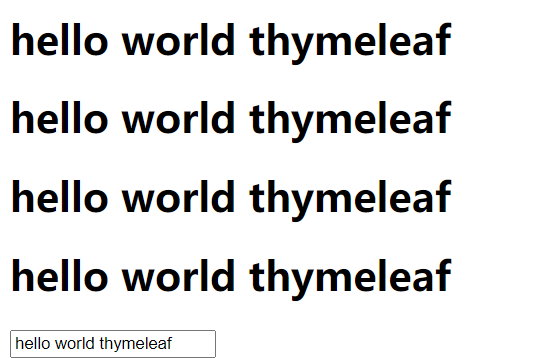
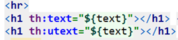
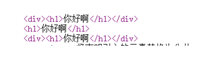

# 附录·Thymeleaf

## F.1：简介

### 1.什么是Thymeleaf

`Thymeleaf`是适用于`Web`和独立环境的现`代服务器端Java模板引擎`，能够处理`HTML，XML，JavaScript，CSS甚至纯文本`。Thymeleaf的*
*主要目标是提供一种优雅且高度可维护的模板创建方式**
。为此，它以自然模板的概念为基础，以不影响模板用作设计原型的方式将其逻辑注入模板文件。这样可以改善设计沟通，并缩小设计团队与开发团队之间的差距。`Thymeleaf`
也已经从一开始就**设计了Web标准记-尤其是HTML5 -允许您创建充分验证模板，如果这是一个需要你。**

### 2.特点

**1.动静结合：**Thymeleaf 在有网络和无网络的环境下皆可运行，即它可以让美工在浏览器查看页面的静态效果，也可以让程序员在服务器查看带数据的动态页面效果。这是由于它支持
html 原型，然后在 html 标签里增加额外的属性来达到模板+数据的展示方式。浏览器解释 html 时会忽略未定义的标签属性，所以
thymeleaf 的模板可以静态地运行；当有数据返回到页面时，Thymeleaf 标签会动态地替换掉静态内容，使页面动态显示。

**2.开箱即用：**它提供标准和spring标准两种方言，可以直接套用模板实现JSTL、
OGNL表达式效果，避免每天套模板、该jstl、改标签的困扰。同时开发人员也可以扩展和创建自定义的方言。

**3.多方言支持：**Thymeleaf 提供spring标准方言和一个与 SpringMVC 完美集成的可选模块，可以快速的实现表单绑定、属性编辑器、国际化等功能。

**4.与SpringBoot完美整合**
，SpringBoot提供了Thymeleaf的默认配置，并且为Thymeleaf设置了视图解析器，我们可以像以前操作jsp一样来操作Thymeleaf。代码几乎没有任何区别，就是在模板语法上有区别。

### 3.参考网站

Csdn：https://www.cnblogs.com/msi-chen/p/10974009.html#_label0

官网：https://www.thymeleaf.org/doc/tutorials/3.0/usingthymeleaf.html#what-is-thymeleaf

### 4.启动器

```java
 <dependency>
        <groupId>org.springframework.boot</groupId>
        <artifactId>spring-boot-starter-thymeleaf</artifactId>
</dependency>
```

## F.2：HelloWorld

### 1.pojo

```java
@Data
@AllArgsConstructor
@NoArgsConstructor
public class Users {
    private  Integer id;
    private String name;
    private String pwd;
}
```

### 2.controller

这里的controller为了后面其他的练习直接写在一起

```java
@Controller
public class TestController {
    @GetMapping("/{path}")
    public String test(@PathVariable(value = "path") String path, Model model) {
        System.out.println("================" + path + "===============");
        Users users1 = new Users(1, "admin", "123456");
        Users users2 = new Users(2, "张三", "123456");
        Users users3 = new Users(3, "李四", "123456");
        Users users4 = new Users(4, "王麻子", "123456");
        List<Users> list = new ArrayList<>();
        list.add(users1);
        list.add(users2);
        list.add(users3);
        list.add(users4);
        model.addAttribute("lists", list);
        model.addAttribute("dates", new Date());
        model.addAttribute("user", users1);
        model.addAttribute("hello", "hello world thymeleaf");
        return path;
    }
}
```

### 3.html

```java
<!DOCTYPE html>
<html lang="en" xmlns:th="http://www.thymeleaf.org">
<head>
    <meta charset="UTF-8">
    <title>Title</title>
</head>
<body>
    <h1 th:text="${hello}"></h1>
</body>
</html>
```

### 4.测试

http://127.0.0.1:8080/hello


### 5.错误解决

什么有错误？对的，有错误！就下面的错误

```text
================hello===============
================favicon.ico===============
2021-02-25 18:57:47.616 ERROR 28912 --- [nio-8080-exec-9] org.thymeleaf.TemplateEngine             : [THYMELEAF][http-nio-8080-exec-9] Exception processing template "favicon.ico": Error resolving template [favicon.ico], template might not exist or might not be accessible by any of the configured Template Resolvers

org.thymeleaf.exceptions.TemplateInputException: Error resolving template [favicon.ico], template might not exist or might not be accessible by any of the configured Template Resolvers
	at org.thymeleaf.engine.TemplateManager.resolveTemplate(TemplateManager.java:869) ~[thymeleaf-

2021-02-25 18:57:47.617 ERROR 28912 --- [nio-8080-exec-9] o.a.c.c.C.[.[.[/].[dispatcherServlet]    : Servlet.service() for servlet [dispatcherServlet] in context with path [] threw exception [Request processing failed; nested exception is org.thymeleaf.exceptions.TemplateInputException: Error resolving template [favicon.ico], template might not exist or might not be accessible by any of the configured Template Resolvers] with root cause

org.thymeleaf.exceptions.TemplateInputException: Error resolving template [favicon.ico], template might not exist or might not be accessible by any of the configured Template Resolvers

```

-
Thymeleaf进行解析视图的时候,默认会查找一个叫favicon.ico的文件,如果找不到就会报错,一般情况下,使用IDEA或者官网创建的项目中都不会含有该内容,可以使用一个标签,告诉Thymeleaf解析时查找该文件的位置,即便目标位置不存在该文件,也不会报错了

页面中加入这个

```java
<link rel="shortcut icon" href="../resources/favicon.ico" th:href="@{/static/favicon.ico}"/>
```

## F.3：提示thymeleaf标签

我们在书写thymeleaf标签的时候可能不会提示：我们在html标签上加上

```java
<html lang="en" xmlns:th="http://www.thymeleaf.org">
```

## F.4：application配置

### 1.properties配置

```properties
#thymeleaf 配置
spring.thymeleaf.mode=HTML5
spring.thymeleaf.encoding=UTF-8
spring.thymeleaf.content-type=text/html
#缓存设置为false, 这样修改之后马上生效，便于调试
spring.thymeleaf.cache=false
#上下文
server.context-path=/thymeleaf
```

### 2.yaml配置

```yaml
server:
  context-path: /thymeleaf
spring:
  thymeleaf:
    cache: false
    content-type: text/html
    encoding: UTF-8
    mode: HTML5
```

## F.5：常用标签/基础

### 1.输出标签

#### 1.简介

| 标签       | 用法简介                                                                             |
|----------|----------------------------------------------------------------------------------|
| th:text  | 在页面上输出值，会把特殊字符进行转义后输出，注意：`[[ ]]`和`th:text`等价                                     |
| th:utext | 在页面上输出值，不会把特殊字符转义，注意：`[()]`和`th:utext`等价                                         |
| th:value | 在input标签中显示数值`<input type="text" name="username"  th:value="${u.username}" />  ` |

#### 2.例子

```java
<h1 th:text="${text}"></h1> <h1>[[ ${text} ]]</h1>
<h1 th:utext="${text}"></h1> <h1>[( ${text} )]</h1>
<input type="text" th:value="${text}">
```



#### 3.注意点

`Th:text( ${…} )`和`thu:text( ${…} )`他们之间必须在标签使用

​                   

而`[[ ${…} ]]`和`[( ${…} )]`可以在任意位置输出,可以用到js标签当中

### 2.# 调用内置对象

#### 1.简介

在thymeleaf中表示调用内置对象，dates，strings。。。。下面就通过内置对象stirngs对字符串，日期的一些常用操作说明：

#### 2.字符串类型

| Name                                    | 作用                               |
|-----------------------------------------|----------------------------------|
| **${#strings.isEmpty(str)}**            | 判断字符串是不是空的,为空返回true,否则返回false    |
| **${#strings.contains(母串，子串)}**         | 看子串在母串中存不存在？在返回true，反之false      |
| **${#strings.startsWith(母串，子串)}**       | 看字符串是不是子串开头                      |
| **${#strings.endsWith(母串，子串)}**         | 看字符串是不是子串结尾                      |
| **${#strings.length(字符串)}**             | 获取字符串长度                          |
| **${#strings.indexOf(母串，子串)}**          | 返回子串在母串中的位置索引                    |
| **${#strings.substring(母串，开始索引，结束索引)}** | 截取母串中的部分返回，结束索引省略就截取到末尾          |
| **${#strings.toUpperCase(母串)}**         | 把字符串中的小写字母都转成大写字母，反之用toLowerCase |

#### 3.日期类型

| name                                     | 简介                    |
|------------------------------------------|-----------------------|
| **${#dates.format(日期变量名)}**              | 格式化日期，默认的以浏览器默认语言为格式化 |
| **${#dates.format(日期变量名，”yyyy-MM-dd”)}** | 格式化日期，自定义格式化规则        |
| **${#dates.year(key)}**                  | 获取年                   |
| **${#dates.month(key)}**                 | 获取月份                  |
| **${#dates.day(key)}**                   | 获取日期                  |

#### 4.测试页面

```html
<p>判断字符串是不是空的,为空返回true,否则返回false:<span th:text="${#strings.isEmpty('')}"></span></p>
<p>看子串在母串中存不存在？在返回true，反之false:<span th:text="${#strings.contains('abc','av')}"></span></p>
<p>看字符串是不是子串开头:<span th:text="${#strings.startsWith('abcefg','abc')}"></span></p>
<p>看字符串是不是子串结尾:<span th:text="${#strings.endsWith('abcabc','abc')}"></span></p>
<p>获取字符串长度:<span th:text="${#strings.length('abcdef')}"></span></p>
<p>返回子串在母串中的位置索引:<span th:text=" ${#strings.indexOf('abcabc','abc')}"></span></p>
<p>截取母串中的部分返回，结束索引省略就截取到末尾:<span th:text="${#strings.substring('abcdefghij',6)}"></span></p>
<p>把字符串中的小写字母都转成大写字母，反之用toLowerCase:<span th:text="${#strings.toUpperCase('abcdef')}"></span></p>
<p>格式化日期，默认的以浏览器默认语言为格式化:<span th:text=" ${#dates.format(dates)}   "></span></p>
<p>格式化日期，自定义格式化规则:<span th:text="${#dates.format(dates,'yyyy-MM-dd')}"></span></p>
<p>获取年:<span th:text="${#dates.year(dates)}"></span></p>
<p>获取月份:<span th:text="${#dates.month(dates)}"></span></p>
<p>获取日期:<span th:text="${#dates.day(dates)}"></span></p>
```


### 3.if

#### 1.语法

```java
th:if()
```

##### 2.案例

```java
<h1>if分支：<span th:if="${user.getId()==1}">超级管理员</span></h1>
```

#### 3.注意

thymeleaf中没有if else标签我们可以使用swich标签

### 4.swich标签

#### 1.语法

```java
th:swich()
     th:case()
     th:case()
     ……………
```

#### 2.案例

```java
<h1>swich分支：
    <i th:switch="${user.getId()}">
        <span th:case="1">超级管理员1</span>
        <span th:case="2">超级管理员2</span>
        <span th:case="3">超级管理员3</span>
    </i>
</h1>
```

### 5.循环标签

#### 1.遍历集合/数组

```java
<h3>
    遍历集合和数组：
    <i th:each="item:${lists}">
        <span th:text="${item.id}"></span>
        <span th:text="${item.name}"></span>
        <span th:text="${item.pwd}"></span><br>
    </i>
</h3>
```

#### 2.内置参数遍历集合和数组

```html
<h5>内置参数遍历集合和数组： <i th:each="item,var:${lists}">
    <span th:text="${item.id}"></span>
    <span th:text="${item.name}"></span>
    <span th:text="${item.pwd}"></span>
    <span th:text="${var.index}"></span> 当前循环的索引，从0开始
    <span th:text="${var.count}"></span> 当前循环的次数，从1开始
    <span th:text="${var.size}"></span> 被循环的集合或数组的长度
    <span th:text="${var.even}"></span> 布尔值，当前循环是偶数？ 从0开始
    <span th:text="${var.odd}"></span> 布尔值，当前循环是奇数？ 从0开始
    <span th:text="${var.first}"></span> 布尔值，当前循环是不是第一条，是返回true
    <span th:text="${var.last}"></span> 布尔值，当前循环是不是最后一条，是返回true<br></i> </h5>
```

#### 3.遍历map

```java
<h5>map遍历
    <i th:each="item:${maps}">
        <span th:text="${item}"></span><br>
    </i>
</h5>
<h5>map遍历升级
    <i th:each="item:${maps}">
        <span th:text="${item.key}"></span>------
        <span th:text="${item.value}"></span>  ------
        <span th:text="${item.value.id}"></span>------
        <span th:text="${item.value.name}"></span>------
        <span th:text="${item.value.pwd}"></span>------
        <br>
    </i>
</h5>
```

### 6.域对象

#### 1  Request

```java
request.setAttribute("req", "HttpServletRequest"）
Request:<span th:text="${#httpServletRequest.getAttribute('req')}"></span><br>
```

#### 2  Session

```java
request.getSession().setAttribute("sess", "HttpSession");
Session:<span th:text="${session.sess}"></span><br>
```

#### 3  ServletContext

```java
request.getSession().getServletContext().setAttribute("app","Application");
Application:<span th:text="${application.app}"></span>
```

### 7.页面抽取

#### 1.简介

| name       | message            |
|------------|--------------------|
| th:insert  | 将公共片段整个插入到声明引入的元素中 |
| th:replace | 将声明引入的元素替换为公共片段    |
| th:include | 将被引入的片段的内容包含进这个标签中 |

#### 2.案例

```java
定义一个公共的页面：<h1>你好啊</h1>
```

引用页面

```java
<div th:insert="@{~/includ/base.html}"> th:insert：将公共片段整个插入到声明引入的元素中</div> <div th:replace="@{~/includ/base.html}">  th:replace：将声明引入的元素替换为公共片段</div> <div th:include="@{~/includ/base.html}"> th:include：将被引入的片段的内容包含进这个标签中</div>
```

#### 3.测试

游览器编译：



### 8.url

#### 1.简介

```java
th:href标签或th:src标签上
url 表达式基本语法：@{}
```

#### 2.url类型

| name             | message                                                                                                                             |
|------------------|-------------------------------------------------------------------------------------------------------------------------------------|
| 绝对路径             | `<a  th:href="@{http://www.baidu.com}">绝对路径</a>  `                                                                                  |
| 相对路径             | `1)相对于当前项目的根，相对于项目的上下文的相对路径  <a  th:href="@{/show}">相对路径</a>  2) 相对于服务器路径  <a  th:href="@{~/project2/resourcename}">相对于服务器的根</a>  ` |
| 在url中传递参数        | `<a th:href="@{/show(id=1,name=zhagnsan)}">相对路径-传参</a>  `                                                                           |
| restful 风格进行参数传递 | `<a class="btn btn-info"  th:href="@{~/item/detail/}+${item.id}+'/aaa'" >详情</a> `                                                   |


