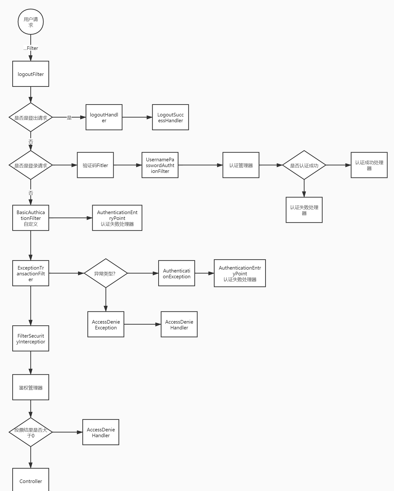

# 简介

## 前言

Spring Security** 是 Spring 家族中的一个安全管理框架。相比与另外一个安全框架**Shiro**，它提供了更丰富的功能，社区资源也比Shiro丰富。
一般来说中大型的项目都是使用**SpringSecurity** 来做安全框架。小项目有Shiro的比较多，因为相比与SpringSecurity，Shiro的上手更加的简单。
一般Web应用的需要进行**认证**和**授权**。
**认证：验证当前访问系统的是不是本系统的用户，并且要确认具体是哪个用户**
**授权：经过认证后判断当前用户是否有权限进行某个操作**
而认证和授权也是SpringSecurity作为安全框架的核心功能。

> Spring Security是一个能够为基于Spring的企业应用系统提供声明式的安全访问控制解决方案的安全框架。它提供了一组可以在Spring应用上下文中配置的Bean，充分利用了Spring
> IoC，DI（控制反转Inversion of Control ,DI:Dependency Injection
> 依赖注入）和AOP（面向切面编程）功能，为应用系统提供声明式的安全访问控制功能，减少了为企业系统安全控制编写大量重复代码的工作。
>
> 	如果要对Web资源进行保护，最好的办法莫过于Filter，要想对方法调用进行保护，最好的办法莫过于AOP。Spring security对Web资源的保护，就是靠Filter实现的。

## pom

```java
        <dependency>
            <groupId>org.springframework.boot</groupId>
            <artifactId>spring-boot-starter-security</artifactId>
        </dependency>
```

## 前后端分离流程

+ 客户端发起一个请求，进入 Security 过滤器链。当到 LogoutFilter 的时候判断是否是登出路径，如果是登出路径则到 logoutHandler
  ，如果登出成功则到 logoutSuccessHandler 登出成功处理。
+ 如果不是登出路径则直接进入下一个过滤器。当到 UsernamePasswordAuthenticationFilter
  的时候判断是否为登录路径，如果是，则进入该过滤器进行登录操作，如果登录失败则到 AuthenticationFailureHandler
  ，登录失败处理器处理，如果登录成功则到 AuthenticationSuccessHandler 登录成功处理器处理，如果不是登录请求则不进入该过滤器。
+
进入认证BasicAuthenticationFilter进行用户认证，成功的话会把认证了的结果写入到SecurityContextHolder中SecurityContext的属性authentication上面。如果认证失败就会交给AuthenticationEntryPoint认证失败处理类，或者抛出异常被后续ExceptionTranslationFilter过滤器处理异常，如果是AuthenticationException就交给
+ AuthenticationEntryPoint处理，如果是AccessDeniedException异常则交给AccessDeniedHandler处理。
  当到 FilterSecurityInterceptor 的时候会拿到 uri ，根据 uri 去找对应的鉴权管理器，鉴权管理器做鉴权工作，鉴权成功则到
  Controller 层，否则到 AccessDeniedHandler 鉴权失败处理器处理。




