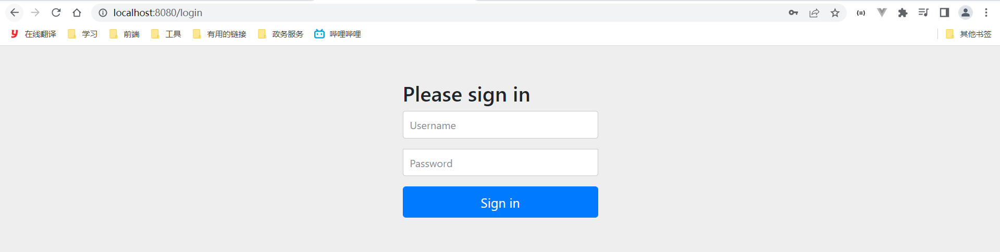
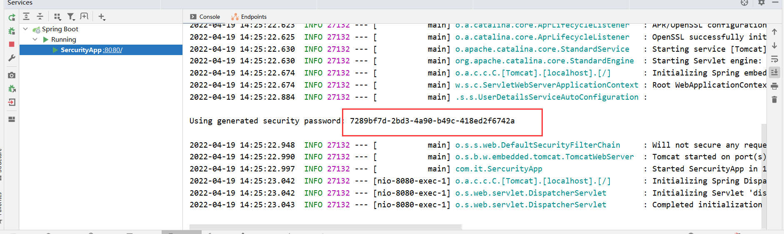

# HelloWord


## 引入pom


往security-01添加以下依赖

```xml
<!--security安全-->
<dependency>
   <groupId>org.springframework.boot</groupId>
   <artifactId>spring-boot-starter-security</artifactId>
</dependency>
```


## 启动项目


http://localhost:8080/login




## 登录


密码会在控制台打印

+ 账号：user
+ 密码：日志查找




登录过后就可以看见页面了


