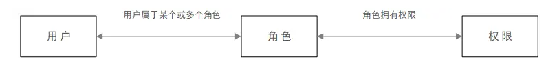
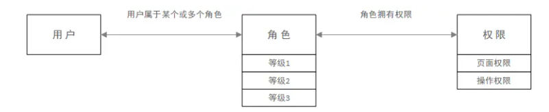

# 授权


## 权限管理系统的作用


对整个后台系统进行权限控制，目的是为了避免系统的使用者因为权限控制的缺失而出现操作不当、数据泄露、流程卡住等问题。

## 权限管理系统的三要素


这里说的三要素是系统中的三大功能模块，分别是账号、角色和权限。权限管理系统的存在，概括的讲是为了将三要素间的关系安排清楚。


（1）账号

每个后台系统的使用者，都有自己的账号。账号是使用者进入系统这扇大门的钥匙，它的权限对应着使用者在系统中的操作范围。后台产品的账号，通常是由公司内部人员进行创建。

（2）角色

角色是搭建在账号与权限之间的一道桥梁。系统中会有很多权限，如果每建一个账号都要配置一遍权限，将是很繁琐的一项工作。因此，角色作为使用者人群的集合，把需要的权限收归于其中，然后再根据账号的需要来配置角色。通常会根据不同的部门、职位、工作内容等，对角色进行设置。

角色这一概念的引入，极大地增加了权限管理系统配置的灵活性和便捷性。创建账号时，可以将不同的角色配置在同一个账号上，也可以给不同的账号配置相同的角色。创建角色时，可以根据角色的差异赋予其不同的权限。

（3）权限

权限可分为三类：数据权限、操作权限和页面权限。

数据权限：控制账号可看到的数据范围。举例说明，风控系统中，负责不同区域的信审人员，只能看到自己负责区域的标的，不能看到和修改其他区域的。

页面权限：控制账号可以看到的页面，通常系统都会有这一层权限控制。这种控制相对操作权限来说比较粗放，难以对权限进行精细管理。

操作权限：控制账号在页面上可以操作的按钮，通常指的是页面中的新增、删除、编辑、查询功能。没有操作权限，就只能看到页面中的数据，但是不能对数据进行操作。操作权限是比页面权限更精细一层的权限控制。


## 授权基本流程


在`SpringSecurity`中，会使用默认的`FilterSecurityInterceptor`来进行权限校验。在`FilterSecurityInterceptor`中会从`SecurityContextHolder`获取其中的`Authentication`，然后获取其中的权限信息。当前用户是否拥有访问当前资源所需的权限。

+  所以我们在项目中只需要把当前登录用户的权限信息也存入`Authentication`。
+ 然后设置我们的资源所需要的权限即可。


## 授权实现步骤


### 开启授权功能


SpringSecurity为我们提供了基于注解的权限控制方案，这也是我们项目中主要采用的方式。我们可以使用注解去指定访问对应的资源所需的权限。

但是要使用它我们需要先开启相关配置。

~~~~java
@EnableGlobalMethodSecurity(prePostEnabled = true)
~~~~


### @PreAuthorize


顾名思义是进入方法前的权限验证，`@PreAuthorize` 声明这个方法所需要的权限表达式，例如：  `@PreAuthorize("hasAuthority('test')")`

根据这个注解所需要的权限，再和当前登录的用户角色所拥有的权限对比，如果用户的角色权限集Set中有这个权限，则放行；没有，拒绝


````java
@RestController
public class HelloController {

    @RequestMapping("/hello")
    @PreAuthorize("hasAuthority('test')")
    public String hello(){
        return "hello";
    }
}
````


## 授权案例


### LoginUser改造


```java
@Data
@NoArgsConstructor
@AllArgsConstructor
public class LoginUser implements UserDetails {

    private UserEntity user;

    //权限信息
    private Set<String> permissions;

    public LoginUser(UserEntity user) {
        this.user = user;

    }

    public LoginUser(UserEntity user, Set<String> permissions) {
        this.user = user;
        this.permissions = permissions;
    }

    @JSONField(serialize = false)//转json的时候不会序列化
    private List<GrantedAuthority> authorities;

    /**
     * 返回授予用户的权限。不能返回null。
     *
     * 返回:
     *
     * 权限，按自然键排序(从不为空)
     * @return
     */
    @Override
    public Collection<? extends GrantedAuthority> getAuthorities() {
        if(!CollectionUtils.isEmpty(authorities)){
            return authorities;
        }
        //把permissions中字符串类型的权限信息转换成GrantedAuthority对象存入authorities中
        authorities = permissions.stream().
                map(SimpleGrantedAuthority::new)
                .collect(Collectors.toList());
        return authorities;
    }

    /**
     * 获取密码
     * @return
     */
    @Override
    public String getPassword() {
        return user.getPassword();
    }

    /**
     * 获取 用户名
     * @return
     */
    @Override
    public String getUsername() {
        return user.getUserName();
    }

    /**
     * 指示用户的帐户是否已过期。帐号过期后将无法验证。
     *
     * 返回:
     *
     * 如果用户的帐户有效(即未过期)则为True，如果不再有效(即过期)则为false。
     * @return
     */
    @Override
    public boolean isAccountNonExpired() {
        return true;
    }

    /**
     * 用户是否被锁定或解锁。被锁定的用户无法进行认证。
     *
     * 返回:
     *
     * 如果用户未被锁定，则为True，否则为false
     * @return
     */
    @Override
    public boolean isAccountNonLocked() {
        return true;
    }

    /***
     * 指示用户的凭据(密码)是否已过期。过期的凭据将阻止身份验证。
     *
     * 返回:
     *
     * 如果用户的凭据有效(即未过期)则为True，如果不再有效(即过期)则为false
     * @return
     */
    @Override
    public boolean isCredentialsNonExpired() {
        return true;
    }

    /**
     * 启用或禁用用户。被禁用的用户无法进行认证。
     *
     * 返回:
     *
     * 如果用户已启用，则为True，否则为false
     * @return
     */
    @Override
    public boolean isEnabled() {
        return true;
    }
}
```


### MyUserDetailsService


```java
@Log4j2
public class MyUserDetailsService implements UserDetailsService {

    @Autowired
    private UserServcie servcie;


    @Override
    public UserDetails loadUserByUsername(String username) throws UsernameNotFoundException {
        log.info("========{}==========",this.getClass());
        UserEntity userEntity = new UserEntity();
        userEntity.setUserName(username);
        UserEntity data = servcie.findAll(userEntity).getData();
        if (data == null) {
            throw new RuntimeException("用户不存在");
        }
        Set<String> set = new HashSet<>();
        set.add("test");
        set.add("admin");
        return new LoginUser(data,set);
    }

}
```


### 过滤器链JwtAuthenticationTokenFilter


```java
/**
 * 描述 ：
 *
 * @author : 小糊涂
 * @version : 1.0
 **/

@Component
public class JwtAuthenticationTokenFilter extends OncePerRequestFilter {

    @Autowired
    private RedisCache redisCache;

    @Override
    protected void doFilterInternal(HttpServletRequest request, HttpServletResponse response, FilterChain filterChain) throws ServletException, IOException {
        //获取token
        String token = request.getHeader("token");
        if (!StringUtils.hasText(token)) {
            //放行
            filterChain.doFilter(request, response);
            return;
        }
        //解析token
        String userid;
        try {
            Claims claims = JwtUtil.parseJWT(token);
            userid = claims.getSubject();
        } catch (Exception e) {
            e.printStackTrace();
            throw new RuntimeException("token非法");
        }
        //从redis中获取用户信息
        String redisKey = "login:" + userid;
        LoginUser loginUser = redisCache.getCacheObject(redisKey);
        if(Objects.isNull(loginUser)){
            throw new RuntimeException("用户未登录");
        }
        //存入SecurityContextHolder
        //TODO 获取权限信息封装到Authentication中
        UsernamePasswordAuthenticationToken authenticationToken =
                new UsernamePasswordAuthenticationToken(loginUser,null,loginUser.getAuthorities());
        SecurityContextHolder.getContext().setAuthentication(authenticationToken);
        //放行
        filterChain.doFilter(request, response);
    }
```


### 测试controller


```java
@GetMapping
@PreAuthorize("hasAnyAuthority('test')")
public ResponseResult get() {

    return userServcie.findAll();
}
```


## RBAC模型


### 简介


迄今为止最为普及的权限设计模型是RBAC模型，基于角色的访问控制（Role-Based Access Control)。

即：基于角色的权限控制。通过角色关联用户，角色关联权限的方式间接赋予用户权限。



### 分类


RBAC模型可以分为：**RBAC0**、**RBAC1**、**RBAC2**、**RBAC3** 四种。其中RBAC0是基础，也是最简单的，相当于底层逻辑，RBAC1、RBAC2、RBAC3都是以RBAC0为基础的升级。

一般情况下，使用RBAC0模型就可以满足常规的权限管理系统设计了。


###  RBAC0模型


最简单的用户、角色、权限模型。这里面又包含了2种：

- 用户和角色是多对一关系，即：一个用户只充当一种角色，一种角色可以有多个用户担当
- 用户和角色是多对多关系，即：一个用户可同时充当多种角色，一种角色可以有多个用户担当


**那么，什么时候该使用多对一的权限体系，什么时候又该使用多对多的权限体系呢**？

如果系统功能比较单一，使用人员较少，岗位权限相对清晰且确保不会出现兼岗的情况，此时可以考虑用多对一的权限体系。其余情况尽量使用多对多的权限体系，保证系统的可扩展性。如：张三既是行政，也负责财务工作，那张三就同时拥有行政和财务两个角色的权限。


###  RBAC1模型


相对于RBAC0模型，增加了子角色，引入了继承概念，即子角色可以继承父角色的所有权限



**使用场景**：如某个业务部门，有经理、主管、专员。主管的权限不能大于经理，专员的权限不能大于主管，如果采用RBAC0模型做权限系统，极可能出现分配权限失误，最终出现主管拥有经理都没有的权限的情况。

而RBAC1模型就很好解决了这个问题，创建完经理角色并配置好权限后，主管角色的权限继承经理角色的权限，并且支持在经理权限上删减主管权限。


### RBAC2模型


基于RBAC0模型，增加了对角色的一些限制：角色互斥、基数约束、先决条件角色等。

- **角色互斥**：同一用户不能分配到一组互斥角色集合中的多个角色，互斥角色是指权限互相制约的两个角色。案例：财务系统中一个用户不能同时被指派给会计角色和审计员角色。
- **基数约束**：一个角色被分配的用户数量受限，它指的是有多少用户能拥有这个角色。例如：一个角色专门为公司CEO创建的，那这个角色的数量是有限的。
- **先决条件角色**：指要想获得较高的权限，要首先拥有低一级的权限。例如：先有副总经理权限，才能有总经理权限。
- **运行时互斥**：例如，允许一个用户具有两个角色的成员资格，但在运行中不可同时激活这两个角色。


### RBAC3模型


称为统一模型，它包含了RBAC1和RBAC2，利用传递性，也把RBAC0包括在内，综合了RBAC0、RBAC1和RBAC2的所有特点，这里就不在多描述了。


### 我们用RBAC0


RBAC权限模型（Role-Based Access Control）即：基于角色的权限控制。这是目前最常被开发者使用也是相对易用、通用权限模型。


## 数据库授权


### LoginUser


```java
@Data
@NoArgsConstructor
@AllArgsConstructor
public class LoginUser implements UserDetails {

    private UserEntity user;

    //权限信息
    private List<String> permissions;

    public LoginUser(UserEntity user) {
        this.user = user;

    }

    public LoginUser(UserEntity user, List<String> permissions) {
        this.user = user;
        this.permissions = permissions;
    }

    @JSONField(serialize = false)//转json的时候不会序列化
    private List<GrantedAuthority> authorities;

    /**
     * 返回授予用户的权限。不能返回null。
     *
     * 返回:
     *
     * 权限，按自然键排序(从不为空)
     * @return
     */
    @Override
    public Collection<? extends GrantedAuthority> getAuthorities() {
        if(!CollectionUtils.isEmpty(authorities)){
            return authorities;
        }
        //把permissions中字符串类型的权限信息转换成GrantedAuthority对象存入authorities中
        authorities = permissions.stream().
                map(SimpleGrantedAuthority::new)
                .collect(Collectors.toList());
        return authorities;
    }

    /**
     * 获取密码
     * @return
     */
    @Override
    public String getPassword() {
        return user.getPassword();
    }

    /**
     * 获取 用户名
     * @return
     */
    @Override
    public String getUsername() {
        return user.getUserName();
    }

    /**
     * 指示用户的帐户是否已过期。帐号过期后将无法验证。
     *
     * 返回:
     *
     * 如果用户的帐户有效(即未过期)则为True，如果不再有效(即过期)则为false。
     * @return
     */
    @Override
    public boolean isAccountNonExpired() {
        return true;
    }

    /**
     * 用户是否被锁定或解锁。被锁定的用户无法进行认证。
     *
     * 返回:
     *
     * 如果用户未被锁定，则为True，否则为false
     * @return
     */
    @Override
    public boolean isAccountNonLocked() {
        return true;
    }

    /***
     * 指示用户的凭据(密码)是否已过期。过期的凭据将阻止身份验证。
     *
     * 返回:
     *
     * 如果用户的凭据有效(即未过期)则为True，如果不再有效(即过期)则为false
     * @return
     */
    @Override
    public boolean isCredentialsNonExpired() {
        return true;
    }

    /**
     * 启用或禁用用户。被禁用的用户无法进行认证。
     *
     * 返回:
     *
     * 如果用户已启用，则为True，否则为false
     * @return
     */
    @Override
    public boolean isEnabled() {
        return true;
    }
}
```


### MyUserDetailsService


```java
/**
 * 描述 ： 自定义的UserDetailsService  用户用户密码校验
 *
 * @author : 小糊涂
 * @version : 1.0
 **/
@Log4j2
public class MyUserDetailsService implements UserDetailsService {

    @Autowired
    private UserServcie servcie;
    @Autowired
    private MenuMapper menuMapper;


    @Override
    public UserDetails loadUserByUsername(String username) throws UsernameNotFoundException {
        log.info("========{}==========",this.getClass());
        UserEntity userEntity = new UserEntity();
        userEntity.setUserName(username);
        UserEntity data = servcie.findAll(userEntity).getData();
        if (data == null) {
            throw new RuntimeException("用户不存在");
        }
        List<String> strings = menuMapper.selectPermsByUserId(data.getId());
        return new LoginUser(data,strings);
    }
}
```


### 测试


http://localhost:8888/login?userName=admin&password=123456

http://localhost:8888/


