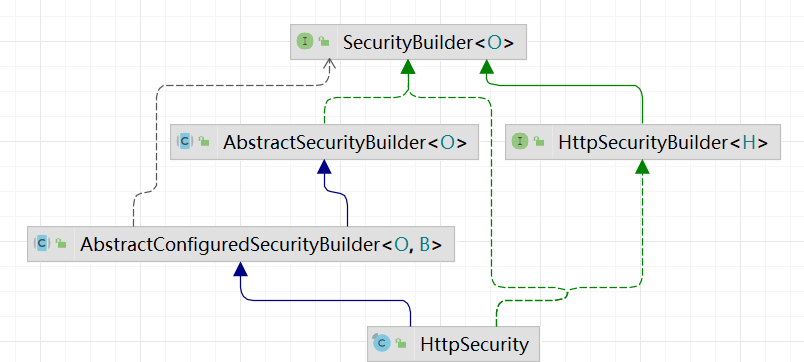

# HttpSecurity(常用方法)

## 简介

下图是：在idea中生成HttpSecurity的类图

## 方法

| 方法                   | 描述                                                         |
| ---------------------- | ------------------------------------------------------------ |
| addFilterAt()          | 在指定的Filter类的位置添加过滤器                             |
| addFilterAfter         | 在某一个过滤器之前添加过滤器。                               |
| addFilterBefore        | 在某一个过滤器之后添加过滤器。                               |
| addFilter              | 添加一个过滤器，该过滤器必须是现有过滤器链中某一个过滤器或者其扩展。 |
| anonymous()            | 允许配置匿名用户的表示方法。 当与WebSecurityConfigurerAdapter结合使用时，这将自动应用。  默认情况下，匿名用户将使用org.springframework.security.authentication.AnonymousAuthenticationToken表示，并包含角色  “ROLE_ANONYMOUS” |
| authorizeRequests()    | 允许基于使用HttpServletRequest限制访问                       |
| cors()                 | 配置跨域资源共享（ CORS ）                                   |
| csrf()                 | 添加 CSRF 支持，使用WebSecurityConfigurerAdapter时，默认启用 |
| formLogin()            | 指定支持基于表单的身份验证。如果未指定FormLoginConfigurer#loginPage(String)，则将生成默认登录页面 |
| headers()              | 将安全标头添加到响应                                         |
| httpBasic()            | 配置 Http Basic 验证                                         |
| jee()                  | 配置基于容器的预认证。 在这种情况下，认证由Servlet容器管理   |
| logout()               | 添加退出登录支持。当使用WebSecurityConfigurerAdapter时，这将自动应用。默认情况是，访问URL”/  logout”，使HTTP  Session无效来清除用户，清除已配置的任何#rememberMe()身份验证，清除SecurityContextHolder，然后重定向到”/login?success” |
| oauth2Login()          | 根据外部OAuth 2.0或OpenID Connect 1.0提供程序配置身份验证    |
| openidLogin()          | 用于基于 OpenId 的验证                                       |
| portMapper()           | 允许配置一个PortMapper(HttpSecurity#(getSharedObject(class)))，其他提供SecurityConfigurer的对象使用  PortMapper 从 HTTP 重定向到 HTTPS 或者从 HTTPS 重定向到 HTTP。默认情况下，Spring  Security使用一个PortMapperImpl映射 HTTP 端口8080到 HTTPS 端口8443，HTTP 端口80到 HTTPS 端口443 |
| rememberMe             | 允许配置“记住我”的验证                                       |
| requestCache()         | 允许配置请求缓存                                             |
| requiresChannel()      | 配置通道安全。为了使该配置有用，必须提供至少一个到所需信道的映射 |
| securityContext()      | 在HttpServletRequests之间的SecurityContextHolder上设置SecurityContext的管理。  当使用WebSecurityConfigurerAdapter时，这将自动应用 |
| servletApi()           | 将HttpServletRequest方法与在其上找到的值集成到SecurityContext中。  当使用WebSecurityConfigurerAdapter时，这将自动应用 |
| sessionManagement()    | 允许配置会话管理                                             |
| x509()                 | 配置基于x509的认证                                           |
| successHandler()       | 配置认证成功处理器                                           |
| failureHandler()       | 配置认证失败处理器                                           |
| logoutSuccessHandler() | 配置注销成功处理器                                           |
| exceptionHandling()    | 配置异常处理                                                 |

## URL匹配

| 方法                | 匹配原则                                                     |
| ------------------- | ------------------------------------------------------------ |
| requestMatchers()   | 配置一个request Mather数组，参数为RequestMatcher 对象，其match 规则自定义,需要的时候放在最前面，对需要匹配的的规则进行自定义与过滤 |
| authorizeRequests() | URL权限配置                                                  |
| antMatchers()       | 配置一个request Mather 的 string数组，参数为 ant 路径格式， 直接匹配url |
| anyRequest          | 匹配任意url，无参 ,最好放在最后面                            |

## 保护URL

| 方法                                     | 匹配原则                                                     |
| ---------------------------------------- | ------------------------------------------------------------ |
| authenticated()                          | 保护UrL，需要用户登录                                        |
| permitAll()                              | 指定URL无需保护，一般应用与静态资源文件                      |
| hasRole(String role)                     | 限制单个角色访问，角色将被增加 “ROLE_” .所以”ADMIN” 将和 “ROLE_ADMIN”进行比较. 另一个方法是hasAuthority(String authority) |
| hasAnyRole(String… roles)                | 允许多个角色访问. 另一个方法是hasAnyAuthority(String… authorities) |
| access(String attribute)                 | 该方法使用 SPEL, 所以可以创建复杂的限制 例如如access(“permitAll”), access(“hasRole(‘ADMIN’) and hasIpAddress(‘123.123.123.123’)”) |
| hasIpAddress(String ipaddressExpression) | 限制IP地址或子网                                             |
| anonymous()                              | 匿名用户                                                     |

## 登录login

| 方法              | 匹配原则                                                   |
| ----------------- | ---------------------------------------------------------- |
| formLogin()       | 基于表单登录                                               |
| loginPage()       | 登录页                                                     |
| defaultSuccessUrl | 登录成功后的默认处理页                                     |
| failuerHandler    | 登录失败之后的处理器                                       |
| successHandler    | 登录成功之后的处理器                                       |
| failuerUrl        | 登录失败之后系统转向的url，默认是this.loginPage + “?error” |

## 登出logout

| 方法                 | 匹配原则                                            |
| -------------------- | --------------------------------------------------- |
| logoutUrl            | 登出url ， 默认是/logout， 它可以是一个ant path url |
| logoutSuccessUrl     | 登出成功后跳转的 url 默认是"/login?logout"          |
| logoutSuccessHandler | 登出成功处理器，设置后会把logoutSuccessUrl 置为null |
