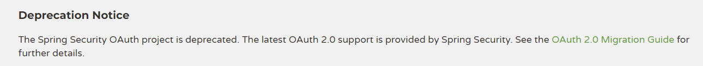

# SpringCloudSecurityOAuth2

## 简介

Spring-Security-OAuth2是对OAuth2的一种实现，并且跟我们之前学习的Spring Security相辅相成，与Spring Cloud体系的集成也非常便利，接下来，我们需要对它进行学习，最终使用它来实现我们设计的分布式认证授权解 决方案。 

OAuth2.0的服务提供方涵盖两个服务，即授权服务 (Authorization Server，也叫认证服务) 和资源服务 (Resource Server)，使用 Spring Security OAuth2 的时候你可以选择把它们在同一个应用程序中实现，也可以选择建立使用同一个授权服务的多个资源服务。 

+ **授权服务** **(Authorization Server）**应包含对接入端以及登入用户的合法性进行验证并颁发token等功能，对令牌的请求端点由 Spring MVC 控制器进行实现，下面是配置一个认证服务必须要实现的endpoints： 

+ **AuthorizationEndpoint** 服务于认证请求。默认 URL：` /oauth/authorize` 。 

+ **TokenEndpoint** 服务于访问令牌的请求。默认 URL： `/oauth/token `。 

+ **资源服务** **(Resource Server)**，应包含对资源的保护功能，对非法请求进行拦截，对请求中token进行解析鉴 权等，下面的过滤器用于实现 OAuth 2.0 资源服务： 
+ **OAuth2AuthenticationProcessingFilter**用来对请求给出的身份令牌解析鉴权。 

## 弃用通知（重点）

https://spring-projects.github.io/spring-security-oauth/docs/downloads.html

Spring Security OAuth项目已弃用。Spring Security提供了最新的OAuth 2.0支持。详见(OAuth 2.0)[https://github.com/spring-projects/spring-security/wiki/OAuth-2.0-Migration-Guide]迁移指南。

## 文档

迁移指南：

https://github.com/spring-projects/spring-security/wiki/OAuth-2.0-Migration-Guide#unported-features

源码：

 https://github.com/spring-projects/spring-security-oauth.git

