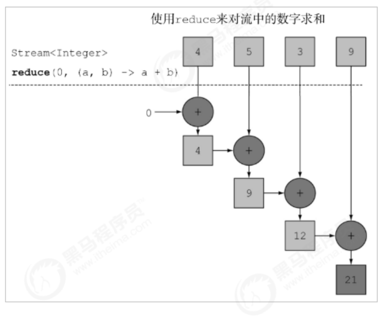

# 六、Stream流(二)

## 6.1：sorted方法

如果需要将数据排序，可以使用 sorted 方法。方法签名：

```java
Stream<T> sorted();
Stream<T> sorted(Comparator<? super T> comparator);
```

**基本使用**

Stream流中的 sorted 方法基本使用的代码如：

```java
   @Test
    public void testSorted() {
        List<Integer> list = new ArrayList<>();
        list.add(20);
        list.add(30);
        list.add(1);
        list.add(5);
        list.add(15);
        list.stream().sorted().forEach(System.out::println);//按照自然顺序排序
        System.out.println("=====================");
        list.stream().sorted((o1, o2) -> o2 - o1).forEach(System.out::println);//自定义比较器
        /**
         * 打印结果
         1
        ................
         30
         =====================
         30
         ................
         1
         */
    }
```

## 6.2：distinct方法

如果需要去除重复数据，可以使用 distinct 方法。方法签名：

```java
Stream<T> distinct();
```

**基本使用**

Stream流中的 distinct 方法基本使用的代码如：

```java
    @Test
    public void testDistinct() {
        List<Integer> list = new ArrayList<>();
        list.add(20);
        list.add(20);
        list.add(10);
        list.add(10);
        list.add(5);
        list.stream().distinct().forEach(System.out::println);
        /**
         * 打印结果
         20
         10
         5
         */
    }
```

> **如何自定义去重**

```java
    @Test
    public void testDistinct2() {
        Stream.of(new Person("刘德华", 58),
                new Person("张学友", 56),
                new Person("张学友", 56),
                new Person("黎明", 52)).distinct().forEach(System.out::println);
        /**
         Person{name='刘德华', age=58}
         Person{name='张学友', age=56}
         Person{name='黎明', age=52}
         */
    }
}
```

自定义对象需要重写`hashcode`和`equals`方法

```java
public class Person {
    private String name;
    private Integer age;

    public Person(String name, Integer age) {
        this.name = name;
        this.age = age;
    }
    public Person() {

    }

    @Override
    public boolean equals(Object o) {
        if (this == o) return true;
        if (o == null || getClass() != o.getClass()) return false;
        Person person = (Person) o;
        return Objects.equals(name, person.name) &&
                Objects.equals(age, person.age);
    }

    @Override
    public int hashCode() {
        return Objects.hash(name, age);
    }

    @Override
    public String toString() {
        return "Person{" +
                "name='" + name + '\'' +
                ", age=" + age +
                '}';
    }

    public Integer getAge() {
        return age;
    }

    public void setAge(Integer age) {
        this.age = age;
    }

    public String getName() {
        return name;
    }

    public void setName(String name) {
        this.name = name;
    }
}

```

## 6.3：match方法

如果需要判断数据是否匹配指定的条件，可以使用 Match 相关方法。方法签名：

```java
boolean allMatch(Predicate<? super T> predicate);// 元素是否全部满足条件
boolean anyMatch(Predicate<? super T> predicate);// 元素是否任意有一个满足条件
boolean noneMatch(Predicate<? super T> predicate);// 元素是否全部不满足条件
```

**基本使用**

Stream流中的 Match 相关方法基本使用的代码如:

```java
    @Test
    public void testMatch() {
        System.out.println(Stream.of(5, 3, 6, 1).allMatch(e -> e > 0)); // allMatch: 元素是否全部满足条件
        System.out.println(Stream.of(5, 3, 6, 1).anyMatch(e -> e > 5));// anyMatch: 元素是否任意有一个满足条件
        System.out.println(Stream.of(5, 3, 6, 1).noneMatch(e -> e > 5)); // noneMatch: 元素是否全部不满足条件
    }
```

## 6.4：find方法

如果需要找到某些数据，可以使用 find 相关方法。方法签名：

```java
Optional<T> findFirst();
Optional<T> findAny();
```

这两个方法一模一样，无区别

**基本使用**

Stream流中的 find 相关方法基本使用的代码如：

```java
    @Test
    public void testFind() {
        Optional<Integer> first = Stream.of(5, 3, 6, 1).findFirst();
        System.out.println("first = " + first.get());
        Optional<Integer> any = Stream.of(5, 5, 6, 1).findAny();
        System.out.println("any = " + any.get());
    }
/**
打印结果：
        first = 5
        any = 5
**/
```

## 6.5：max和min方法

如果需要获取`最大`和`最小`值，可以使用 `max `和 `min `方法。方法签名：

```java
Optional<T> max(Comparator<? super T> comparator); 
Optional<T> min(Comparator<? super T> comparator);
```

这两个方法都可以获取最大最小值，主要区别在于我们自定义比较器,通过我们的比较器排序后获取到第一个值

**基本使用**

Stream流中的 `max `和 `min `相关方法基本使用的代码如：

```java
   @Test
    public void testMax_Min() {
        Optional<Integer> max1 = Stream.of(5, 3, 6, 1).max((o1, o2) -> o1 - o2);
        Optional<Integer> max2 = Stream.of(5, 3, 6, 1).min((o1, o2) -> o2 - o1);
        System.out.println("max1 = " + max1.get());
        System.out.println("max2 = " + max2.get());

        Optional<Integer> min1 = Stream.of(5, 3, 6, 1).max((o1, o2) -> o2 - o1);
        Optional<Integer> min2 = Stream.of(5, 3, 6, 1).min((o1, o2) -> o1 - o2);
        System.out.println("min1 = " + min1.get());
        System.out.println("min2 = " + min2.get());
        /**
        max1 = 6
        max2 = 6
        min1 = 1
        min2 = 1
        **/
    }
```

## 6.6：reduce方法

如果需要将所有数据归纳得到一个数据，可以使用 reduce 方法。方法签名：

```java
T reduce(T identity, BinaryOperator<T> accumulator);//参数数据具体处理方式
T reduce(T identity, BinaryOperator<T> accumulator);//第一个参数是默认值，第二个值是数据具体处理方式
```

**基本使用**

Stream流中的 reduce 相关方法基本使用的代码如：

```java
   @Test
    public void testReduce() {
        List<Integer> list = new ArrayList<>();
        list.add(20);
        list.add(20);
        list.add(10);
        list.add(10);
        list.add(5);
        Optional<Integer> reduce1 = list.stream().reduce((x, y) -> {
            System.out.println("x=" + x + ",y=" + y);
            return x * y;
        });
        System.out.println(reduce1.get());
        System.out.println("===============");
        Integer reduce2 = list.stream().reduce(0, (x, y) -> {
            System.out.println("x=" + x + ",y=" + y);
            return x + y;
        });
        System.out.println(reduce2);
    }
/**
x=20,y=20
x=400,y=10
x=4000,y=10
x=40000,y=5
200000
===============
x=0,y=20
x=20,y=20
x=40,y=10
x=50,y=10
x=60,y=5
65 
**/
```



## 6.7：map和reduce组合使用

```java
 @Test
    public void testMapReduce() {
        // 求出所有年龄的总和
        int totalAge = Stream.of(
                new Person("刘德华", 58),
                new Person("张学友", 56),
                new Person("郭富城", 54),
                new Person("黎明", 52)
        ).map((p) -> p.getAge()).reduce(0, (x, y) -> x + y);
        System.out.println("totalAge = " + totalAge);
        // 找出最大年龄
        int maxAge = Stream.of(
                new Person("刘德华", 58),
                new Person("张学友", 56),
                new Person("郭富城", 54),
                new Person("黎明", 52)
        ).map((p) -> p.getAge()).reduce(0, (x, y) -> x > y ? x : y);
        System.out.println("maxAge = " + maxAge);
        // 统计 数字2 出现的次数
        int count = Stream.of(1, 2, 2, 1, 3, 2).map(i -> {
            if (i == 2) {
                return 1;
            } else {
                return 0;
            }
        }).reduce(0, Integer::sum);
        System.out.println("count = " + count);
    }
```

## 6.8：concat方法

如果有两个流，希望合并成为一个流，那么可以使用 Stream 接口的静态方法 concat ：

```java
    @Test
    public void testContact() {
        Stream<String> streamA = Stream.of("张三","李四");
        Stream<String> streamB = Stream.of("王麻子");
        Stream<String> result = Stream.concat(streamA, streamB);
        result.forEach(System.out::println);
    }
    /**
    打印结果
    **/
```

## 6.9：总和案例

现在有两个 ArrayList 集合存储队伍当中的多个成员姓名，要求使用传统的for循环（或增强for循环）**依次**进行以下若干操作步骤：

1. 第一个队伍只要名字为3个字的成员姓名；

2. 第一个队伍筛选之后只要前3个人；

3. 第二个队伍只要姓张的成员姓名；

4. 第二个队伍筛选之后不要前2个人；

5. 将两个队伍合并为一个队伍；

6. 根据姓名创建 Person 对象；

7. 打印整个队伍的Person对象信息。

```java
import java.util.ArrayList;
import java.util.Arrays;
import java.util.List;

public class DemoArrayListNames {
    public static void main(String[] args) {
        List<String> one = Arrays.asList("迪丽热巴", "宋远桥", "苏星河", "老子", "庄子", "孙子", "洪七公");
        List<String> two = Arrays.asList("古力娜扎", "张无忌", "张三丰", "赵丽颖", "张二狗", "张天爱", "张三");
        // 第一个队伍只要名字为3个字的成员姓名；
        List<String> oneA = new ArrayList<>();
        for (String name : one) {
            if (name.length() == 3) {
                oneA.add(name);
            }
        }
        System.out.println(oneA.size());
        // 第一个队伍筛选之后只要前3个人；
        List<String> oneB = new ArrayList<>();
        for (int i = 0; i < 3; i++) {
            oneB.add(oneA.get(i));
        }
        // 第二个队伍只要姓张的成员姓名；
        List<String> twoA = new ArrayList<>();
        for (String name : two) {
            if (name.startsWith("张")) {
                twoA.add(name);
            }
        }
        // 第二个队伍筛选之后不要前2个人；
        List<String> twoB = new ArrayList<>();
        for (int i = 2; i < twoA.size(); i++) {
            twoB.add(twoA.get(i));
        }
        // 将两个队伍合并为一个队伍；
        List<String> totalNames = new ArrayList<>();
        totalNames.addAll(oneB);
        totalNames.addAll(twoB);
        // 根据姓名创建Person对象；
        List<Person> totalPersonList = new ArrayList<>();
        for (String name : totalNames) {
            totalPersonList.add(new Person(name));
        }
        // 打印整个队伍的Person对象信息。
        for (Person person : totalPersonList) {
            System.out.println(person);
        }
    }
}
```


