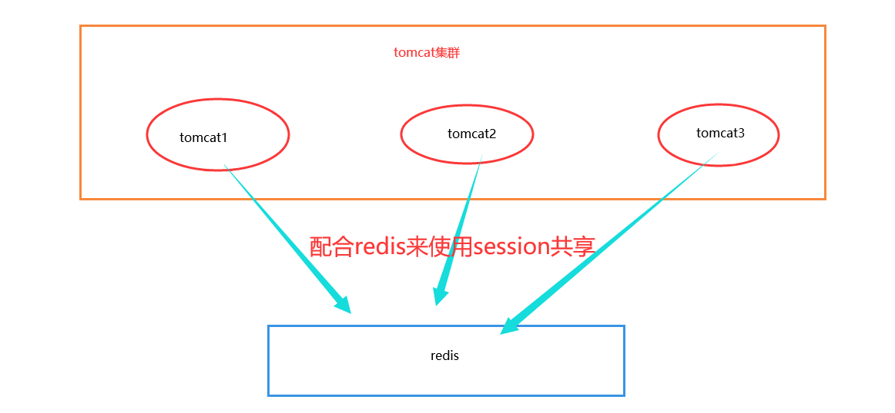
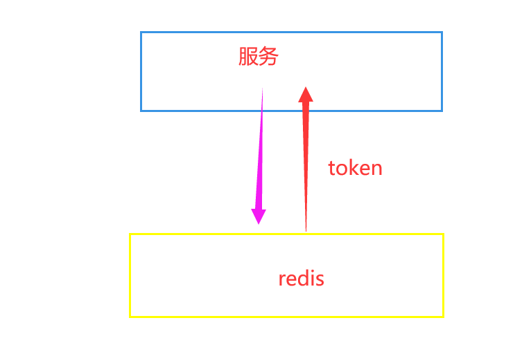

# 二、传统认证

## 2.1：Session

我们知道，http协议本身是一种无状态的协议，而这就意味着如果用户向我们的应用提供了用户名和密码来进行用户认证，那么下一次请求时，用户还要再一次进行用户认证才行，因为根据http协议，我们并不能知道是哪个用户发出的请求，所以为了让我们的应用能识别是哪个用户发出的请求，我们只能在服务器存储一份用户登录的信息，这份登录信息会在响应时传递给浏览器，告诉其保存为cookie,以便下次请求时发送给我们的应用，这样我们的应用就能识别请求来自哪个用户了,这就是传统的基于session认证。

==但是这种基于session的认证使应用本身很难得到扩展，随着不同客户端用户的增加，独立的服务器已无法承载更多的用户，而这时候基于session认证应用的问题就会暴露出来.==

**基于session认证所显露的问题**

+ Session: 每个用户经过我们的应用认证之后，我们的应用都要在服务端做一次记录，以方便用户下次请求的鉴别，通常而言session都是保存在内存中，而随着认证用户的增多，服务端的开销会明显增大。

+ 扩展性:
  用户认证之后，服务端做认证记录，如果认证的记录被保存在内存中的话，这意味着用户下次请求还必须要请求在这台服务器上,这样才能拿到授权的资源，这样在分布式的应用上，相应的限制了负载均衡器的能力。这也意味着限制了应用的扩展能力。

+ CSRF: 因为是基于cookie来进行用户识别的, cookie如果被截获，用户就会很容易受到跨站请求伪造的攻击。

## 2.2：Token

Token是服务器签发的一串加密字符串，是为了给客户端重复访问的一个令牌，作用是为了证明请求者（客户端）的身份，保持用户长期保持登录状态。

基于token的鉴权机制类似于http协议也是无状态的，它不需要在服务端去保留用户的认证信息或者会话信息。这就意味着基于token认证机制的应用不需要去考虑用户在哪一台服务器登录了，这就为应用的扩展提供了便利。

流程上是这样的：

- 用户使用用户名密码来请求服务器
- 服务器进行验证用户的信息
- 服务器通过验证发送给用户一个token
- 客户端存储token，并在每次请求时附送上这个token值
- 服务端验证token值，并返回数据

这个token必须要在每次请求时传递给服务端，它应该保存在请求头里， 另外，服务端要支持`CORS(跨来源资源共享)`
策略，一般我们在服务端这么做就可以了`Access-Control-Allow-Origin: *`。

那么我们现在回到JWT的主题上。

