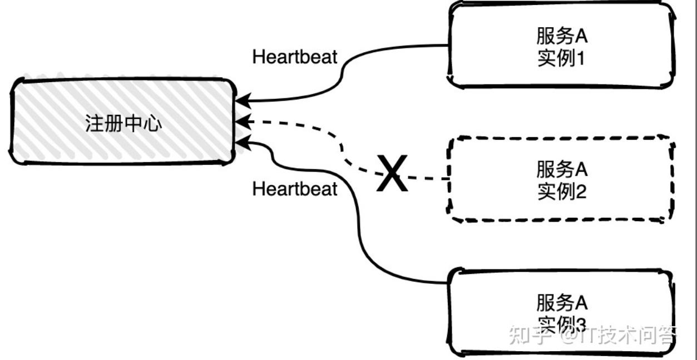
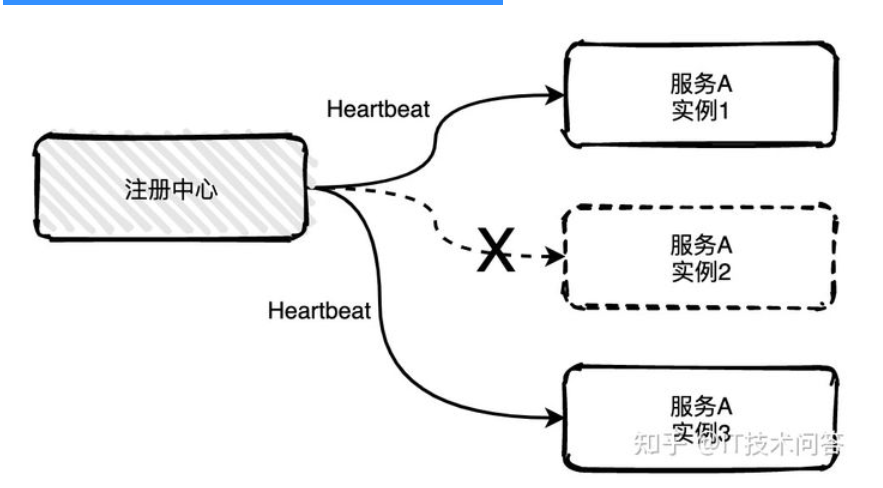
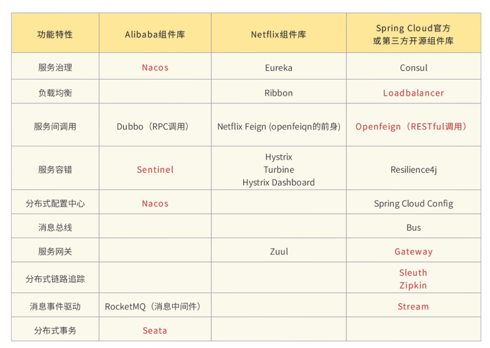

# 简介


## Spring Cloud的是什么？


Spring Cloud为开发人员提供了工具来快速构建分布式系统中的一些常见模式(例如**配置管理、服务发现、断路器、智能路由、微代理、控制总线、一次性令牌、全局锁、领导选举、分布式会话、集群状态**)。

协调分布式系统有固定样板模型，使用Spring Cloud开发人员可以快速地搭建基于实现了这些模型的服务和应用程序。他们将在任何分布式环境中工作，包括开发人员自己的笔记本电脑，裸机数据中心，和管理的平台，如云计算。


## 服务进化概述


1. 传统服务到微服务进化。

   > 《传统到分布式演进》

2. 单体应用-> SOA ->微服务（下面讲）


```
课外扩展：
持续集成，持续部署，持续交付。
集成:是指软件个人研发的部分向软件整体部分集成，以便尽早发现个人开发部分的问题；
部署: 是代码尽快向可运行的开发/测试节交付，以便尽早测试；
交付: 是指研发尽快向客户交付，以便尽早发现生产环境中存在的问题。
   如果说等到所有东西都完成了才向下个环节交付，导致所有的问题只能在最后才爆发出来，解决成本巨大甚至无法解决。而所谓的持续，就是说每完成一个完整的部分，就向下个环节交付，发现问题可以马上调整。使问题不会放大到其他部分和后面的环节。
   这种做法的核心思想在于：既然事实上难以做到事先完全了解完整的、正确的需求，那么就干脆一小块一小块的做，并且加快交付的速度和频率，使得交付物尽早在下个环节得到验证。早发现问题早返工。

上面的3个持续，也都随着微服务的发展而发展，当架构师的同学，可以参考这种方式。

持续集成的工具，向大家推荐：https://jenkins.io/doc/book/pipeline/
```


### 单体应用


1. 概念：所有功能全部打包在一起。应用大部分是一个war包或jar包。我参与网约车最开始架构是：一个乘客项目中有 用户、订单、消息、地图等功能。随着业务发展，功能增多，这个项目会越来越臃肿。

2. 好处：容易开发、测试、部署，适合项目初期试错。

3. 坏处：

   	随着项目越来越复杂，团队不断扩大。坏处就显现出来了。

   - 复杂性高：代码多，十万行，百万行级别。加一个小功能，会带来其他功能的隐患，因为它们在一起。
   - 技术债务：人员流动，不坏不修，因为不敢修。
   - 持续部署困难：由于是全量应用，改一个小功能，全部部署，会导致无关的功能暂停使用。编译部署上线耗时长，不敢随便部署，导致部署频率低，进而又导致两次部署之间 功能修改多，越不敢部署，恶性循环。
   - 可靠性差：某个小问题，比如小功能出现OOM，会导致整个应用崩溃。
   - 扩展受限：只能整体扩展，无法按照需要进行扩展，  不能根据计算密集型（派单系统）和IO密集型（文件服务） 进行合适的区分。
   - 阻碍创新：单体应用是以一种技术解决所有问题，不容易引入新技术。但在高速的互联网发展过程中，适应的潮流是：用合适的语言做合适的事情。比如在单体应用中，一个项目用spring MVC，想换成spring boot，切换成本很高，因为有可能10万，百万行代码都要改，而微服务可以轻松切换，因为每个服务，功能简单，代码少。


### SOA


   	对单体应用的改进：引入SOA（Service-Oriented Architecture）面向服务架构，拆分系统，用服务的流程化来实现业务的灵活性。服务间需要某些方法进行连接，面向接口等，它是一种设计方法，其中包含多个服务， 服务之间通过相互依赖最终提供一系列的功能。一个服务 通常以独立的形式存在于操作系统进程中。各个服务之间 通过网络调用。但是还是需要用些方法来进行服务组合，有可能还是个单体应用。


所以要引入微服务，是SOA思想的一种具体实践。

微服务架构 = 80%的SOA服务架构思想 + 100%的组件化架构思想


### 微服务


看下一节


## 微服务


### 微服务概况


- 无严格定义。
- 微服务是一种架构风格，将单体应用划分为小型的服务单元。
- 微服务架构是一种使用一系列粒度较小的服务来开发单个应用的方式；每个服务运行在自己的进程中；服务间采用轻量级的方式进行通信(通常是HTTP API)；这些服务是基于业务逻辑和范围，通过自动化部署的机制来独立部署的，并且服务的集中管理应该是最低限度的，即每个服务可以采用不同的编程语言编写，使用不同的数据存储技术。
- 英文定义：

```java
看这篇文章：
http://www.martinfowler.com/articles/microservices.html
```

- 小类比

  合久必分。分开后通信，独立部署，独立存储。

```java
分封制：
服从天子命令：服从服务管理。
有为天子镇守疆土的义务：各自完成各自的一块业务。
随从作战：服务调用。
交纳贡献：分担流量压力。
```

- 段子（中台战略）

```java
Q：大师大师，服务拆多了怎么办？
A：那就再合起来。
Q：那太没面子了。
A：那就说跨过了微服务初级阶段，在做中台（自助建站系统）。
```


### 微服务特性


独立运行在自己进程中。

一系列独立服务共同构建起整个系统。

一个服务只关注自己的独立业务。

轻量的通信机制RESTful API

使用不同语言开发

全自动部署机制


### 微服务组件介绍


不局限与具体的微服务实现技术。

- 服务注册与发现：服务提供方将己方调用地址注册到服务注册中心，让服务调用方能够方便地找到自己；服务调用方从服务注册中心找到自己需要调用的服务的地址。

- 负载均衡：服务提供方一般以多实例的形式提供服务，负载均衡功能能够让服务调用方连接到合适的服务节点。并且，服务节点选择的过程对服务调用方来说是透明的。

- 服务网关：服务网关是服务调用的唯一入口，可以在这个组件中实现用户鉴权、动态路由、灰度发布、A/B测试、负载限流等功能。

  ```java
  灰度发布（又名金丝雀发布）是指在黑与白之间，能够平滑过渡的一种发布方式。在其上可以进行A/B testing，即让一部分用户继续用产品特性A，一部分用户开始用产品特性B，如果用户对B没有什么反对意见，那么逐步扩大范围，把所有用户都迁移到B上面来。灰度发布可以保证整体系统的稳定，在初始灰度的时候就可以发现、调整问题，以保证其影响度。
  ```

- 配置中心：将本地化的配置信息(Properties、XML、YAML等形式)注册到配置中心，实现程序包在开发、测试、生产环境中的无差别性，方便程序包的迁移，也是无状态特性。

- 集成框架：微服务组件都以职责单一的程序包对外提供服务，集成框架以配置的形式将所有微服务组件(特别是管理端组件)集成到统一的界面框架下，让用户能够在统一的界面中使用系统。Spring Cloud就是一个集成框架。

- 调用链监控：记录完成一次请求的先后衔接和调用关系，并将这种串行或并行的调用关系展示出来。在系统出错时，可以方便地找到出错点。

- 支撑平台：系统微服务化后，各个业务模块经过拆分变得更加细化，系统的部署、运维、监控等都比单体应用架构更加复杂，这就需要将大部分的工作自动化。现在，Docker等工具可以给微服务架构的部署带来较多的便利，例如持续集成、蓝绿发布、健康检查、性能监控等等。如果没有合适的支撑平台或工具，微服务架构就无法发挥它最大的功效。

  ```java
  1. 蓝绿部署是不停老版本，部署新版本然后进行测试，确认OK，将流量切到新版本，然后老版本同时也升级到新版本。
  2. 灰度是选择部分部署新版本，将部分流量引入到新版本，新老版本同时提供服务。等待灰度的版本OK，可全量覆盖老版本。
  
  灰度是不同版本共存，蓝绿是新旧版本切换，2种模式的出发点不一样。
  ```

  

### 微服务优点


1. 独立部署。不依赖其他服务，耦合性低，不用管其他服务的部署对自己的影响。
2. 易于开发和维护：关注特定业务，所以业务清晰，代码量少，模块变的易开发、易理解、易维护。
3. 启动块：功能少，代码少，所以启动快，有需要停机维护的服务，不会长时间暂停服务。
4. 局部修改容易：只需要部署 相应的服务即可，适合敏捷开发。
5. 技术栈不受限：java，node.js等
6. 按需伸缩：某个服务受限，可以按需增加内存，cpu等。
7. 职责专一。专门团队负责专门业务，有利于团队分工。
8. 代码复用。不需要重复写。底层实现通过接口方式提供。
9. 便于团队协作：每个团队只需要提供API就行，定义好API后，可以并行开发。


### 微服务缺点


1. 分布式固有的复杂性：容错（某个服务宕机），网络延时，调用关系、分布式事务等，都会带来复杂。

2. 分布式事务的挑战：每个服务有自己的数据库，有点在于不同服务可以选择适合自身业务的数据库。订单用MySQL，评论用Mongodb等。目前最理想解决方案是：柔性事务的最终一致性。

   ```sh
   刚性事务：遵循ACID原则，强一致性。
   柔性事务：遵循BASE理论，最终一致性；与刚性事务不同，柔性事务允许一定时间内，不同节点的数据不一致，但要求最终一致。
   
   BASE 是 Basically Available(基本可用)、Soft state(软状态)和 Eventually consistent (最终一致性)三个短语的缩写。BASE理论是对CAP中AP的一个扩展，通过牺牲强一致性来获得可用性，当出现故障允许部分不可用但要保证核心功能可用，允许数据在一段时间内是不一致的，但最终达到一致状态。满足BASE理论的事务，我们称之为“柔性事务”。
   ```

3. 接口调整成本高：改一个接口，调用方都要改。

4. 测试难度提升：一个接口改变，所有调用方都得测。自动化测试就变的重要了。API文档的管理也尤为重要。推荐：yapi。

5. 运维要求高：需要维护 几十 上百个服务。监控变的复杂。并且还要关注多个集群，不像原来单体，一个应用正常运行即可。

6. 重复工作：比如java的工具类可以在共享common.jar中，但在多语言下行不通，C++无法直接用java的jar包。


### 设计原则


单一职责原则：关注整个系统功能中单独，有界限的一部分。

服务自治原则：可以独立开发，测试，构建，部署，运行，与其他服务解耦。

轻量级通信原则：轻，跨平台，跨语言。REST,AMQP 等。

粒度把控：与自己实际相结合。 不要追求完美，随业务进化而调整。《淘宝技术这10年》。


## 服务治理


  在传统的rpc远程调用框架中，管理每个服务与服务之间依赖关系比较复杂，管理比较复杂，所以需要使用服务治理，管理服务于服务之间依赖关系，可以实现服务调用、负载均衡、容错等，实现服务发现与注册。

服务治理的优点：

- 更高的可用性

  服务治理可以支持动态的服务实例集群环境，任何服务实例可以随时上线或下线。并且当一个服务实例不可用时，治理服务器可以将请求转给其他服务提供者，当一个新的服务实例上线时，也能够快速地分担服务调用请求。

- 负载均衡

  服务治理可以提供动态的负载均衡功能，可以将所有请求动态地分布到其所管理的所有服务实例中进行处理。

- 提升应用的弹性

  服务治理的客户端会定时从服务治理服务器中复制一份服务实例信息缓存到本地中，这样即使当服务治理服务器不可用时，服务消费者也可以使用本地的缓存去访问相应的服务，而不至于中断服务。通过这种机制，极大地提高了应用的弹性。

- 高可用性集群

  可以构建服务治理集群，通过互相注册机制，将每个治理服务器所管辖的服务信息列表进行交换，使服务治理服务拥有更高的可用性。


## 服务注册发现


**服务注册的两种方式**

+ 客户端注册
  客户端注册即为：将服务注册与服务注销的逻辑写进代码里面，当一个微服务启动的时候，将信息写入注册中心，当一个微服务下线的时候，注销相应的信息。且，需要不同的编程语言实现相同的一套逻辑。对业务代码有一定的入侵。期间，注册中心与各个微服务之间还需要保持心跳。

+ 第三方注册
  第三方注册由一个独立的服务 Registrar 负责注册与注销。当服务启动后以某种方式通知Registrar，然后Registrar负责向注册中心发起注册工作。同时注册中心要维护与服务之间的心跳，当服务不可用时，向注册中心注销服务。

**服务发现的两种方式**

+ 客户端发现
  客户端负责向注册中心获取相应的 ip 与 port ，多种语言需要实现同一套逻辑，有点冗余的感觉。
+ 服务端发现
  由 API gateway 实现服务发现的功能，这样一套语言便可轻松维护服务发现的功能


## 心跳机制


如果服务有多个实例，其中一个实例出现宕机，注册中心是可以实时感知到，并且将该实例信息从列表中移出，也称为摘机。

如何实现摘机？业界比较常用的方式是通过心跳检测的方式实现，心跳检测有**主动**和**被动**两种方式。

**被动检测**是指服务主动向注册中心发送心跳消息，时间间隔可自定义，比如配置5秒发送一次，注册中心如果在三个周期内比如说15秒内没有收到实例的心跳消息，就会将该实例从列表中移除。



上图中服务A的实例2已经宕机不能主动给注册中心发送心跳消息，15秒之后注册就会将实例2移除掉。

**主动检测**是注册中心主动发起，每隔几秒中会给所有列表中的服务实例发送心跳检测消息，如果多个周期内未发送成功或未收到回复就会主动移除该实例。





## SpringCloud版本


- 采用版本名+版本号，其中版本名采用伦敦地铁站命名，其中按照地铁首字母A-Z依次命令如Hoxton.SR9。但是现在已更改为主版本号.次版本号.修订号如2020.0.0
- 旧版本命名方式中,开发的快照版本(BUILD-SNAPSHOT)到里程碑版本(M),开发的差不多到会发布的候选发布版(RELEASE),最后到正式版(SR)版本。
- 新版本命名是`YYYY.MINOR.MICRO[-MODIFIER]`，拿**2020.0.1-SNAPSHOT** 这个版本来说，其中YYYY为年份全称、MINOR为辅助版本号、MICRO为补丁版本号。MODIFIER同上述修饰关键节点，BUILD-SNAPSHOT、里程碑M等。

SNAPSHOT 版本：正在开发中的快照版本，例如 2021.0.0-SNAPSHOT，快照版代表当前分支最新的代码进度，也是更新最为频繁的小版本类型，不推荐在线上正式环境使用；

Milestone 版本：在大版本正式发布前的里程碑版本，例如 2021.0.0-M1，M1 代表当前大版本的第一个里程碑版本，M2 代表第二个迭代里程碑，以此类推。在正式版本发布之前要经历多个里程碑的迭代，像 Spring Cloud Finchley 版足足经历了 9 个 M 版本之后，才过渡到了 RC 版。同样地，我也不推荐你在正式项目中使用 Milestone 版本；

Release Candidate 版本：这就是我们俗称的 RC 版，例如 2021.0.0-RC1。当一个版本迭代到 RC 版的时候，意味着离正式发布已经不远了。但是你要注意，RC 版是发布前的候选版本，走到这一步通常已经没有新的功能开发，RC 主要目的是开放出来让大家试用并尽量修复严重 Bug。

Release 版：稳定的正式发布版，比如 2020.0.1。你可以在自己的线上业务中放心使用 Release 稳定版。


## Cloud版本和Boot版本怎么选择


> 与springboot版本对应:https://start.spring.io/actuator/info

```java
{
      "Hoxton.SR12": "Spring Boot >=2.2.0.RELEASE and <2.4.0.M1",
      "2020.0.5": "Spring Boot >=2.4.0.M1 and <2.6.0-M1",
      "2021.0.0-M1": "Spring Boot >=2.6.0-M1 and <2.6.0-M3",
      "2021.0.0-M3": "Spring Boot >=2.6.0-M3 and <2.6.0-RC1",
      "2021.0.0-RC1": "Spring Boot >=2.6.0-RC1 and <2.6.1",
      "2021.0.1": "Spring Boot >=2.6.1 and <2.6.5-SNAPSHOT",
      "2021.0.2-SNAPSHOT": "Spring Boot >=2.6.5-SNAPSHOT and <3.0.0-M1",
      "2022.0.0-M1": "Spring Boot >=3.0.0-M1 and <3.1.0-M1"
}
```


##  AlibabaCloud 以及对应的适配Cloud 和 Boot 版本关系


https://github.com/alibaba/spring-cloud-alibaba/wiki/%E7%89%88%E6%9C%AC%E8%AF%B4%E6%98%8E


下表为按时间顺序发布的 Spring Cloud Alibaba 以及对应的适配 Spring Cloud 和 Spring Boot 版本关系（由于 Spring Cloud 版本命名有调整，所以对应的 Spring Cloud Alibaba 版本号也做了对应变化）

| Spring Cloud Alibaba Version      | Spring Cloud Version        | Spring Boot Version |
| --------------------------------- | --------------------------- | ------------------- |
| 2021.0.1.0                        | Spring Cloud 2021.0.1       | 2.6.3               |
| 2.2.7.RELEASE                     | Spring Cloud Hoxton.SR12    | 2.3.12.RELEASE      |
| 2021.1                            | Spring Cloud 2020.0.1       | 2.4.2               |
| 2.2.6.RELEASE                     | Spring Cloud Hoxton.SR9     | 2.3.2.RELEASE       |
| 2.1.4.RELEASE                     | Spring Cloud Greenwich.SR6  | 2.1.13.RELEASE      |
| 2.2.1.RELEASE                     | Spring Cloud Hoxton.SR3     | 2.2.5.RELEASE       |
| 2.2.0.RELEASE                     | Spring Cloud Hoxton.RELEASE | 2.2.X.RELEASE       |
| 2.1.2.RELEASE                     | Spring Cloud Greenwich      | 2.1.X.RELEASE       |
| 2.0.4.RELEASE(停止维护，建议升级) | Spring Cloud Finchley       | 2.0.X.RELEASE       |
| 1.5.1.RELEASE(停止维护，建议升级) | Spring Cloud Edgware        | 1.5.X.RELEASE       |


## CloudAlibaba版本及其自身所适配的各组件对应版本


https://github.com/alibaba/spring-cloud-alibaba/wiki/%E7%89%88%E6%9C%AC%E8%AF%B4%E6%98%8E

每个 Spring Cloud Alibaba 版本及其自身所适配的各组件对应版本（经过验证，自行搭配各组件版本不保证可用）如下表所示（最新版本用*标记）：

| Spring Cloud Alibaba Version                              | Sentinel Version | Nacos Version | RocketMQ Version | Dubbo Version | Seata Version |
| --------------------------------------------------------- | ---------------- | ------------- | ---------------- | ------------- | ------------- |
| 2.2.7.RELEASE                                             | 1.8.1            | 2.0.3         | 4.6.1            | 2.7.13        | 1.3.0         |
| 2.2.6.RELEASE                                             | 1.8.1            | 1.4.2         | 4.4.0            | 2.7.8         | 1.3.0         |
| 2021.1 or 2.2.5.RELEASE or 2.1.4.RELEASE or 2.0.4.RELEASE | 1.8.0            | 1.4.1         | 4.4.0            | 2.7.8         | 1.3.0         |
| 2021.0.1.0*                                               | 1.8.3            | 1.4.2         | 4.9.2            | 2.7.15        | 1.4.2         |
| 2.2.3.RELEASE or 2.1.3.RELEASE or 2.0.3.RELEASE           | 1.8.0            | 1.3.3         | 4.4.0            | 2.7.8         | 1.3.0         |
| 2.2.1.RELEASE or 2.1.2.RELEASE or 2.0.2.RELEASE           | 1.7.1            | 1.2.1         | 4.4.0            | 2.7.6         | 1.2.0         |
| 2.2.0.RELEASE                                             | 1.7.1            | 1.1.4         | 4.4.0            | 2.7.4.1       | 1.0.0         |
| 2.1.1.RELEASE or 2.0.1.RELEASE or 1.5.1.RELEASE           | 1.7.0            | 1.1.4         | 4.4.0            | 2.7.3         | 0.9.0         |
| 2.1.0.RELEASE or 2.0.0.RELEASE or 1.5.0.RELEASE           | 1.6.3            | 1.1.1         | 4.4.0            | 2.7.3         | 0.7.1         |


## 目前所使用的Cloud组件





## 相关网址


+ Git源码地址：https://github.com/spring-projects/spring-cloud
+ 官网：https://spring.io/projects/spring-cloud
+ 已发布的稳定版：https://mvnrepository.com/artifact/org.springframework.cloud/spring-cloud-dependencies
+ Cloud与Boot对应关系:https://start.spring.io/actuator/info
+ cloud中文文档：https://www.bookstack.cn/read/spring-cloud-docs/README.md
+ alibabacloud中文文档:https://github.com/alibaba/spring-cloud-alibaba/blob/master/README-zh.md
+ alibabacloud文档:https://github.com/alibaba/spring-cloud-alibaba
+ alibabacloud文档:https://spring-cloud-alibaba-group.github.io/github-pages/greenwich/spring-cloud-alibaba.html
+ alibabacloud官网:https://spring.io/projects/spring-cloud-alibaba#overview


