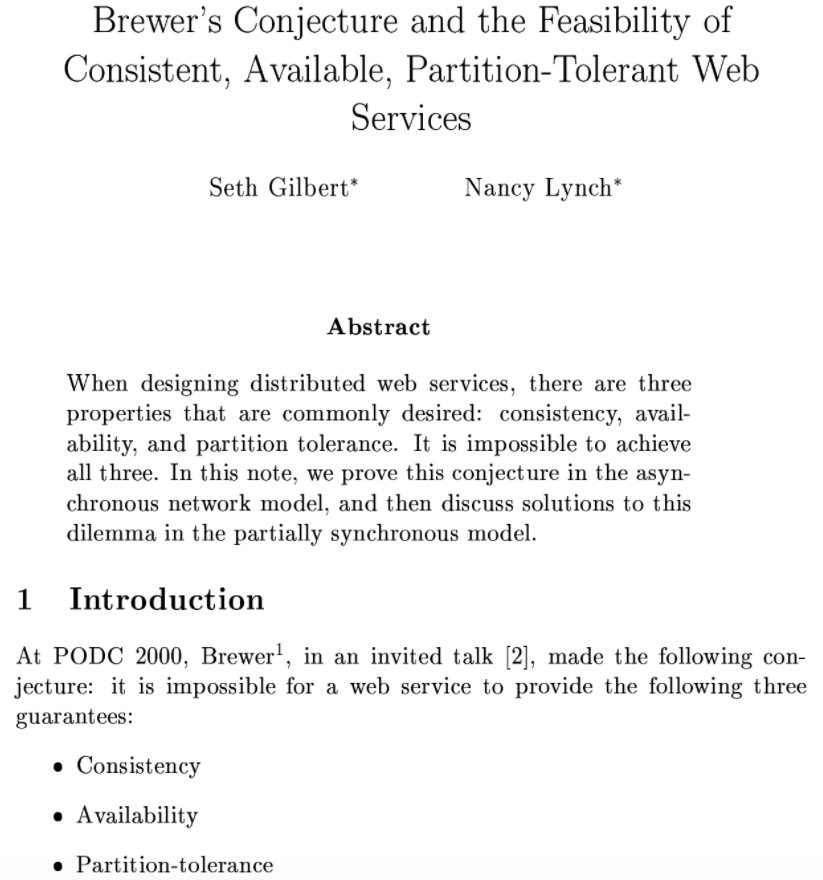
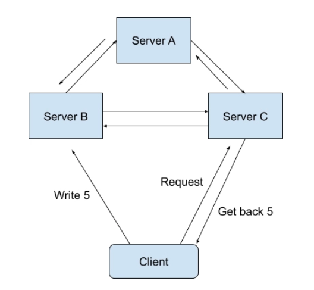
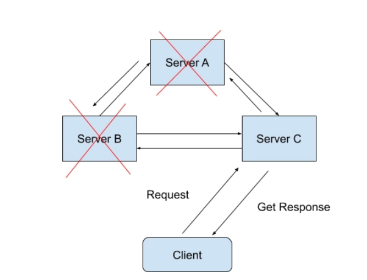
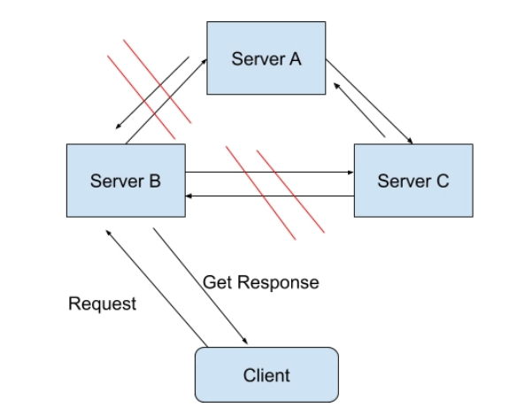
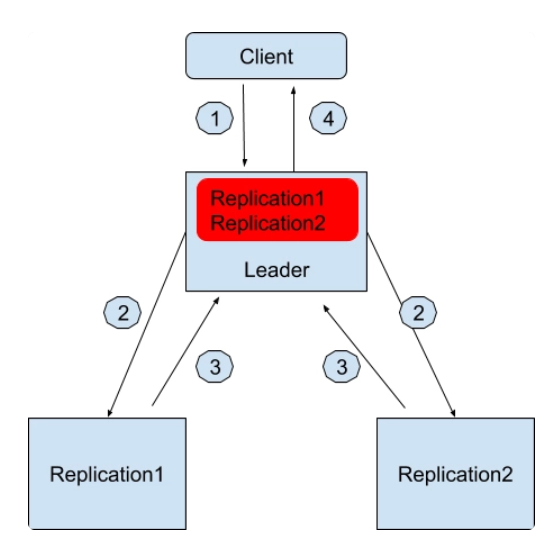
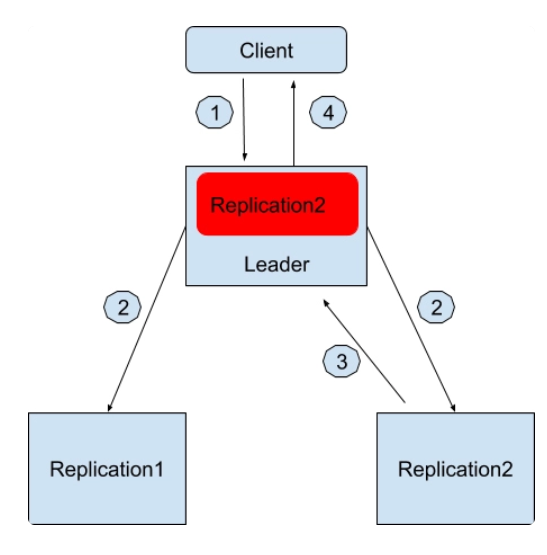

# CAP

## 由来

CAP 这个概念最初是由埃里克·布鲁尔博士（Dr. Eric Brewer）在 2000 年的 ACM 年度学术研讨会上提出的。如果你对这次演讲感兴趣的话，可以翻阅他那次名为“Towards Robust Distributed Systems”的演讲 deck。在两年之后，塞思·吉尔伯特（Seth Gilbert）和麻省理工学院的南希·林奇教授（Nancy Ann Lynch）在他们的论文`“Brewer’s conjecture and the Feasibility of Consistent, Available, Partition-Tolerant Web Services”`中证明了这一概念。

他们在这篇论文中证明了：在任意的分布式系统中，**一致性（Consistency）**，**高可用性（Availability）**和**分区容错性（Partition-tolerance）**这三种属性最多只能同时存在两个属性。

## CAP简介

|      | 描述       |
| ---- | ---------- |
| C    | 一致性     |
| A    | 高可用性   |
| P    | 分区容错性 |

## C(一致性)

一致性在这里指的是**线性一致性（Linearizability Consistency）**。在线性一致性的保证下，所有分布式环境下的操作都像是在单机上完成的一样，也就是说图中 Sever A、B、C 的状态一直是一致的。

> **例子：**

假设我们设计了一个分布式的购物系统，在这个系统中，商品的存货状态分别保存在服务器 A 和服务器 B 中。我们把存货状态定义为“有货状态”或者“无货状态”。

在最开始的时候，服务器 A 和服务器 B 都会显示商品为有货状态。

等一段时间过后，商品卖完了，后台就必须将这两台服务器上的商品状态更新为无货状态。因为是在分布式的环境下，商品状态的更新在服务器 A 上完成了，显示为无货状态。而服务器 B 的状态因为网络延迟的原因更新还未完成，还是显示着有货状态。

这时，恰好有两个用户使用着这个购物系统，先后发送了一个查询操作（Query Operation）到后台服务器中查询商品状态。

我们假设是用户 A 先查询的，这个查询操作 A 被发送到了服务器 A 上面，并且成功返回了商品是无货状态的。

用户 B 在随后也对同一商品进行查询，而这个查询操作 B 被发送到了服务器 B 上面，并且成功返回了商品是有货状态的。

我们知道，对于整个系统来说，商品的系统状态应该为无货状态。而操作 A 又是在操作 B 之前发送并且成功完成的，所以如果这个系统有线性一致性这个属性的话，操作 B 所看到的系统状态理论上应该是无货状态。

**但在我们这个例子中，操作 B 却返回了有货状态。所以我们说，这个分布式的购物系统并不满足论文里所讲到的线性一致性。聊完了一致性，我们一起来看看可用性的含义。**

## A(高可用性)

可用性的概念比较简单，在这里指的是在分布式系统中，任意非故障的服务器都必须对客户的请求产生响应。

当系统满足可用性的时候，不管出现什么状况（除非所有的服务器全部崩溃），都能返回消息。

**也就是说，当客户端向系统发送请求，只要系统背后的服务器有一台还未崩溃，那么这个未崩溃的服务器必须最终响应客户端。**

## P(分区容错性)

在了解了可用性之后，你还需要了解分区容错性。

**它分为两个部分，“分区”和“容错”。**

在一个分布式系统里，如果出现一些故障，可能会使得部分节点之间无法连通。由于这些故障节点无法联通，造成整个网络就会被分成几块区域，从而使数据分散在这些无法连通的区域中的情况，你可以认为这就是发生了分区错误。

如图所示，如果你要的数据只在 Sever A 中保存，当系统出现分区错误，在不能直接连接 Sever A 时，你是无法获取数据的。我们要“分区容错”，意思是即使出现这样的“错误”，系统也需要能“容忍”。也就是说，就算错误出现，系统也必须能够返回消息。

分区容错性，**在这里指的是我们的系统允许网络丢失从一个节点发送到另一个节点的任意多条消息。**

## CAP如何选择

我们知道，在现代网络通信中，节点出现故障或者网络出现丢包这样的情况是时常会发生的。

如果没有了分区容错性，也就是说系统不允许这些节点间的通讯出现任何错误的话，那我们日常所用到的很多系统就不能再继续工作了。所以在大部分情况下，**系统设计都会保留 P 属性，而在 C 和 A 中二选一。**

在任意系统中，我们最多可以保留 CAP 属性中的两种，也就是 CP 或者 AP 或者 CA。

CP 系统：Google BigTable, Hbase, MongoDB, Redis, MemCacheDB，这些存储架构都是放弃了高可用性（High Availablity）而选择 CP 属性的。

AP 系统：Amazon Dynamo 系统以及它的衍生存储系统 Apache Cassandra 和 Voldemort 都是属于 AP 系统CA 系统：Apache Kafka 是一个比较典型的 CA 系统。

我在上面说过，P 属性在现代网络时代中基本上是属于一个必选项，那为什么 Apache Kafka 会放弃 P 选择 CA 属性呢？我来给你解释一下它的架构思想。

## 放弃了P属性的 Kafka

在 Kafka 发布了 0.8 版本之后，Kafka 系统引入了 Replication 的概念。Kafka Relocation 通过将数据复制到不同的节点上，从而增强了数据在系统中的持久性（Durability）和可用性（Availability）。在 Kafka Replication 的系统设计中，所有的数据日志存储是设计在同一个数据中心（Data Center）里面的，也就是说，在同一个数据中心里网络分区出现的可能性是十分之小的。

它的具体架构是这样的，在 Kafka 数据副本（Data Replication）的设计中，先通过 Zookeeper 选举出一个领导者节点（Leader）。这个领导者节点负责维护一组被称作同步数据副本（In-sync-replica）的节点，所有的数据写入都必须在这个领导者节点中记录。

我来举个例子，假设现在数据中心有三台服务器，一台被选为作为领导者节点，另外两台服务器用来保存数据副本，分别是 Replication1 和 Replication2，它们两个节点就是被领导者节点维护的同步数据副本了。领导者节点知道它维护着两个同步数据副本。

如果用户想写入一个数据，假设是“Geekbang”

1. 用户会发请求到领导者节点中想写入“Geekbang”。
2. 领导者节点收到请求后先在本地保存好，然后也同时发消息通知 eplication1 和 Replication2。
3. Replication1 和 Replication2 收到消息后也保存好这条消息并且回复领导者节点写入成功。
4. 领导者节点记录副本 1 和副本 2 都是健康（Healthy）的，并且回复用户写入成功。

**红色的部分是领导者节点本地日志，记录着有哪些同步数据副本是健康的。**

往后用户如果想查询写入的数据，无论是领导者节点还是两个副本都可以返回正确同步的结果。

那假如分区出现了该怎么办呢？例如领导者节点和副本 1 无法通讯了，这个时候流程就变成这样了。

1. 用户会发请求到领导者节点中想写入“Geekbang”。

2. 领导者节点收到请求后先在本地保存好，然后也同时发消息通知 Replication1 和 Replication2。

3. 只有 Replication2 收到消息后也保存好这条消息并且回复领导者节点写入成功。

4. 领导者节点记录副本 2 是健康的，并且回复用户写入成功。

**同样，红色的部分是领导者节点本地日志，记录着有哪些同步数据副本是健康的。**

如果所有副本都无法通讯的时候，Apache Kafka 允许系统只有一个节点工作，也就是领导者节点。这个时候所有的写入都只保存在领导者节点了。过程如下，

1. 用户会发请求到领导者节点中想写入“Geekbang”。
2. 领导者节点收到请求后先在本地保存好，然后也同时发消息通知 Replication1 和 Replication2。
3. 没有任何副本回复领导者节点写入成功，领导者节点记录无副本是健康的，并且回复用户写入成功。

