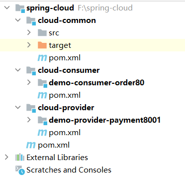
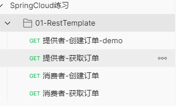

# 项目模块建立


## 项目结构截图





## spring-cloud


### pom


```java
<?xml version="1.0" encoding="UTF-8"?>
<project xmlns="http://maven.apache.org/POM/4.0.0"
         xmlns:xsi="http://www.w3.org/2001/XMLSchema-instance"
         xsi:schemaLocation="http://maven.apache.org/POM/4.0.0 http://maven.apache.org/xsd/maven-4.0.0.xsd">

    <modelVersion>4.0.0</modelVersion>
    <groupId>com.xht.example.cloud</groupId>
    <artifactId>spring-cloud</artifactId>
    <packaging>pom</packaging>
    <version>1.0-SNAPSHOT</version>
    <modules>
        <module>cloud-common</module>
        <module>cloud-consumer</module>
        <module>cloud-provider</module>
    </modules>
    <name>cloud-parent</name>
    <properties>
        <project.build.sourceEncoding>UTF-8</project.build.sourceEncoding>
        <maven.compiler.source>8</maven.compiler.source>
        <maven.compiler.target>8</maven.compiler.target>
        <spring-boot.version>2.6.3</spring-boot.version>
        <spring-cloud.version>2021.0.1</spring-cloud.version>
        <spring-cloud-alibaba.version>2021.0.1.0</spring-cloud-alibaba.version>
        <junit.version>4.12</junit.version>
        <log4j.version>1.2.17</log4j.version>
        <lombok.version>1.16.18</lombok.version>
        <mysql.version>8.0.20</mysql.version>
        <druid.version>1.2.8</druid.version>
        <mybatis.spring.boot.version>3.5.9</mybatis.spring.boot.version>
        <my-version>1.0-SNAPSHOT</my-version>
    </properties>
    <parent>
        <groupId>org.springframework.boot</groupId>
        <artifactId>spring-boot-starter-parent</artifactId>
        <version>2.6.4</version>
    </parent>
    <dependencyManagement>
        <dependencies>
            <dependency>
                <groupId>org.springframework.cloud</groupId>
                <artifactId>spring-cloud-dependencies</artifactId>
                <version>${spring-cloud.version}</version>
                <type>pom</type>
                <scope>import</scope>
            </dependency>
            <dependency>
                <groupId>com.alibaba.cloud</groupId>
                <artifactId>spring-cloud-alibaba-dependencies</artifactId>
                <version>${spring-cloud-alibaba.version}</version>
                <type>pom</type>
                <scope>import</scope>
            </dependency>
            <dependency>
                <groupId>mysql</groupId>
                <artifactId>mysql-connector-java</artifactId>
                <version>${mysql.version}</version>
            </dependency>
            <dependency>
                <groupId>com.alibaba</groupId>
                <artifactId>druid-spring-boot-starter</artifactId>
                <version>${druid.version}</version>
            </dependency>
            <dependency>
                <groupId>org.mybatis.spring.boot</groupId>
                <artifactId>mybatis-spring-boot-starter</artifactId>
                <version>2.2.2</version>
            </dependency>
            <dependency>
                <groupId>junit</groupId>
                <artifactId>junit</artifactId>
                <version>${junit.version}</version>
            </dependency>
            <dependency>
                <groupId>log4j</groupId>
                <artifactId>log4j</artifactId>
                <version>${log4j.version}</version>
            </dependency>
            <dependency>
                <groupId>org.projectlombok</groupId>
                <artifactId>lombok</artifactId>
                <version>${lombok.version}</version>
                <optional>true</optional>
            </dependency>
            <dependency>
                <groupId>com.xht.example.cloud</groupId>
                <artifactId>cloud-common</artifactId>
                <version>${my-version}</version>
            </dependency>
        </dependencies>
    </dependencyManagement>


    <repositories>
        <repository>
            <id>alimaven</id>
            <name>aliyun maven</name>
            <url>http://maven.aliyun.com/nexus/content/groups/public/</url>
        </repository>

        <repository>
            <id>spring-snapshots</id>
            <url>http://repo.spring.io/libs-snapshot</url>
        </repository>
    </repositories>

    <pluginRepositories>
        <pluginRepository>
            <id>spring-snapshots</id>
            <url>http://repo.spring.io/libs-snapshot</url>
        </pluginRepository>
    </pluginRepositories>
    <build>
        <plugins>
            <plugin>
                <groupId>org.springframework.boot</groupId>
                <artifactId>spring-boot-maven-plugin</artifactId>
                <configuration>
                    <fork>true</fork>
                    <addResources>true</addResources>
                </configuration>
            </plugin>
        </plugins>
    </build>
</project>
```


## cloud-common


### pom


```java
<?xml version="1.0" encoding="UTF-8"?>
<project xmlns="http://maven.apache.org/POM/4.0.0"
         xmlns:xsi="http://www.w3.org/2001/XMLSchema-instance"
         xsi:schemaLocation="http://maven.apache.org/POM/4.0.0 http://maven.apache.org/xsd/maven-4.0.0.xsd">
    <parent>
        <artifactId>spring-cloud</artifactId>
        <groupId>com.xht.example.cloud</groupId>
        <version>1.0-SNAPSHOT</version>
    </parent>
    <modelVersion>4.0.0</modelVersion>
    <artifactId>cloud-common</artifactId>
    <packaging>jar</packaging>
    <dependencies>
        <dependency>
            <groupId>org.springframework.boot</groupId>
            <artifactId>spring-boot-devtools</artifactId>
            <scope>runtime</scope>
            <optional>true</optional>
        </dependency>
        <dependency>
            <groupId>org.projectlombok</groupId>
            <artifactId>lombok</artifactId>
        </dependency>
        <dependency>
            <groupId>cn.hutool</groupId>
            <artifactId>hutool-all</artifactId>
            <version>5.1.0</version>
        </dependency>
    </dependencies>
    <properties>
        <maven.compiler.source>8</maven.compiler.source>
        <maven.compiler.target>8</maven.compiler.target>
    </properties>

</project>
```


### PaymentEntity


```java
package com.it.common.entity;

import lombok.AllArgsConstructor;
import lombok.Data;
import lombok.NoArgsConstructor;

import java.io.Serializable;

/**
 * 描述 ：
 *
 * @author : 小糊涂
 * @version : 1.0
 **/
@Data
@AllArgsConstructor
@NoArgsConstructor
public class PaymentEntity implements Serializable {

    private Long id;

    private String serial;

}
```


### CommonResult


```java
package com.it.common;


import lombok.AllArgsConstructor;
import lombok.Data;
import lombok.NoArgsConstructor;
import lombok.extern.slf4j.Slf4j;

/**
 * @auther zzyy
 * @create 2020-01-27 20:17
 */
@Data
@AllArgsConstructor
@NoArgsConstructor
public class CommonResult<T> {
    private Integer code;
    private String message;
    private T data;

    public CommonResult(Integer code, String message) {
        this(code, message, null);
    }
}
```


## cloud-consumer


### pom


```java
<?xml version="1.0" encoding="UTF-8"?>
<project xmlns="http://maven.apache.org/POM/4.0.0"
         xmlns:xsi="http://www.w3.org/2001/XMLSchema-instance"
         xsi:schemaLocation="http://maven.apache.org/POM/4.0.0 http://maven.apache.org/xsd/maven-4.0.0.xsd">
    <parent>
        <artifactId>spring-cloud</artifactId>
        <groupId>com.xht.example.cloud</groupId>
        <version>1.0-SNAPSHOT</version>
    </parent>
    <modelVersion>4.0.0</modelVersion>
    <packaging>pom</packaging>
    <description>服务消费者</description>
    <modules>
        <module>demo-consumer-order80</module>
    </modules>
    <artifactId>cloud-consumer</artifactId>

    <properties>
        <maven.compiler.source>8</maven.compiler.source>
        <maven.compiler.target>8</maven.compiler.target>
    </properties>
    <dependencies>
        <dependency>
            <groupId>com.xht.example.cloud</groupId>
            <artifactId>cloud-common</artifactId>
        </dependency>
        <dependency>
            <groupId>org.springframework.boot</groupId>
            <artifactId>spring-boot-starter-web</artifactId>
        </dependency>
        <dependency>
            <groupId>org.springframework.boot</groupId>
            <artifactId>spring-boot-starter-actuator</artifactId>
        </dependency>
        <dependency>
            <groupId>org.springframework.boot</groupId>
            <artifactId>spring-boot-starter-test</artifactId>
            <scope>test</scope>
        </dependency>
    </dependencies>
</project>
```


## demo-consumer-order80


### pom


```java
<?xml version="1.0" encoding="UTF-8"?>
<project xmlns="http://maven.apache.org/POM/4.0.0"
         xmlns:xsi="http://www.w3.org/2001/XMLSchema-instance"
         xsi:schemaLocation="http://maven.apache.org/POM/4.0.0 http://maven.apache.org/xsd/maven-4.0.0.xsd">
    <parent>
        <artifactId>cloud-consumer</artifactId>
        <groupId>com.xht.example.cloud</groupId>
        <version>1.0-SNAPSHOT</version>
    </parent>
    <modelVersion>4.0.0</modelVersion>
    <packaging>jar</packaging>
    <artifactId>demo-consumer-order80</artifactId>

    <properties>
        <maven.compiler.source>8</maven.compiler.source>
        <maven.compiler.target>8</maven.compiler.target>
    </properties>
    <dependencies>
        <dependency>
            <groupId>org.springframework.boot</groupId>
            <artifactId>spring-boot-devtools</artifactId>
            <scope>runtime</scope>
            <optional>true</optional>
        </dependency>
    </dependencies>
</project>
```


### application.yml


```yaml
server:
  port: 80
```


### DemoOrderAPP80


```java
package com.it;

import org.springframework.boot.SpringApplication;
import org.springframework.boot.autoconfigure.SpringBootApplication;

/**
 * 描述 ：
 *
 * @author : 小糊涂
 * @version : 1.0
 **/
@SpringBootApplication
public class DemoOrderAPP80 {
    public static void main(String[] args) {
        SpringApplication.run(DemoOrderAPP80.class, args);
    }
}

```


### RestTemplateConfig


```java
package com.it.config;

import org.springframework.context.annotation.Bean;
import org.springframework.context.annotation.Configuration;
import org.springframework.web.client.RestTemplate;

/**
 * 描述 ：
 *
 * @author : 小糊涂
 * @version : 1.0
 **/
@Configuration
public class RestTemplateConfig {

    @Autowired
    private RestTemplateBuilder builder;

    @Bean
    public RestTemplate restTemplate(){
        return builder.build();
    }
}

```


### OrderController


```java
package com.it.controller;

import com.it.common.CommonResult;
import com.it.common.entity.PaymentEntity;
import org.springframework.beans.factory.annotation.Autowired;
import org.springframework.web.bind.annotation.GetMapping;
import org.springframework.web.bind.annotation.PathVariable;
import org.springframework.web.bind.annotation.RestController;
import org.springframework.web.client.RestTemplate;

/**
 * 描述 ：
 *
 * @author : 小糊涂
 * @version : 1.0
 **/
@RestController
public class OrderController
{

    public static final String PaymentSrv_URL = "http://localhost:8001";

    @Autowired
    private RestTemplate restTemplate;

    @GetMapping("/consumer/payment/create") //客户端用浏览器是get请求，但是底层实质发送post调用服务端8001
    public CommonResult create(PaymentEntity payment)
    {
        System.out.println(payment);
        return restTemplate.postForObject(PaymentSrv_URL + "/payment/create",payment,CommonResult.class);
    }


    @GetMapping("/consumer/payment/get/{id}")
    public CommonResult getPayment(@PathVariable Long id)
    {
        return restTemplate.getForObject(PaymentSrv_URL + "/payment/get/"+id, CommonResult.class, id);
    }
}
```


## cloud-provider


### pom


```java
<?xml version="1.0" encoding="UTF-8"?>
<project xmlns="http://maven.apache.org/POM/4.0.0"
         xmlns:xsi="http://www.w3.org/2001/XMLSchema-instance"
         xsi:schemaLocation="http://maven.apache.org/POM/4.0.0 http://maven.apache.org/xsd/maven-4.0.0.xsd">
    <parent>
        <artifactId>spring-cloud</artifactId>
        <groupId>com.xht.example.cloud</groupId>
        <version>1.0-SNAPSHOT</version>
    </parent>
    <modelVersion>4.0.0</modelVersion>
    <packaging>pom</packaging>
    <description>服务提供者</description>
    <modules>
        <module>demo-provider-payment8001</module>
    </modules>
    <artifactId>cloud-provider</artifactId>

    <properties>
        <maven.compiler.source>8</maven.compiler.source>
        <maven.compiler.target>8</maven.compiler.target>
    </properties>
    <dependencies>
        <dependency>
            <groupId>com.xht.example.cloud</groupId>
            <artifactId>cloud-common</artifactId>
        </dependency>
        <dependency>
            <groupId>org.springframework.boot</groupId>
            <artifactId>spring-boot-starter-web</artifactId>
        </dependency>
        <dependency>
            <groupId>org.springframework.boot</groupId>
            <artifactId>spring-boot-starter-actuator</artifactId>
        </dependency>
        <dependency>
            <groupId>org.mybatis.spring.boot</groupId>
            <artifactId>mybatis-spring-boot-starter</artifactId>
        </dependency>
        <!-- https://mvnrepository.com/artifact/mysql/mysql-connector-java -->
        <dependency>
            <groupId>mysql</groupId>
            <artifactId>mysql-connector-java</artifactId>
        </dependency>
        <dependency>
            <groupId>com.alibaba</groupId>
            <artifactId>druid-spring-boot-starter</artifactId>
        </dependency>
    </dependencies>
</project>
```


## demo-provider-payment8001


### pom


```java
<?xml version="1.0" encoding="UTF-8"?>
<project xmlns="http://maven.apache.org/POM/4.0.0"
         xmlns:xsi="http://www.w3.org/2001/XMLSchema-instance"
         xsi:schemaLocation="http://maven.apache.org/POM/4.0.0 http://maven.apache.org/xsd/maven-4.0.0.xsd">
    <parent>
        <artifactId>cloud-provider</artifactId>
        <groupId>com.xht.example.cloud</groupId>
        <version>1.0-SNAPSHOT</version>
    </parent>
    <modelVersion>4.0.0</modelVersion>
    <artifactId>demo-provider-payment8001</artifactId>
    <packaging>jar</packaging>
    <properties>
        <maven.compiler.source>8</maven.compiler.source>
        <maven.compiler.target>8</maven.compiler.target>
    </properties>
    <dependencies>
        <dependency>
            <groupId>org.springframework.boot</groupId>
            <artifactId>spring-boot-devtools</artifactId>
            <scope>runtime</scope>
            <optional>true</optional>
        </dependency>
    </dependencies>
</project>
```


### application.yml


```java
server:
  port: 8001

spring:
  application:
    name: cloud-payment-service
  datasource:
    username: root
    password: 123456
    driver-class-name: com.mysql.jdbc.Driver
    url: jdbc:mysql://127.0.0.1:3306/test?useSSL=false&allowPublicKeyRetrieval=true&useUnicode=true&characterEncoding=utf-8&serverTimezone=GMT%2B8

mybatis:
  mapperLocations: classpath:mapper/*.xml
  type-aliases-package: com.it.common.entity    # 所有Entity别名类所在包
```


### PaymentMapper.xml


在`resources/mapper`目录下


```java
<?xml version="1.0" encoding="UTF-8" ?>
<!DOCTYPE mapper PUBLIC "-//mybatis.org//DTD Mapper 3.0//EN" "http://mybatis.org/dtd/mybatis-3-mapper.dtd" >

<mapper namespace="com.it.dao.PaymentDao">

    <resultMap id="BaseResultMap" type="com.it.common.entity.PaymentEntity">
        <id column="id" property="id" jdbcType="BIGINT"/>
        <result column="serial" property="serial" jdbcType="VARCHAR"/>
    </resultMap>

    <insert id="create" parameterType="com.it.common.entity.PaymentEntity" useGeneratedKeys="true" keyProperty="id">
        INSERT INTO payment(SERIAL)
        VALUES (#{serial});
    </insert>

    <select id="getPaymentById" parameterType="Long" resultMap="BaseResultMap">
        SELECT *
        FROM payment
        WHERE id = #{id};
    </select>

</mapper>
```


### DemoPaymentAPP8001


```java
package com.it;

import org.springframework.boot.SpringApplication;
import org.springframework.boot.autoconfigure.SpringBootApplication;

/**
 * 描述 ：
 *
 * @author : 小糊涂
 * @version : 1.0
 **/
@SpringBootApplication
public class DemoPaymentAPP8001 {
    public static void main(String[] args) {
        SpringApplication.run(DemoPaymentAPP8001.class,args);
    }

}
```


### DruidConfig


```java
package com.it.config;

import com.alibaba.druid.pool.DruidDataSource;
import com.alibaba.druid.support.http.StatViewServlet;
import com.alibaba.druid.support.http.WebStatFilter;
import org.springframework.boot.context.properties.ConfigurationProperties;
import org.springframework.boot.web.servlet.FilterRegistrationBean;
import org.springframework.boot.web.servlet.ServletRegistrationBean;
import org.springframework.context.annotation.Bean;
import org.springframework.context.annotation.Configuration;

import javax.sql.DataSource;
import java.util.HashMap;

/**
 * druid 配置多数据源
 *  访问页面http://ip:port/druid/sql.html
 * @author xht
 */
@Configuration
public class DruidConfig {

    @ConfigurationProperties(prefix = "spring.datasource")
    @Bean
    public DataSource dataSource() {
        return new DruidDataSource();
    }
}
```


### PaymentController


```java
package com.it.controller;

import com.it.common.CommonResult;
import com.it.common.entity.PaymentEntity;
import com.it.service.PaymentService;
import lombok.extern.slf4j.Slf4j;
import org.springframework.web.bind.annotation.GetMapping;
import org.springframework.web.bind.annotation.PathVariable;
import org.springframework.web.bind.annotation.PostMapping;
import org.springframework.web.bind.annotation.RequestBody;
import org.springframework.web.bind.annotation.RestController;

import javax.annotation.Resource;

/**
 * 描述 ：
 *
 * @author : 小糊涂
 * @version : 1.0
 **/
@RestController
@Slf4j
public class PaymentController
{
    @Resource
    private PaymentService paymentService;

    @PostMapping(value = "/payment/create")
    public CommonResult create(@RequestBody PaymentEntity payment)
    {
        int result = paymentService.create(payment);
        log.info("*****插入操作返回结果:" + result);

        if(result > 0)
        {
            return new CommonResult(200,"插入数据库成功",result);
        }else{
            return new CommonResult(444,"插入数据库失败",null);
        }
    }

    @GetMapping(value = "/payment/get/{id}")
    public CommonResult<PaymentEntity> getPaymentById(@PathVariable("id") Long id)
    {
        PaymentEntity payment = paymentService.getPaymentById(id);
        log.info("*****查询结果:{}",payment);
        if (payment != null) {
            return new CommonResult(200,"查询成功",payment);
        }else{
            return new CommonResult(444,"没有对应记录,查询ID: "+id,null);
        }
    }
}
```


### PaymentDao


```java
package com.it.dao;

/**
 * 描述 ：
 *
 * @author : 小糊涂
 * @version : 1.0
 **/

import com.it.common.entity.PaymentEntity;
import org.apache.ibatis.annotations.Mapper;
import org.apache.ibatis.annotations.Param;

@Mapper
public interface PaymentDao {
    public int create(PaymentEntity payment);

    public PaymentEntity getPaymentById(@Param("id") Long id);
}
```


### PaymentService


```java
package com.it.service;

import com.it.common.entity.PaymentEntity;

/**
 * 描述 ：
 *
 * @author : 小糊涂
 * @version : 1.0
 **/
public interface PaymentService {
    public int create(PaymentEntity payment);

    public PaymentEntity getPaymentById(Long id);

}
```


### PaymentServiceImpl


```java
package com.it.service.impl;

import com.it.common.entity.PaymentEntity;
import com.it.dao.PaymentDao;
import com.it.service.PaymentService;
import org.springframework.stereotype.Service;

import javax.annotation.Resource;

/**
 * 描述 ：
 *
 * @author : 小糊涂
 * @version : 1.0
 **/
@Service
public class PaymentServiceImpl implements PaymentService {

    @Resource
    private PaymentDao paymentDao;


    @Override
    public int create(PaymentEntity payment) {
        return paymentDao.create(payment);
    }

    @Override
    public PaymentEntity getPaymentById(Long id) {
        return paymentDao.getPaymentById(id);
    }
}
```


## 测试


postMan测试：复制下面json，复制到任意的json文件中，然后导入到postMan中



```javascript
{
	"info": {
		"_postman_id": "982a519e-c744-4fcd-a55b-823a5e883fdb",
		"name": "SpringCloud练习",
		"schema": "https://schema.getpostman.com/json/collection/v2.1.0/collection.json"
	},
	"item": [
		{
			"name": "01-RestTemplate",
			"item": [
				{
					"name": "提供者-创建订单-demo",
					"protocolProfileBehavior": {
						"disableBodyPruning": true
					},
					"request": {
						"method": "GET",
						"header": [],
						"body": {
							"mode": "raw",
							"raw": "{\r\n    \"serial\": \"小糊涂\"\r\n}",
							"options": {
								"raw": {
									"language": "json"
								}
							}
						},
						"url": {
							"raw": "http://127.0.0.1:8001/payment/create",
							"protocol": "http",
							"host": [
								"127",
								"0",
								"0",
								"1"
							],
							"port": "8001",
							"path": [
								"payment",
								"create"
							]
						}
					},
					"response": []
				},
				{
					"name": "提供者-获取订单",
					"request": {
						"method": "GET",
						"header": [],
						"url": {
							"raw": "http://127.0.0.1:8001/payment/get/1",
							"protocol": "http",
							"host": [
								"127",
								"0",
								"0",
								"1"
							],
							"port": "8001",
							"path": [
								"payment",
								"get",
								"1"
							]
						}
					},
					"response": []
				},
				{
					"name": "消费者-创建订单",
					"protocolProfileBehavior": {
						"disableBodyPruning": true
					},
					"request": {
						"method": "GET",
						"header": [],
						"body": {
							"mode": "raw",
							"raw": "",
							"options": {
								"raw": {
									"language": "json"
								}
							}
						},
						"url": {
							"raw": "http://127.0.0.1:80/consumer/payment/create?serial=小糊涂",
							"protocol": "http",
							"host": [
								"127",
								"0",
								"0",
								"1"
							],
							"port": "80",
							"path": [
								"consumer",
								"payment",
								"create"
							],
							"query": [
								{
									"key": "serial",
									"value": "小糊涂"
								}
							]
						}
					},
					"response": []
				},
				{
					"name": "消费者-获取订单",
					"request": {
						"method": "GET",
						"header": [],
						"url": {
							"raw": "http://127.0.0.1:80/consumer/payment/get/1",
							"protocol": "http",
							"host": [
								"127",
								"0",
								"0",
								"1"
							],
							"port": "80",
							"path": [
								"consumer",
								"payment",
								"get",
								"1"
							]
						}
					},
					"response": []
				}
			]
		}
	]
}
```


