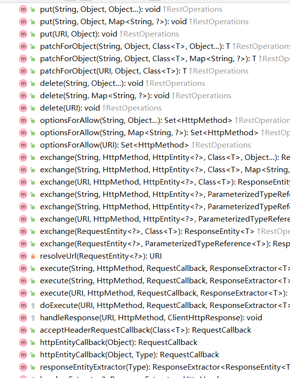
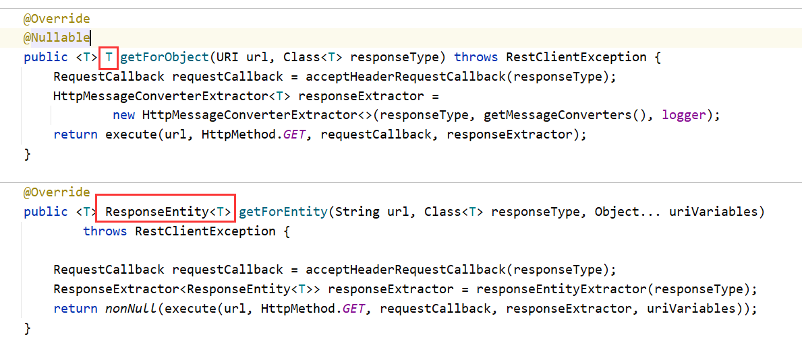
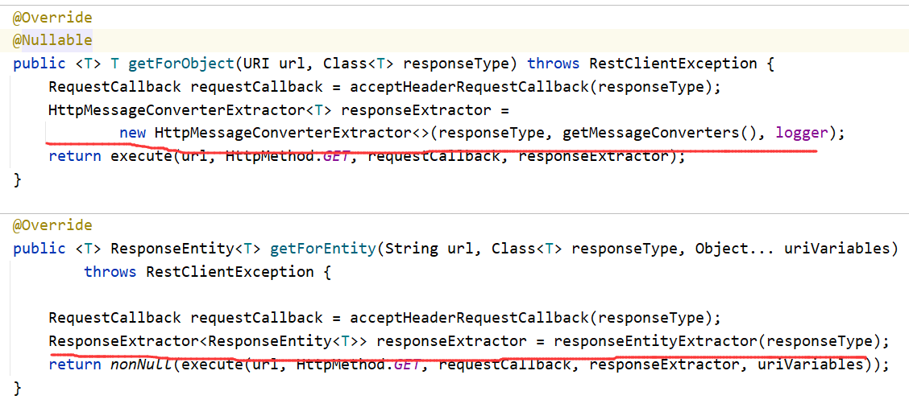

# RestTemplate


## 简介


我们写上面的项目时，发现了一个新的类：`RestTemplate`

`RestTemplate`提供了多种便捷访问**远程Http服务的方法**，是一种简单便捷的访问**restful服务模板类**，是Spring提供的用于访问Rest服务的客户端模板工具集

## 官网地址


https://docs.spring.io/spring-framework/docs/5.2.2.RELEASE/javadoc-api/org/springframework/web/client/RestTemplate.html


## 使用


使用restTemplate访问restful接口非常的简单粗暴无脑。(**url**, **requestMap**, **ResponseBean.class**)这三个参数分别代表 
REST请求地址、请求参数、HTTP响应转换被转换成的对象类型。

 

## SpringBoot配置


```java

/**
 * 描述 ：
 *
 * @author : 小糊涂
 * @version : 1.0
 **/
@Configuration
public class RestTemplateConfig {
    @Bean
    public RestTemplate restTemplate(){
        RestTemplate restTemplate = new RestTemplate();
        HttpComponentsClientHttpRequestFactory httpRequestFactory = new HttpComponentsClientHttpRequestFactory();
        httpRequestFactory.setConnectionRequestTimeout(30 * 1000);//请求连接超时
        httpRequestFactory.setConnectTimeout(30 * 3000);//连接超时时间
        httpRequestFactory.setReadTimeout(30 * 3000);//读取超时
        restTemplate.setRequestFactory(httpRequestFactory);
        return restTemplate;
    }
}
```


 

## 使用案例


```java
@RestController
@Slf4j
public class OrderController {
    private static final String PAYMENT_URL = "http://localhost:8001";

    @Resource
    private RestTemplate restTemplate;
 
    @GetMapping(value = "/consumer/payment/create")
    public CommonResult<Integer> create(Payment payment) {
        return restTemplate.postForObject(PAYMENT_URL + "/payment/create", payment, CommonResult.class);
    }
 
    @GetMapping(value = "consumer/payment/get/{id}")
    public CommonResult<Payment> getPaymentByid(@PathVariable("id") Integer id) {
        return restTemplate.getForObject(PAYMENT_URL + "/payment/get/" + id, CommonResult.class);
    }
}
```


##  有哪些方法





这么些方法其实就够我们用了.


## GetForEntity与getForObject的区别


接下来我们就来分析一下源码,看看这些方法都有什么样的区别,这里以 `get请求` 为例,post请求类似,大家可以自行查阅
其实方法主要分为 **两大类** 一类就是 **`getForEntity`** ,另外一类就是 **`getForObject`**

我们首先区分提下这两个大类的区别,这里我们将两段代码贴出来对比着看首先我们来看 **第一个不同** 的地方:





我们首先可以看到就是两者的 `返回类型是不一样` 的,我们可以看到getForEntity的返回类型是规定死的,只能是responseEntity,但是responseEntity里面包含的数据是可以变化的,getForObject的返回类型则是可以变化的,也就是自定义的意思.

接着我们来看第二个不同的地方:




getForObject相对于getForEntity来说,多了一步类型转换的步骤,其实可以理解成**getForObject对getForEntity获得的数据进行了更深层次的一次封装** ,

只让用户注重于他们所注重的数据本身,将其他一些无关紧要的数据,比如说 **请求头,响应状态** 这些数据全部都隐藏起来,只让用户看到他们想要的数据,就比如说查出来的信息


> **getForObject：返回响应体中数据转化成的对象，可以理解为json**
>
> **getForEntity：返回的是ResponseEntity的对象包含了一些重要的信息 例如以下代码**


## 配置字符集,解决乱码


但是还需要注意一点,如果我们请求回来的数据里面包含中文的话,那么我们就需要重新配置一下字符集,否则中文是会乱码的


````java
		@Bean //必须new 一个RestTemplate并放入spring容器当中,否则启动时报错
    public RestTemplate restTemplate() {
        RestTemplate restTemplate = new RestTemplate();
        HttpComponentsClientHttpRequestFactory httpRequestFactory = new HttpComponentsClientHttpRequestFactory();
        httpRequestFactory.setConnectionRequestTimeout(30 * 1000);
        httpRequestFactory.setConnectTimeout(30 * 3000);
        httpRequestFactory.setReadTimeout(30 * 3000);
//        //修改字符集
        List<HttpMessageConverter<?>> list = restTemplate.getMessageConverters();
        for (HttpMessageConverter<?> httpMessageConverter : list) {
            if (httpMessageConverter instanceof StringHttpMessageConverter){
                ((StringHttpMessageConverter)
                        httpMessageConverter).setDefaultCharset(Charset.forName("utf-8"));
                break;
            }
        }
        restTemplate.setRequestFactory(httpRequestFactory);
        return restTemplate;
    }
````


