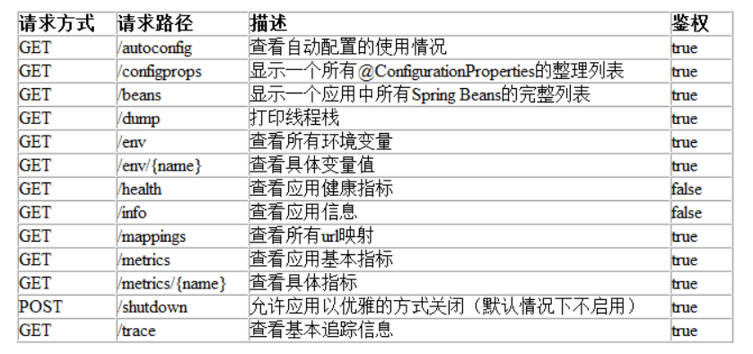

# SpringActuator


## 简介


为了更好的学习后面的知识点，我们先学习一下这个：`SpringActuator`这是springboot里面的一个服务监控

主要运用在微服务架构，所以我建议你先学微服务(至少了解)，否则可能get不到它的用处，只有大型的分布式系统才会用到指标监控... 

**SpringBoot自带监控功能Actuator，可以帮助实现对程序内部运行情况监控，比如监控状况、Bean加载情况、环境变 量、日志信息、线程信息等**


## 为什么要使用它


对于一个大型的几十个、几百个微服务构成的微服务架构系统，在线上时通常会遇到下面一些问题，

比如： 

1. 如何知道哪些服务除了问题，如何快速定位？ (健康状况） 
2. 如何统一监控各个微服务的性能指标（内存、jvm、并发数、线程池、Http 请求统计）
3.  如何统一管理各个微服务的日志？（切换线上日志等级，快速搜索日志...） 
4. 如何优雅管理服务下线（正在运行的线程不发生中断） 


So: 在这种大型分布式应用的环境下，我们如何能够快速发现问题、快速解决问题， 必须要有监控平台、（链路追踪、日志）


## start


```java
<dependency>
     <groupId>org.springframework.boot</groupId>
     <artifactId>spring-boot-starter-actuator</artifactId>
</dependency>
<dependency>
     <groupId>org.springframework.boot</groupId>
     <artifactId>spring-boot-starter-web</artifactId>
</dependency>                
```


## 启动测试


```java
http://localhost:8080/actuator/
```


## yml配置项


  这大抵就是全部默认的 Endpoint 的配置了，怎么样？强大吧！之前做了一个网络监控的项目，就是能够实时查看服务器的 CPU、内存、磁盘、IO 这些（基于 sigar.jar 实现），然后现在发现 SpringBoot 就这样轻松支持了，还更强大，更简便......

  默认的 Endpoint 映射前缀是 **/actuator**，可以通过如上 base-path 自定义设置。

  每个 Endpoint 都可以配置开启或者禁用。但是仅仅开启 Endpoint 是不够的，还需要通过 jmx 或者 web 暴露他们，通过 exclude 和 include 属性配置。


```yaml
management:
  endpoints:
    # 暴露 EndPoint 以供访问，有jmx和web两种方式，exclude 的优先级高于 include
    jmx:
      exposure:
        exclude: '*'
        include: '*'
    web:
      exposure:
        # exclude: '*'
        include: [ "health","info","beans","mappings","logfile","metrics","shutdown","env" ]
      base-path: /actuator  # 配置 Endpoint 的基础路径
      cors: # 配置跨域资源共享
        allowed-origins: http://example.com
        allowed-methods: GET,POST
    enabled-by-default: true # 修改全局 endpoint 默认设置
  endpoint:
    auditevents: # 1、显示当前引用程序的审计事件信息，默认开启
      enabled: true
      cache:
        time-to-live: 10s # 配置端点缓存响应的时间
    beans: # 2、显示一个应用中所有 Spring Beans 的完整列表，默认开启
      enabled: true
    conditions: # 3、显示配置类和自动配置类的状态及它们被应用和未被应用的原因，默认开启
      enabled: true
    configprops: # 4、显示一个所有@ConfigurationProperties的集合列表，默认开启
      enabled: true
    env: # 5、显示来自Spring的 ConfigurableEnvironment的属性，默认开启
      enabled: true
    flyway: # 6、显示数据库迁移路径，如果有的话，默认开启
      enabled: true
    health: # 7、显示健康信息，默认开启
      enabled: true
      show-details: always
    info: # 8、显示任意的应用信息，默认开启
      enabled: true
    liquibase: # 9、展示任何Liquibase数据库迁移路径，如果有的话，默认开启
      enabled: true
    metrics: # 10、展示当前应用的metrics信息，默认开启
      enabled: true
    mappings: # 11、显示一个所有@RequestMapping路径的集合列表，默认开启
      enabled: true
    scheduledtasks: # 12、显示应用程序中的计划任务，默认开启
      enabled: true
    sessions: # 13、允许从Spring会话支持的会话存储中检索和删除(retrieval and deletion)用户会话。使用Spring Session对反应性Web应用程序的支持时不可用。默认开启。
      enabled: true
    shutdown: # 14、允许应用以优雅的方式关闭，默认关闭
      enabled: true
    threaddump: # 15、执行一个线程dump
      enabled: true
    # web 应用时可以使用以下端点
    heapdump: # 16、    返回一个GZip压缩的hprof堆dump文件，默认开启
      enabled: true
    jolokia: # 17、通过HTTP暴露JMX beans（当Jolokia在类路径上时，WebFlux不可用），默认开启
      enabled: true
    logfile: # 18、返回日志文件内容（如果设置了logging.file或logging.path属性的话），支持使用HTTP Range头接收日志文件内容的部分信息，默认开启
      enabled: true
    prometheus: #19、以可以被Prometheus服务器抓取的格式显示metrics信息，默认开启
      enabled: true
```


## 提供的监控项


下表包含了Actuator提供的主要监控项。 




## info接口不显示信息


因为没有build-info.propertiesspa这个文件，我们使用idea的插件里面这个选项，然后再次打包就可以


