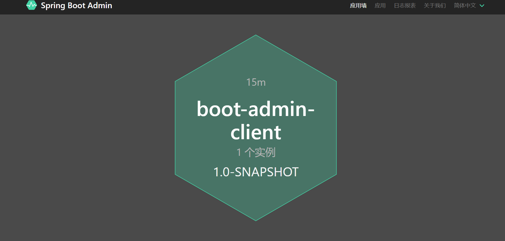
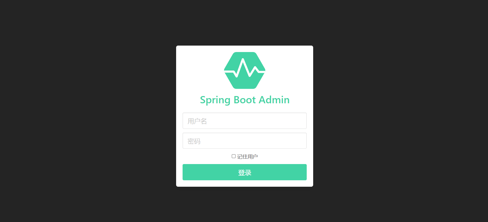

# Spring Boot Admin


## 简介


 可视化监控平台， 是一个基于 Spring Boot Actuator 端点之上的 Vue.js 应用程序。 

https://github.com/codecentric/spring-boot-admin

绿色：健康 灰色：连接客户端健康信息超时（超过10s) 红色：就能看到具体异常信息


## 版本选择


springboot版本是多少admin的版本就是多少

Spring Boot 2.x=Spring Boot Admin 2.x (比如Spring Boot 2.3.x 可以用Spring Boot Admin 2.3.x)

+ 服务端

```java
<dependency>
   <groupId>de.codecentric</groupId>
   <artifactId>spring-boot-admin-starter-server</artifactId>
   <version>2.6.2</version>
</dependency>
```

+ 客户端

```java
<dependency>
   <groupId>de.codecentric</groupId>
   <artifactId>spring-boot-admin-starter-client</artifactId>
   <version>2.6.2</version>
</dependency>
```


## 服务端-pom


```java
<dependencies>
    <dependency>
        <groupId>org.springframework.boot</groupId>
        <artifactId>spring-boot-starter-web</artifactId>
    </dependency>
    <dependency>
        <groupId>de.codecentric</groupId>
        <artifactId>spring-boot-admin-starter-server</artifactId>
        <version>2.6.2</version>
    </dependency>
</dependencies>
```


## 服务端-启动类


```java
package com.it;

import de.codecentric.boot.admin.server.config.EnableAdminServer;
import org.springframework.boot.SpringApplication;
import org.springframework.boot.autoconfigure.SpringBootApplication;

/**
 * 描述 ：
 *
 * @author : 小糊涂
 * @version : 1.0
 **/
@EnableAdminServer
@SpringBootApplication
public class AppAdmin {
    public static void main(String[] args) {
        SpringApplication.run(AppAdmin.class,args);
    }

}
```


## 服务端-application.yaml


```java
server:
  port: 5555
```


## 客户端-pom


```java
<dependencies>
    <dependency>
        <groupId>org.springframework.boot</groupId>
        <artifactId>spring-boot-starter-web</artifactId>
    </dependency>
    <dependency>
        <groupId>org.springframework.boot</groupId>
        <artifactId>spring-boot-starter-actuator</artifactId>
    </dependency>
    <dependency>
        <groupId>de.codecentric</groupId>
        <artifactId>spring-boot-admin-starter-client</artifactId>
        <version>2.6.2</version>
    </dependency>
</dependencies>
```


## 客户端-启动类


```java
@SpringBootApplication
public class DemoPaymentAPP8001 {
    public static void main(String[] args) {
        SpringApplication.run(DemoPaymentAPP8001.class,args);
    }
}
```


## 客户端-application.yaml


```yaml
server:
  port: 6666

spring:
  application:
    name: boot-admin-client
  boot:
    admin:
      client:
        url: http://localhost:5555
        instance:
          prefer-ip: true
#开放端点用于SpringBoot Admin的监控
management:
  endpoints:
    web:
      exposure:
        #开放所有页面节点  默认只开启了health、info两个节点
        include: '*'
  endpoint:
    health:
      #显示健康具体信息  默认不会显示详细信息
      show-details: always

# 利用info端点，加入版本等信息
info:
  versin: @project.version@
  name: @project.artifactId@
  group: @project.groupId@
  description: @project.description@
  #还可以自定义信息
  author: 小糊涂
  age: 保密
```


## 测试


http://localhost:5555/wallboard




## 给服务端加密码


### 添加依赖


```java
<dependency>
  <groupId>org.springframework.boot</groupId>
  <artifactId>spring-boot-starter-security</artifactId>
</dependency>
```


### application.yaml


```java
server:
  port: 5555

spring:
  application:
    name: springboot-admin-server
  security:
    user:
      name: admin
      password: 123456
```


### 添加配置类


```java
    @Configuration
    public  class SecuritySecureConfig extends WebSecurityConfigurerAdapter {
        private final String adminContextPath;

        public SecuritySecureConfig(AdminServerProperties adminServerProperties) {
            this.adminContextPath = adminServerProperties.getContextPath();
        }

        @Override
        protected void configure(HttpSecurity http) throws Exception {
            // @formatter:off
            SavedRequestAwareAuthenticationSuccessHandler successHandler = new SavedRequestAwareAuthenticationSuccessHandler();
            successHandler.setTargetUrlParameter("redirectTo");
            successHandler.setDefaultTargetUrl(adminContextPath + "/");
            http.authorizeRequests()
                    .antMatchers(adminContextPath + "/assets/**").permitAll()
                    .antMatchers(adminContextPath + "/login").permitAll()
                    .anyRequest().authenticated()
                    .and()
                    .formLogin().loginPage(adminContextPath + "/login").successHandler(successHandler).and()
                    .logout().logoutUrl(adminContextPath + "/logout").and()
                    .httpBasic().and()
                    .csrf()
                    .csrfTokenRepository(CookieCsrfTokenRepository.withHttpOnlyFalse())
                    .ignoringAntMatchers(
                            adminContextPath + "/instances",
                            adminContextPath + "/actuator/**"
                    );
            // @formatter:on
        }
    }
```


### 测试


访问： http://127.0.0.1:5555/login




### 客户端修改


由于服务端配置了密码，客户端访问的时候需要密码，这是基于SBA访问模式，也就是所谓的直接连接springboot admin服务端模式，在application.yml文件中添加username，password


```java
server:
  port: 6666

spring:
  application:
    name: boot-admin-client
  boot:
    admin:
      client:
        url: http://localhost:5555
        instance:
          prefer-ip: true
        username: admin
        password: 123456
#开放端点用于SpringBoot Admin的监控
management:
  endpoints:
    web:
      exposure:
        #开放所有页面节点  默认只开启了health、info两个节点
        include: '*'
  endpoint:
    health:
      #显示健康具体信息  默认不会显示详细信息
      show-details: always

# 利用info端点，加入版本等信息
info:
  app:
    versin: @project.version@
    name: @project.artifactId@
    group: @project.groupId@
    description: @project.description@
    #还可以自定义信息
    author: 小糊涂
    age: 保密

```


### 测试


http://127.0.0.1:5555/instances/c3451f067dbf/details


