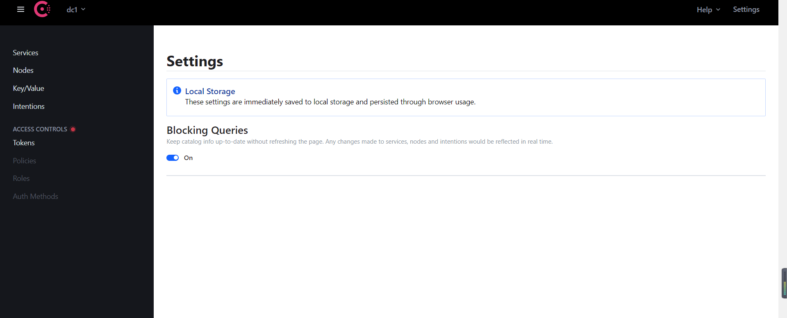
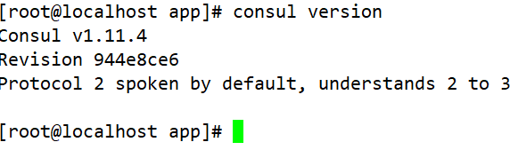
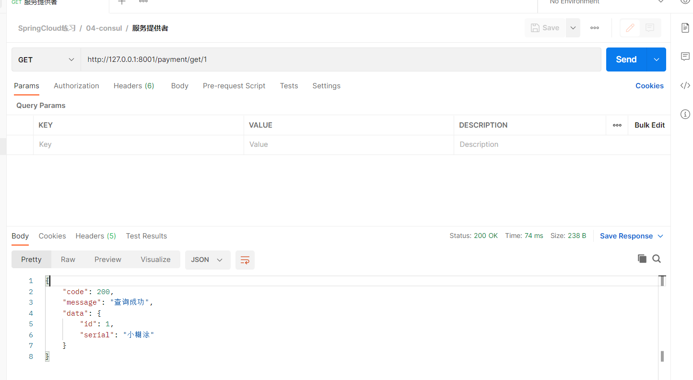
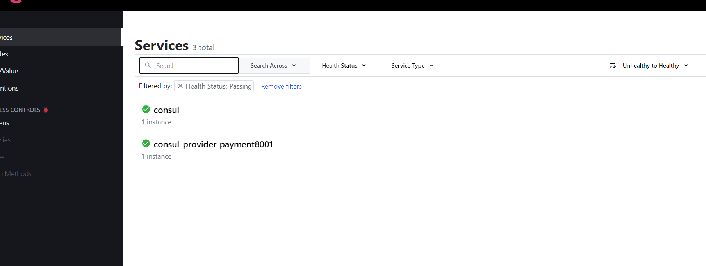
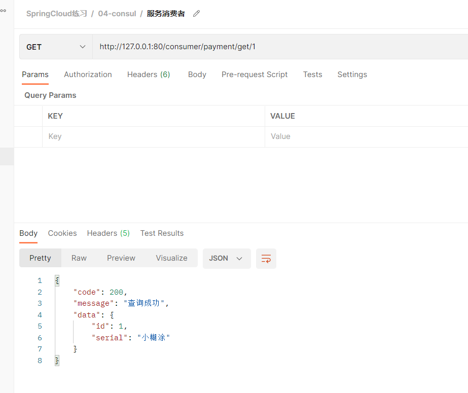
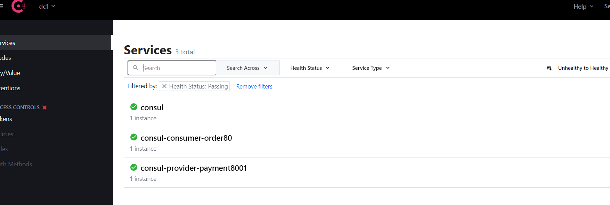

# Consul 


## 简介


### 是什么


Consul 是一套开源的分布式服务发现和配置管理系统，由 HashiCorp 公司用 Go 语言开发。

提供了微服务系统中的**服务治理**、**配置中心**、**控制总线**等功能。这些功能中的每一个都可以根据需要单独使用，也可以一起使用以构建全方位的服务网格，总之Consul提供了一种完整的服务网格解决方案。

它具有很多优点。包括： 基于 raft 协议，比较简洁； 支持健康检查, 同时支持 HTTP 和 DNS 协议 支持跨数据中心的 WAN 集群 提供图形界面 跨平台，支持 Linux、Mac、Windows

 

### 特点


- **服务发现**：Consul 的客户端可以注册服务，例如 `api`or `mysql`，其他客户端可以使用 Consul 发现给定服务的提供者。使用 DNS 或 HTTP，应用程序可以轻松找到它们所依赖的服务。
- **健康检查**：Consul 客户端可以提供任意数量的健康检查，或者与给定服务相关联（“网络服务器是否返回 200 OK”），或者与本地节点相关联（“内存利用率是否低于 90%”）。操作员可以使用此信息来监控集群的健康状况，服务发现组件使用它来将流量从不健康的主机中路由出去。
- **KV 存储**：应用程序可以将 Consul 的分层键/值存储用于任意数量的目的，包括动态配置、特征标记、协调、领导者选举等。简单的 HTTP API 使其易于使用。
- **安全服务通信**：Consul 可以为服务生成和分发 TLS 证书以建立相互 TLS 连接。 [意图](https://www.consul.io/docs/connect/intentions) 可用于定义允许通信的服务。可以通过可以实时更改的意图轻松管理服务分段，而不是使用复杂的网络拓扑和静态防火墙规则。
- **多数据中心**：Consul 支持开箱即用的多个数据中心。这意味着 Consul 的用户不必担心构建额外的抽象层以扩展到多个区域。

可视化Web界面


### 相关连接


下载：https://www.consul.io/downloads.html

中文教程：https://www.springcloud.cc/spring-cloud-consul.html

官网安装说明：https://learn.hashicorp.com/consul/getting-started/install.html


## windows安装


下载完成后只有一个consul.exe文件，硬盘路径下双击运行，查看版本号信息


+ 启动

```java
consul agent -dev
```

通过以下地址可以访问Consul的首页：http://localhost:8500




## Liunx安装


```shell
wget https://releases.hashicorp.com/consul/1.11.4/consul_1.11.4_linux_amd64.zip
mv consul /usr/sbin/consul
consul version
```





Consul启动
启动命令：

```java
consul agent -dev -ui -node=consul-dev -client=192.168.100.100 
```

> 说明：
> -client 为服务器端IP，如果不配置该参数会导致同网段机器访问不到
> 也可以使用命令
>
> ```java
> consul agent -dev -ui -node=consul-dev -client=0.0.0.0
> ```


## 服务提供者注册到Consul


### consul-provider-payment8001


```java
<?xml version="1.0" encoding="UTF-8"?>
<project xmlns="http://maven.apache.org/POM/4.0.0"
         xmlns:xsi="http://www.w3.org/2001/XMLSchema-instance"
         xsi:schemaLocation="http://maven.apache.org/POM/4.0.0 http://maven.apache.org/xsd/maven-4.0.0.xsd">
    <parent>
        <artifactId>cloud-provider</artifactId>
        <groupId>com.xht.example.cloud</groupId>
        <version>1.0-SNAPSHOT</version>
    </parent>
    <modelVersion>4.0.0</modelVersion>

    <artifactId>consul-provider-payment8001</artifactId>

    <properties>
        <maven.compiler.source>8</maven.compiler.source>
        <maven.compiler.target>8</maven.compiler.target>
    </properties>
    <dependencies>
        <!--SpringCloud consul-server -->
        <dependency>
            <groupId>org.springframework.cloud</groupId>
            <artifactId>spring-cloud-starter-consul-discovery</artifactId>
        </dependency>
    </dependencies>
</project>
```


### 复制代码


我们把`demo-provider-payment8001`的代码全部复制到`consul-provider-payment8001`

启动类改名：`ConsulPaymentAPP8001`


### 启动类


```java
@EnableDiscoveryClient
@SpringBootApplication
public class ConsulPaymentAPP8001 {
    public static void main(String[] args) {
        SpringApplication.run(ConsulPaymentAPP8001.class,args);
    }
}
```


### application.yml


```yaml
server:
  port: 8001

spring:
  application:
    name: consul-provider-payment8001
  datasource:
    username: root
    password: 123456
    driver-class-name: com.mysql.jdbc.Driver
    url: jdbc:mysql://127.0.0.1:3306/test?useSSL=false&allowPublicKeyRetrieval=true&useUnicode=true&characterEncoding=utf-8&serverTimezone=GMT%2B8
  cloud:
    consul:
      port: 8500
      host: 192.168.100.100
      discovery:
        service-name: ${spring.application.name}
mybatis:
  mapperLocations: classpath:mapper/*.xml
  type-aliases-package: com.it.common.entity    # 所有Entity别名类所在包
```


### 测试


```java
http://127.0.0.1:8001/payment/get/1
```








## 服务消费者注册到Consul


### consul-consumer-order80


```xml
<?xml version="1.0" encoding="UTF-8"?>
<project xmlns="http://maven.apache.org/POM/4.0.0"
         xmlns:xsi="http://www.w3.org/2001/XMLSchema-instance"
         xsi:schemaLocation="http://maven.apache.org/POM/4.0.0 http://maven.apache.org/xsd/maven-4.0.0.xsd">
    <parent>
        <artifactId>cloud-consumer</artifactId>
        <groupId>com.xht.example.cloud</groupId>
        <version>1.0-SNAPSHOT</version>
    </parent>
    <modelVersion>4.0.0</modelVersion>

    <artifactId>consul-consumer-order80</artifactId>

    <properties>
        <maven.compiler.source>8</maven.compiler.source>
        <maven.compiler.target>8</maven.compiler.target>
    </properties>
    <dependencies>
        <!--SpringCloud consul-server -->
        <dependency>
            <groupId>org.springframework.cloud</groupId>
            <artifactId>spring-cloud-starter-consul-discovery</artifactId>
        </dependency>
    </dependencies>
</project>
```


### 复制代码


我们把`demo-provider-payment8001`的代码全部复制到`consul-consumer-order80`

启动类改名：`ConsulOrderAPP80`


### 启动类


```java
@EnableDiscoveryClient
@SpringBootApplication
public class ConsulOrderAPP80 {
    public static void main(String[] args) {
        SpringApplication.run(ConsulOrderAPP80.class, args);
    }
}
```


### application.yml


```yaml
server:
  port: 80
spring:
  application:
    name: consul-consumer-order80
  cloud:
    consul:
      host: 192.168.100.100
      port: 8500
      discovery:
        service-name: ${spring.application.name}
```


### controller


```java
@RestController
public class OrderController
{

    public static final String PaymentSrv_URL = "http://consul-provider-payment8001";

    @Autowired
    private RestTemplate restTemplate;

    @GetMapping("/consumer/payment/create") //客户端用浏览器是get请求，但是底层实质发送post调用服务端8001
    public CommonResult create(PaymentEntity payment)
    {
        System.out.println(payment);
        return restTemplate.postForObject(PaymentSrv_URL + "/payment/create",payment,CommonResult.class);
    }


    @GetMapping("/consumer/payment/get/{id}")
    public CommonResult getPayment(@PathVariable Long id)
    {
        return restTemplate.getForObject(PaymentSrv_URL + "/payment/get/"+id, CommonResult.class, id);
    }

    @GetMapping("/get")
    public CommonResult test(@PathVariable Long id)
    {
        HashMap<String,Object> map = new HashMap<>();
        map.put("id",1);
        ResponseEntity<String> forEntity = restTemplate.getForEntity(PaymentSrv_URL + "/payment/get/" + id, String.class, map);
        System.out.println(forEntity);


        return new  CommonResult(200,"");
    }
}
```


### RestTemplateConfig


```java
/**
 * 描述 ：
 *
 * @author : 小糊涂
 * @version : 1.0
 **/
@Configuration
public class RestTemplateConfig {
    @Bean
    @LoadBalanced
    public RestTemplate restTemplate(){
        RestTemplate restTemplate = new RestTemplate();
        HttpComponentsClientHttpRequestFactory httpRequestFactory = new HttpComponentsClientHttpRequestFactory();
        httpRequestFactory.setConnectionRequestTimeout(30 * 1000);//请求连接超时
        httpRequestFactory.setConnectTimeout(30 * 3000);//连接超时时间
        httpRequestFactory.setReadTimeout(30 * 3000);//读取超时
        restTemplate.setRequestFactory(httpRequestFactory);
        return restTemplate;
    }
}
```


### 测试


```java
http://127.0.0.1:80/consumer/payment/get/1
```






