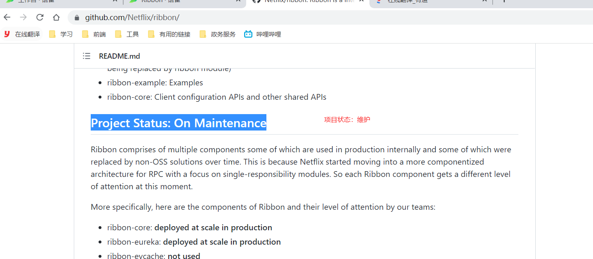
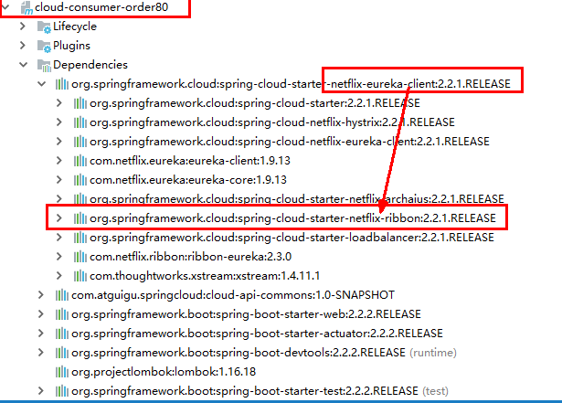
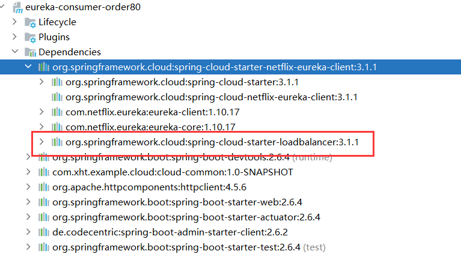

# Ribbon(老版本)


## 简介


Spring Cloud Ribbon是基于Netflix Ribbon实现的一套客户端       负载均衡的工具。

简单的说，Ribbon是Netflix发布的开源项目，主要功能是提供客户端的软件负载均衡算法和服务调用。Ribbon客户端组件提供一系列完善的配置项如连接超时，重试等。简单的说，就是在配置文件中列出Load Balancer（简称LB）后面所有的机器，Ribbon会自动的帮助你基于某种规则（如简单轮询，随机连接等）去连接这些机器。我们很容易使用Ribbon实现自定义的负载均衡算法。

**Feign已经默认使用了Ribbon。**

- 负载均衡
- 容错
- 多协议（HTTP，TCP，UDP）支持异步和反应模型
- 缓存和批处理


## 官网资料


https://github.com/Netflix/ribbon/wiki/Getting-Started

Ribbon目前也进入维护模式



**未来替换方案**

spring-cloud-loadbalancer


## 负载均衡


### LB负载均衡(Load Balance)是什么


简单的说就是将用户的请求平摊的分配到多个服务上，从而达到系统的HA（高可用）。
常见的负载均衡有软件Nginx，LVS，硬件 F5等。


### Ribbon本地负载均衡客户端 VS Nginx服务端负载均衡区别


 Nginx是服务器负载均衡，客户端所有请求都会交给nginx，然后由nginx实现转发请求。即负载均衡是由服务端实现的。

 Ribbon本地负载均衡，在调用微服务接口时候，会在注册中心上获取注册信息服务列表之后缓存到JVM本地，从而在本地实现RPC远程服务调用技术。

 

### 集中式LB


即在服务的消费方和提供方之间使用独立的LB设施(可以是硬件，如F5, 也可以是软件，如nginx), 由该设施负责把访问请求通过某种策略转发至服务的提供方；


### 进程内LB


将LB逻辑集成到消费方，消费方从服务注册中心获知有哪些地址可用，然后自己再从这些地址中选择出一个合适的服务器。

Ribbon就属于进程内LB，它只是一个类库，集成于消费方进程，消费方通过它来获取到服务提供方的地址。


### 提示


前面我们讲解过了80通过轮询负载访问8001/8002


## RestTemplate和Ribbon相结合


不需要添加额外的依赖，我们只要依赖Eureka-client，就自动依赖的ribbon

Ribbon在Netflix中是非常重要的一个组件，在Zuul中使用Ribbon做负载均衡，以及Feign组件的结合等。在Spring Cloud 中，作为开发中，做的最多的可能是将RestTemplate和Ribbon相结合，你可能会这样写：


```java
@Configuration
public class RestTemplateConfig {
    @Bean
    @LoadBalanced //表示负载均衡，使用到是Ribbo
    public RestTemplate restTemplate(){
        RestTemplate restTemplate = new RestTemplate();
        HttpComponentsClientHttpRequestFactory httpRequestFactory = new HttpComponentsClientHttpRequestFactory();
        httpRequestFactory.setConnectionRequestTimeout(30 * 1000);//请求连接超时
        httpRequestFactory.setConnectTimeout(30 * 3000);//连接超时时间
        httpRequestFactory.setReadTimeout(30 * 3000);//读取超时
        restTemplate.setRequestFactory(httpRequestFactory);
        return restTemplate;
    }
}
```


## Ribbon在工作时分成两步


第一步先选择 EurekaServer ,它优先选择在同一个区域内负载较少的server.

第二步再根据用户指定的策略，在从server取到的服务注册列表中选择一个地址。
其中Ribbon提供了多种策略：比如轮询、随机和根据响应时间加权。


> 总结：Ribbon其实就是一个软负载均衡的客户端组件，
> **他可以和其他所需请求的客户端结合使用，和eureka结合只是其中的一个实例。**


## pom


之前写样例时候没有引入spring-cloud-starter-ribbon也可以使用ribbon,

```xml
<dependency>
    <groupId>org.springframework.cloud</groupId>
    <artifactId>spring-cloud-starter-netflix-ribbon</artifactId>
</dependency>
```

猜测spring-cloud-starter-netflix-eureka-client自带了spring-cloud-starter-ribbon引用，
证明如下： 可以看到spring-cloud-starter-netflix-eureka-client 确实引入了Ribbon

**注意我这里的版本**



**新版本里面只有**





## 核心组件IRule使用


| RoundRobinRule:            | 轮询                                                         |
| -------------------------- | ------------------------------------------------------------ |
| RandomRule:                | 随机                                                         |
| AvailabilityFilteringRule: | 会先过滤掉由于多次访问故障而处于断路器跳闸状态的服务,以及并发的连接数量 超过阈值的服务,然后对剩余的服务列表按照轮询策略进行访问; |
| WeightedResponseTimeRule:  | 根据平均响应时间计算所有服务的权重,响应时间越快,服务权重越大,被选中的机率越高; 刚启动时,如果统计信息不足,则使用RoundRobinRule策略,等统计信息足够时,会切换到WeightedResponseTimeRule |
| RetryRule:                 | 先按照RoundRobinRule的策略获取服务,如果获取服务失败,则在指定时间内会进行重试,获取可用的服务; |
| BestAvailableRule:         | 会先过滤掉由于多次访问故障而处于断路器跳闸状态的服务,然后选择一个并发量最小的服务; |
| ZoneAvoidanceRule:         | 默认规则,复合判断server所在区域的性能和server的可用性选择服务器; |

```java
@Bean
public IRulemyRule(){
    //显式的指定使用轮询算法
    return newRandomRule();
}
```


```yaml
# 给指定名称的微服务配置负载均衡策略。即：Ribbon 调用该微服务进行负载时，会使用如下指定的策略
user-service:
  ribbon:
    # 指定 Ribbon 负载均衡策略
    NFLoadBalancerRuleClassName: com.netflix.loadbalancer.RandomRule 
```

**主启动类添加`@RibbonClient`**


## 饥饿加载


Ribbon 默认是采用懒加载，即第一次访问时才会去创建 LoadBalanceClient，请求时间会很长。


而饥饿加载则会在项目启动时创建，降低第一次访问的耗时，通过下面配置开启饥饿加载

```yaml
ribbon:
  eager-load:
    # 开启饥饿加载
    enabled: true
    # 指定哪个服务开启饥饿加载
    clients: 
      # 多个的话，使用 - 接着往下加即可
      - user-service
```


## 总结


Ribbon负载均衡规则

- - 规则接口是 IRule
  - 默认实现是 ZoneAvoidanceRule，根据 zone 选择服务列表，然后轮询


负载均衡自定义方式

- - 代码方式：配置灵活，但修改时需要重新打包发布
  - 配置方式：直观，方便，无需重新打包发布，但是无法做全局配置


饥饿加载

- - 开启饥饿加载
  - 指定饥饿加载的微服务名称


## 常用配置


```yaml
ribbon:
  eureka:
    # 禁用 Eureka
    enabled: false
    # 请求连接的超时时间
    ConnectTimeout: 2000
    # 请求处理的超时时间
    ReadTimeout: 5000
    # 最大连接数
		MaxTotalConnections: 500
		# 每个host最大连接数
		MaxConnectionsPerHost: 500
```


