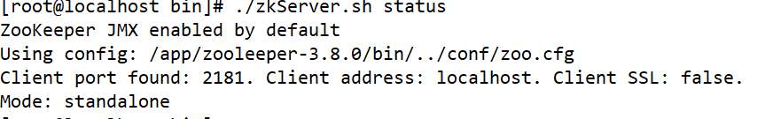
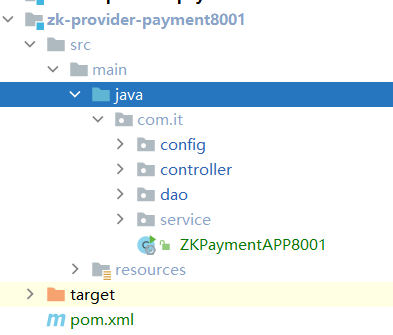
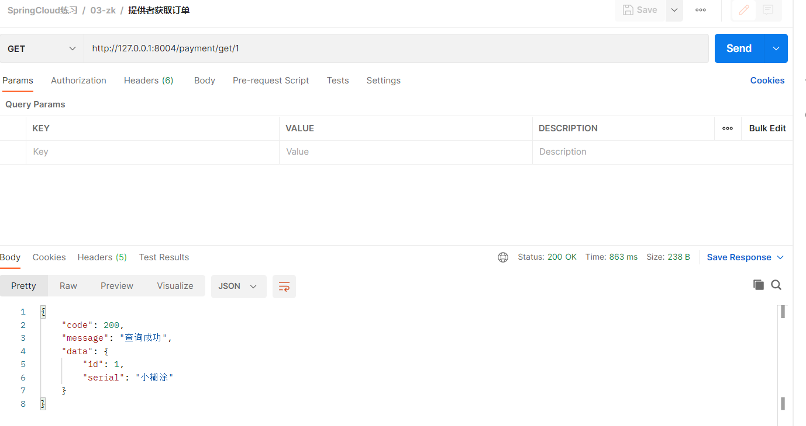
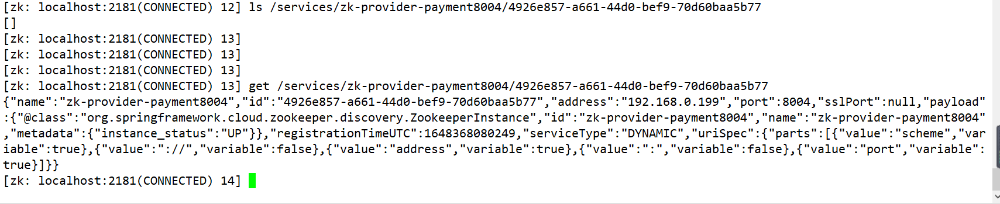
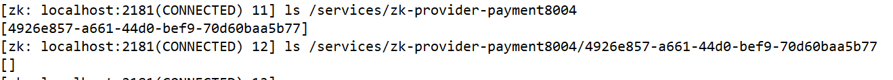
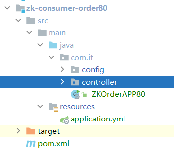
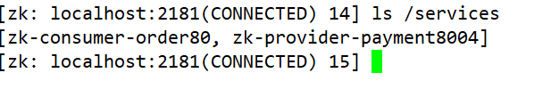
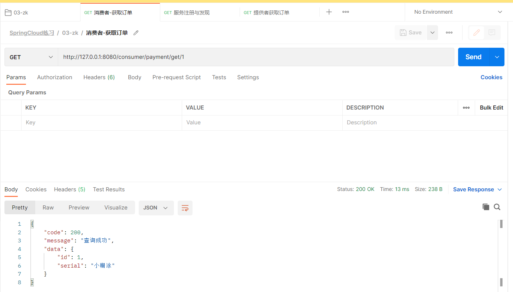

# ZooKeeper


> 这里不会过多讲解这个框架，只会作为一个注册中心来讲


## 简介


zookeeper 是一个分布式的**协调服务**，是Google的Chubby一个开源的实现，是Hadoop和Hbase的重要组件。它是一个为分布式应用提供一致性服务的软件，提供的功能包括：配置维护、域名服务、分布式同步、组服务等


## ZK相关命令


| 作用                               | 命令                            |
| ---------------------------------- | ------------------------------- |
| 启动 ZK 服务                       | bin/zkServer.sh start           |
| 查看 ZK 服务状态                   | bin/zkServer.sh status          |
| 停止 ZK 服务                       | bin/zkServer.sh stop            |
| 重启 ZK 服务                       | bin/zkServer.sh restart         |
| 连接服务器                         | zkCli.sh -server 127.0.0.1:2181 |
| 查看根目录                         | ls /                            |
| 创建 testnode 节点，关联字符串"zz" | create /zk/testnode "zz"        |
| 查看节点内容                       | get /zk/testnode                |
| 设置节点内容                       | set /zk/testnode abc            |
| 删除节点                           | delete /zk/testnode             |
| 查看某节点的权限控制情况           | getAcl /zk                      |


## 准备


启动zk

```shell
./zkServer.sh start
./zkServer.sh status
```




##  服务提供者


### zk-provider-payment8001


```xml
<?xml version="1.0" encoding="UTF-8"?>
<project xmlns="http://maven.apache.org/POM/4.0.0"
         xmlns:xsi="http://www.w3.org/2001/XMLSchema-instance"
         xsi:schemaLocation="http://maven.apache.org/POM/4.0.0 http://maven.apache.org/xsd/maven-4.0.0.xsd">
    <parent>
        <artifactId>cloud-provider</artifactId>
        <groupId>com.xht.example.cloud</groupId>
        <version>1.0-SNAPSHOT</version>
    </parent>
    <modelVersion>4.0.0</modelVersion>

    <artifactId>zk-provider-payment8001</artifactId>

    <properties>
        <maven.compiler.source>8</maven.compiler.source>
        <maven.compiler.target>8</maven.compiler.target>
    </properties>
    <dependencies>
        <!-- SpringBoot整合zookeeper客户端 -->
        <dependency>
            <groupId>org.springframework.cloud</groupId>
            <artifactId>spring-cloud-starter-zookeeper-discovery</artifactId>
            <!-- 先排除自带的 zookeeper3.5.3 -->
            <exclusions>
                <exclusion>
                    <groupId>org.apache.zookeeper</groupId>
                    <artifactId>zookeeper</artifactId>
                </exclusion>
            </exclusions>
        </dependency>
        <!-- 添加和服务器端 zookeeper 版本匹配的依赖 -->
        <dependency>
            <groupId>org.apache.zookeeper</groupId>
            <artifactId>zookeeper</artifactId>
            <version>3.8.0</version>
        </dependency>
        <dependency>
            <groupId>org.springframework.boot</groupId>
            <artifactId>spring-boot-devtools</artifactId>
            <scope>runtime</scope>
            <optional>true</optional>
        </dependency>
    </dependencies>
</project>
```


###  复制代码


我们把`demo-provider-payment8001`的代码全部复制到`zk-provider-payment8001`

启动类改名：`ZKPaymentAPP8001`



 

### 启动类


```java
package com.it;

import org.springframework.boot.SpringApplication;
import org.springframework.boot.autoconfigure.SpringBootApplication;
import org.springframework.cloud.client.discovery.EnableDiscoveryClient;

/**
 * 描述 ：
 *
 * @author : 小糊涂
 * @version : 1.0
 **/
@SpringBootApplication
@EnableDiscoveryClient //该注解用于向使用consul或者zookeeper作为注册中心时注册服务
public class ZKPaymentAPP8001 {
    public static void main(String[] args) {
        SpringApplication.run(ZKPaymentAPP8001.class,args);
    }
}
```


### application.yml


```yaml
server:
  port: 8004

spring:
  application:
    name: zk-provider-payment8004
  cloud:
    zookeeper:
      connect-string: 192.168.100.100:2181
      connection-timeout: 150000
  datasource:
    username: root
    password: 123456
    driver-class-name: com.mysql.jdbc.Driver
    url: jdbc:mysql://127.0.0.1:3306/test?useSSL=false&allowPublicKeyRetrieval=true&useUnicode=true&characterEncoding=utf-8&serverTimezone=GMT%2B8
  boot:
    admin:
      client:
        url: http://localhost:5555
        instance:
          prefer-ip: true
#开放端点用于SpringBoot Admin的监控
management:
  endpoints:
    web:
      exposure:
        include: '*'


mybatis:
  mapperLocations: classpath:mapper/*.xml
  type-aliases-package: com.it.common.entity    # 所有Entity别名类所在包
```


### 测试


```java
http://127.0.0.1:8004/payment/get/1
```




+ 查看zk




```json
{"name":"zk-provider-payment8004","id":"4926e857-a661-44d0-bef9-70d60baa5b77","address":"192.168.0.199","port":8004,"sslPort":null,"payload":{"@class":"org.springframework.cloud.zookeeper.discovery.ZookeeperInstance","id":"zk-provider-payment8004","name":"zk-provider-payment8004","metadata":{"instance_status":"UP"}},"registrationTimeUTC":1648368080249,"serviceType":"DYNAMIC","uriSpec":{"parts":[{"value":"scheme","variable":true},{"value":"://","variable":false},{"value":"address","variable":true},{"value":":","variable":false},{"value":"port","variable":true}]}}
```


## 服务节点是临时节点还是持久节点


这个节点是临时的还是持久的




> 他是临时的，我们暂停服务，启动服务后，我们发现这个流水号发生了改变


## 服务消费者


### zk-consumer-order80


```xml
<?xml version="1.0" encoding="UTF-8"?>
<project xmlns="http://maven.apache.org/POM/4.0.0"
         xmlns:xsi="http://www.w3.org/2001/XMLSchema-instance"
         xsi:schemaLocation="http://maven.apache.org/POM/4.0.0 http://maven.apache.org/xsd/maven-4.0.0.xsd">
    <parent>
        <artifactId>cloud-consumer</artifactId>
        <groupId>com.xht.example.cloud</groupId>
        <version>1.0-SNAPSHOT</version>
    </parent>
    <modelVersion>4.0.0</modelVersion>

    <artifactId>zk-consumer-order80</artifactId>

    <properties>
        <maven.compiler.source>8</maven.compiler.source>
        <maven.compiler.target>8</maven.compiler.target>
    </properties>
    <dependencies>
        <!--热部署插件-->
        <dependency>
            <groupId>org.springframework.boot</groupId>
            <artifactId>spring-boot-devtools</artifactId>
            <scope>runtime</scope>
            <optional>true</optional>
        </dependency>
        <!-- SpringBoot整合zookeeper客户端 -->
        <dependency>
            <groupId>org.springframework.cloud</groupId>
            <artifactId>spring-cloud-starter-zookeeper-discovery</artifactId>
            <!-- 先排除自带的 zookeeper3.5.3 -->
            <exclusions>
                <exclusion>
                    <groupId>org.apache.zookeeper</groupId>
                    <artifactId>zookeeper</artifactId>
                </exclusion>
            </exclusions>
        </dependency>
        <!-- 添加和服务器端 zookeeper 版本匹配的依赖 -->
        <dependency>
            <groupId>org.apache.zookeeper</groupId>
            <artifactId>zookeeper</artifactId>
            <version>3.8.0</version>
        </dependency>
    </dependencies>
</project>
```


### 复制代码


将`demo-consumer-order80`复制到`zk-consumer-order80`

启动类改名为：`ZKOrderAPP80`




### 启动类


```java
package com.it;

import org.springframework.boot.SpringApplication;
import org.springframework.boot.autoconfigure.SpringBootApplication;
import org.springframework.cloud.client.discovery.EnableDiscoveryClient;

/**
 * 描述 ：
 *
 * @author : 小糊涂
 * @version : 1.0
 **/
@EnableDiscoveryClient
@SpringBootApplication
public class ZKOrderAPP80 {
    public static void main(String[] args) {
        SpringApplication.run(ZKOrderAPP80.class, args);
    }
}
```


### controller


```java
package com.it.controller;

import com.it.common.CommonResult;
import com.it.common.entity.PaymentEntity;
import org.springframework.beans.factory.annotation.Autowired;
import org.springframework.http.ResponseEntity;
import org.springframework.web.bind.annotation.GetMapping;
import org.springframework.web.bind.annotation.PathVariable;
import org.springframework.web.bind.annotation.RestController;
import org.springframework.web.client.RestTemplate;

import java.util.HashMap;

/**
 * 描述 ：
 *
 * @author : 小糊涂
 * @version : 1.0
 **/
@RestController
public class OrderController
{

    public static final String PaymentSrv_URL = "http://ZK-PROVIDER-PAYMENT8004";

    @Autowired
    private RestTemplate restTemplate;

    @GetMapping("/consumer/payment/create") //客户端用浏览器是get请求，但是底层实质发送post调用服务端8001
    public CommonResult create(PaymentEntity payment)
    {
        System.out.println(payment);
        return restTemplate.postForObject(PaymentSrv_URL + "/payment/create",payment,CommonResult.class);
    }


    @GetMapping("/consumer/payment/get/{id}")
    public CommonResult getPayment(@PathVariable Long id)
    {
        return restTemplate.getForObject(PaymentSrv_URL + "/payment/get/"+id, CommonResult.class, id);
    }

    @GetMapping("/get")
    public CommonResult test(@PathVariable Long id)
    {
        HashMap<String,Object> map = new HashMap<>();
        map.put("id",1);
        ResponseEntity<String> forEntity = restTemplate.getForEntity(PaymentSrv_URL + "/payment/get/" + id, String.class, map);
        System.out.println(forEntity);


        return new  CommonResult(200,"");
    }
}
```


### application.yaml


```java
server:
  port: 8080


spring:
  application:
    name: zk-consumer-order80
  cloud:
    zookeeper:
      connection-timeout: 15000
      connect-string: 192.168.100.100:2181
```


### RestTemplateConfig


```java
/**
 * 描述 ：
 *
 * @author : 小糊涂
 * @version : 1.0
 **/
@Configuration
public class RestTemplateConfig {
    @Bean
    @LoadBalanced
    public RestTemplate restTemplate(){
        RestTemplate restTemplate = new RestTemplate();
        HttpComponentsClientHttpRequestFactory httpRequestFactory = new HttpComponentsClientHttpRequestFactory();
        httpRequestFactory.setConnectionRequestTimeout(30 * 1000);//请求连接超时
        httpRequestFactory.setConnectTimeout(30 * 3000);//连接超时时间
        httpRequestFactory.setReadTimeout(30 * 3000);//读取超时
        restTemplate.setRequestFactory(httpRequestFactory);
        return restTemplate;
    }
}
```


### 测试


+ zk



+ 接口

```java
http://127.0.0.1:8080/consumer/payment/get/1
```




## zookeeper不适合用作注册中心的简单总结


1. 当注册中心的服务规模超过一定数量的时候，zk不能很好的工作，不能支持很高的tps和TCP长连接
2. zk的写请求是不是可扩展的
3. zk提供的Service Health Check功能很弱，基于zk的session活性检查和临时节点监听机制上，不能真正反应服务的健康状态
4. zk原生客户端没有提供数据缓存机制，当注册中心宕机的时候，会造成服务不可用
5. zk原生客户端不好用，难以掌握Client/Session状态机，zk的客户端和服务端交互协议不简单，比如：TCP长连接Session管理，Ephemeral Znode（临时节点），Event&Notification（事件订阅通知）,ping（心跳检测）
6. 复杂的异常处理，ConnectionLossException和Disconnected事件

ZooKeeper应该 **“The King Of Coordination for Big Data”！**大数据协调之王

　　

> ZAB协议（zookeeper原子广播协议），崩溃恢复模式（群首选举协议，），原子广播模式（消息广播协议，类似于两阶段提交协议）
>
> 1. znode，分为持久节点和临时节点，节点都有一个是否有序的属性。临时节点TCP连接断开后，就会被删除。
> 2. 可以设置znode的事件监听(watch)。
> 3. 客户端主要有zkclient,curator
> 4. 节点数据最大可设置为1M
> 5. 2181默认服务端口，3888默认选举端口，leader会监听2888端口，follower连接leader
> 6. leader（群首）,follower（追随者）,observer（观察者）
> 7. 独立模式，仲裁模式（集群模式）
> 8. 事务是有序的zxid64位,低32位是单调递增的，高32表示leader的周期
> 9. 节点权限READ，WRITE，CREATE，DELETE，ADMIN
> 10. 内置鉴权模式，world，auth，digest，ip，super


## 小结


从 CP 模型上来讲，zookeeper 并不适合注册中心高可用的需要。

从性能上来讲，zookeeper 也无法满足注册中心大规模且频繁注册写的场景。

你可能会问，zookeeper 既然这么多问题，他咋不改呢？

其实，这并不算是 zookeeper 的问题，是人家本来就不适合做注册中心，非要用他的话，肯定一堆问题。

zookeeper 的特长是做分布式协调服务，例如 kafka、hbase、flink、hadoop 等大项目都在用 zookeeper，用的挺好的，因为是用对了地方。


