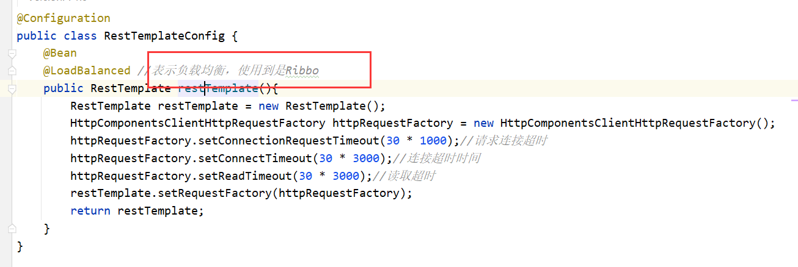

# 重要提醒（版本更替问题）

我们上面的代码中配置的`RestTemplateConfig`配置类

中注释的是：

其实不是ribbon：他是 **spring-cloud-loadbalancer**

新版本cloud里面采用的都是：`spring-cloud-loadbalancer`

包括我们后面`fegin`里面也是

> **Spring Cloud 2020.0.0 之后 Spring Cloud Netflix 彻底删除掉了除Eureka外的所有组件。**

+ spring cloud netflix只保留了spring cloud netflix eureka，删除了netflix其他的组件，涉及
+ spring-cloud-netflix-archaius
+ spring-cloud-netflix-concurrency-limits
+ spring-cloud-netflix-core
+ spring-cloud-netflix-dependencies
+ spring-cloud-netflix-hystrix
+ spring-cloud-netflix-hystrix-contract
+ spring-cloud-netflix-hystrix-dashboard
+ spring-cloud-netflix-hystrix-stream
+ spring-cloud-netflix-ribbon
+ spring-cloud-netflix-sidecar
+ spring-cloud-netflix-turbine
+ spring-cloud-netflix-turbine-stream
+ spring-cloud-netflix-zuul
+ spring-cloud-starter-netflix-archaius
+ spring-cloud-starter-netflix-hystrix
+ spring-cloud-starter-netflix-hystrix-dashboard
+ spring-cloud-starter-netflix-ribbon
+ spring-cloud-starter-netflix-turbine
+ spring-cloud-starter-netflix-turbine-stream
+ spring-cloud-starter-netflix-zuul

