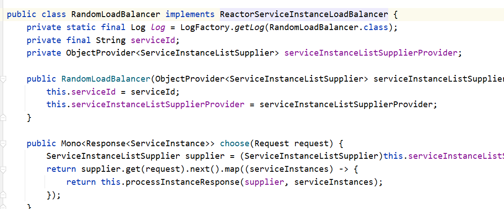

# spring-cloud-loadbalancer


## 简介


Spring Cloud LoadBalancer是Spring Cloud官方自己提供的客户端负载均衡器, 用来替代Ribbon。

**Spring官方提供了两种负载均衡的客户端:**

**RestTemplate**

RestTemplate是Spring提供的用于访问Rest服务的客户端，RestTemplate提供了多种便捷访问 远程Http服务的方法，能够大大提高客户端的编写效率。默认情况下，RestTemplate默认依赖 jdk的HTTP连接工具。

**WebClient** 

WebClient是从Spring WebFlux 5.0版本开始提供的一个非阻塞的基于响应式编程的进行Http请 求的客户端工具。它的响应式编程的基于Reactor的。WebClient中提供了标准Http请求方式对 应的get、post、put、delete等方法，可以用来发起相应的请求

## 原理


LoadBalancerClient 在初始化时会通过 Eureka Client 向 Eureka 服务端获取所有服务实例的注册信息并缓存在本地，并且每10秒向 EurekaClient 发送 “ping”，来判断服务的可用性。如果服务的可用性发生了改变或者服务数量和之前的不一致，则更新或者重新拉取。最后，在得到服务注册列表信息后，ILoadBalancer 根据 IRule 的策略进行负载均衡（默认策略为轮询）

当使用 LoadBalancerClient 进行远程调用的负载均衡时，LoadBalancerClient 先通过目标服务名在本地服务注册清单中获取服务提供方的某一个实例，比如订单服务需要访问商品服务，商品服务有3个节点，LoadBalancerClient 会通过 choose() 方法获取到3个节点中的一个服务，拿到服务的信息之后取出服务IP信息，就可以得到完整的想要访问的IP地址和接口，最后通过 RestTempate 访问商品服务。


## 负载策略


一个是轮询，一个是随时，默认是轮询，现在我们切换成随机

| 类                     | 负载策略 |
| ---------------------- | -------- |
| RoundRobinLoadBalancer | 随时     |
| RandomLoadBalancer     | 轮询     |


## 负载策略配置


添加 LoadBalancer配置类


```java
import org.springframework.cloud.client.ServiceInstance;
import org.springframework.cloud.client.loadbalancer.LoadBalanced;
import org.springframework.cloud.loadbalancer.annotation.LoadBalancerClients;
import org.springframework.cloud.loadbalancer.core.ReactorLoadBalancer;
import org.springframework.cloud.loadbalancer.core.ServiceInstanceListSupplier;
import org.springframework.cloud.loadbalancer.support.LoadBalancerClientFactory;
import org.springframework.context.annotation.Bean;
import org.springframework.context.annotation.ComponentScan;
import org.springframework.context.annotation.Configuration;
import org.springframework.core.env.Environment;
import org.springframework.web.client.RestTemplate;
@Configuration
@LoadBalancerClients(defaultConfiguration = {SpringBeanConfiguration.class})
public class SpringBeanConfiguration {

    @Bean
    @LoadBalanced
    public RestTemplate restTemplate(){
        return new RestTemplate();
    }

    @Bean
    ReactorLoadBalancer<ServiceInstance> randomLoadBalancer(Environment environment,
                                                            LoadBalancerClientFactory loadBalancerClientFactory) {
        String name = environment.getProperty(LoadBalancerClientFactory.PROPERTY_NAME);

        return new NacosSameClusterWeightedRule(loadBalancerClientFactory
                .getLazyProvider(name, ServiceInstanceListSupplier.class),
                name);
    }
}
```


## 负载均衡第二种配置


### 新建一个类


```java
import org.springframework.cloud.client.ServiceInstance;
import org.springframework.cloud.loadbalancer.core.ReactorLoadBalancer;
import org.springframework.cloud.loadbalancer.core.ServiceInstanceListSupplier;
import org.springframework.cloud.loadbalancer.support.LoadBalancerClientFactory;
import org.springframework.context.annotation.Bean;
import org.springframework.core.env.Environment;

//这里不用写Configuration
public class CustomLoadBalancerConfig {
    @Bean
    ReactorLoadBalancer<ServiceInstance> randomLoadBalancer(Environment environment,
                                                            LoadBalancerClientFactory loadBalancerClientFactory) {
        String name = environment.getProperty(LoadBalancerClientFactory.PROPERTY_NAME);

       	// 返回内容为自定义负载均衡的配置类
        return new RandomLoadBalancer(loadBalancerClientFactory
                .getLazyProvider(name, ServiceInstanceListSupplier.class),
                name);
    }
}
```


```java
import org.springframework.cloud.client.loadbalancer.LoadBalanced;
import org.springframework.cloud.loadbalancer.annotation.LoadBalancerClients;
import org.springframework.context.annotation.Bean;
import org.springframework.context.annotation.ComponentScan;
import org.springframework.context.annotation.Configuration;
import org.springframework.web.client.RestTemplate;


@Configuration
// 在这里配置我们自定义的LoadBalancer策略，注：这里的类为注入Bean的类，而非负载均衡的实现类
@LoadBalancerClients(defaultConfiguration = {CustomLoadBalancerConfig .class})
public class RespTemplateConfig  {

    @Bean
    @LoadBalanced
    public RestTemplate restTemplate(){
        return new RestTemplate();
    }

}
```


## 自定义负载策略


如果要自己实现负载，可以实现 `ReactorServiceInstanceLoadBalancer`




以下代码参考部分网络文档，以及官方的**RandomLoadBalancer**实现类

```java
import java.math.BigDecimal;
import java.util.*;
import java.util.stream.Collectors;

import com.alibaba.cloud.nacos.NacosDiscoveryProperties;
import com.alibaba.nacos.api.naming.pojo.Instance;
import com.alibaba.nacos.api.utils.StringUtils;
import com.alibaba.nacos.client.naming.core.Balancer;
import lombok.extern.slf4j.Slf4j;
import org.springframework.beans.factory.ObjectProvider;
import org.springframework.cloud.client.ServiceInstance;
import org.springframework.cloud.client.loadbalancer.DefaultResponse;
import org.springframework.cloud.client.loadbalancer.EmptyResponse;
import org.springframework.cloud.client.loadbalancer.Request;
import org.springframework.cloud.client.loadbalancer.Response;
import org.springframework.cloud.loadbalancer.core.NoopServiceInstanceListSupplier;
import org.springframework.cloud.loadbalancer.core.ReactorServiceInstanceLoadBalancer;
import org.springframework.cloud.loadbalancer.core.SelectedInstanceCallback;
import org.springframework.cloud.loadbalancer.core.ServiceInstanceListSupplier;
import reactor.core.publisher.Mono;

import javax.annotation.Resource;

@Slf4j
// 自定义负载均衡实现需要实现 ReactorServiceInstanceLoadBalancer 接口 以及重写choose方法
public class NacosSameClusterWeightedRule implements ReactorServiceInstanceLoadBalancer {

    // 注入当前服务的nacos的配置信息
    @Resource
    private NacosDiscoveryProperties nacosDiscoveryProperties;

    // loadbalancer 提供的访问当前服务的名称
    final String serviceId;
    
    // loadbalancer 提供的访问的服务列表
    ObjectProvider<ServiceInstanceListSupplier> serviceInstanceListSupplierProvider;

    public NacosSameClusterWeightedRule(ObjectProvider<ServiceInstanceListSupplier> serviceInstanceListSupplierProvider, String serviceId) {
        this.serviceId = serviceId;
        this.serviceInstanceListSupplierProvider = serviceInstanceListSupplierProvider;
    }

/**
     * 服务器调用负载均衡时调的放啊
     * 此处代码内容与 RandomLoadBalancer 一致
     */
    public Mono<Response<ServiceInstance>> choose(Request request) {
        ServiceInstanceListSupplier supplier = this.serviceInstanceListSupplierProvider.getIfAvailable(NoopServiceInstanceListSupplier::new);
        return supplier.get(request).next().map((serviceInstances) -> {
            return this.processInstanceResponse(supplier, serviceInstances);
        });
    }
    
    /**
     * 对负载均衡的服务进行筛选的方法
     * 此处代码内容与 RandomLoadBalancer 一致
     */
    private Response<ServiceInstance> processInstanceResponse(ServiceInstanceListSupplier supplier, List<ServiceInstance> serviceInstances) {
        Response<ServiceInstance> serviceInstanceResponse = this.getInstanceResponse(serviceInstances);
        if (supplier instanceof SelectedInstanceCallback && serviceInstanceResponse.hasServer()) {
            ((SelectedInstanceCallback)supplier).selectedServiceInstance((ServiceInstance)serviceInstanceResponse.getServer());
        }

        return serviceInstanceResponse;
    }

    /**
     * 对负载均衡的服务进行筛选的方法
     * 自定义
     * 此处的 instances 实例列表  只会提供健康的实例  所以不需要担心如果实例无法访问的情况
     */
    private Response<ServiceInstance> getInstanceResponse(List<ServiceInstance> instances) {
        if (instances.isEmpty()) {
            return new EmptyResponse();
        }
        // 获取当前服务所在的集群名称
        String currentClusterName = nacosDiscoveryProperties.getClusterName();
        // 过滤在同一集群下注册的服务 根据集群名称筛选的集合
        List<ServiceInstance> sameClusterNameInstList  = instances.stream().filter(i-> StringUtils.equals(i.getMetadata().get("nacos.cluster"),currentClusterName)).collect(Collectors.toList());
        ServiceInstance sameClusterNameInst;
        if (sameClusterNameInstList.isEmpty()) {
            // 如果为空，则根据权重直接过滤所有服务列表
            sameClusterNameInst = getHostByRandomWeight(instances);
        } else {
            // 如果不为空，则根据权重直接过滤所在集群下的服务列表
            sameClusterNameInst = getHostByRandomWeight(sameClusterNameInstList);
        }
        return new DefaultResponse(sameClusterNameInst);
    }

    private ServiceInstance getHostByRandomWeight(List<ServiceInstance> sameClusterNameInstList){

        List<Instance> list = new ArrayList<>();
        Map<String,ServiceInstance> dataMap = new HashMap<>();
        // 此处将 ServiceInstance 转化为 Instance 是为了接下来调用nacos中的权重算法，由于入参不同，所以需要转换，此处建议打断电进行参数调试，以下是我目前为止所用到的参数，转化为map是为了最终方便获取取值到的服务对象
        sameClusterNameInstList.forEach(i->{
            Instance ins = new Instance();
            Map<String, String> metadata = i.getMetadata();

            ins.setInstanceId(metadata.get("nacos.instanceId"));
            ins.setWeight(new BigDecimal(metadata.get("nacos.weight")).doubleValue());
            ins.setClusterName(metadata.get("nacos.cluster"));
            ins.setEphemeral(Boolean.parseBoolean(metadata.get("nacos.ephemeral")));
            ins.setHealthy(Boolean.parseBoolean(metadata.get("nacos.healthy")));
            ins.setPort(i.getPort());
            ins.setIp(i.getHost());
            ins.setServiceName(i.getServiceId());

            ins.setMetadata(metadata);

            list.add(ins);
            // key为服务ID，值为服务对象
            dataMap.put(metadata.get("nacos.instanceId"),i);
        });
        // 调用nacos官方提供的负载均衡权重算法
        Instance hostByRandomWeightCopy = ExtendBalancer.getHostByRandomWeightCopy(list);
        
        // 根据最终ID获取需要返回的实例对象
        return dataMap.get(hostByRandomWeightCopy.getInstanceId());
    }

}

class ExtendBalancer extends Balancer {
    /**
     * 根据权重选择随机选择一个
     */
    public static Instance getHostByRandomWeightCopy(List<Instance> hosts) {
        return getHostByRandomWeight(hosts);
    }
}
```


