# Nacos


## 简介


### 概述


Nacos/nɑ:kəʊs/ 是 Dynamic Naming and Configuration Service 的首字母简称；

Nacos 帮助您更敏捷和容易地构建、交付和管理微服务平台。 Nacos 是构建以“服务”为中心的现代应用架构 (例如微服务范式、云原生范式) 的服务基础设施。


## 安装


### 下载


https://github.com/alibaba/nacos/releases  选择一个最新的稳定版本。

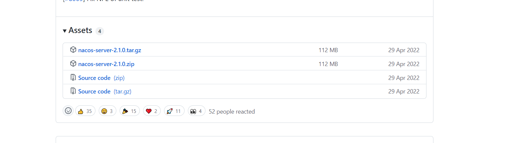


其中zip是Windows版本，tar.gz是Linux版本。

本文使用Windows版本的nacos-server-2.1.0.tar.gz来介绍。


### 安装


上传服务器解压

```shell
tar -zxvf nacos-server-2.1.0.tar.gz
```


### 注意


Nacos的运行需要以至少2C4g60g*3的机器配置下运行。


## 启动


> 进入bin目录下


### Linux/Unix/Mac


启动命令(standalone代表着单机模式运行，非集群模式):

```shell
sh startup.sh -m standalone
```

如果您使用的是ubuntu系统，或者运行脚本报错提示[[符号找不到，可尝试如下运行：

```shell
bash startup.sh -m standalone
```


### Windows

启动命令(standalone代表着单机模式运行，非集群模式):

```shell
startup.cmd -m standalone
```


### 启动后页面


访问：http://IP:8848/nacos/


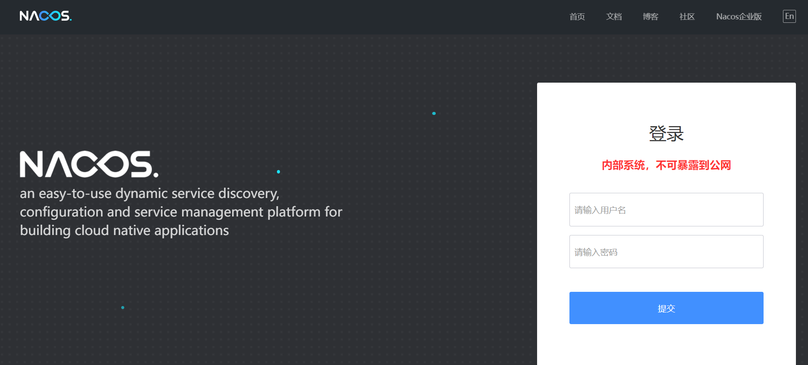


## 关闭服务


> 进入bin目录下


### Linux/Unix/Mac


```java
sh shutdown.sh
```


### Windows


```java
shutdown.cmd
```

或者双击shutdown.cmd运行文件。


## 单机模式配置MySql


### 准备mysql


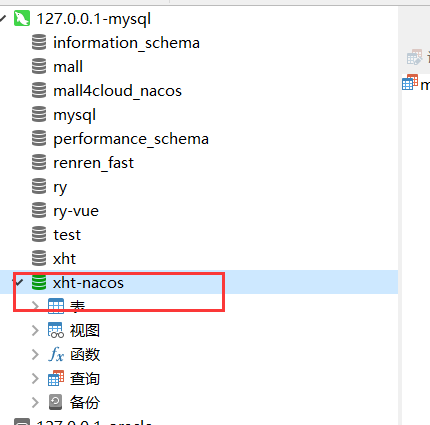


### 导入初始化数据


使用 conf/nacos-mysql.sql文件初始化数据库


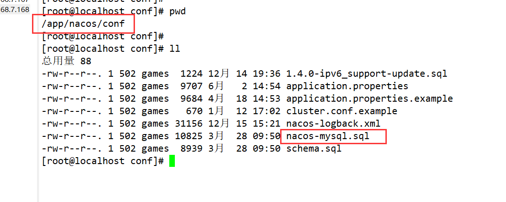

```sql

/******************************************/
/*   数据库全名 = nacos_config   */
/*   表名称 = config_info   */
/******************************************/
CREATE TABLE `config_info` (
  `id` bigint(20) NOT NULL AUTO_INCREMENT COMMENT 'id',
  `data_id` varchar(255) NOT NULL COMMENT 'data_id',
  `group_id` varchar(255) DEFAULT NULL,
  `content` longtext NOT NULL COMMENT 'content',
  `md5` varchar(32) DEFAULT NULL COMMENT 'md5',
  `gmt_create` datetime NOT NULL DEFAULT CURRENT_TIMESTAMP COMMENT '创建时间',
  `gmt_modified` datetime NOT NULL DEFAULT CURRENT_TIMESTAMP COMMENT '修改时间',
  `src_user` text COMMENT 'source user',
  `src_ip` varchar(50) DEFAULT NULL COMMENT 'source ip',
  `app_name` varchar(128) DEFAULT NULL,
  `tenant_id` varchar(128) DEFAULT '' COMMENT '租户字段',
  `c_desc` varchar(256) DEFAULT NULL,
  `c_use` varchar(64) DEFAULT NULL,
  `effect` varchar(64) DEFAULT NULL,
  `type` varchar(64) DEFAULT NULL,
  `c_schema` text,
  `encrypted_data_key` text NOT NULL COMMENT '秘钥',
  PRIMARY KEY (`id`),
  UNIQUE KEY `uk_configinfo_datagrouptenant` (`data_id`,`group_id`,`tenant_id`)
) ENGINE=InnoDB DEFAULT CHARSET=utf8 COLLATE=utf8_bin COMMENT='config_info';

/******************************************/
/*   数据库全名 = nacos_config   */
/*   表名称 = config_info_aggr   */
/******************************************/
CREATE TABLE `config_info_aggr` (
  `id` bigint(20) NOT NULL AUTO_INCREMENT COMMENT 'id',
  `data_id` varchar(255) NOT NULL COMMENT 'data_id',
  `group_id` varchar(255) NOT NULL COMMENT 'group_id',
  `datum_id` varchar(255) NOT NULL COMMENT 'datum_id',
  `content` longtext NOT NULL COMMENT '内容',
  `gmt_modified` datetime NOT NULL COMMENT '修改时间',
  `app_name` varchar(128) DEFAULT NULL,
  `tenant_id` varchar(128) DEFAULT '' COMMENT '租户字段',
  PRIMARY KEY (`id`),
  UNIQUE KEY `uk_configinfoaggr_datagrouptenantdatum` (`data_id`,`group_id`,`tenant_id`,`datum_id`)
) ENGINE=InnoDB DEFAULT CHARSET=utf8 COLLATE=utf8_bin COMMENT='增加租户字段';


/******************************************/
/*   数据库全名 = nacos_config   */
/*   表名称 = config_info_beta   */
/******************************************/
CREATE TABLE `config_info_beta` (
  `id` bigint(20) NOT NULL AUTO_INCREMENT COMMENT 'id',
  `data_id` varchar(255) NOT NULL COMMENT 'data_id',
  `group_id` varchar(128) NOT NULL COMMENT 'group_id',
  `app_name` varchar(128) DEFAULT NULL COMMENT 'app_name',
  `content` longtext NOT NULL COMMENT 'content',
  `beta_ips` varchar(1024) DEFAULT NULL COMMENT 'betaIps',
  `md5` varchar(32) DEFAULT NULL COMMENT 'md5',
  `gmt_create` datetime NOT NULL DEFAULT CURRENT_TIMESTAMP COMMENT '创建时间',
  `gmt_modified` datetime NOT NULL DEFAULT CURRENT_TIMESTAMP COMMENT '修改时间',
  `src_user` text COMMENT 'source user',
  `src_ip` varchar(50) DEFAULT NULL COMMENT 'source ip',
  `tenant_id` varchar(128) DEFAULT '' COMMENT '租户字段',
  `encrypted_data_key` text NOT NULL COMMENT '秘钥',
  PRIMARY KEY (`id`),
  UNIQUE KEY `uk_configinfobeta_datagrouptenant` (`data_id`,`group_id`,`tenant_id`)
) ENGINE=InnoDB DEFAULT CHARSET=utf8 COLLATE=utf8_bin COMMENT='config_info_beta';

/******************************************/
/*   数据库全名 = nacos_config   */
/*   表名称 = config_info_tag   */
/******************************************/
CREATE TABLE `config_info_tag` (
  `id` bigint(20) NOT NULL AUTO_INCREMENT COMMENT 'id',
  `data_id` varchar(255) NOT NULL COMMENT 'data_id',
  `group_id` varchar(128) NOT NULL COMMENT 'group_id',
  `tenant_id` varchar(128) DEFAULT '' COMMENT 'tenant_id',
  `tag_id` varchar(128) NOT NULL COMMENT 'tag_id',
  `app_name` varchar(128) DEFAULT NULL COMMENT 'app_name',
  `content` longtext NOT NULL COMMENT 'content',
  `md5` varchar(32) DEFAULT NULL COMMENT 'md5',
  `gmt_create` datetime NOT NULL DEFAULT CURRENT_TIMESTAMP COMMENT '创建时间',
  `gmt_modified` datetime NOT NULL DEFAULT CURRENT_TIMESTAMP COMMENT '修改时间',
  `src_user` text COMMENT 'source user',
  `src_ip` varchar(50) DEFAULT NULL COMMENT 'source ip',
  PRIMARY KEY (`id`),
  UNIQUE KEY `uk_configinfotag_datagrouptenanttag` (`data_id`,`group_id`,`tenant_id`,`tag_id`)
) ENGINE=InnoDB DEFAULT CHARSET=utf8 COLLATE=utf8_bin COMMENT='config_info_tag';

/******************************************/
/*   数据库全名 = nacos_config   */
/*   表名称 = config_tags_relation   */
/******************************************/
CREATE TABLE `config_tags_relation` (
  `id` bigint(20) NOT NULL COMMENT 'id',
  `tag_name` varchar(128) NOT NULL COMMENT 'tag_name',
  `tag_type` varchar(64) DEFAULT NULL COMMENT 'tag_type',
  `data_id` varchar(255) NOT NULL COMMENT 'data_id',
  `group_id` varchar(128) NOT NULL COMMENT 'group_id',
  `tenant_id` varchar(128) DEFAULT '' COMMENT 'tenant_id',
  `nid` bigint(20) NOT NULL AUTO_INCREMENT,
  PRIMARY KEY (`nid`),
  UNIQUE KEY `uk_configtagrelation_configidtag` (`id`,`tag_name`,`tag_type`),
  KEY `idx_tenant_id` (`tenant_id`)
) ENGINE=InnoDB DEFAULT CHARSET=utf8 COLLATE=utf8_bin COMMENT='config_tag_relation';

/******************************************/
/*   数据库全名 = nacos_config   */
/*   表名称 = group_capacity   */
/******************************************/
CREATE TABLE `group_capacity` (
  `id` bigint(20) unsigned NOT NULL AUTO_INCREMENT COMMENT '主键ID',
  `group_id` varchar(128) NOT NULL DEFAULT '' COMMENT 'Group ID，空字符表示整个集群',
  `quota` int(10) unsigned NOT NULL DEFAULT '0' COMMENT '配额，0表示使用默认值',
  `usage` int(10) unsigned NOT NULL DEFAULT '0' COMMENT '使用量',
  `max_size` int(10) unsigned NOT NULL DEFAULT '0' COMMENT '单个配置大小上限，单位为字节，0表示使用默认值',
  `max_aggr_count` int(10) unsigned NOT NULL DEFAULT '0' COMMENT '聚合子配置最大个数，，0表示使用默认值',
  `max_aggr_size` int(10) unsigned NOT NULL DEFAULT '0' COMMENT '单个聚合数据的子配置大小上限，单位为字节，0表示使用默认值',
  `max_history_count` int(10) unsigned NOT NULL DEFAULT '0' COMMENT '最大变更历史数量',
  `gmt_create` datetime NOT NULL DEFAULT CURRENT_TIMESTAMP COMMENT '创建时间',
  `gmt_modified` datetime NOT NULL DEFAULT CURRENT_TIMESTAMP COMMENT '修改时间',
  PRIMARY KEY (`id`),
  UNIQUE KEY `uk_group_id` (`group_id`)
) ENGINE=InnoDB DEFAULT CHARSET=utf8 COLLATE=utf8_bin COMMENT='集群、各Group容量信息表';

/******************************************/
/*   数据库全名 = nacos_config   */
/*   表名称 = his_config_info   */
/******************************************/
CREATE TABLE `his_config_info` (
  `id` bigint(64) unsigned NOT NULL,
  `nid` bigint(20) unsigned NOT NULL AUTO_INCREMENT,
  `data_id` varchar(255) NOT NULL,
  `group_id` varchar(128) NOT NULL,
  `app_name` varchar(128) DEFAULT NULL COMMENT 'app_name',
  `content` longtext NOT NULL,
  `md5` varchar(32) DEFAULT NULL,
  `gmt_create` datetime NOT NULL DEFAULT CURRENT_TIMESTAMP,
  `gmt_modified` datetime NOT NULL DEFAULT CURRENT_TIMESTAMP,
  `src_user` text,
  `src_ip` varchar(50) DEFAULT NULL,
  `op_type` char(10) DEFAULT NULL,
  `tenant_id` varchar(128) DEFAULT '' COMMENT '租户字段',
  `encrypted_data_key` text NOT NULL COMMENT '秘钥',
  PRIMARY KEY (`nid`),
  KEY `idx_gmt_create` (`gmt_create`),
  KEY `idx_gmt_modified` (`gmt_modified`),
  KEY `idx_did` (`data_id`)
) ENGINE=InnoDB DEFAULT CHARSET=utf8 COLLATE=utf8_bin COMMENT='多租户改造';


/******************************************/
/*   数据库全名 = nacos_config   */
/*   表名称 = tenant_capacity   */
/******************************************/
CREATE TABLE `tenant_capacity` (
  `id` bigint(20) unsigned NOT NULL AUTO_INCREMENT COMMENT '主键ID',
  `tenant_id` varchar(128) NOT NULL DEFAULT '' COMMENT 'Tenant ID',
  `quota` int(10) unsigned NOT NULL DEFAULT '0' COMMENT '配额，0表示使用默认值',
  `usage` int(10) unsigned NOT NULL DEFAULT '0' COMMENT '使用量',
  `max_size` int(10) unsigned NOT NULL DEFAULT '0' COMMENT '单个配置大小上限，单位为字节，0表示使用默认值',
  `max_aggr_count` int(10) unsigned NOT NULL DEFAULT '0' COMMENT '聚合子配置最大个数',
  `max_aggr_size` int(10) unsigned NOT NULL DEFAULT '0' COMMENT '单个聚合数据的子配置大小上限，单位为字节，0表示使用默认值',
  `max_history_count` int(10) unsigned NOT NULL DEFAULT '0' COMMENT '最大变更历史数量',
  `gmt_create` datetime NOT NULL DEFAULT CURRENT_TIMESTAMP COMMENT '创建时间',
  `gmt_modified` datetime NOT NULL DEFAULT CURRENT_TIMESTAMP COMMENT '修改时间',
  PRIMARY KEY (`id`),
  UNIQUE KEY `uk_tenant_id` (`tenant_id`)
) ENGINE=InnoDB DEFAULT CHARSET=utf8 COLLATE=utf8_bin COMMENT='租户容量信息表';


CREATE TABLE `tenant_info` (
  `id` bigint(20) NOT NULL AUTO_INCREMENT COMMENT 'id',
  `kp` varchar(128) NOT NULL COMMENT 'kp',
  `tenant_id` varchar(128) default '' COMMENT 'tenant_id',
  `tenant_name` varchar(128) default '' COMMENT 'tenant_name',
  `tenant_desc` varchar(256) DEFAULT NULL COMMENT 'tenant_desc',
  `create_source` varchar(32) DEFAULT NULL COMMENT 'create_source',
  `gmt_create` bigint(20) NOT NULL COMMENT '创建时间',
  `gmt_modified` bigint(20) NOT NULL COMMENT '修改时间',
  PRIMARY KEY (`id`),
  UNIQUE KEY `uk_tenant_info_kptenantid` (`kp`,`tenant_id`),
  KEY `idx_tenant_id` (`tenant_id`)
) ENGINE=InnoDB DEFAULT CHARSET=utf8 COLLATE=utf8_bin COMMENT='tenant_info';

CREATE TABLE `users` (
	`username` varchar(50) NOT NULL PRIMARY KEY,
	`password` varchar(500) NOT NULL,
	`enabled` boolean NOT NULL
);

CREATE TABLE `roles` (
	`username` varchar(50) NOT NULL,
	`role` varchar(50) NOT NULL,
	UNIQUE INDEX `idx_user_role` (`username` ASC, `role` ASC) USING BTREE
);

CREATE TABLE `permissions` (
    `role` varchar(50) NOT NULL,
    `resource` varchar(255) NOT NULL,
    `action` varchar(8) NOT NULL,
    UNIQUE INDEX `uk_role_permission` (`role`,`resource`,`action`) USING BTREE
);

INSERT INTO users (username, password, enabled) VALUES ('nacos', '$2a$10$EuWPZHzz32dJN7jexM34MOeYirDdFAZm2kuWj7VEOJhhZkDrxfvUu', TRUE);

INSERT INTO roles (username, role) VALUES ('nacos', 'ROLE_ADMIN');

```


### 改conf/application.properties文件增加mysql支持


```properties
### If use MySQL as datasource:
spring.datasource.platform=mysql
### Count of DB:
db.num=1
### Connect URL of DB:
db.url.0=jdbc:mysql://192.168.100.1:3306/xht-nacos?characterEncoding=utf8&connectTimeout=1000&socketTimeout=3000&autoReconnect=true&useUnicode=true&useSSL=false&serverTimezone=UTC
db.user.0=root
db.password.0=123456
```


### 启动测试


进入到用户列表创建用户：root

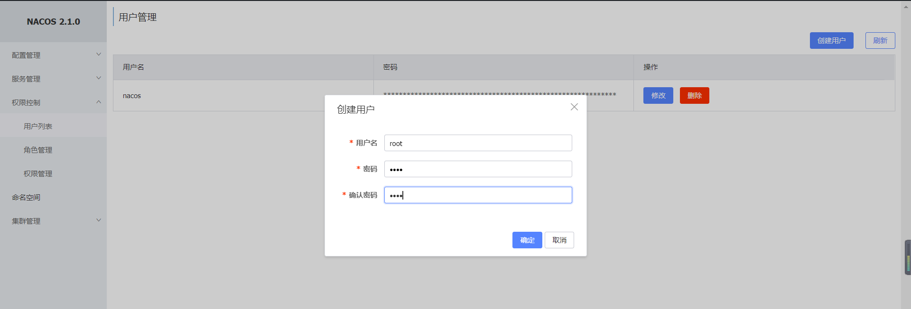


```mysql
-- 根据用户名查询用户
SELECT * FROM `users` WHERE username = 'root';
```


## 发布配置


### 登录系统


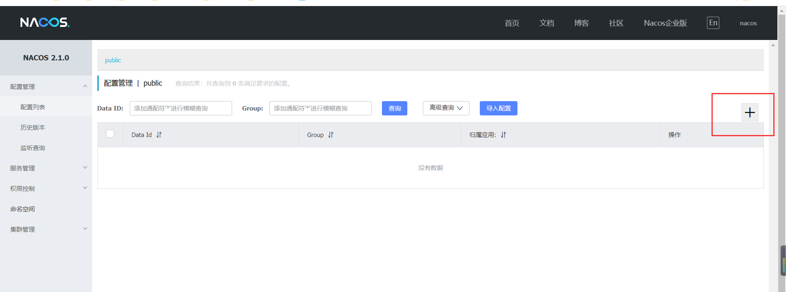


### 新建配置并发布


> 除了Group：其他的都是可以自定义的，这个Group属性后面说的

| key  | value |
| ---- | ----- |
|      |       |


### 查看


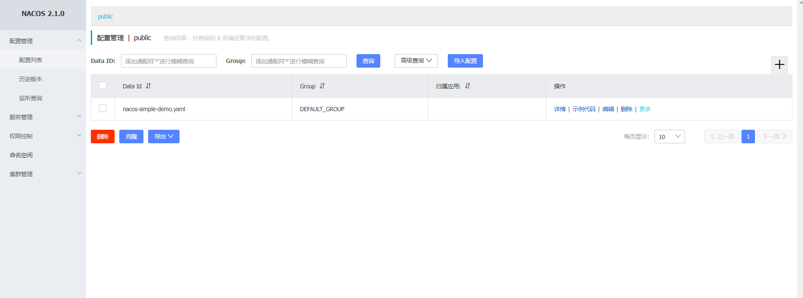


### 注意


<font color='red'>**Data ID**必须是英文</font>


## nacos客户端获取配置


### 新建父工程cloud-nacos


```xml
<?xml version="1.0" encoding="UTF-8"?>
<project xmlns="http://maven.apache.org/POM/4.0.0"
         xmlns:xsi="http://www.w3.org/2001/XMLSchema-instance"
         xsi:schemaLocation="http://maven.apache.org/POM/4.0.0 http://maven.apache.org/xsd/maven-4.0.0.xsd">
    <parent>
        <artifactId>spring-cloud</artifactId>
        <groupId>com.xht.example.cloud</groupId>
        <version>1.0-SNAPSHOT</version>
    </parent>
    <modelVersion>4.0.0</modelVersion>
    <artifactId>cloud-nacos</artifactId>
    <packaging>pom</packaging>
    <modules>
        <module>cloud-nacos-client</module>
    </modules>
    <properties>
        <maven.compiler.source>11</maven.compiler.source>
        <maven.compiler.target>11</maven.compiler.target>
    </properties>
</project>
```


### 新建子工程cloud-nacos-client


```xml
<?xml version="1.0" encoding="UTF-8"?>
<project xmlns="http://maven.apache.org/POM/4.0.0"
         xmlns:xsi="http://www.w3.org/2001/XMLSchema-instance"
         xsi:schemaLocation="http://maven.apache.org/POM/4.0.0 http://maven.apache.org/xsd/maven-4.0.0.xsd">
    <parent>
        <artifactId>cloud-nacos</artifactId>
        <groupId>com.xht.example.cloud</groupId>
        <version>1.0-SNAPSHOT</version>
    </parent>
    <modelVersion>4.0.0</modelVersion>
    <artifactId>cloud-nacos-client</artifactId>
    <properties>
        <maven.compiler.source>11</maven.compiler.source>
        <maven.compiler.target>11</maven.compiler.target>
    </properties>
    <dependencies>
        <dependency>
            <groupId>com.alibaba.nacos</groupId>
            <artifactId>nacos-client</artifactId>
            <version>2.1.0</version>
        </dependency>
        <dependency>
            <groupId>org.slf4j</groupId>
            <artifactId>slf4j-api</artifactId>
            <version>2.0.0-alpha7</version>
        </dependency>
        <dependency>
            <groupId>commons-logging</groupId>
            <artifactId>commons-logging</artifactId>
            <version>1.2</version>
        </dependency>
    </dependencies>
</project>
```


### NacosClient.java


```java
package com.it;
import com.alibaba.nacos.api.NacosFactory;
import com.alibaba.nacos.api.config.ConfigService;
import com.alibaba.nacos.api.exception.NacosException;
import java.util.Properties;
/**
 * 描述 ：
 *
 * @author : 小糊涂
 * @version : 1.0
 **/
public class NacosClient {
    public static void main(String[] args) throws NacosException {
        //nacos 地址
        String serverAddr = "192.168.100.100:8848";
        //Data Id
        String dataId = "nacos-simple-demo.yaml";
        //Group
        String group = "DEFAULT_GROUP";
        Properties properties = new Properties();
        properties.put("serverAddr", serverAddr);
        ConfigService configService = NacosFactory.createConfigService(properties);
        //获取配置, String dataId, String group,long timeoutMs
        String content = configService.getConfig(dataId, group, 5000);
        System.out.println(content);
    }
}
```


### 测试


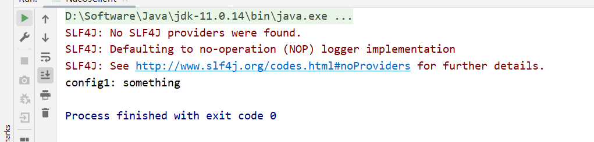


## pom依赖


```xml
<!--nacos注册中心-->
<dependency>
    <groupId>com.alibaba.cloud</groupId>
    <artifactId>spring-cloud-starter-alibaba-nacos-config</artifactId>
</dependency>
<!--nacos服务发现-->
<dependency>
    <groupId>com.alibaba.cloud</groupId>
    <artifactId>spring-cloud-starter-alibaba-nacos-discovery</artifactId>
</dependency>
```


## 服务提供者注册Nacos


### cloud-nacos-provider8010


```xml
<?xml version="1.0" encoding="UTF-8"?>
<project xmlns="http://maven.apache.org/POM/4.0.0"
         xmlns:xsi="http://www.w3.org/2001/XMLSchema-instance"
         xsi:schemaLocation="http://maven.apache.org/POM/4.0.0 http://maven.apache.org/xsd/maven-4.0.0.xsd">
    <parent>
        <artifactId>cloud-nacos</artifactId>
        <groupId>com.xht.example.cloud</groupId>
        <version>1.0-SNAPSHOT</version>
    </parent>
    <modelVersion>4.0.0</modelVersion>

    <artifactId>cloud-nacos-provider8010</artifactId>

    <properties>
        <maven.compiler.source>11</maven.compiler.source>
        <maven.compiler.target>11</maven.compiler.target>
    </properties>
    <dependencies>
        <dependency>
            <groupId>com.alibaba.cloud</groupId>
            <artifactId>spring-cloud-starter-alibaba-nacos-config</artifactId>
        </dependency>
        <dependency>
            <groupId>com.alibaba.cloud</groupId>
            <artifactId>spring-cloud-starter-alibaba-nacos-discovery</artifactId>
        </dependency>
        <!-- SpringBoot整合Web组件 -->
        <dependency>
            <groupId>org.springframework.boot</groupId>
            <artifactId>spring-boot-starter-web</artifactId>
        </dependency>
        <dependency>
            <groupId>org.springframework.boot</groupId>
            <artifactId>spring-boot-starter-actuator</artifactId>
        </dependency>
        <!--日常通用jar包配置-->
        <dependency>
            <groupId>org.springframework.boot</groupId>
            <artifactId>spring-boot-devtools</artifactId>
            <scope>runtime</scope>
            <optional>true</optional>
        </dependency>
    </dependencies>
</project>
```


### 启动类


```java
package com.it.xht.nacos;
import org.springframework.boot.SpringApplication;
import org.springframework.boot.autoconfigure.SpringBootApplication;
import org.springframework.cloud.client.discovery.EnableDiscoveryClient;
/**
 * 描述 ：
 * @author : 小糊涂
 * @version : 1.0
 **/
@EnableDiscoveryClient //注册与发现nacos
@SpringBootApplication
public class NacosProviderApp8010 {
    public static void main(String[] args) {
        SpringApplication.run(NacosProviderApp8010.class, args);
    }
}
```


### TestController


```java
package com.it.xht.nacos.controller;
import org.springframework.beans.factory.annotation.Value;
import org.springframework.web.bind.annotation.GetMapping;
import org.springframework.web.bind.annotation.PathVariable;
import org.springframework.web.bind.annotation.RestController;
/**
 * 描述 ：
 * @author : 小糊涂
 * @version : 1.0
 **/
@RestController
public class TestController {
    @Value("${server.port}")
    private String serverPort;

    @GetMapping(value = "/payment/nacos/{id}")
    public String getPayment(@PathVariable("id") Integer id)
    {
        return "nacos registry, serverPort: "+ serverPort+"\t id"+id;
    }
}
```


### application.yml


```java
server:
  port: 8010

spring:
  application:
    name: cloud-nacos-provider
  cloud:
    nacos:
      discovery:
        server-addr: 192.168.100.100:8848 #nacos地址
```


### 测试


查看nacos

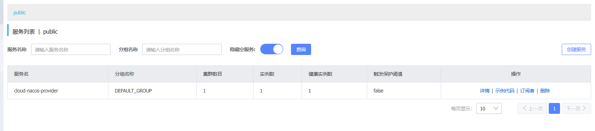


访问： http://localhost:8010/payment/nacos/13


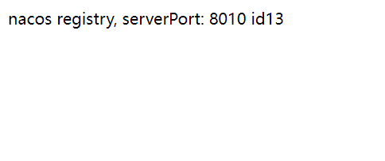


## 服务消费者注册Nacos


### cloud-nacos-cosumer80


```xml
<?xml version="1.0" encoding="UTF-8"?>
<project xmlns="http://maven.apache.org/POM/4.0.0"
         xmlns:xsi="http://www.w3.org/2001/XMLSchema-instance"
         xsi:schemaLocation="http://maven.apache.org/POM/4.0.0 http://maven.apache.org/xsd/maven-4.0.0.xsd">
    <parent>
        <artifactId>cloud-nacos</artifactId>
        <groupId>com.xht.example.cloud</groupId>
        <version>1.0-SNAPSHOT</version>
    </parent>
    <modelVersion>4.0.0</modelVersion>

    <artifactId>cloud-nacos-cosumer80</artifactId>

    <properties>
        <maven.compiler.source>11</maven.compiler.source>
        <maven.compiler.target>11</maven.compiler.target>
    </properties>
    <dependencies>
        <dependency>
            <groupId>com.alibaba.cloud</groupId>
            <artifactId>spring-cloud-starter-alibaba-nacos-config</artifactId>
        </dependency>
        <dependency>
            <groupId>com.alibaba.cloud</groupId>
            <artifactId>spring-cloud-starter-alibaba-nacos-discovery</artifactId>
        </dependency>
        <!-- SpringBoot整合Web组件 -->
        <dependency>
            <groupId>org.springframework.boot</groupId>
            <artifactId>spring-boot-starter-web</artifactId>
        </dependency>
        <dependency>
            <groupId>org.springframework.boot</groupId>
            <artifactId>spring-boot-starter-actuator</artifactId>
        </dependency>
        <!--日常通用jar包配置-->
        <dependency>
            <groupId>org.springframework.boot</groupId>
            <artifactId>spring-boot-devtools</artifactId>
            <scope>runtime</scope>
            <optional>true</optional>
        </dependency>

        <!--openfeign-->
        <dependency>
            <groupId>org.springframework.cloud</groupId>
            <artifactId>spring-cloud-starter-openfeign</artifactId>
        </dependency>
        <dependency>
            <groupId>org.springframework.cloud</groupId>
            <artifactId>spring-cloud-starter-loadbalancer</artifactId>
        </dependency>
        <dependency>
            <groupId>org.springframework.cloud</groupId>
            <artifactId>spring-cloud-starter-loadbalancer</artifactId>
        </dependency>
    </dependencies>
</project>
```


### 启动类


```java
package com.it.xht.nacos;
import org.springframework.boot.SpringApplication;
import org.springframework.boot.autoconfigure.SpringBootApplication;
import org.springframework.cloud.client.discovery.EnableDiscoveryClient;
import org.springframework.cloud.openfeign.EnableFeignClients;
/**
 * 描述 ：
 *
 * @author : 小糊涂
 * @version : 1.0
 **/
@EnableDiscoveryClient
@SpringBootApplication
@EnableFeignClients
public class NacosConsumer80 {
    public static void main(String[] args) {
        SpringApplication.run(NacosConsumer80.class, args);
    }
}
```


### application.yml


```yaml
server:
  port: 80

spring:
  application:
    name: cloud-nacos-cosumer80
  cloud:
    nacos:
      discovery:
        server-addr: 192.168.100.100:8848

 # 消费者将要去访问的微服务名称(注册成功进nacos的微服务提供者)
service-url:
  nacos-user-service: http://cloud-nacos-provider8010
```


### RestTemplateConfig


```java
package com.it.xht.nacos.config;

import org.springframework.cloud.client.loadbalancer.LoadBalanced;
import org.springframework.context.annotation.Bean;
import org.springframework.context.annotation.Configuration;
import org.springframework.web.client.RestTemplate;

/**
 * 描述 ：
 *
 * @author : 小糊涂
 * @version : 1.0
 **/
@Configuration
public class RestTemplateConfig {
    @Bean
    @LoadBalanced
    public RestTemplate restTemplate() {
        return new RestTemplate();
    }
}
```


### TestFegin


```java
package com.it.xht.nacos.fegin;

import org.springframework.cloud.openfeign.FeignClient;
import org.springframework.web.bind.annotation.GetMapping;
import org.springframework.web.bind.annotation.PathVariable;

/**
 * 描述 ：
 *
 * @author : 小糊涂
 * @version : 1.0
 **/
@FeignClient(value = "cloud-nacos-provider")
public interface TestFegin {
    @GetMapping(value = "/payment/nacos/{id}")
    public String getPayment(@PathVariable("id") Integer id);

}
```

 

### TestController


```java
package com.it.xht.nacos.controller;

import com.it.xht.nacos.fegin.TestFegin;
import org.springframework.beans.factory.annotation.Autowired;
import org.springframework.beans.factory.annotation.Value;
import org.springframework.web.bind.annotation.GetMapping;
import org.springframework.web.bind.annotation.PathVariable;
import org.springframework.web.bind.annotation.RestController;
import org.springframework.web.client.RestTemplate;

/**
 * 描述 ：
 *
 * @author : 小糊涂
 * @version : 1.0
 **/
@RestController
public class TestController {
    @Autowired
    private RestTemplate restTemplate;

    @Value("${service-url.nacos-user-service}")
    private String serverURL;

    @Autowired
    private TestFegin testFegin;

    @GetMapping("/consumer/payment/nacos/{id}")
    public String paymentInfo(@PathVariable("id") Integer id) {
        return restTemplate.getForObject(serverURL + "/payment/nacos/" + id, String.class);
    }

    @GetMapping("/consumer/payment/nacos/fegin/{id}")
    public String paymentInfoFegin(@PathVariable("id") Integer id) {
        return testFegin.getPayment(id);
    }
}
```


### 测试


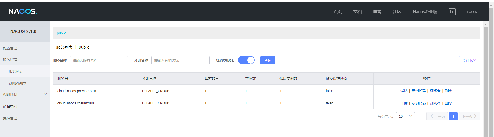


http://localhost/consumer/payment/nacos/13


## 负载均衡


### 创建cloud-nacos-provider8011


复制cloud-nacos-provider8010项目，更改项目中的端口为8011

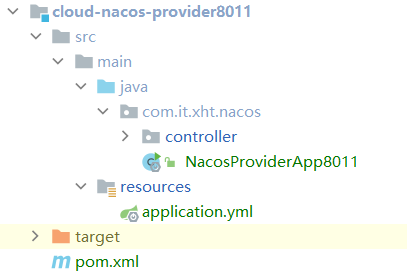


### 测试


访问：http://localhost/consumer/payment/nacos/fegin/13

我们发现：nacos默认的负载策略是轮询


### nacos的负载策略来源


老版的是：ribbon


新版本的是：loadbalancer


```xml
<dependency>
    <groupId>org.springframework.cloud</groupId>
    <artifactId>spring-cloud-starter-loadbalancer</artifactId>
</dependency>
```


## 接入nacos配置中心


### pom依赖


```xml
<!--nacos注册中心-->
<dependency>
    <groupId>com.alibaba.cloud</groupId>
    <artifactId>spring-cloud-starter-alibaba-nacos-config</artifactId>
</dependency>
```


### nacos添加一个配置


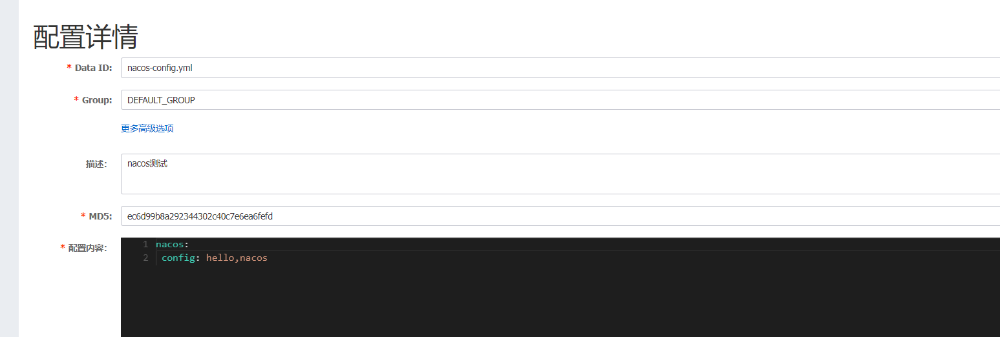


### cloud-nacos-config3377


```xml
<?xml version="1.0" encoding="UTF-8"?>
<project xmlns="http://maven.apache.org/POM/4.0.0"
         xmlns:xsi="http://www.w3.org/2001/XMLSchema-instance"
         xsi:schemaLocation="http://maven.apache.org/POM/4.0.0 http://maven.apache.org/xsd/maven-4.0.0.xsd">
    <parent>
        <artifactId>cloud-nacos</artifactId>
        <groupId>com.xht.example.cloud</groupId>
        <version>1.0-SNAPSHOT</version>
    </parent>
    <modelVersion>4.0.0</modelVersion>
    <artifactId>cloud-nacos-config3377</artifactId>
    <properties>
        <maven.compiler.source>11</maven.compiler.source>
        <maven.compiler.target>11</maven.compiler.target>
    </properties>
    <dependencies>
        <!--nacos注册中心-->
        <dependency>
            <groupId>com.alibaba.cloud</groupId>
            <artifactId>spring-cloud-starter-alibaba-nacos-config</artifactId>
        </dependency>
        <!--nacos服务发现-->
        <dependency>
            <groupId>com.alibaba.cloud</groupId>
            <artifactId>spring-cloud-starter-alibaba-nacos-discovery</artifactId>
        </dependency>
        <!-- SpringBoot整合Web组件 -->
        <dependency>
            <groupId>org.springframework.boot</groupId>
            <artifactId>spring-boot-starter-web</artifactId>
        </dependency>
        <dependency>
            <groupId>org.springframework.boot</groupId>
            <artifactId>spring-boot-starter-actuator</artifactId>
        </dependency>
        <!--日常通用jar包配置-->
        <dependency>
            <groupId>org.springframework.boot</groupId>
            <artifactId>spring-boot-devtools</artifactId>
            <scope>runtime</scope>
            <optional>true</optional>
        </dependency>
        <dependency>
            <groupId>org.springframework.cloud</groupId>
            <artifactId>spring-cloud-starter-bootstrap</artifactId>
        </dependency>
    </dependencies>
</project>
```


### Config3377App


```java
@SpringBootApplication
@EnableDiscoveryClient
public class Config3377App {
    public static void main(String[] args) {
        SpringApplication.run(Config3377App.class, args);
    }
}
```


### ConfigClientController


```java
@RestController
@RefreshScope //在控制器类加入@RefreshScope注解使当前类下的配置支持Nacos的动态刷新功能。
public class ConfigClientController
{
    @Value("${nacos.info}")
    private String configInfo;

    @GetMapping("/config/info")
    public String getConfigInfo() {
        return configInfo;
    }
}
```


### bootstrap.yml


```yaml
server:
  port: 3377

spring:
  application:
    name: nacos-config
  cloud:
    nacos:
      discovery:
        server-addr: 192.168.100.100:8848
      config:
        server-addr: 192.168.100.100:8848
        file-extension: yml
```


### 测试


访问：http://localhost:3377/config/info


## @RefreshScope


### 简介


其中通过@Value注解，去读取key为nacosconfig的配置的值，并通过/getValue接口返回。加入@RefreshScope注解，可以使当前类下的配置支持动态更新。


### 大体流程


1. 需要动态刷新的类标注@RefreshScope 注解
2. @RefreshScope 注解标注了@Scope 注解，并默认了ScopedProxyMode.TARGET_CLASS; 属性，此属性的功能就是在创建一个代理，在每次调用的时候都用它来调用GenericScope get 方法来获取对象
3. 如属性发生变更会调用 ContextRefresher refresh() ->RefreshScope refreshAll() 进行缓存清理方法调用，并发送刷新事件通知 -> GenericScope 真正的 清理方法destroy() 实现清理缓存
4. 在下一次使用对象的时候，会调用GenericScope get(String name, ObjectFactory<?> objectFactory) 方法创建一个新的对象，并存入缓存中，此时新对象因为Spring 的装配机制就是新的属性了


### 源码


```java
/**
 * Convenience annotation to put a <code>@Bean</code> definition in
 * {@link org.springframework.cloud.context.scope.refresh.RefreshScope refresh scope}.
 * Beans annotated this way can be refreshed at runtime and any components that are using
 * them will get a new instance on the next method call, fully initialized and injected
 * with all dependencies.
 * @author Dave Syer
 */
@Target({ ElementType.TYPE, ElementType.METHOD })
@Retention(RetentionPolicy.RUNTIME)
@Scope("refresh")
@Documented
public @interface RefreshScope {

   /**
    * @see Scope#proxyMode()
    * @return proxy mode
    */
   ScopedProxyMode proxyMode() default ScopedProxyMode.TARGET_CLASS;

}
```


### @Scope


可以看出，它使用就是 @Scope ，其内部就一个属性默认 ScopedProxyMode.TARGET_CLASS。知道了是通过Spring Scope 来实现的那就简单了，我们来看下Scope 这个接口

```java
public interface Scope {

	/**
	 * Return the object with the given name from the underlying scope,
	 * {@link org.springframework.beans.factory.ObjectFactory#getObject() creating it}
	 * if not found in the underlying storage mechanism.
	 * <p>This is the central operation of a Scope, and the only operation
	 * that is absolutely required.
	 * @param name the name of the object to retrieve
	 * @param objectFactory the {@link ObjectFactory} to use to create the scoped
	 * object if it is not present in the underlying storage mechanism
	 * @return the desired object (never {@code null})
	 * @throws IllegalStateException if the underlying scope is not currently active
	 */
	Object get(String name, ObjectFactory<?> objectFactory);

 
	@Nullable
	Object remove(String name);

 
	void registerDestructionCallback(String name, Runnable callback);

 
	@Nullable
	Object resolveContextualObject(String key);

	 
	@Nullable
	String getConversationId();

}
```


看下接口，我们只看Object get(String name, ObjectFactory<?> objectFactory); 这个方法帮助我们来创建一个新的bean ，也就是说，@RefreshScope 在调用 刷新的时候会使用此方法来给我们创建新的对象，这样就可以通过spring 的装配机制将属性重新注入了，也就实现了所谓的动态刷新。


### 那它究竟是怎么处理老的对象，又怎么除法创建新的对象呢？


GenericScope 实现了get方法

```java
@Override
public Object get(String name, ObjectFactory<?> objectFactory) {
	BeanLifecycleWrapper value = this.cache.put(name,
			new BeanLifecycleWrapper(name, objectFactory));
	locks.putIfAbsent(name, new ReentrantReadWriteLock());
	try {
		return value.getBean();
	}
	catch (RuntimeException e) {
		this.errors.put(name, e);
		throw e;
	}
}
```


缓存清理方法


```java
@Override
	public void destroy() {
		List<Throwable> errors = new ArrayList<Throwable>();
		Collection<BeanLifecycleWrapper> wrappers = this.cache.clear();
		for (BeanLifecycleWrapper wrapper : wrappers) {
			try {
				Lock lock = locks.get(wrapper.getName()).writeLock();
				lock.lock();
				try {
					wrapper.destroy();
				}
				finally {
					lock.unlock();
				}
			}
			catch (RuntimeException e) {
				errors.add(e);
			}
		}
		if (!errors.isEmpty()) {
			throw wrapIfNecessary(errors.get(0));
		}
		this.errors.clear();
	}
```


*ContextRefresher 调用refresh方法进行清理key*


````java
public synchronized Set<String> refresh() {
		Set<String> keys = refreshEnvironment();
		this.scope.refreshAll();
		return keys;
	}
````


## dataId规范


在 `bootstrap.properties` 中配置 Nacos server 的地址和应用名

```properties
spring.cloud.nacos.config.server-addr=127.0.0.1:8848
spring.application.name=example
```

说明：之所以需要配置 `spring.application.name` ，是因为它是构成 Nacos 配置管理 `dataId`字段的一部分。

在 Nacos Spring Cloud 中，`dataId` 的完整格式如下：

```java
${prefix}-${spring.profiles.active}.${file-extension}
```


| 字段值                 | 解析                                                         |
| ---------------------- | ------------------------------------------------------------ |
| prefix                 | 默认为 `spring.application.name` 的值，也可以通过配置项 `spring.cloud.nacos.config.prefix`来配置。 |
| spring.profiles.active | 即为当前环境对应的 profile，详情可以参考 [Spring Boot文档](https://docs.spring.io/spring-boot/docs/current/reference/html/boot-features-profiles.html#boot-features-profiles)。 **注意：当 `spring.profiles.active` 为空时，对应的连接符 `-` 也将不存在，dataId 的拼接格式变成 `${prefix}.${file-extension}`** |
| file-extension         | 为配置内容的数据格式，可以通过配置项 `spring.cloud.nacos.config.file-extension` 来配置。目前只支持 `properties` 和 `yaml` 类型。 |


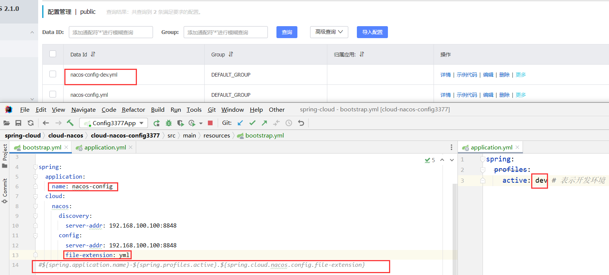


## 多环境多项目问题


> 问题1：

实际开发中，通常一个系统会准备

dev开发环境

test测试环境

prod生产环境。
如何保证指定环境启动时服务能正确读取到Nacos上相应环境的配置文件呢？

> 问题2：

一个大型分布式微服务系统会有很多微服务子项目，

每个微服务项目又都会有相应的开发环境、测试环境、预发环境、正式环境......

那怎么对这些微服务配置进行管理呢？


## Nacos的图形化管理界面


## Namespace+Group+Data ID


### 命名空间（Namespace）


用于进行租户粒度的配置隔离。不同的命名空间下，可以存在相同的 Group 或 Data ID 的配置。Namespace 的常用场景之一是不同环境的配置的区分隔离，例如开发测试环境和生产环境的资源（如数据库配置、限流阈值、降级开关）隔离等。如果在没有指定 Namespace 的情况下，默认使用 public 命名空间。


### 配置组（Group）


Nacos 中的一组配置集，是配置的维度之一。通过一个有意义的字符串（如 ABTest 中的实验组、对照组）对配置集进行分组，从而区分 Data ID 相同的配置集。当您在 Nacos 上创建一个配置时，如果未填写配置分组的名称，则配置分组的名称默认采用 DEFAULT_GROUP 。配置分组的常见场景：不同的应用或组件使用了相同的配置项，如 database_url 配置和 MQ_Topic 配置。


### 配置ID（Data ID）


Nacos 中的某个配置集的 ID。配置集 ID 是划分配置的维度之一。Data ID 通常用于划分系统的配置集。一个系统或者应用可以包含多个配置集，每个配置集都可以被一个有意义的名称标识。Data ID 尽量保障全局唯一，可以参考 Nacos Spring Cloud 中的命名规则：

```java
${prefix}-${spring.profiles.active}-${file-extension}
```


### 总结


默认情况：
Namespace=public，Group=DEFAULT_GROUP, 默认Cluster是DEFAULT

Nacos默认的命名空间是public，Namespace主要用来实现隔离。
比方说我们现在有三个环境：开发、测试、生产环境，我们就可以创建三个Namespace，不同的Namespace之间是隔离的。

Group默认是DEFAULT_GROUP，Group可以把不同的微服务划分到同一个分组里面去

Service就是微服务；一个Service可以包含多个Cluster（集群），Nacos默认Cluster是DEFAULT，Cluster是对指定微服务的一个虚拟划分。
比方说为了容灾，将Service微服务分别部署在了杭州机房和广州机房，
这时就可以给杭州机房的Service微服务起一个集群名称（HZ），
给广州机房的Service微服务起一个集群名称（GZ），还可以尽量让同一个机房的微服务互相调用，以提升性能。

最后是Instance，就是微服务的实例。


## 多环境之dataId


### 复制项目


复制项目 `cloud-nacos-config3377`为` cloud-nacos-configdataId3378`

启动类名字改成：`Config3378App`

依赖相同

### bootstrap.yml


```yaml
server:
  port: 3378

spring:
  application:
    name: nacos-config-dataId
  cloud:
    nacos:
      discovery:
        server-addr: 192.168.100.100:8848
      config:
        server-addr: 192.168.100.100:8848
        file-extension: yml
#${spring.application.name}-${spring.profiles.active}.${spring.cloud.nacos.config.file-extension}
```


### application.yml


```yaml
spring:
  profiles:
    active: test # 表示开发环境
```


### nacos配置


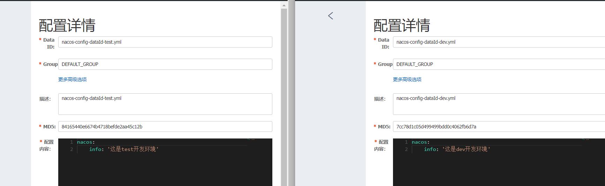


### 测试


我们修改`application.yml`文件的`active`值：

然后访问：http://localhost:3378/config/info


观察显示的结果


## 多环境之Group


### 复制项目


复制项目 `cloud-nacos-config3377`为` cloud-nacos-configgroup3379`

启动类名字改成：`Config3379App`

依赖相同


### bootstrap.yml


```yaml
server:
  port: 3379

spring:
  application:
    name: nacos-config-group
  cloud:
    nacos:
      discovery:
        server-addr: 192.168.100.100:8848
      config:
        server-addr: 192.168.100.100:8848
        file-extension: yml
        group: TEST_GROUP
#${spring.application.name}-${spring.profiles.active}.${spring.cloud.nacos.config.file-extension}
```


### application.yml


```yaml
# 没有内容
```


### nacos配置新增Group


新建立两个：dataId为`nacos-config-group`的配置，但是分组不一样：`DEV_GROUP,TEST_GROUP`


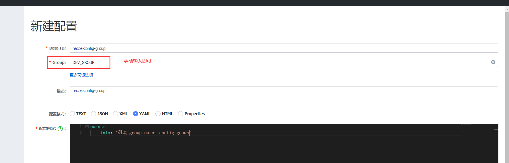


### 测试


我们修改`application.yml`文件的`group`值：`DEV_GROUP`,`TEST_GROUP`

然后访问：http://localhost:3379/config/info


观察显示的结果


## 多环境之Namespace


### 复制项目


复制项目 `cloud-nacos-config3377`为` cloud-nacos-configgroup3379`

启动类名字改成：`Config3379App`

依赖相同


### bootstrap.yml


```yaml
server:
  port: 3380

spring:
  application:
    name: nacos-config-namespace
  cloud:
    nacos:
      discovery:
        server-addr: 192.168.100.100:8848
      config:
        server-addr: 192.168.100.100:8848
        file-extension: yml
        namespace: fae6d7e4-dc79-4d32-8212-b9480d4b21bf
#${spring.application.name}-${spring.profiles.active}.${spring.cloud.nacos.config.file-extension}
```


### application.yml


```yaml
# 没有内容
```


### nacos配置新增Namespace


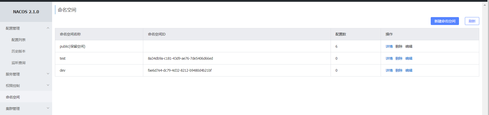


然后在每一个命名空间中建立：`nacos-config-namespace.yml`配置


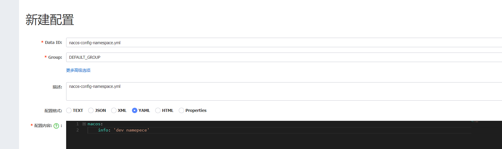

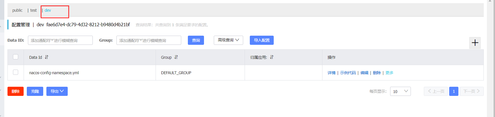


### 测试


我们修改`application.yml`文件的`namespace`值：

然后访问：http://localhost:3380/config/info


观察显示的结果


## 多环境-总结


+ DataID: 适用于项目不多，服务量少的情况。
+ Group：实现方式简单，但是容易与DataID方案发生冲突，仅适合于本地调试
+ Namespace：实现方式简单，配置管理简单灵活，同时可以结合DataID共同使用，推荐这种方案


## 共享配置


### 场景描述


一个项目中服务数量增加后，配置文件相应增加，多个配置文件中会存在相同的配置，那么我们可以将相同的配置独立出来，作为该项目中各个服务的共享配置文件，每个服务都可以通过Nacos进行共享配置的读取


### 环境准备


命令行运行以下命令

```shell
curl -X POST "http://192.168.100.100:8848/nacos/v1/cs/configs?dataId=config1.yml&group=DEFAULT_GROUP&content=HelloWorld"
curl -X POST "http://192.168.100.100:8848/nacos/v1/cs/configs?dataId=config2.yml&group=DEFAULT_GROUP&content=HelloWorld"
curl -X POST "http://192.168.100.100:8848/nacos/v1/cs/configs?dataId=config3.yml&group=DEFAULT_GROUP3&content=HelloWorld"
curl -X POST "http://192.168.100.100:8848/nacos/v1/cs/configs?dataId=config4.yml&group=DEFAULT_GROUP4&content=HelloWorld"
curl -X POST "http://192.168.100.100:8848/nacos/v1/cs/configs?dataId=config5.yml&group=DEFAULT_GROUP5&content=HelloWorld"
curl -X POST "http://192.168.100.100:8848/nacos/v1/cs/configs?dataId=config6.yml&group=DEFAULT_GROUP6&content=HelloWorld"
curl -X POST "http://192.168.100.100:8848/nacos/v1/cs/configs?dataId=config7.yml&group=DEFAULT_GROUP7&content=HelloWorld"
curl -X POST "http://192.168.100.100:8848/nacos/v1/cs/configs?dataId=config8.yml&group=DEFAULT_GROUP8&content=HelloWorld"
curl -X POST "http://192.168.100.100:8848/nacos/v1/cs/configs?dataId=config9.yml&group=DEFAULT_GROUP9&content=HelloWorld"
```


然后修改每一个配置如下：内容写成和dataId一样的配置，只是区别不同

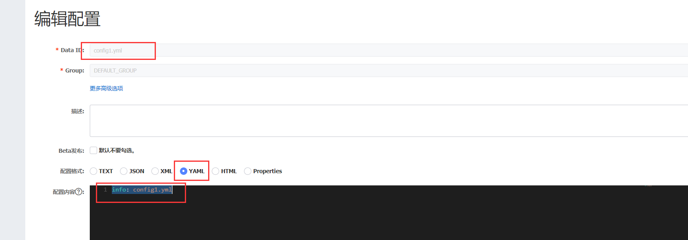


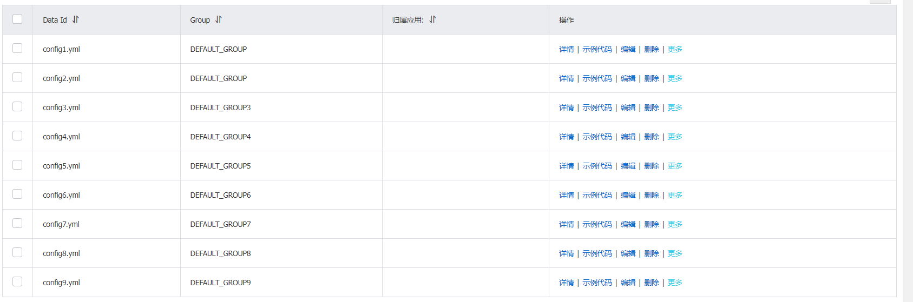


### bootstarp.yml


```yaml
spring:
  application:
    name: nacos-config-namespace
  cloud:
    nacos:
      discovery:
        server-addr: 192.168.100.100:8848
      config:
        server-addr: 192.168.100.100:8848
        file-extension: yml
#        namespace: fae6d7e4-dc79-4d32-8212-b9480d4b21bf
#        老版本的动态刷新+配置
        shared-dataids: config1.yml,config2.yml
        refreshable-dataids: config1.yml
#        新版本的动态刷新+配置
        shared-configs:
          - data-id: config3.yml
            group: DEFAULT_GROUP3
            refresh: true # 动态刷新 开启true默认false
          - data-id: config4.yml
            group: DEFAULT_GROUP4
            refresh: false # 动态刷新 开启true默认false
#        老版本的动态刷新 + 配置  + 分组
        ext-config:
          - data-id: config5.yml
            group: DEFAULT_GROUP5
            refresh: true # 动态刷新 开启true默认false
          - data-id: config6.yml
            group: DEFAULT_GROUP6
            refresh: false # 动态刷新 开启true默认false
#       新版版本的动态刷新+配置 + 分组
        extension-configs:
          - data-id: config7.yml
            group: DEFAULT_GROUP7
            refresh: true # 动态刷新 开启true默认false
          - data-id: config8.yml
            group: DEFAULT_GROUP8
            refresh: false # 动态刷新 开启true默认false
```


### Controller


```java
    @Value("${info}")
    private String info;
    @GetMapping("/info")
    public String getINfo() {
        return info;
    }
```


### 测试


切换配置，更改配置来做测试


### 总结


上面的demo已经演示Nacos共享配置的两种实现方式，两种方式针对不同的场景，总结如下：

+ shared-dataids方式：
  + 适合于共享配置文件与项目默认配置文件处于相同Group时，直接两条命令就可以搞定
  + 优点：配置方便
  + 缺点：只能在同一Group中
+ ext-config方式：
  + 它可以由开发者自定义要读取的共享配置文件的DataId、Group、refresh属性，这样刚好解决了shared-dataids存在的局限性。
  + 优点：可以与shared-dataids方案结合使用，用户自定义配置。灵活性强
  + 缺点：配置容易出错，要熟悉YAML语法


## 关闭配置中心


```java
spring:
  cloud:
    nacos:
      config:
        enabled: false
```


## 服务管理


### 服务管理列表


服务列表帮助用户以统一的视图管理其所有的微服务以及服务健康状态。整体界面布局是左上角有服务的搜索框和搜索按钮，页面中央是服务列表的展示。服务列表主要展示服务名、集群数目、实例数目、健康实例数目和详情按钮五个栏目。

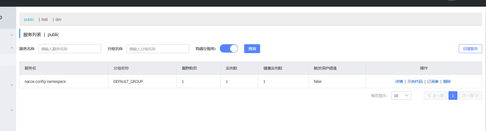


> 在服务列表页面点击详情，可以看到服务的详情。可以查看服务、集群和实例的基本信息。


### 服务流量权重支持及流量保护


Nacos为用户提供了流量权重控制的能力，同时开放了服务流量的阈值保护，以帮助用户更好的保护服务服务提供者集群不被意外打垮。如下图所以，可以点击实例的编辑按钮，修改实例的权重。如果想增加实例的流量，可以将权重调大，如果不想实例接收流量，则可以将权重设为0。

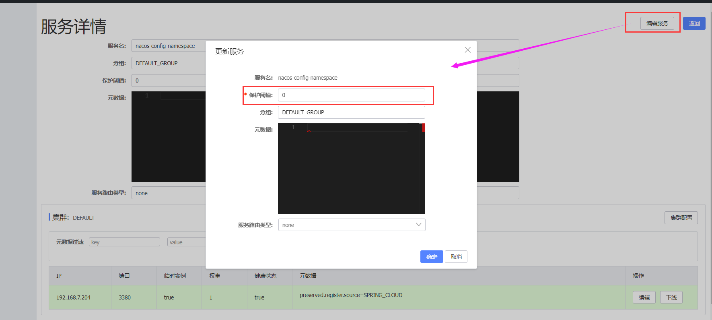


### 服务元数据管理


Nacos提供多个维度的服务元数据的暴露，帮助用户存储自定义的信息。这些信息都是以K-v的数据结构存储，在控制台上，会以k1=v1k2=v2这样的格式展示。类似的，编辑元数据可以通过相同的格式进行。例如服务的元数据编辑，首先点击服务详情页右上角的“编辑服务"按钮，然后在元数据输入框输入: `version=1.0`。

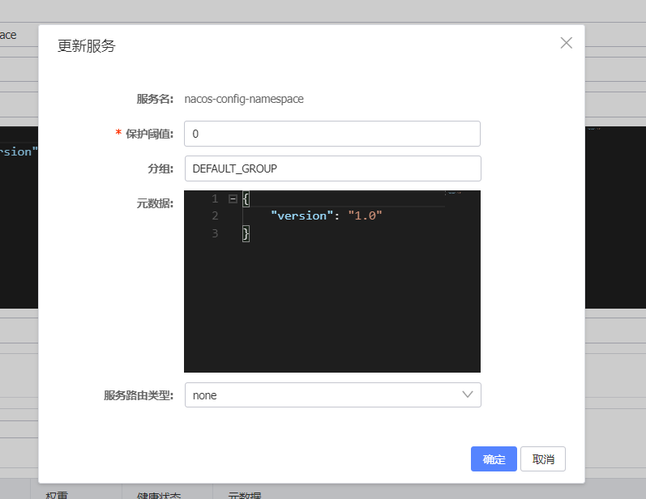


点击确认，就可以在服务详情页面，看到服务的元数据已经更新了。


## 保护阈值


### 简介


**保护阈值（ProtectThreshold）：为了防止因过多实例故障，导致所有流量全部流入剩余健康实例，继而造成流量压力将剩余健康实例被压垮形成雪崩效应。应将健康保护阈值定义为⼀个 0 到 1 之间的浮点数。当域名健康实例数占总服务实例数的比例小于该值时，无论实例是否健康，都会将这个（健康或不健康的）实例返回给客户端。这样做虽然损失了⼀部分流量，但是保证了集群中剩余健康实例能正常工作**


也就是说，保护阈值是设置集群中健康实例占比允许的最小值，它需要设置一个 0-1 的浮点值，默认值为 0，当集群中的健康实例占比小于设置的保护阈值时，就会触发阈值保护功能。保护阈值可在服务详情中查询和设置，如下图所示：

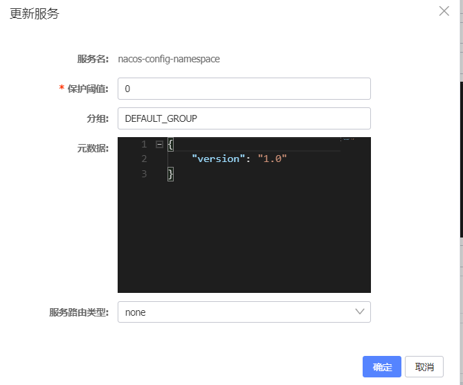

### 如何理解保护阈值


**要理解保护阈值先要明确一个前提条件：对于 Nacos 的注册中心功能来说，Nacos 有一个天然的职责，是将服务消费者（Consumer）的请求转发给某个健康的服务提供者（Provider）。** 但在执行的流程中，可能会出现一种极端的情况，比如某个服务有 100 个实例，其中 99 个实例都宕机了，只剩下一个健康的实例，这个时候如果把所有的请求都转发到这一个健康实例上就会造成雪崩效应，最终导致业务系统崩溃。 为了防止这种极端情况，于是就有了“保护阈值”，保护阈值一旦被触发，那么 Nacos 将会把请求转发给所有服务实例，也就是健康实例+非健康实例，这样可能会损失了⼀部分流量，但能保证集群中剩余的健康实例能正常工作。

> 保护阈值触发条件：（实际健康实例/总服务实例）≤设置的保护阈值


### 总结


保护阈值是为了防止因过多实例故障，导致所有流量全部流入剩余健康实例，继而造成流量压力将剩余健康实例被压垮形成雪崩效应。它的默认值是 0，取值范围应该是 0-1 的浮点数。此值是定义集群中允许健康实例占比的最小值，如果实际健康服务占比小于或等于此值，就会触发保护阈值，那么 Nacos 就会将全部实例：健康实例 + 非健康实例全部返回给调用者，而当保护阈值未触发时，Nacos 只会把健康实例返回给调用者。 

+ 保护阈值的意义在于
  **当服务A健康实例数/总实例数 < 保护阈值 的时候，说明健康实例真的不多了，这个时候保护阈值会被触**
  **发（状态true）**
+ **nacos将会把该服务所有的实例信息（健康的+不健康的）全部提供给消费者，消费者可能访问到不健康**
  **的实例，请求失败，但这样也⽐造成雪崩要好，牺牲了⼀些请求，保证了整个系统的⼀个可⽤**


## Nacos集群部署


### 集群部署架构图


因此开源的时候推荐用户把所有服务列表放到一个vip下面，然后挂到一个域名下面

`http://ip1:port/openAPI `直连ip模式，机器挂则需要修改ip才可以使用。

`http://SLB:port/openAPI` 挂载SLB模式(内网SLB，不可暴露到公网，以免带来安全风险)，直连SLB即可，下面挂server真实ip，可读性不好。

`http://nacos.com:port/openAPI` 域名 + SLB模式(内网SLB，不可暴露到公网，以免带来安全风险)，可读性好，而且换ip方便，推荐模式


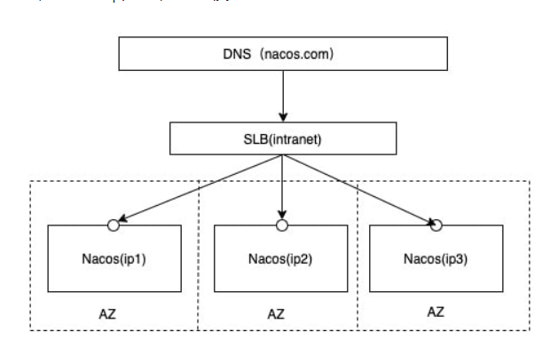

### 预备环境准备


请确保是在环境中安装使用:

1. 64 bit OS Linux/Unix/Mac，推荐使用Linux系统。
2. 64 bit JDK 1.8+；[下载](http://www.oracle.com/technetwork/java/javase/downloads/jdk8-downloads-2133151.html).[配置](https://docs.oracle.com/cd/E19182-01/820-7851/inst_cli_jdk_javahome_t/)。
3. Maven 3.2.x+；[下载](https://maven.apache.org/download.cgi).[配置](https://maven.apache.org/settings.html)。
4. 3个或3个以上Nacos节点才能构成集群。


### 下载源码或者安装包


你可以通过两种方式来获取 Nacos。

#### 从 Github 上下载源码方式


```bash
unzip nacos-source.zip
cd nacos/
mvn -Prelease-nacos clean install -U  
cd nacos/distribution/target/nacos-server-1.3.0/nacos/bin
```


#### 下载编译后压缩包方式


下载地址

[zip包](https://github.com/alibaba/nacos/releases/download/1.3.0/nacos-server-1.3.0.zip)

[tar.gz包](https://github.com/alibaba/nacos/releases/download/1.3.0/nacos-server-1.3.0.tar.gz)

```bash
unzip nacos-server-1.3.0.zip 或者 tar -xvf nacos-server-1.3.0.tar.gz
cd nacos/bin
```


### 准备虚拟机三台


+ 192.168.100.100 nginx
+ 192.168.100.201 nacos
+ 192.168.100.202 nacos
+ 192.168.100.203 nacos


### 安装nacos


分别向`192.168.100.201`,`192.168.100.202`,`192.168.100.203`三台机子上传nacos安装包


```java
tar -zxvf nacos-server-2.1.0.tar.gz    
cd /nacos/app/conf  
cp cluster.conf.example   cluster.conf
```


修改`conf`目录下的`application.properties`文件，让其支持持久化


```properties
### If use MySQL as datasource:
spring.datasource.platform=mysql
### Count of DB:
db.num=1
### Connect URL of DB:
db.url.0=jdbc:mysql://192.168.100.1:3306/xht-nacos?characterEncoding=utf8&connectTimeout=1000&socketTimeout=3000&autoReconnect=true&useUnicode=true&useSSL=false&serverTimezone=UTC
db.user.0=root
db.password.0=123456
```


修改`conf`目录下的`cluster.conf`文件，集群配置


```java
192.168.168.201:8848
192.168.168.202:8848
192.168.168.203:8848
```


### 启动集群


> 使用内置数据源

```bash
sh startup.sh -p embedded
```

> 使用外置数据源

```bash
sh startup.sh
```


### 配置nginx


```java
worker_processes  2;
events {
    worker_connections  1024;
}
http {
    include       mime.types;
    default_type  application/octet-stream;
    sendfile        on;
    keepalive_timeout  65;
    upstream cluster{
        server 192.168.100.201:8848;
        server 192.168.100.201:8848;
        server 192.168.100.201:8848;
    }
     server{
     	listen 80;
     	server_name 127.0.0.1;
        location / {
            #root   html;
            #index  index.html index.htm;
            proxy_pass http://cluster;
        }      
    }
}

```


### 查看集群信息


https://192.168.100.100/nacos

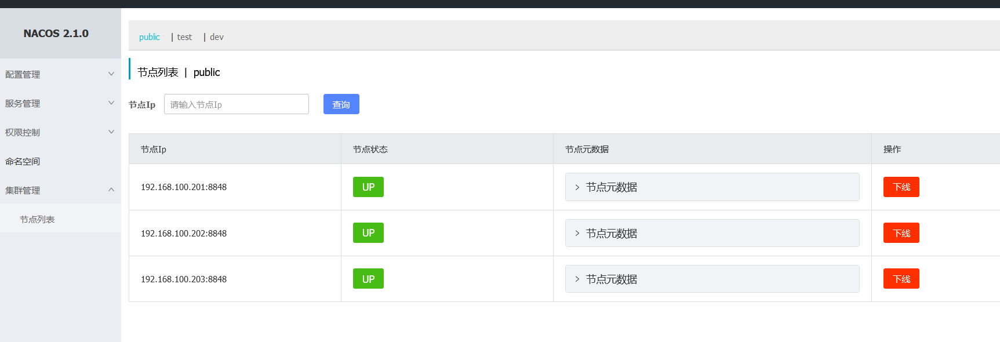


### springcloud连接集群


```java
spring:
  application:
    name: cloud-nacos-cosumer80
  cloud:
    nacos:
      discovery:
        server-addr: 192.168.100.100:80
```


