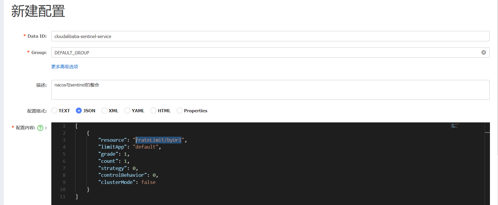

# Sentinel实现熔断与限流


> **Alibaba Sentinel是一款高性能且轻量级的流量控制，熔断降级可替换方案。**


## 简介


### Sentinel介绍


随着微服务的流行，服务和服务之间的稳定性变得越来越重要。Sentinel以流量为切入点，从流量控制，熔断降级，系统负载保护等多个维度保护服务的稳定性。


### Sentinel具有以下特征


- 丰富的应用场景：Sentinel承接了阿里巴巴近10年的双十一大促销流量的核心场景，例如秒杀（即突发流量控制再系统容量可以承受的范围），消息削峰填谷，集群流量控制，实时熔断下游不可用应用等。
- 完备的实时监控：Sentinel同时提供实时的监控功能，我们可以在控制台中看到接入应用的单台机器秒级数据，甚至500台以下规模的集群的汇总运行情况。
- 广泛的开源生态：Sentinel提供开箱即用的与其它开源框架/库的整合模块，例如与SpringCloud，Dubbo,gRPC的整合，我们只需要引入相应的依赖并进行简单的配置即可，快速接入Sentinel。
- 完善的SPI扩展点：Sentinel提供简单易用，完善的SPI扩展接口，我们可以通过实现扩展接口来快速的定制逻辑。例如定制规则管理，适配动态数据源等。


### Sentinel的历史


- 2012年，Sentinel诞生，主要功能为入口流量控制。
- 2013-2017年，Sentinel在阿里巴巴集团内部迅速发展，成为基础技术模块，覆盖了所有的核心场景。Sentinel也因此积累了大量的流量归整场景以及生产实践。
- 2018年，Sentinel开源，并持续演进。


## Sentinel和Hystrix


Hystrix的关注点在于隔离和熔断为主的容错机制，超时或被熔断的调用将会快速失败，并可以提供fallback机制。

Sentinel的关注点在于：

- 多样化的流量控制
- 熔断降级
- 系统负载保护
- 实时监控和控制台


|                | **Sentinel**                                   | **Hystrix**                 |
| -------------- | ---------------------------------------------- | --------------------------- |
| 隔离策略       | 信号量隔离(并发线程数限流)                     | 线程池隔离/信号量隔离       |
| 熔断降级策略   | 基于响应时间，异常比率，异常数                 | 基于异常比率                |
| 实时指标实现   | 滑动窗口(LeapArray)                            | 滑动窗口(基于RxJava)        |
| 规则配置       | 支持多种数据源                                 | 支持多种数据源              |
| 扩展性         | 多个扩展点                                     | 插件的形式                  |
| 基于注解的支持 | 支持                                           | 支持                        |
| 调用链路信息   | 支持同步调用                                   | 不支持                      |
| 限流           | 基于QPS/并发数，支持基于调用关系的限流         | 有限支持                    |
| 流量整形       | 支持慢启动，匀速器模式                         | 不支持                      |
| 系统负载保护   | 支持                                           | 不支持                      |
| 控制台         | 开箱即用，可配置规则，查看秒级监控，机器发现等 | 较为简单                    |
| 常见框架的适配 | Servlet,SpringCloud,Dubbo,gRPC等               | Servlet,SpringCLoud Netflix |


## 官网


https://github.com/alibaba/Sentinel

https://github.com/alibaba/Sentinel/wiki/%E4%BB%8B%E7%BB%8D


## Sentinel核心


Sentinel分为两个部分：

- 核心库(java客户端)：不依赖任何框架/库，能够运行于所有java运行时环境，同时对Dubbo/Spring Cloud等框架也有较好的支持。
- 控制台(Dashboard)：基于SpringBoot开发，打包后可以直接运行，不需要额外的tomcat等应用容错。


## Sentinel控制台


### 简介


Sentinel提供一个轻量级的开源控制台，它提供机器发现以及健康情况管理，监控(单机和集群)，规则管理和推送的功能


### 获取控制台


+ 中文官网帮助文档：https://github.com/alibaba/Sentinel/wiki/控制台

+ 官网下载：https://github.com/alibaba/Sentinel/releases

- 使用以下命令将代码打包成一个 fat jar: `mvn clean package`


### 启动


> **注意**：启动 Sentinel 控制台需要 JDK 版本为 1.8 及以上版本。

使用如下命令启动控制台：

```java
java -Dserver.port=8080 -Dcsp.sentinel.dashboard.server=localhost:8080 -Dproject.name=sentinel-dashboard -jar sentinel-dashboard-1.8.4.jar
```

或者

```java
java -jar sentinel-dashboard-1.8.4.jar
```


其中 `-Dserver.port=8080` 用于指定 Sentinel 控制台端口为 `8080`。


### 测试


+ 访问：http://127.0.0.1:8080/#/login
+ 账号：sentinel
+ 密码：sentinel


### 控制台密码修改


从 Sentinel 1.6.0 起，Sentinel 控制台引入基本的**登录**功能，默认用户名和密码都是 `sentinel`。该鉴权能力非常基础，生产环境使用建议根据安全需要自行改造。

用户可以通过如下参数进行配置：

- `-Dsentinel.dashboard.auth.username=sentinel` 用于指定控制台的登录用户名为 `sentinel`；
- `-Dsentinel.dashboard.auth.password=123456` 用于指定控制台的登录密码为 `123456`；如果省略这两个参数，默认用户和密码均为 `sentinel`；
- `-Dserver.servlet.session.timeout=7200` 用于指定 Spring Boot 服务端 session 的过期时间，如 `7200` 表示 7200 秒；`60m` 表示 60 分钟，默认为 30 分钟；


> **同样也可以直接在 Spring properties 文件中进行配置。然后重新打包**
>
> 注意：部署多台控制台时，session 默认不会在各实例之间共享，这一块需要自行改造。


### 控制台配置项


控制台的一些特性可以通过配置项来进行配置，配置项主要有两个来源：`System.getProperty()` 和 `System.getenv()`，同时存在时后者可以覆盖前者。

> 通过环境变量进行配置时，因为不支持 `.` 所以需要将其更换为 `_`。


| 配置项                                        | 类型    | 默认值                    | 最小值 | 描述                                                         |
| --------------------------------------------- | ------- | ------------------------- | ------ | ------------------------------------------------------------ |
| auth.enabled                                  | boolean | true                      | -      | 是否开启登录鉴权，仅用于日常测试，生产上不建议关闭           |
| sentinel.dashboard.auth.username              | String  | sentinel                  | -      | 登录控制台的用户名，默认为 `sentinel`                        |
| sentinel.dashboard.auth.password              | String  | sentinel                  | -      | 登录控制台的密码，默认为 `sentinel`                          |
| sentinel.dashboard.app.hideAppNoMachineMillis | Integer | 0                         | 60000  | 是否隐藏无健康节点的应用，距离最近一次主机心跳时间的毫秒数，默认关闭 |
| sentinel.dashboard.removeAppNoMachineMillis   | Integer | 0                         | 120000 | 是否自动删除无健康节点的应用，距离最近一次其下节点的心跳时间毫秒数，默认关闭 |
| sentinel.dashboard.unhealthyMachineMillis     | Integer | 60000                     | 30000  | 主机失联判定，不可关闭                                       |
| sentinel.dashboard.autoRemoveMachineMillis    | Integer | 0                         | 300000 | 距离最近心跳时间超过指定时间是否自动删除失联节点，默认关闭   |
| sentinel.dashboard.unhealthyMachineMillis     | Integer | 60000                     | 30000  | 主机失联判定，不可关闭                                       |
| server.servlet.session.cookie.name            | String  | sentinel_dashboard_cookie | -      | 控制台应用的 cookie 名称，可单独设置避免同一域名下 cookie 名冲突 |


### 配置示例


- 命令行方式：

```
java -Dsentinel.dashboard.app.hideAppNoMachineMillis=60000
```

- Java 方式：

```
System.setProperty("sentinel.dashboard.app.hideAppNoMachineMillis", "60000");
```

- 环境变量方式：

```
sentinel_dashboard_app_hideAppNoMachineMillis=60000
```


## 准备项目


### cloud-sentinel


```xml
<?xml version="1.0" encoding="UTF-8"?>
<project xmlns="http://maven.apache.org/POM/4.0.0"
         xmlns:xsi="http://www.w3.org/2001/XMLSchema-instance"
         xsi:schemaLocation="http://maven.apache.org/POM/4.0.0 http://maven.apache.org/xsd/maven-4.0.0.xsd">
    <parent>
        <artifactId>spring-cloud</artifactId>
        <groupId>com.xht.example.cloud</groupId>
        <version>1.0-SNAPSHOT</version>
    </parent>
    <modelVersion>4.0.0</modelVersion>
    <artifactId>cloud-sentinel</artifactId>
    <packaging>pom</packaging>
    <modules>
        <module>cloud-sentinel-service8401</module>
    </modules>
    <properties>
        <maven.compiler.source>11</maven.compiler.source>
        <maven.compiler.target>11</maven.compiler.target>
    </properties>
    <dependencies>
        <!--nacos注册中心-->
        <dependency>
            <groupId>com.alibaba.cloud</groupId>
            <artifactId>spring-cloud-starter-alibaba-nacos-config</artifactId>
        </dependency>
        <!--nacos服务发现-->
        <dependency>
            <groupId>com.alibaba.cloud</groupId>
            <artifactId>spring-cloud-starter-alibaba-nacos-discovery</artifactId>
        </dependency>
        <!-- SpringBoot整合Web组件 -->
        <dependency>
            <groupId>org.springframework.boot</groupId>
            <artifactId>spring-boot-starter-web</artifactId>
        </dependency>
        <dependency>
            <groupId>org.springframework.boot</groupId>
            <artifactId>spring-boot-starter-actuator</artifactId>
        </dependency>
        <!--日常通用jar包配置-->
        <dependency>
            <groupId>org.springframework.boot</groupId>
            <artifactId>spring-boot-devtools</artifactId>
            <scope>runtime</scope>
            <optional>true</optional>
        </dependency>
        <dependency>
            <groupId>org.projectlombok</groupId>
            <artifactId>lombok</artifactId>
            <optional>true</optional>
        </dependency>
        <dependency>
            <groupId>org.springframework.cloud</groupId>
            <artifactId>spring-cloud-starter-bootstrap</artifactId>
        </dependency>
    </dependencies>

</project>
```


##  客户端接入Sentinel控制台


### cloud-sentinel-service8401


```xml
<?xml version="1.0" encoding="UTF-8"?>
<project xmlns="http://maven.apache.org/POM/4.0.0"
         xmlns:xsi="http://www.w3.org/2001/XMLSchema-instance"
         xsi:schemaLocation="http://maven.apache.org/POM/4.0.0 http://maven.apache.org/xsd/maven-4.0.0.xsd">
    <parent>
        <artifactId>cloud-sentinel</artifactId>
        <groupId>com.xht.example.cloud</groupId>
        <version>1.0-SNAPSHOT</version>
    </parent>
    <modelVersion>4.0.0</modelVersion>

    <artifactId>cloud-sentinel-service8401</artifactId>

    <properties>
        <maven.compiler.source>11</maven.compiler.source>
        <maven.compiler.target>11</maven.compiler.target>
    </properties>
    <dependencies>
        <!--SpringCloud ailibaba sentinel-datasource-nacos 后续做持久化用到-->
        <dependency>
            <groupId>com.alibaba.csp</groupId>
            <artifactId>sentinel-datasource-nacos</artifactId>
        </dependency>
        <!--SpringCloud ailibaba sentinel -->
        <dependency>
            <groupId>com.alibaba.cloud</groupId>
            <artifactId>spring-cloud-starter-alibaba-sentinel</artifactId>
        </dependency>
    </dependencies>

</project>
```


### 配置文件bootstrap.yml


```yaml
server:
  port: 8401

spring:
  application:
    name: cloud-sentinel-service8401

  cloud:
    nacos:
      discovery:
        server-addr: 192.168.100.100:8848
    sentinel:
      transport:
        #配置Sentinel dashboard地址
        dashboard: localhost:8080
        port: 8080
```


### 启动类


```java
/**
 * 描述 ：
 *
 * @author : 小糊涂
 * @version : 1.0
 **/
@EnableDiscoveryClient
@SpringBootApplication
public class SentinelAppServer {
    public static void main(String[] args) {
        SpringApplication.run(SentinelAppServer.class,args);
    }
}
```


### TestController


```java
/**
 * 描述 ：
 *
 * @author : 小糊涂
 * @version : 1.0
 **/
@RestController
public class TestController {

    @GetMapping("/test1")
    public Map<String,Object> test1(){
        Map<String, Object> result = new HashMap<>();
        result.put("method","test1");
        result.put("class",this.getClass());
        return  result;
    }
    @GetMapping("/test2")
    public Map<String,Object> test2(){
        Map<String, Object> result = new HashMap<>();
        result.put("method","test2");
        result.put("class",this.getClass());
        return  result;
    }
}
```


## 客户端接入Sentinel进行测试


### 启动Sentinel


```shell
java -jar java -jar sentinel-dashboard-1.8.4.jar  
```


### 启动项目cloud-sentinel-service8401


### 打开Sentinel控制台(发现问题)


发现还是什么东西都没有，空空如也，啥都没有


### 执行一次访问即可（解决问题）


访问一下接口就可以，这是由于Sentinel的懒加载机制

```java
http://127.0.0.1:8401/test1
http://127.0.0.1:8401/test2
```


## SpringCloud配置Sentinel的端口


我们可以配置Sentinel时端口可以写成:

```yaml

spring:
    sentinel:
      transport:
        #配置Sentinel dashboard地址
        dashboard: localhost:8080
        #默认8719端口，假如被占用会自动从8719开始依次+1扫描,直至找到未被占用的端口
        port: 8719
```


## 规则的种类(重点)


### 简介


Sentinel 的所有规则都可以在内存态中动态地查询及修改，修改之后立即生效。同时 Sentinel 也提供相关 API，供您来定制自己的规则策略。

Sentinel 支持以下几种规则：**流量控制规则**、**熔断降级规则**、**系统保护规则**、**来源访问控制规则** 和 **热点参数规则**。


### 流量控制规则 (FlowRule)


重要属性：

| Field           | 说明                                                         | 默认值                        |
| --------------- | ------------------------------------------------------------ | ----------------------------- |
| resource        | 资源名，资源名是限流规则的作用对象                           |                               |
| count           | 限流阈值                                                     |                               |
| grade           | 限流阈值类型，QPS 模式（1）或并发线程数模式（0）             | QPS 模式                      |
| limitApp        | 流控针对的调用来源                                           | `default`，代表不区分调用来源 |
| strategy        | 调用关系限流策略：直接、链路、关联                           | 根据资源本身（直接）          |
| controlBehavior | 流控效果（直接拒绝/WarmUp/匀速+排队等待），不支持按调用关系限流 | 直接拒绝                      |
| clusterMode     | 是否集群限流                                                 | 否                            |

同一个资源可以同时有多个限流规则，检查规则时会依次检查。


理解上面规则的定义之后，我们可以通过调用 `FlowRuleManager.loadRules()` 方法来用硬编码的方式定义流量控制规则，比如：

```java
private void initFlowQpsRule() {
    List<FlowRule> rules = new ArrayList<>();
    FlowRule rule = new FlowRule(resourceName);
    // set limit qps to 20
    rule.setCount(20);
    rule.setGrade(RuleConstant.FLOW_GRADE_QPS);
    rule.setLimitApp("default");
    rules.add(rule);
    FlowRuleManager.loadRules(rules);
}
```


### 熔断降级规则 (DegradeRule)


熔断降级规则包含下面几个重要的属性：


| Field              | 说明                                                         | 默认值     |
| ------------------ | ------------------------------------------------------------ | ---------- |
| resource           | 资源名，即规则的作用对象                                     |            |
| grade              | 熔断策略，支持慢调用比例/异常比例/异常数策略                 | 慢调用比例 |
| count              | 慢调用比例模式下为慢调用临界 RT（超出该值计为慢调用）；异常比例/异常数模式下为对应的阈值 |            |
| timeWindow         | 熔断时长，单位为 s                                           |            |
| minRequestAmount   | 熔断触发的最小请求数，请求数小于该值时即使异常比率超出阈值也不会熔断（1.7.0 引入） | 5          |
| statIntervalMs     | 统计时长（单位为 ms），如 60*1000 代表分钟级（1.8.0 引入）   | 1000 ms    |
| slowRatioThreshold | 慢调用比例阈值，仅慢调用比例模式有效（1.8.0 引入）           |            |

同一个资源可以同时有多个降级规则。

理解上面规则的定义之后，我们可以通过调用 `DegradeRuleManager.loadRules()` 方法来用硬编码的方式定义流量控制规则。

```java
private void initDegradeRule() {
    List<DegradeRule> rules = new ArrayList<>();
    DegradeRule rule = new DegradeRule();
    rule.setResource(KEY);
    // set threshold RT, 10 ms
    rule.setCount(10);
    rule.setGrade(RuleConstant.DEGRADE_GRADE_RT);
    rule.setTimeWindow(10);
    rules.add(rule);
    DegradeRuleManager.loadRules(rules);
}
```


### 系统保护规则 (SystemRule)


Sentinel 系统自适应限流从整体维度对应用入口流量进行控制，结合应用的 Load、CPU 使用率、总体平均 RT、入口 QPS 和并发线程数等几个维度的监控指标，通过自适应的流控策略，让系统的入口流量和系统的负载达到一个平衡，让系统尽可能跑在最大吞吐量的同时保证系统整体的稳定性。

系统规则包含下面几个重要的属性：

| Field             | 说明                                   | 默认值      |
| ----------------- | -------------------------------------- | ----------- |
| highestSystemLoad | `load1` 触发值，用于触发自适应控制阶段 | -1 (不生效) |
| avgRt             | 所有入口流量的平均响应时间             | -1 (不生效) |
| maxThread         | 入口流量的最大并发数                   | -1 (不生效) |
| qps               | 所有入口资源的 QPS                     | -1 (不生效) |
| highestCpuUsage   | 当前系统的 CPU 使用率（0.0-1.0）       | -1 (不生效) |

理解上面规则的定义之后，我们可以通过调用 `SystemRuleManager.loadRules()` 方法来用硬编码的方式定义流量控制规则。

```java
private void initSystemRule() {
    List<SystemRule> rules = new ArrayList<>();
    SystemRule rule = new SystemRule();
    rule.setHighestSystemLoad(10);
    rules.add(rule);
    SystemRuleManager.loadRules(rules);
}
```

注意系统规则只针对入口资源（EntryType=IN）生效。


### 访问控制规则 (AuthorityRule)


很多时候，我们需要根据调用方来限制资源是否通过，这时候可以使用 Sentinel 的访问控制（黑白名单）的功能。黑白名单根据资源的请求来源（`origin`）限制资源是否通过，若配置白名单则只有请求来源位于白名单内时才可通过；若配置黑名单则请求来源位于黑名单时不通过，其余的请求通过。

授权规则，即黑白名单规则（`AuthorityRule`）非常简单，主要有以下配置项：

- `resource`：资源名，即规则的作用对象
- `limitApp`：对应的黑名单/白名单，不同 origin 用 `,` 分隔，如 `appA,appB`
- `strategy`：限制模式，`AUTHORITY_WHITE` 为白名单模式，`AUTHORITY_BLACK` 为黑名单模式，默认为白名单模式


### 热点规则 (ParamFlowRule)


热点参数规则（`ParamFlowRule`）类似于流量控制规则（`FlowRule`）：

| 属性              | 说明                                                         | 默认值   |
| ----------------- | ------------------------------------------------------------ | -------- |
| resource          | 资源名，必填                                                 |          |
| count             | 限流阈值，必填                                               |          |
| grade             | 限流模式                                                     | QPS 模式 |
| durationInSec     | 统计窗口时间长度（单位为秒），1.6.0 版本开始支持             | 1s       |
| controlBehavior   | 流控效果（支持快速失败和匀速排队模式），1.6.0 版本开始支持   | 快速失败 |
| maxQueueingTimeMs | 最大排队等待时长（仅在匀速排队模式生效），1.6.0 版本开始支持 | 0ms      |
| paramIdx          | 热点参数的索引，必填，对应 `SphU.entry(xxx, args)` 中的参数索引位置 |          |
| paramFlowItemList | 参数例外项，可以针对指定的参数值单独设置限流阈值，不受前面 `count` 阈值的限制。**仅支持基本类型和字符串类型** |          |
| clusterMode       | 是否是集群参数流控规则                                       | `false`  |
| clusterConfig     | 集群流控相关配置                                             |          |

我们可以通过 `ParamFlowRuleManager` 的 `loadRules` 方法更新热点参数规则，下面是一个示例：

```java
ParamFlowRule rule = new ParamFlowRule(resourceName)
    .setParamIdx(0)
    .setCount(5);
// 针对 int 类型的参数 PARAM_B，单独设置限流 QPS 阈值为 10，而不是全局的阈值 5.
ParamFlowItem item = new ParamFlowItem().setObject(String.valueOf(PARAM_B))
    .setClassType(int.class.getName())
    .setCount(10);
rule.setParamFlowItemList(Collections.singletonList(item));

ParamFlowRuleManager.loadRules(Collections.singletonList(rule));
```


## 流控规则


### 简介


### 页面上内容的意思


+ 资源名：唯一名称，默认请求路径
+ 针对来源: Sentinel可以针对调用者进行限流，填写微服务名称，默认default(不区分来源)
+ 阈值类型/单机阈值:
    + QPS(每秒钟的请求数量):当调用该api的QPS达到阈值的时候，进行限流
    + 线程数：当调用该api的QPS达到阈值的时候进行限流

+ 是否集群：不需要集群
+ 流控模式：
    + 直接：api达到限流条件的时候，直接限流
    + 关联：当关联的资源达到阈值时，就限流自己
    + 链路：只记录指定链路上的流量(指定资源从入口资源进来的流量，如果达到阈值，就进行限流)[api级别的针对来源]
+ 流控效果：
    + 快速失败：直接失败，抛异常
    + Warm UP：根据codeFactor(冷加载因子，默认是3)的值，从阈值/codeFactory，经过预热时长，才达到设置的QPS阈值
    + 排队等待：匀速排队，让请求以匀速的速度通过，阈值类型必须设置为QPS，否则无效


## 阈值类型QPS


### 配置


### 配置说明


表示1秒钟内查询1次就是OK，若超过次数1，就直接-快速失败，报默认错误


### 效果


多次刷新`http://127.0.0.1:8401/test1`接口：


## 阈值类型并发线程数


### Controller


```java
@GetMapping("/test2")
public Map<String,Object> test2(){
  try {
       Thread.sleep(800);
  } catch (InterruptedException e) {
    throw new RuntimeException(e);
  }
  Map<String, Object> result = new HashMap<>();
  result.put("method","test2");
  result.put("class",this.getClass());
  return  result;
}
```


### 配置


### 配置说明


表示1秒钟内请求后台，后台处理线程数超过1，就默认报错


### 效果


两个游览器接口同时多次刷新`http://127.0.0.1:8401/test2`接口：


## 提醒


上面两点已经介绍了[QPS](#流控QPS直接失败)和[线程数](流控并发线程数直接失败)限流，以方便下面试验，下面将基本全部采用qps


## 流控模式直接


### 配置


### 配置说明


表示1秒钟内查询1次就是OK，若超过次数1，就直接-快速失败，报默认错误


### 效果


多次刷新`http://127.0.0.1:8401/test1`接口：


## 流控模式关联


### 简介


在订单支付中，支付接口处理慢，订单接口处理快，当订单一直执行，这个时候支付接口处理不过来，那么就可能出现问题。


流控关联呢可以这样理解：

+ 订单接口关联支付接口
+ 当支付接口达到限流的阈值的时候
+ 订单接口就限流自己


### 准备Controller


```java
@GetMapping("/order")
public Map<String,Object> order(){
    Map<String, Object> result = new HashMap<>();
    result.put("method","order");
    result.put("msg","订单接口");
    result.put("class",this.getClass());
    return  result;
}
@GetMapping("/pay")
public Map<String,Object> pay(){
    Map<String, Object> result = new HashMap<>();
    result.put("method","pay");
    result.put("msg","支付接口");
    result.put("class",this.getClass());
    return  result;
}
```


### 配置


### 配置说明


`http://127.0.0.1:8401/pay`接口1秒钟内查询1次就是OK，若超过次数1，`http://127.0.0.1:8401/order`接口就直接-快速失败，报默认错误


### 效果测试


#### postman模拟并发请求


#### 请求`http://127.0.0.1:8401/order`


## 流控模式链路


### 简介


链路流控模式指的是，当从某个接口过来的资源达到限流条件时，开启限流。它的功能有点类似于针对来源配置项，区别在于：**针对来源是针对上级微服务，而链路流控是针对上级接口，也就是说它的粒度更细。**


### 配置


### 配置说明


当我们请求`sentinel_spring_web_context`资源过多时，`order`接口失败


### 效果测试


+ postman并发请求`http://127.0.0.1:8401/pay`
+ 请求`http://127.0.0.1:8401/pay`错误


## 流控效果直接失败


+ 直接->快速失败(默认的流控处理)
+ 直接失败，抛出异常Blocked by Sentinel (flow limiting)
+ 源码在`com.alibaba.csp.sentinel.slots.block.flow.controller.DefaultController`


## 流控效果Warm Up(预热)


### 简介


> 为了解决：系统在某一刻处理大量请求


官网简介地址：https://github.com/alibaba/Sentinel/wiki/%E6%B5%81%E9%87%8F%E6%8E%A7%E5%88%B6


Warm Up（`RuleConstant.CONTROL_BEHAVIOR_WARM_UP`）方式，即预热/冷启动方式。当系统长期处于低水位的情况下，当流量突然增加时，直接把系统拉升到高水位可能瞬间把系统压垮。通过"冷启动"，让通过的流量缓慢增加，在一定时间内逐渐增加到阈值上限，给冷系统一个预热的时间，避免冷系统被压垮。


官网给出的公式是下面这句话：

默认 `coldFactor` 为 3，即请求 QPS 从 `threshold / 3` 开始，经预热时长逐渐升至设定的 QPS 阈值。

他的意思就是说刚开始我设置的阈值 `x` 那么系统在不用的时候是：`10/3=3`,当大量的请求上来时候，根据设置的预热时间来达到最后的我们设置的阈值`x`


### 准备的Controller


```java
@GetMapping("/yure")
public Map<String,Object> yure(){
    System.out.println(Thread.currentThread().getName());
    Map<String, Object> result = new HashMap<>();
    result.put("method","yure");
    result.put("msg","预热测试");
    result.put("class",this.getClass());
    return  result;
}
```


### 配置


+ 默认 coldFactor 为 3，即请求QPS从(threshold / 3) 开始，经多少预热时长才逐渐升至设定的 QPS 阈值。
+ 案例，阀值为10+预热时长设置5秒。系统初始化的阀值为10 / 3 约等于3,即阀值刚开始为3；然后过了5秒后阀值才慢慢升高恢复到10


### 效果测试


快速请求：http://127.0.0.1:8401/yure查看效果

刚开始不行，后续慢慢OK


### 应用场景


如：秒杀系统在开启的瞬间，会有很多流量上来，很有可能把系统打死，预热方式就是把为了保护系统，可慢慢的把流量放进来，慢慢的把阀值增长到设置的阀值。


## 流控效果排队等待


### 简介


匀速排队，让请求以均匀的速度通过，阀值类型必须设成QPS，否则无效。

设置含义：/testA每秒1次请求，超过的话就排队等待，等待的超时时间为20000毫秒。

Sentinel 匀速排队等待策略是 Leaky Bucket 算法结合虚拟队列等待机制实现的。

> **注意**：<font color='red'>匀速排队模式暂时不支持 QPS > 1000 的场景。</font>


### 准备Controller


```java
@GetMapping("/paidui")
public Map<String,Object> paidui(){
    System.out.println(Thread.currentThread().getName());
    Map<String, Object> result = new HashMap<>();
    result.put("method","paidui");
    result.put("msg","排队");
    result.put("class",this.getClass());
    return  result;
}
```


### 配置


每秒1次请求，超过的话就排队等待，等待的超时时间为20000毫秒。


### 测试


postman并发请求，查看控制台日志


## 熔断规则


### 熔断降级


除了流量控制以外，对调用链路中不稳定的资源进行**熔断降级也是保障高可用的重要措施之一**。

一个服务常常会调用别的模块，可能是另外的一个远程服务、数据库，或者第三方 API 等。例如，支付的时候，可能需要远程调用银联提供的 API；查询某个商品的价格，可能需要进行数据库查询。然而，这个被依赖服务的稳定性是不能保证的。如果依赖的服务出现了不稳定的情况，请求的响应时间变长，那么调用服务的方法的响应时间也会变长，线程会产生堆积，最终可能耗尽业务自身的线程池，服务本身也变得不可用。


现代微服务架构都是分布式的，由非常多的服务组成。不同服务之间相互调用，组成复杂的调用链路。以上的问题在链路调用中会产生放大的效果。复杂链路上的某一环不稳定，就可能会层层级联，最终导致整个链路都不可用。因此我们需要对不稳定的**弱依赖服务调用**进行熔断降级，暂时切断不稳定调用，避免局部不稳定因素导致整体的雪崩。熔断降级作为保护自身的手段，通常在客户端（调用端）进行配置。


### 熔断策略


Sentinel 提供以下几种熔断策略：

- 慢调用比例 (`SLOW_REQUEST_RATIO`)：选择以慢调用比例作为阈值，需要设置允许的慢调用 RT（即最大的响应时间），请求的响应时间大于该值则统计为慢调用。当单位统计时长（`statIntervalMs`）内请求数目大于设置的最小请求数目，并且慢调用的比例大于阈值，则接下来的熔断时长内请求会自动被熔断。经过熔断时长后熔断器会进入探测恢复状态（HALF-OPEN 状态），若接下来的一个请求响应时间小于设置的慢调用 RT 则结束熔断，若大于设置的慢调用 RT 则会再次被熔断。
- 异常比例 (`ERROR_RATIO`)：当单位统计时长（`statIntervalMs`）内请求数目大于设置的最小请求数目，并且异常的比例大于阈值，则接下来的熔断时长内请求会自动被熔断。经过熔断时长后熔断器会进入探测恢复状态（HALF-OPEN 状态），若接下来的一个请求成功完成（没有错误）则结束熔断，否则会再次被熔断。异常比率的阈值范围是 `[0.0, 1.0]`，代表 0% - 100%。
- 异常数 (`ERROR_COUNT`)：当单位统计时长内的异常数目超过阈值之后会自动进行熔断。经过熔断时长后熔断器会进入探测恢复状态（HALF-OPEN 状态），若接下来的一个请求成功完成（没有错误）则结束熔断，否则会再次被熔断。


## 熔断规则-慢调用比例(RT)


### 简介


慢调用比例 (`SLOW_REQUEST_RATIO`)：选择以慢调用比例作为阈值，需要设置允许的慢调用 RT（即最大的响应时间），请求的响应时间大于该值则统计为慢调用。当单位统计时长（`statIntervalMs`）内请求数目大于设置的最小请求数目，并且慢调用的比例大于阈值，则接下来的熔断时长内请求会自动被熔断。经过熔断时长后熔断器会进入探测恢复状态（HALF-OPEN 状态），若接下来的一个请求响应时间小于设置的慢调用 RT 则结束熔断，若大于设置的慢调用 RT 则会再次被熔断。


> 简单的说，例如我们说请求响应时间大于500毫秒的请求就是满调用的时间，那么我们监听10秒内最少10个请求，当**慢调用数量/总请求数>=0.5**，出现熔断效果


### 准备Controller


```java
@GetMapping("/testRT")
public Map<String, Object> testRT() {
    System.out.println("熔断降级-RT:"+Thread.currentThread().getName());
    Map<String, Object> result = new HashMap<>();
    result.put("method", "testRT");
    result.put("msg", "熔断降级-RT");
    result.put("class", this.getClass());
    try {
        Thread.sleep(600);
    } catch (InterruptedException e) {
        throw new RuntimeException(e);
    }
    return result;
}
```


### 配置


### 配置说明


+ 资源名为`testRT`的请求，使用的熔断策略是`慢调用比例(RT)`
+ 请求时间超过`500毫秒`就是满调用,
+ 它会统计`10000毫秒`中的所有该请求，并且慢调用比例不低于`阈值0.5`，如果达到`阈值`，则进入熔断，熔断时间是`10秒`


### 测试


+ postman并发请求`http://127.0.0.1:8401/testRT`
+ 请求`http://127.0.0.1:8401/testRT`错误
+ 暂停postman并发请求
+ 请求`http://127.0.0.1:8401/testRT`正常


### 场景适配


可以适配一下场景查询，例如爆款商品详情查询等等


## 熔断规则-异常比例


### 简介


异常比例 (`ERROR_RATIO`)：当单位统计时长（`statIntervalMs`）内请求数目大于设置的最小请求数目，并且异常的比例大于阈值，则接下来的熔断时长内请求会自动被熔断。经过熔断时长后熔断器会进入探测恢复状态（HALF-OPEN 状态），若接下来的一个请求成功完成（没有错误）则结束熔断，否则会再次被熔断。异常比率的阈值范围是 `[0.0, 1.0]`，代表 0% - 100%。


> 简单说：就是监控1000秒内最少十个请求，我们异常比例阈值是0.5，那么我们的这十个请求中：**错误请求数/总请求数>=0.5时**，就会出现熔断效果


### 准备Controller


```java
@GetMapping("/testError")
public Map<String, Object> testError() {
    System.out.println("熔断降级-异常比例:" + Thread.currentThread().getName());
    Map<String, Object> result = new HashMap<>();
    result.put("method", "testError");
    result.put("msg", "熔断降级-异常比例");
    result.put("class", this.getClass());
    int age = 10 / 0;
    return result;
}
```


### 配置


### 配置说明


+ 资源名为`testError`的请求，使用的熔断策略是`异常比例`
+ 它会统计`10000毫秒`中的所有该请求，并且异常比例不低于`阈值0.5`，如果达到`阈值`，则进入熔断，熔断时间是`10秒`


### 测试


+ postman并发五次请求`http://127.0.0.1:8401/testError`

+ 游览器请求`http://127.0.0.1:8401/testError`错误


## 熔断规则-异常数


### 简介


当单位统计时长内的异常数目超过阈值之后会自动进行熔断。经过熔断时长后熔断器会进入探测恢复状态（HALF-OPEN 状态），若接下来的一个请求成功完成（没有错误）则结束熔断，否则会再次被熔断。


> 简单说，监听10s内所有的请求，并且监听数量大于等于配置的数量，如果异常数量大于等于配置的异常数量那么就出现熔断


### Controller


```java
@GetMapping("/testErrorCount")
public Map<String, Object> testErrorCount() {
    System.out.println("熔断降级-异常数:" + Thread.currentThread().getName());
    Map<String, Object> result = new HashMap<>();
    result.put("method", "testErrorCount");
    result.put("msg", "熔断降级-异常数");
    result.put("class", this.getClass());
    int age = 10 / 0;
    return result;
}
```


### 配置


### 配置说明


+ 资源名为`testErrorCount`的请求，使用的熔断策略是`异常数`
+ 它会统计`1000毫秒`中的所有该请求，并且数量大于等与5，当请求中出现一个错误的时候就触发熔断


### 测试


postman快速访问：`testErrorCount`接口查看结果


## 热点规则


### 简介


何为热点？热点即经常访问的数据。很多时候我们希望统计某个热点数据中访问频次最高的 Top K 数据，并对其访问进行限制。比如：

- 商品 ID 为参数，统计一段时间内最常购买的商品 ID 并进行限制
- 用户 ID 为参数，针对一段时间内频繁访问的用户 ID 进行限制

热点参数限流会统计传入参数中的热点参数，并根据配置的限流阈值与模式，对包含热点参数的资源调用进行限流。热点参数限流可以看做是一种特殊的流量控制，仅对包含热点参数的资源调用生效。

Sentinel 利用 LRU 策略统计最近最常访问的热点参数，结合令牌桶算法来进行参数级别的流控。热点参数限流支持集群模式。


注意：<font color='red'>仅支持qps模式</font>

> 简单的说就是根据参数数值来判断


### @SentinelResource简介


资源是Sentinel中的核心概念之一。资源是指：可以是任何东西 ，服务，服务里的方法，甚至是一段代码，最常用的资源是我们代码中 的java方法。Sentinel提供了 `@SentinelResource`注解用于定义资源，并提供了`AspectJ`的扩展用于自动定义资源，处理`BlockException`等。


### 用注解的方式定义资源


```java
@SentinelResource(value = "selectUserById",
            blockHandler = "selectUserByIdBlocakHandler",
            fallback = "selectUserByIdFallback")
    @Override
    public Users selectUserById(Integer id) {
      //  Integer.parseInt("t");
        return restTemplate.getForObject("http://product-service/product/"+id, Users.class);
    }

    //服务流量控制处理
    public Users selectUserByIdBlocakHandler(Integer id, BlockException ex){
        ex.printStackTrace();
        return new Users(id,"服务流量托底数据","1234");
    }
    //服务熔断降级处理
    public Users selectUserByIdFallback(Integer id,Throwable throwable){
        System.out.println("product-service服务的selectUserById方法出现异常，信息如下："
        +throwable);
        return new Users(id,"服务熔断托底数据","1234");
    }

```


### @SentinelResource属性


**<font color='red'>注意：注解方式不支持private修饰符修饰的方法</font>**

@SentinelResource用于定义资源，并提供可选的异常处理和fallback配置项，常用属性如下：

+ **value**：资源名称，必须项(不能为空)

- **entryType**： entry类型，可选项（默认为EntryType.OUT）
- **blockHandler / blockHandlerClass**：blockHandler对应处理BlockException的函数名称，可选项。blockHandler函数访问范围需要是public ,返回类型需要与原方法相匹配，参数类型需要和原方法相匹配并且最后加一个额外的参数，类型为 BlockException。blockHandler函数默认需要和原方法在同一个类中，若希望使用其他类的函数，则可以指定blockHandlerClass为对应的类的Class对象，注意对应 的**函数必须为static函数**，否则无法解析。
- **fallback**： fallback函数名称，可选项，用于在抛出异常的时候提供fallback处理逻辑，fallback函数可以针对所有类型的异常(除了exceptionsToIgnore里面排除掉的异常类型)进行处理，fallback函数签名和位置要求：
    - 返回类型必须与原函数返回值类型一致
    - 方法参数列表需要和原函数一致，或者可以额外多一个Throwable类型的参数用于接收对应        的异常。
    - fallback函数默认需要和原方法在同一个类中，若希望使用其他类的函数，则可以指定            fallbackClass为对应**的类的Class对象，注意对应的函数必须为static函数，否则无法解析。**

- **exceptionsToIgnore**：用于指定哪些异常被排除掉，不会计入异常统计中，也不会进入fallback逻辑中，而是原样抛出。

说明：1.6.0之前的版本fallback函数只针对降级异常进行处理，不能针对业务异常进行处理。


### Controller


```java
@SentinelResource(value = "hot")
@GetMapping("/testHot")
public Map<String, Object> testHot(@RequestParam(value = "p1",required = false)String p1,
                                   @RequestParam(value = "p2",required = false)String p2) {
    System.out.println("热点参数:" + Thread.currentThread().getName());
    Map<String, Object> result = new HashMap<>();
    result.put("method", "testHot");
    result.put("msg", "热点参数");
    result.put("p1", p1);
    result.put("p2", p2);
    result.put("class", this.getClass());
    return result;
}
```


### 配置


### 配置详解


资源名为`hot`的请求，默认qps是2，他的第零个参数（角标从0开始），如果是1的话他的qps是10


### 测试


postman依次访问以下两个接口：

+ `http://localhost:8401/testHot?p1=2&p2=2`

+ `http://localhost:8401/testHot?p1=1&p2=2`


### 用法案例


#### 代码：SentinelFallkController


```java
public class SentinelFallkController {

    /**
     * 热点参数-服务流量托底数据
     * @param p1
     * @param p2
     * @param exception
     * @return
     */
    public static Map<String, Object> testHot3BlocakHandler(String p1, String p2, BlockException exception) {
        System.out.println("热点参数:" + Thread.currentThread().getName());
        Map<String, Object> result = new HashMap<>();
        result.put("method", "testHot3BlocakHandler");
        result.put("msg", "热点参数-服务流量托底数据");
        result.put("p1", p1);
        result.put("p2", p2);
        result.put("exception", exception);
        result.put("class", SentinelFallkController.class.getClass());
        return result;
    }

    /**
     *热点参数-服务熔断降级处理
     * @param p1
     * @param p2
     * @param throwable
     * @return
     */
    public static Map<String, Object> testHot3Fallback(String p1, String p2, Throwable throwable){
        System.out.println("热点参数:" + Thread.currentThread().getName());
        Map<String, Object> result = new HashMap<>();
        result.put("method", "testHot3Fallback");
        result.put("msg", "热点参数-服务熔断降级处理");
        result.put("p1", p1);
        result.put("p2", p2);
        result.put("throwable", throwable);
        result.put("class", SentinelFallkController.class.getClass());
        return result;
    }
}
```


#### 代码：Controller


```java
@SentinelResource(value = "hot")
@GetMapping("/testHot")
public Map<String, Object> testHot(@RequestParam(value = "p1",required = false)String p1,
                                   @RequestParam(value = "p2",required = false)String p2) {
    System.out.println("热点参数:" + Thread.currentThread().getName());
    Map<String, Object> result = new HashMap<>();
    result.put("method", "testRT");
    result.put("msg", "热点参数");
    result.put("p1", p1);
    result.put("p2", p2);
    result.put("class", this.getClass());
    return result;
}
 //---------------------------------增加限流熔断失败回调方法-并且回调方法在本类-----------------------------------------------
@SentinelResource(value = "hot2",blockHandler = "testHot2BlocakHandler",fallback = "testHot2Fallback")
@GetMapping("/testHot2")
public Map<String, Object> testHot2(@RequestParam(value = "p1",required = false)String p1,
                                   @RequestParam(value = "p2",required = false)String p2) {
    System.out.println("热点参数:" + Thread.currentThread().getName());
    Map<String, Object> result = new HashMap<>();
    result.put("method", "testRT");
    result.put("msg", "热点参数");
    result.put("p1", p1);
    result.put("p2", p2);
    result.put("class", this.getClass());
    return result;
}


/**
 * 热点参数-服务流量托底数据
 * @param p1
 * @param p2
 * @param exception
 * @return
 */
public  Map<String, Object> testHot2BlocakHandler(String p1, String p2, BlockException exception) {
    System.out.println("热点参数:" + Thread.currentThread().getName());
    Map<String, Object> result = new HashMap<>();
    result.put("method", "testRT");
    result.put("msg", "热点参数-服务流量托底数据");
    result.put("p1", p1);
    result.put("p2", p2);
    result.put("exception", exception);
    result.put("class", this.getClass());
    return result;
}

/**
 *热点参数-服务熔断降级处理
 * @param p1
 * @param p2
 * @param throwable
 * @return
 */
public Map<String, Object> testHot2Fallback(String p1, String p2, Throwable throwable){
    System.out.println("热点参数:" + Thread.currentThread().getName());
    Map<String, Object> result = new HashMap<>();
    result.put("method", "testRT");
    result.put("msg", "热点参数-服务熔断降级处理");
    result.put("p1", p1);
    result.put("p2", p2);
    result.put("throwable", throwable);
    result.put("class", this.getClass());
    return result;
}
 //---------------------------------增加限流熔断失败回调方法-并且回调方法在其他类中-----------------------------------------------

@SentinelResource(value = "hot3",blockHandlerClass = SentinelFallkController.class,blockHandler = "testHot3BlocakHandler",fallback = "testHot3Fallback")
@GetMapping("/testHot3")
public Map<String, Object> testHot3(@RequestParam(value = "p1",required = false)String p1,
                                    @RequestParam(value = "p2",required = false)String p2) {
    System.out.println("热点参数:" + Thread.currentThread().getName());
    Map<String, Object> result = new HashMap<>();
    result.put("method", "testRT");
    result.put("msg", "热点参数");
    result.put("p1", p1);
    result.put("p2", p2);
    result.put("class", this.getClass());
    return result;
}
```


#### 配置


每个资源都这样配置，方便测试


#### 测试


访问下面接口查看效果

+ `http://localhost:8401/testHot?p1=2&p2=2`

+ `http://localhost:8401/testHot2?p1=2&p2=2`

+ `http://localhost:8401/testHot3?p1=2&p2=2`


## 系统规则-系统自适应限流


### 简介


Sentinel 系统自适应限流从整体维度对应用入口流量进行控制，结合应用的 Load、CPU 使用率、总体平均 RT、入口 QPS 和并发线程数等几个维度的监控指标，通过自适应的流控策略，让系统的入口流量和系统的负载达到一个平衡，让系统尽可能跑在最大吞吐量的同时保证系统整体的稳定性。


### 配置简介


- **Load 自适应**（仅对 Linux/Unix-like 机器生效）：系统的 load1 作为启发指标，进行自适应系统保护。当系统 load1 超过设定的启发值，且系统当前的并发线程数超过估算的系统容量时才会触发系统保护（BBR 阶段）。系统容量由系统的 `maxQps * minRt` 估算得出。设定参考值一般是 `CPU cores * 2.5`。
- **CPU usage**（1.5.0+ 版本）：当系统 CPU 使用率超过阈值即触发系统保护（取值范围 0.0-1.0），比较灵敏。
- **平均 RT**：当单台机器上所有入口流量的平均 RT 达到阈值即触发系统保护，单位是毫秒。
- **并发线程数**：当单台机器上所有入口流量的并发线程数达到阈值即触发系统保护。
- **入口 QPS**：当单台机器上所有入口流量的 QPS 达到阈值即触发系统保护。


## Fegin整合Sentinel


### 准备fegin工程提供者-cloud-sentinel-provider9000


#### pom


```xml
<?xml version="1.0" encoding="UTF-8"?>
<project xmlns="http://maven.apache.org/POM/4.0.0"
         xmlns:xsi="http://www.w3.org/2001/XMLSchema-instance"
         xsi:schemaLocation="http://maven.apache.org/POM/4.0.0 http://maven.apache.org/xsd/maven-4.0.0.xsd">
    <parent>
        <artifactId>cloud-sentinel</artifactId>
        <groupId>com.xht.example.cloud</groupId>
        <version>1.0-SNAPSHOT</version>
    </parent>
    <modelVersion>4.0.0</modelVersion>
    <artifactId>cloud-sentinel-provider9000</artifactId>
    <properties>
        <maven.compiler.source>11</maven.compiler.source>
        <maven.compiler.target>11</maven.compiler.target>
        <project.build.sourceEncoding>UTF-8</project.build.sourceEncoding>
    </properties>
    <dependencies>
        <!--SpringCloud ailibaba sentinel-datasource-nacos 后续做持久化用到-->
        <dependency>
            <groupId>com.alibaba.csp</groupId>
            <artifactId>sentinel-datasource-nacos</artifactId>
        </dependency>
        <!--SpringCloud ailibaba sentinel -->
        <dependency>
            <groupId>com.alibaba.cloud</groupId>
            <artifactId>spring-cloud-starter-alibaba-sentinel</artifactId>
        </dependency>
    </dependencies>
</project>
```


#### bootstrap.yml


```java
server:
  port: 9000

spring:
  application:
    name: cloud-sentinel-provider
  cloud:
    nacos:
      discovery:
        server-addr: 192.168.100.100:8848
    sentinel:
      transport:
        #配置Sentinel dashboard地址
        dashboard: localhost:8080
        port: 8080
```


#### 启动类


```java
@SpringBootApplication
@EnableDiscoveryClient
public class ProviderApp9000 {
    public static void main(String[] args) {
        SpringApplication.run(ProviderApp9000.class, args);
    }
}
```


#### TestController


```java
@RestController
public class TestController {

    @Value("${server.port}")
    private String port;

    @GetMapping(value = "/port")
    public Map<String, Object> test() {
        Map<String, Object> result = new HashMap<>();
        result.put("code", 200);
        result.put("msg", "请求成功-cloud-sentinel-provider-" + port);
        result.put("data", port);
        return result;
    }

    @GetMapping(value = "/test")
    public Map<String, Object> test(HttpServletRequest request) {
        Map<String, Object> result = new HashMap<>();
        result.put("code", 200);
        result.put("url", request.getRequestURI());
        result.put("msg", "请求成功-cloud-sentinel-provider-" + port);
        result.put("data", port);
        int i = 1 / 0;
        return result;
    }
}
```


### 准备fegin工程消费者-cloud-sentinel-consumer80


#### pom


```xml
<?xml version="1.0" encoding="UTF-8"?>
<project xmlns="http://maven.apache.org/POM/4.0.0"
         xmlns:xsi="http://www.w3.org/2001/XMLSchema-instance"
         xsi:schemaLocation="http://maven.apache.org/POM/4.0.0 http://maven.apache.org/xsd/maven-4.0.0.xsd">
    <parent>
        <artifactId>cloud-sentinel</artifactId>
        <groupId>com.xht.example.cloud</groupId>
        <version>1.0-SNAPSHOT</version>
    </parent>
    <modelVersion>4.0.0</modelVersion>

    <artifactId>cloud-sentinel-consumer80</artifactId>
    <packaging>jar</packaging>
    <properties>
        <maven.compiler.source>11</maven.compiler.source>
        <maven.compiler.target>11</maven.compiler.target>
        <project.build.sourceEncoding>UTF-8</project.build.sourceEncoding>
    </properties>
    <dependencies>
        <!--SpringCloud ailibaba sentinel-datasource-nacos 后续做持久化用到-->
        <dependency>
            <groupId>com.alibaba.csp</groupId>
            <artifactId>sentinel-datasource-nacos</artifactId>
        </dependency>
        <!--SpringCloud ailibaba sentinel -->
        <dependency>
            <groupId>com.alibaba.cloud</groupId>
            <artifactId>spring-cloud-starter-alibaba-sentinel</artifactId>
        </dependency>
        <!--openfeign-->
        <dependency>
            <groupId>org.springframework.cloud</groupId>
            <artifactId>spring-cloud-starter-openfeign</artifactId>
        </dependency>
        <dependency>
            <groupId>org.springframework.cloud</groupId>
            <artifactId>spring-cloud-loadbalancer</artifactId>
        </dependency>
    </dependencies>

</project>
```


#### bootstrap.yml


```yaml
server:
  port: 80

spring:
  application:
    name: cloud-sentinel-consumer80
  cloud:
    nacos:
      discovery:
        server-addr: 192.168.100.100:8848
    sentinel:
      transport:
        #配置Sentinel dashboard地址
        dashboard: localhost:8080
        port: 8080
```


#### 启动类


```java
@EnableDiscoveryClient
@EnableFeignClients
@SpringBootApplication
public class ConsumerApp80 {
    public static void main(String[] args) {
        SpringApplication.run(ConsumerApp80.class, args);
    }
}
```


#### TestFegin


```java
@FeignClient(value = "cloud-sentinel-provider")
public interface TestFegin {

    @GetMapping(value = "/port")
    public Map<String, Object> port();

    @GetMapping(value = "/test")
    public Map<String, Object> test();
}
```


#### TestControler


```java
@RestController
public class TestControler {


    @Autowired
    private TestFegin testFegin;

    @GetMapping("/port")
    public Map<String, Object> port() {
        return testFegin.port();
    }

    @GetMapping("/test")
    public Map<String, Object> test() {
        return testFegin.test();
    }

}
```


### 准备fegin工程-测试


游览器访问

`http://localhost/test`

`http://localhost/test`


### sentinel整合fegin-配置文件


```yaml
# 开启fegin和sentinel的熔断
feign:
  sentinel:
    enabled: true
```


### sentinel整合fegin-熔断类


#### TestFeginFallBack


```java
@Component
public class TestFeginFallBack implements TestFegin{
    @Override
    public Map<String, Object> port() {
        Map<String, Object> result = new HashMap<>();
        result.put("status",500);
        result.put("msg","出现了错误");
        result.put("data",TestFeginFallBack.class);
        return result;
    }

    @Override
    public Map<String, Object> test() {
        Map<String, Object> result = new HashMap<>();
        result.put("status",500);
        result.put("msg","出现了错误");
        result.put("data",TestFeginFallBack.class);
        return result;
    }
}
```


#### TestFeginFallBackFactory


```java
@Component
public class TestFeginFallBackFactory implements FallbackFactory<TestFegin> {
    @Override
    public TestFegin create(Throwable cause) {
        //打印错误的堆栈日志
        cause.printStackTrace();
        return new TestFegin() {
            @Override
            public Map<String, Object> port() {
                Map<String, Object> result = new HashMap<>();
                result.put("status", 300);
                result.put("msg", "出现了错误" + cause.getMessage());
                result.put("data", TestFeginFallBackFactory.class);
                return result;
            }

            @Override
            public Map<String, Object> test() {
                Map<String, Object> result = new HashMap<>();
                result.put("status", 300);
                result.put("msg", "出现了错误" + cause.getMessage());
                result.put("data", TestFeginFallBackFactory.class);
                return result;
            }
        };
    }
}
```


### 关于的fegin两个属性讲解


一、`fallbackFactory`推荐：可以捕获异常信息并返回默认降级结果。可以打印[堆栈](https://so.csdn.net/so/search?q=堆栈&spm=1001.2101.3001.7020)信息。

二、 `fallback` 不推荐:不能捕获异常打印堆栈信息，不利于问题排查。


### 测试


#### fegin的配置需要


```java
/**
 * 测试一：无熔断效果，不推荐
 */
//@FeignClient(value = "cloud-sentinel-provider")
/**
 * 测试二：有熔断效果，无打印堆栈信息，不推荐
 */
//@FeignClient(value = "cloud-sentinel-provider",fallback = TestFeginFallBack.class)
/**
 * 测试三：有熔断效果，有打印堆栈信息，推荐
 */
@FeignClient(value = "cloud-sentinel-provider",fallbackFactory = TestFeginFallBackFactory.class)
/**
 * 测试四：有熔断效果，无打印堆栈信息，不推荐
 */
//@FeignClient(value = "cloud-sentinel-provider",fallback = TestFeginFallBack.class,fallbackFactory = TestFeginFallBackFactory.class)
/**
 * 测试五：有熔断效果，无打印堆栈信息，不推荐
 */
//@FeignClient(value = "cloud-sentinel-provider",fallbackFactory = TestFeginFallBackFactory.class,fallback = TestFeginFallBack.class)
public interface TestFegin {

    @GetMapping(value = "/port")
    public Map<String, Object> port();

    @GetMapping(value = "/test")
    public Map<String, Object> test();
}
```


#### sentinel的配置


为服务提供者`cloud-sentinel-provider`配置任意的限流模式


#### 测试方法


随机切换fegin的配置，就是上面代码中的注释部分，而且任意关闭服务提供者，或者进行sentinel的限流配置，查看效果


### 结论


一、`fallbackFactory`推荐：可以捕获异常信息并返回默认降级结果。可以打印[堆栈](https://so.csdn.net/so/search?q=堆栈&spm=1001.2101.3001.7020)信息。

二、 `fallback` 不推荐:不能捕获异常打印堆栈信息，不利于问题排查。


## 规则持久化简介


### 三种方式


一般来说，规则的推送有下面三种模式:

| 推送模式                                                     | 说明                                                         | 优点                         | 缺点                                                         |
| ------------------------------------------------------------ | ------------------------------------------------------------ | ---------------------------- | ------------------------------------------------------------ |
| [原始模式](#原始模式)                                        | API 将规则推送至客户端并直接更新到内存中，扩展写数据源（[`WritableDataSource`](https://github.com/alibaba/Sentinel/wiki/动态规则扩展)） | 简单，无任何依赖             | 不保证一致性；规则保存在内存中，重启即消失。严重不建议用于生产环境 |
| [Pull 模式](#Pull模式)                                       | 扩展写数据源（[`WritableDataSource`](https://github.com/alibaba/Sentinel/wiki/动态规则扩展)）， 客户端主动向某个规则管理中心定期轮询拉取规则，这个规则中心可以是 RDBMS、文件 等 | 简单，无任何依赖；规则持久化 | 不保证一致性；实时性不保证，拉取过于频繁也可能会有性能问题。 |
| **[Push 模式](https://github.com/alibaba/Sentinel/wiki/在生产环境中使用-Sentinel#Push模式)** | 扩展读数据源（[`ReadableDataSource`](https://github.com/alibaba/Sentinel/wiki/动态规则扩展)），规则中心统一推送，客户端通过注册监听器的方式时刻监听变化，比如使用 Nacos、Zookeeper 等配置中心。这种方式有更好的实时性和一致性保证。**生产环境下一般采用 push 模式的数据源。** | 规则持久化；一致性；快速     | 引入第三方依赖                                               |


### 原始模式


如果不做任何修改，Dashboard 的推送规则方式是通过 API 将规则推送至客户端并直接更新到内存中：


> 这种做法的好处是简单，无依赖；坏处是应用重启规则就会消失，仅用于简单测试，不能用于生产环境。


### Pull模式


pull 模式的数据源（如本地文件、RDBMS 等）一般是可写入的。使用时需要在客户端注册数据源：将对应的读数据源注册至对应的 RuleManager，将写数据源注册至 transport 的 `WritableDataSourceRegistry` 中。以本地文件数据源为例：

public class FileDataSourceInit implements InitFunc {

```java
@Override
public void init() throws Exception {
    String flowRulePath = "xxx";

    ReadableDataSource<String, List<FlowRule>> ds = new FileRefreshableDataSource<>(
        flowRulePath, source -> JSON.parseObject(source, new TypeReference<List<FlowRule>>() {})
    );
    // 将可读数据源注册至 FlowRuleManager.
    FlowRuleManager.register2Property(ds.getProperty());

    WritableDataSource<List<FlowRule>> wds = new FileWritableDataSource<>(flowRulePath, this::encodeJson);
    // 将可写数据源注册至 transport 模块的 WritableDataSourceRegistry 中.
    // 这样收到控制台推送的规则时，Sentinel 会先更新到内存，然后将规则写入到文件中.
    WritableDataSourceRegistry.registerFlowDataSource(wds);
	}

    private <T> String encodeJson(T t) {
        return JSON.toJSONString(t);
    }
}
```


本地文件数据源会定时轮询文件的变更，读取规则。这样我们既可以在应用本地直接修改文件来更新规则，也可以通过 Sentinel 控制台推送规则。以本地文件数据源为例，推送过程如下图所示：


首先 Sentinel 控制台通过 API 将规则推送至客户端并更新到内存中，接着注册的写数据源会将新的规则保存到本地的文件中。使用 pull 模式的数据源时一般不需要对 Sentinel 控制台进行改造。

这种实现方法好处是简单，不引入新的依赖，坏处是无法保证监控数据的一致性。


### Push模式


**生产环境下一般更常用的是 push 模式的数据源**。对于 push 模式的数据源,如远程配置中心（ZooKeeper, Nacos, Apollo等等），推送的操作不应由 Sentinel 客户端进行，而应该经控制台统一进行管理，直接进行推送，数据源仅负责获取配置中心推送的配置并更新到本地。因此推送规则正确做法应该是 **配置中心控制台/Sentinel 控制台 → 配置中心 → Sentinel 数据源 → Sentinel**，而不是经 Sentinel 数据源推送至配置中心。这样的流程就非常清晰了：


## 规则持久化-Nacos的实现Push模式


### 主要依赖


```xml
<!--SpringCloud ailibaba sentinel-datasource-nacos 后续做持久化用到-->
<dependency>
    <groupId>com.alibaba.csp</groupId>
    <artifactId>sentinel-datasource-nacos</artifactId>
</dependency>
```


### cloud-sentinel-datasource-nacos


```xml
<?xml version="1.0" encoding="UTF-8"?>
<project xmlns="http://maven.apache.org/POM/4.0.0"
         xmlns:xsi="http://www.w3.org/2001/XMLSchema-instance"
         xsi:schemaLocation="http://maven.apache.org/POM/4.0.0 http://maven.apache.org/xsd/maven-4.0.0.xsd">
    <parent>
        <artifactId>cloud-sentinel</artifactId>
        <groupId>com.xht.example.cloud</groupId>
        <version>1.0-SNAPSHOT</version>
    </parent>
    <modelVersion>4.0.0</modelVersion>

    <artifactId>cloud-sentinel-datasource-nacos</artifactId>

    <properties>
        <maven.compiler.source>11</maven.compiler.source>
        <maven.compiler.target>11</maven.compiler.target>
        <project.build.sourceEncoding>UTF-8</project.build.sourceEncoding>
    </properties>

    <dependencies>
        <!--SpringCloud ailibaba sentinel-datasource-nacos 后续做持久化用到-->
        <dependency>
            <groupId>com.alibaba.csp</groupId>
            <artifactId>sentinel-datasource-nacos</artifactId>
        </dependency>
        <!--SpringCloud ailibaba sentinel -->
        <dependency>
            <groupId>com.alibaba.cloud</groupId>
            <artifactId>spring-cloud-starter-alibaba-sentinel</artifactId>
        </dependency>
    </dependencies>

</project>
```


### 启动类


```java
@SpringBootApplication
@EnableDiscoveryClient
public class AppDbNacosServer {
    public static void main(String[] args) {
        SpringApplication.run(AppDbNacosServer.class);
    }
}
```


### TestController


```java
/**
 * 描述 ：
 *
 * @author : 小糊涂
 * @version : 1.0
 **/
@RestController
public class TestController {

    @RequestMapping("/rateLimit/byUrl")
    public String test() {
        return "success";
    }
}
```


### bootstrap.yml


```yaml
server:
  port: 8402

spring:
  application:
    name: cloud-sentinel-datasource-nacos
  cloud:
    nacos:
      discovery:
        server-addr: 192.168.100.100:8848 #Nacos服务注册中心地址
    sentinel:
      transport:
        dashboard: 127.0.0.1:8080 #配置Sentinel dashboard地址
        port: 8719
      datasource:
        ds1: #配置nacos
          nacos:
            server-addr: 192.168.100.100:8848
            dataId: cloudalibaba-sentinel-service
            groupId: DEFAULT_GROUP
            data-type: json
            rule-type: flow

management:
  endpoints:
    web:
      exposure:
        include: '*'

feign:
  sentinel:
    enabled: true # 激活Sentinel对Feign的支持
```


### nacos新增加配置





### nacos配置详解


| Field           | 说明                                                         | 默认值                        |
| --------------- | ------------------------------------------------------------ | ----------------------------- |
| resource        | 资源名，资源名是限流规则的作用对象                           |                               |
| count           | 限流阈值                                                     |                               |
| grade           | 限流阈值类型，QPS 模式（1）或并发线程数模式（0）             | QPS 模式                      |
| limitApp        | 流控针对的调用来源                                           | `default`，代表不区分调用来源 |
| strategy        | 调用关系限流策略：直接、链路、关联                           | 根据资源本身（直接）          |
| controlBehavior | 流控效果（直接拒绝/WarmUp/匀速+排队等待），不支持按调用关系限流 | 直接拒绝                      |
| clusterMode     | 是否集群限流                                                 | 否                            |


### 测试


启动项目，启动sentinel查看页面：


## BlockException全局异常统一处理


```java
/**
 * 描述 ：Sentinel自定义返回值
 *
 * @author : 小糊涂
 * @version : 1.0
 **/
@Component
public class SentinelBlockExceptionHandler implements BlockExceptionHandler {


    @Override
    public void handle(HttpServletRequest request, HttpServletResponse response, BlockException e) throws Exception {
        Map<String, Object> result = new HashMap<>();
        result.put("code", 5000);
        if (e instanceof FlowException) {
            result.put("msg", "接口限流了");
        } else if (e instanceof ParamFlowException) {
            result.put("msg", "热点参数限流了");
        } else if (e instanceof DegradeException) {
            result.put("msg", "服务降级了");
        } else if (e instanceof AuthorityException) {
            result.put("msg", "授权系统保护规则");
        } else if (e instanceof SystemBlockException) {
            result.put("msg", "出发系统保护规则");
        } else {
            result.put("msg", "系统出错");
        }
        System.out.println(e.getMessage());
        result.put("data",request.getRequestURI());
        response.setStatus(500);
        response.setCharacterEncoding("utf8");
        response.setContentType(MediaType.APPLICATION_JSON_VALUE);
        PrintWriter out = response.getWriter();
        System.out.println(JSON.toJSONString(result));
        out.print(JSON.toJSONString(result));
        out.flush();
        out.close();
    }
}
```


