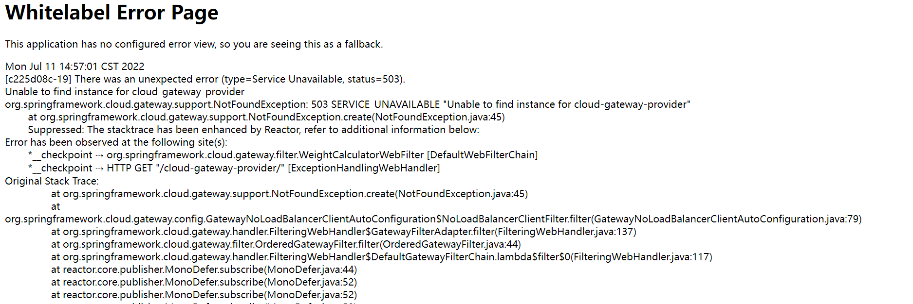
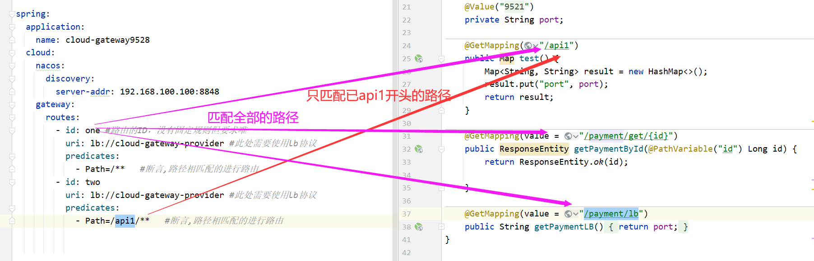
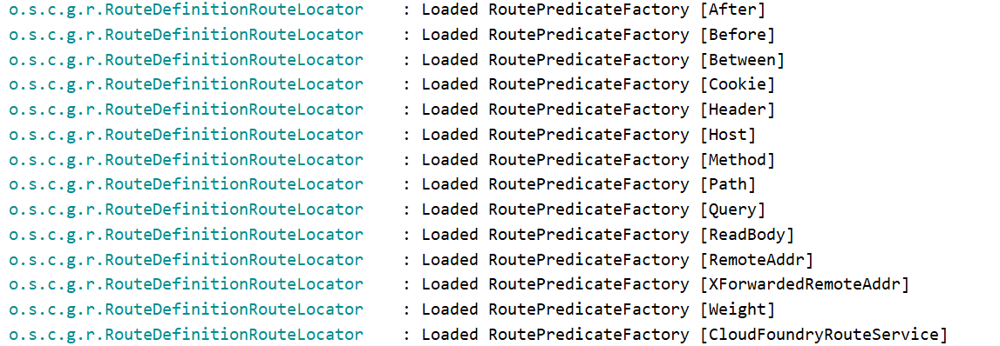
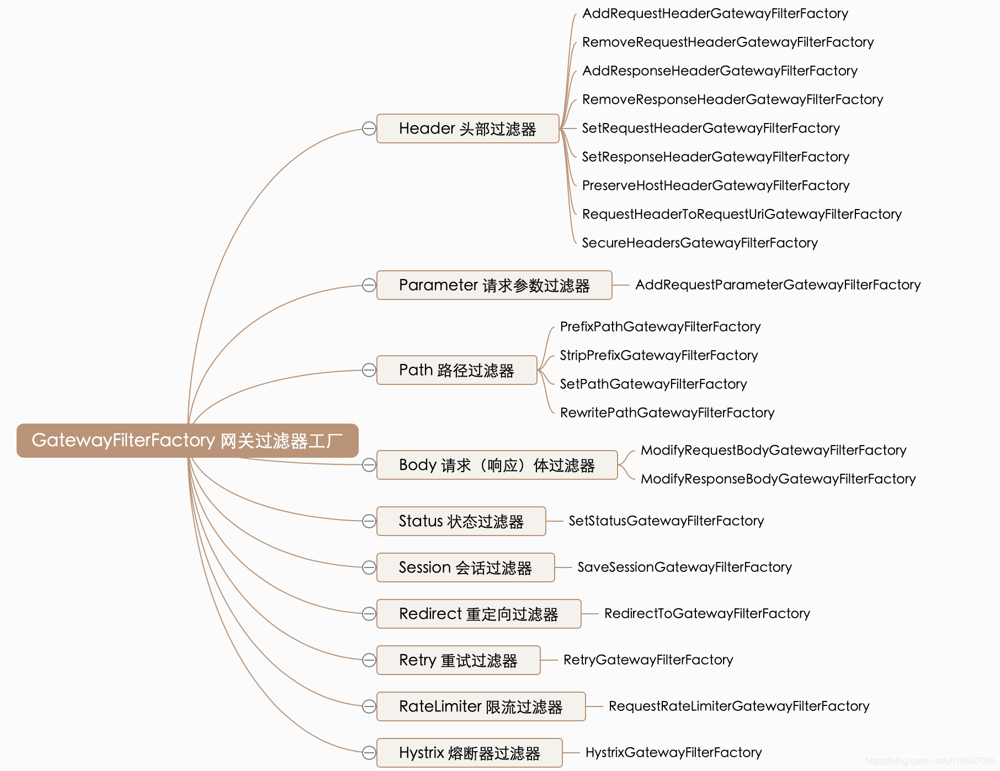
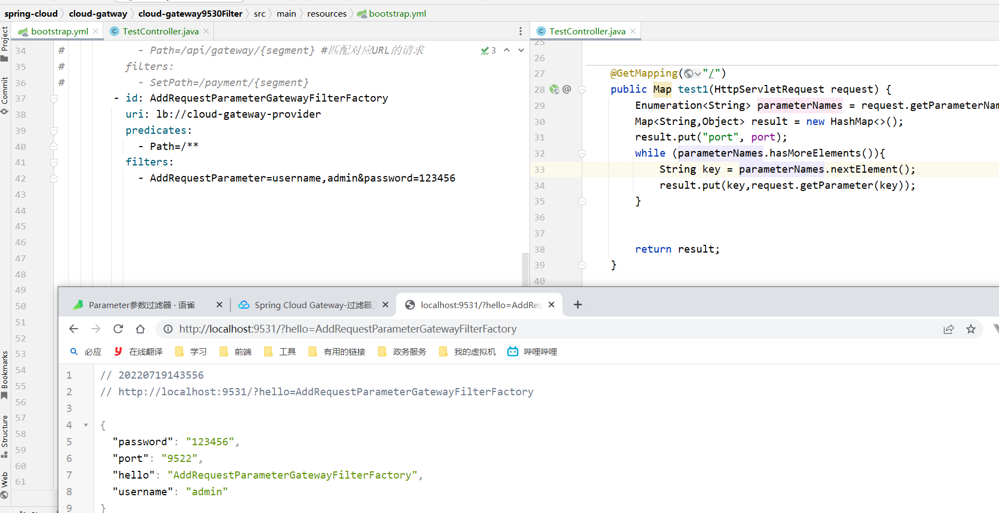
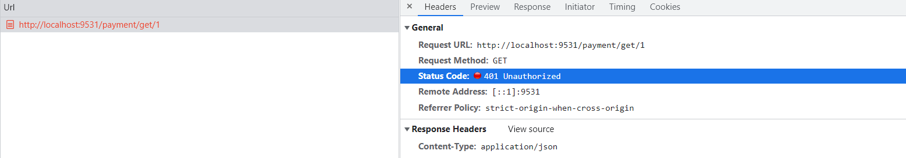
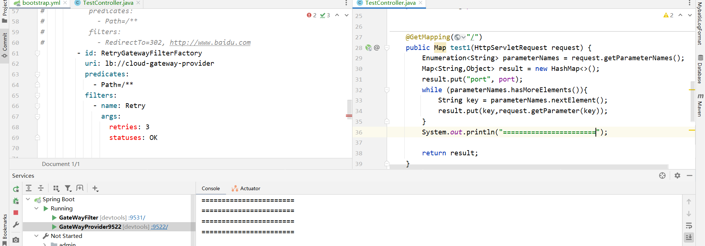
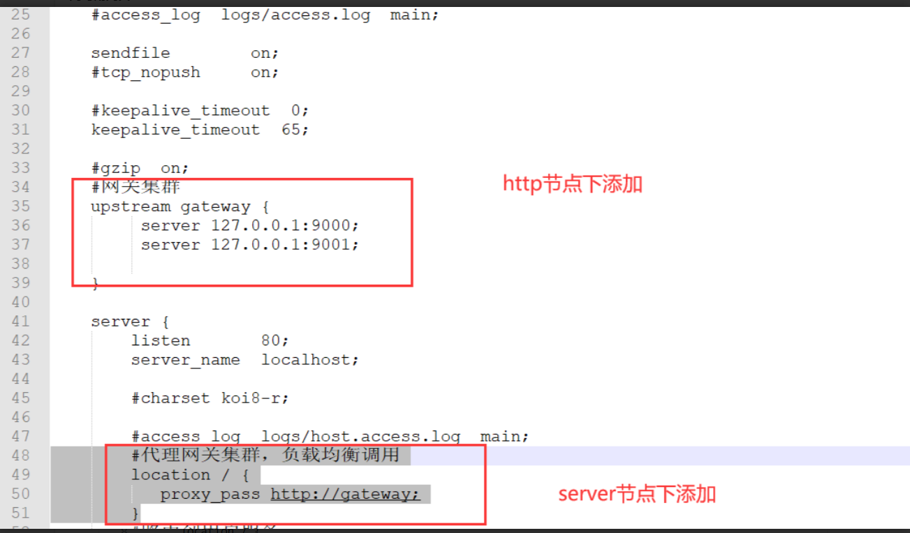
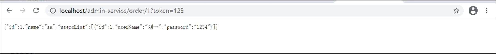

# 网关GateWay


## 简介


官方文档：https://docs.spring.io/spring-cloud-gateway/docs/current/reference/html/

Gateway是在Spring生态系统之上构建的API网关服务，基于Spring5，Spring Boot2和Project Reactor等技术。

Gateway旨jiezai在提供一种简单而有效的方式来对API进行路由，以及提供一些强大的过滤器功能，例如：熔断、限流、重试等

SpringCloud Gateway 是 Spring Cloud 的一个全新项目，基于Spring 5.0 + Spring Boot 2.0 和 Project Reactor 等技术开发的网关，它旨在为微服务架构提供一种简单有效的统一的 API 路由管理方式。

SpringCloud Gateway 作为 Spring Cloud 生态系统中的网关，目标是替代 Zuul，在Spring Cloud 2.0以上版本中，没有对新版本的Zuul 2.0以上最新高性能版本进行集成，仍然还是使用的Zuul 1.x非Reactor模式的老版本。而为了提升网关的性能，SpringCloud Gateway是基于 WebFlux框架实现的，而WebFlux框架底层则是使用了高性能的Reactor模式通信框架Netty。

SpringCloud Gateway的目标提供统一的路由方式且基于Filter链的方式提供了网关基本的功能，例如：安全，监控/指标，和限流。


## 微服务中网关在哪里


## SpringCloud Gatewa 与 Zuul的区别


在SpringCloud Finchley 正式版之前，Spring Cloud 推荐的网关是 Netfix 提供的Zuul

1. Zuul 1.x,，是一个基于阻塞 I/O的 API Gateway
2. Zuul 1.x基于Servlet 2.5使用阻塞架构他不支持任何长连接（如WebSocket）Zuul 的设计模式和Nginx较像，每次 I/O 操作都是从工作线程中选择一个执行，请求线程被阻塞到工作线程完成，但是差别是Nginx用C++实现，Zuul 用Java实现，而JVM本身会有第一次加载较慢的情况，使得Zuul的性能相对较差。
3. Zuul 2.x理念更先进，想基于Netty非阻塞和支持长连接，但SpringCloud目前还没有整合。Zuul 2.x的性能较 Zuul1.x 有较大提升。在性能方面，根据官方提供的基准测试，Spring Cloud Gateway 的 RPS（每秒请求数）是Zuul的1.6倍。
4. SpringCloud Gateway 建立在Spring Framework 5, Project Reactor 和 Spring Boot 2.0之上，使用非阻塞API。
5. SpringCloud Gateway还支持WebSocket，并且与Spring紧密集成拥有更好的开发体验


## 事先准备cloud-gatway


```xml
<?xml version="1.0" encoding="UTF-8"?>
<project xmlns="http://maven.apache.org/POM/4.0.0"
         xmlns:xsi="http://www.w3.org/2001/XMLSchema-instance"
         xsi:schemaLocation="http://maven.apache.org/POM/4.0.0 http://maven.apache.org/xsd/maven-4.0.0.xsd">
    <parent>
        <artifactId>spring-cloud</artifactId>
        <groupId>com.xht.example.cloud</groupId>
        <version>1.0-SNAPSHOT</version>
    </parent>
    <modelVersion>4.0.0</modelVersion>
    <artifactId>cloud-gatway</artifactId>
    <packaging>pom</packaging>
    <modules>
        <module>cloud-gateway9527</module>
        <module>cloud-gateway-provider9522</module>
        <module>cloud-gateway-provider9521</module>
    </modules>
    <properties>
        <maven.compiler.source>11</maven.compiler.source>
        <maven.compiler.target>11</maven.compiler.target>
    </properties>
    <dependencies>

    </dependencies>
</project>
```


## 事先准备两个端口不一样的服务


### cloud-gateway-provider9521和cloud-gateway-provider9520


```xml
<?xml version="1.0" encoding="UTF-8"?>
<project xmlns="http://maven.apache.org/POM/4.0.0"
         xmlns:xsi="http://www.w3.org/2001/XMLSchema-instance"
         xsi:schemaLocation="http://maven.apache.org/POM/4.0.0 http://maven.apache.org/xsd/maven-4.0.0.xsd">
    <parent>
        <artifactId>cloud-gatway</artifactId>
        <groupId>com.xht.example.cloud</groupId>
        <version>1.0-SNAPSHOT</version>
    </parent>
    <modelVersion>4.0.0</modelVersion>

    <artifactId>cloud-gateway-provider9521</artifactId>

    <properties>
        <maven.compiler.source>11</maven.compiler.source>
        <maven.compiler.target>11</maven.compiler.target>
    </properties>
    <dependencies>
        <!--nacos注册中心-->
        <dependency>
            <groupId>com.alibaba.cloud</groupId>
            <artifactId>spring-cloud-starter-alibaba-nacos-config</artifactId>
        </dependency>
        <!--nacos服务发现-->
        <dependency>
            <groupId>com.alibaba.cloud</groupId>
            <artifactId>spring-cloud-starter-alibaba-nacos-discovery</artifactId>
        </dependency>
        <dependency>
            <groupId>org.springframework.boot</groupId>
            <artifactId>spring-boot-starter-web</artifactId>
        </dependency>
        <dependency>
            <groupId>org.springframework.boot</groupId>
            <artifactId>spring-boot-starter-actuator</artifactId>
        </dependency>
        <!--日常通用jar包配置-->
        <dependency>
            <groupId>org.springframework.boot</groupId>
            <artifactId>spring-boot-devtools</artifactId>
            <scope>runtime</scope>
            <optional>true</optional>
        </dependency>
        <dependency>
            <groupId>org.springframework.cloud</groupId>
            <artifactId>spring-cloud-starter-bootstrap</artifactId>
        </dependency>
    </dependencies>

</project>
```


### 启动类


```java
@SpringBootApplication
@EnableDiscoveryClient
public class GateWayProvider9521 {
    public static void main(String[] args) {
        SpringApplication.run(GateWayProvider9521.class,args);
    }
}
```


### Controller


```java
@RestController
public class TestController {

    @Value("${server.port}")
    private String port;

    @GetMapping
    public Map test() {
        Map<String,String> result = new HashMap<>();
        result.put("port",port);
        return  result;
    }
}
```


### bootstrap.yml


```yaml
server:
  port: 端口自己定义


spring:
  application:
    name: cloud-gateway-provider
  cloud:
    nacos:
      discovery:
        server-addr: 192.168.100.100:8848
```


### 测试


http://localhost:9521/

http://localhost:9522/


## HelloWorldcloud-gateway9527


### pom


```xml
<?xml version="1.0" encoding="UTF-8"?>
<project xmlns="http://maven.apache.org/POM/4.0.0"
         xmlns:xsi="http://www.w3.org/2001/XMLSchema-instance"
         xsi:schemaLocation="http://maven.apache.org/POM/4.0.0 http://maven.apache.org/xsd/maven-4.0.0.xsd">
    <parent>
        <artifactId>cloud-gatway</artifactId>
        <groupId>com.xht.example.cloud</groupId>
        <version>1.0-SNAPSHOT</version>
    </parent>
    <modelVersion>4.0.0</modelVersion>

    <artifactId>cloud-gateway9527</artifactId>

    <properties>
        <maven.compiler.source>11</maven.compiler.source>
        <maven.compiler.target>11</maven.compiler.target>
    </properties>
    <dependencies>
        <!--gatway启动类-->
        <dependency>
            <groupId>org.springframework.cloud</groupId>
            <artifactId>spring-cloud-starter-gateway</artifactId>
        </dependency>
        <!--nacos注册中心-->
        <dependency>
            <groupId>com.alibaba.cloud</groupId>
            <artifactId>spring-cloud-starter-alibaba-nacos-config</artifactId>
        </dependency>
        <!--nacos服务发现-->
        <dependency>
            <groupId>com.alibaba.cloud</groupId>
            <artifactId>spring-cloud-starter-alibaba-nacos-discovery</artifactId>
        </dependency>
   <!--
   gateway不需要这两个jar需要移除
    <dependency>
            <groupId>org.springframework.boot</groupId>
            <artifactId>spring-boot-starter-web</artifactId>
        </dependency>
        <dependency>
            <groupId>org.springframework.boot</groupId>
            <artifactId>spring-boot-starter-actuator</artifactId>
        </dependency>-->
        <!--日常通用jar包配置-->
        <dependency>
            <groupId>org.springframework.boot</groupId>
            <artifactId>spring-boot-devtools</artifactId>
            <scope>runtime</scope>
            <optional>true</optional>
        </dependency>
        <dependency>
            <groupId>org.springframework.cloud</groupId>
            <artifactId>spring-cloud-starter-bootstrap</artifactId>
        </dependency>
       <dependency>
            <groupId>org.springframework.cloud</groupId>
            <artifactId>spring-cloud-loadbalancer</artifactId>
        </dependency>
    </dependencies>
</project>
```


### 启动类


```java
/**
 * 描述 ：
 *
 * @author : 小糊涂
 * @version : 1.0
 **/
@EnableDiscoveryClient
@SpringBootApplication
public class GateWay9527Server {
    public static void main(String[] args) {
        SpringApplication.run(GateWay9527Server.class,args);
    }
}
```


### 配置文件


```java
server:
  port: 9527

spring:
  application:
    name: cloud-gateway9527
  cloud:
    nacos:
      discovery:
        server-addr: 192.168.100.100:8848
    gateway:
      discovery: #网关发现机制配置
        locator: #处理机制
          enabled: true # 开启网关自动映射处理逻辑，只要请求地址符合规则: http://gatewayPort/微服务名/微服务请求地址
          lower-case-service-id: true #全部服务名称全部小写
```


### 测试


访问：http://localhost:9527/cloud-gateway-provider/

多次刷新会发现是轮询的形式请求


### 注意点


+ 2020版本过后必须有这个loadbalancer

```xml
<dependency>
     <groupId>org.springframework.cloud</groupId>
     <artifactId>spring-cloud-loadbalancer</artifactId>
 </dependency>
```





+ gateway不需要以下jar


```xml
<dependency>
        <groupId>org.springframework.boot</groupId>
        <artifactId>spring-boot-starter-web</artifactId>
    </dependency>
    <dependency>
        <groupId>org.springframework.boot</groupId>
        <artifactId>spring-boot-starter-actuator</artifactId>
    </dependency>
```


## 微服务名实现动态路由


默认情况下Gateway会根据注册中心注册的服务列表，以注册中心上微服务名为路径创建动态路由进行转发，从而实现动态路由的功能，配置如下:


```yaml
spring:
  cloud:
    gateway:
      discovery: #网关发现机制配置
        locator: #处理机制
          enabled: true
          lower-case-service-id: true #全部服务名称全部小写
```


## 配置文件实现动态路由


```yml
spring:
  cloud:
    gateway:
      routes:
        - id: one #路由的ID，没有固定规则但要求唯一
          uri: lb://cloud-gateway-provider #此处需要使用lb协议
          predicates:
            - Path=/**   #断言,路径相匹配的进行路由
        - id: two
          uri: lb://cloud-gateway-provider #此处需要使用lb协议
          predicates:
            - Path=/api1/**   #断言,路径相匹配的进行路由
```




## 代码实现动态路由


```java
@Configuration
public class GateWayConfig {
    /**
     * 配置了一个id为route-name的路由规则，
     * 当访问地址 http://localhost:9527/guonei时会自动转发到地址：http://news.baidu.com/guonei
     * @param builder
     * @return
     */
    @Bean
    public RouteLocator customRouteLocator(RouteLocatorBuilder builder)
    {
        RouteLocatorBuilder.Builder routes = builder.routes();
        routes.route("one", r -> r.path("/").uri("lb://cloud-gateway-provider")).build();
        return routes.build();

    }
    @Bean
    public RouteLocator customRouteLocator2(RouteLocatorBuilder builder)
    {
        RouteLocatorBuilder.Builder routes = builder.routes();
        routes.route("two", r -> r.path("/api1").uri("lb://cloud-gateway-provider")).build();
        return routes.build();
    }

}
```

匹配原则和上图一样


## Predicate(谓词/路由规则)


### 简介


Predicate我们叫它谓词，或者叫做路由规则

GateWay启动时出现了这些日志




### The After Route Predicate Factory


After路由 predicate 工厂接受一个参数，一个datetime(它是一个java ZonedDateTime)。此 predicate 匹配在指定日期时间之后发生的请求。下面的示例配置一个after路由predicate:


**例1。application.yml**

```yaml
spring:
  cloud:
    gateway:
      routes:
      - id: after_route
        uri: lb://cloud-payment-service #此处需要使用lb协议才能根据服务名进行负载均衡调用
        predicates:
        - After=2017-01-20T17:42:47.789-07:00[America/Denver]
```

这条路由与丹佛时间2017年1月20日17点42分以后的任何请求相匹配。


以上是日期格式是国外的时区，可以用以下代码获取本地时区

```java
ZonedDateTime zonedDateTime = ZonedDateTime.now();
System.out.println(zonedDateTime);
// 输出：2020-04-30T15:48:20.500+08:00[Asia/Shanghai]
```


### The Before Route Predicate Factory


Before路由 predicate 工厂接受一个参数，一个datetime(它是一个java ZonedDateTime)。此 predicate 匹配在指定日期时间之前发生的请求。下面的示例配置一个before路由 predicate:


**例2. application.ym**

```yaml
spring:
  cloud:
    gateway:
      routes:
      - id: before_route
        uri: lb://cloud-payment-service #此处需要使用lb协议才能根据服务名进行负载均衡调用
        predicates:
        - Before=2017-01-20T17:42:47.789-07:00[America/Denver]
```

这条路由与丹佛时间2017年1月20日17点42分之前的任何请求相匹配。


### 3.The Between Route Predicate Factory


route predicate工厂接受两个参数，datetime1和datetime2，它们是java ZonedDateTime对象。此predicate匹配在datetime1之后和datetime2之前发生的请求。datetime2参数必须位于datetime1之后。下面的示例配置一个路由间predicate:


**例3. application.yml**

```yaml
spring:
  cloud:
    gateway:
      routes:
      - id: between_route
        uri: lb://cloud-payment-service #此处需要使用lb协议才能根据服务名进行负载均衡调用
        predicates:
        - Between=2017-01-20T17:42:47.789-07:00[America/Denver], 2017-01-21T17:42:47.789-07:00[America/Denver]
```

该路由与2017年1月20日(丹佛)17:42山地时间之后和2017年1月21日(丹佛)17:42山地时间之前的任何请求匹配。这对于维护窗口可能很有用。


### The Cookie Route Predicate Factory


Cookie route predicate工厂接受两个参数，Cookie名称和regexp(它是一个Java正则表达式)。此predicate匹配具有给定名称且其值与正则表达式匹配的cookie。下面的示例配置一个cookie路由谓词工厂:


**例4. application.yml**

```yaml
spring:
  cloud:
    gateway:
      routes:
      - id: cookie_route
        uri: lb://cloud-payment-service #此处需要使用lb协议才能根据服务名进行负载均衡调用
        predicates:
        - Cookie=chocolate, ch.p
```

此路由匹配具有一个名为chocolate的cookie的请求，该cookie的值与ch.p正则表达式匹配。


使用cURL工具发送带有cookie为`chocolate=ch.p`的请求可以匹配该路由。

```java
curl http://localhost:9527/payment/lb/ --cookie "chocolate=ch.p"
```


### The Header Route Predicate Factory


头 route predicate 工厂接受两个参数，头名称和regexp（这是一个Java正则表达式）。此predicate与具有给定名称且其值与正则表达式匹配的头匹配。以下示例配置头route predicate：


**例 5. application.yml**

```yaml
spring:
  cloud:
    gateway:
      routes:
      - id: header_route
        uri: lb://cloud-payment-service #此处需要使用lb协议才能根据服务名进行负载均衡调用
        predicates:
        - Header=X-Request-Id, \d+
```

如果请求的头名为X-Request-Id，其值与\d+正则表达式匹配(即，它的值为一个或多个数字)，则此路由将进行匹配。


使用cURL发送带有请求头为`X-Request-Id:123`的请求可以匹配该路由。

```java
curl http://localhost:9527/payment/lb/ -H "X-Request-Id:123" 
```


### The Host Route Predicate Factory


Host route predicate工厂需要一个参数：主机名的列表 patterns .的模式是一个Ant-style的模式，`.` 作为分隔符。此 predicate 与模式匹配的主机标头匹配。下面的示例配置一个Host route predicate:


**例6. application.yml**

```yaml
spring:
  cloud:
    gateway:
      routes:
      - id: host_route
        uri: lb://cloud-payment-service #此处需要使用lb协议才能根据服务名进行负载均衡调用
        predicates:
        - Host=**.somehost.org,**.anotherhost.org
```

还支持URI模板变量(例如 {sub}.myhost.org)。


如果请求的主机头的值为www.somehost.org或beta.somehost.org或www.anotherhost.org，则此路由匹配。


此predicate将URI模板变量(如前面示例中定义的sub)提取为名称和值的映射，并将其放在ServerWebExchange.getAttributes()中，并在ServerWebExchangeUtils.URI_TEMPLATE_VARIABLES_ATTRIBUTE中定义了一个键。然后这些值可供`GatewayFilter`[ factories](https://cloud.spring.io/spring-cloud-static/spring-cloud-gateway/2.2.2.RELEASE/reference/html/#gateway-route-filters)使用


使用cURL访问带有请求头为www.somehost.org或者www.anotherhost.org的请求可以匹配该路由。

```java
curl http://localhost:9527/payment/lb/ -H "Host:www.somehost.org"
```


### The Method Route Predicate Factory


`Method` Route Predicate工厂接受一个`methods` 参数，该参数是一个或多个参数：要匹配的HTTP methods。下面的示例配置一个方法route predicate:

**例7. application.yml**

```yaml
spring:
  cloud:
    gateway:
      routes:
      - id: method_route
        uri: lb://cloud-payment-service #此处需要使用lb协议才能根据服务名进行负载均衡调用
        predicates:
        - Method=GET,POST
```

如果请求方法是GET或POST，则此路由匹配。


使用cURL发送GET或POST请求可以匹配该路由。

```java
curl http://localhost:9527/payment/lb/
```


### The Path Route Predicate Factory


`Path` Route Predicate工厂接受两个参数：一个Spring `PathMatcher` `patterns` 和一个名为matchOptionalTrailingSeparator的可选标志。下面的示例配置一个path route predicate：


**例8. application.yml**

```java
spring:
  cloud:
    gateway:
      routes:
      - id: path_route
        uri: lb://cloud-payment-service #此处需要使用lb协议才能根据服务名进行负载均衡调用
        predicates:
        - Path=/red/{segment},/blue/{segment}
```

如果请求路径为，例如：/red/1 或`/red/blue` 或 `/blue/green`，则此路由匹配。


该predicate将URI模板变量(如前面示例中定义的segment)提取为名称和值的映射，并将其放入ServerWebExchange.getAttributes()中，并在`ServerWebExchangeUtils.URI_TEMPLATE_VARIABLES_ATTRIBUTE`.中定义了一个键。然后这些值可供`GatewayFilter`[ factories](https://cloud.spring.io/spring-cloud-static/spring-cloud-gateway/2.2.2.RELEASE/reference/html/#gateway-route-filters)使用


有一个实用方法（称为get）可以使访问这些变量变得更容易。下面的示例演示如何使用get方法：

```java
Map<String, String> uriVariables = ServerWebExchangeUtils.getPathPredicateVariables(exchange);

String segment = uriVariables.get("segment");
```


### The Query Route Predicate Factory


`Query` route predicate工厂接受两个参数：一个必需的`param` 和一个可选的`regexp` (它是一个Java正则表达式)。下面的示例配置一个查询路由谓词：


**例9. application.yml**

```yaml
spring:
  cloud:
    gateway:
      routes:
      - id: query_route
        uri: lb://cloud-payment-service #此处需要使用lb协议才能根据服务名进行负载均衡调用
        predicates:
        - Query=green
```

如果请求包含`green` 查询参数，则前面的路由匹配。


**application.yml**

```yaml
spring:
  cloud:
    gateway:
      routes:
      - id: query_route
        uri: lb://cloud-payment-service #此处需要使用lb协议才能根据服务名进行负载均衡调用
        predicates:
        - Query=red, gree.
```

如果请求包含一个`red` 查询参数，其值与`gree.` 匹配，则前面的路由将匹配。regexp，所以green和`greet` 是匹配的。


使用curl发送带`Query=red`查询参数的请求可以匹配该路由。

```java
curl http://localhost:9527/payment/lb/?red=greet
```


### The RemoteAddr Route Predicate Factory


`RemoteAddr` route predicate 工厂接受 sources 列表(最小大小为1)，这些源是CIDR符号(IPv4或IPv6)字符串，比如192.168.0.1/16(其中192.168.0.1是一个IP地址，`16` 是子网掩码)。下面的示例配置一个RemoteAddr route predicate：


**例10. application.yml**

```yaml
spring:
  cloud:
    gateway:
      routes:
      - id: remoteaddr_route
        uri: lb://cloud-payment-service #此处需要使用lb协议才能根据服务名进行负载均衡调用
        predicates:
        - RemoteAddr=192.168.1.1/24
```

如果请求的远程地址是`192.168.1.10`，则此路由匹配。


### The Weight Route Predicate Factory


权重 route predicate工厂接受两个参数：组和权值(一个int)。每组计算权重。下面的示例配置一个权重route predicate:


**例11. application.yml**

```yaml
spring:
  cloud:
    gateway:
      routes:
      - id: weight_high
        uri: https://weighthigh.org
        predicates:
        - Weight=group1, 8
      - id: weight_low
        uri: https://weightlow.org
        predicates:
        - Weight=group1, 2
```

这条 route 将80%的流量转发到[weigh.org](https://weighthigh.org/), 20%的流量转发到[weighlow.org](https://weighlow.org/)


### 修改远程地址解析的方式


默认情况下，RemoteAddr route predicate工厂使用来自传入请求的远程地址。如果Spring Cloud Gateway位于代理层的后面，这可能与实际的客户端IP地址不匹配。


您可以通过设置自定义RemoteAddressResolver来自定义远程地址的解析方式。Spring Cloud Gateway提供了一个非默认的远程地址解析器，它基于[X-Forwarded-For header](https://developer.mozilla.org/en-US/docs/Web/HTTP/Headers/X-Forwarded-For)，XForwardedRemoteAddressResolver。


`XForwardedRemoteAddressResolver` 有两个静态构造函数方法，它们采用不同的安全方法:


1. XForwardedRemoteAddressResolver::trustAll 返回一个RemoteAddressResolver，它总是接受X-Forwarded-For头中找到的第一个IP地址。这种方法容易受到欺骗，因为恶意客户机可以为X-Forwarded-For设置一个初始值，解析器将接受这个初始值。
2. XForwardedRemoteAddressResolver::maxTrustedIndex 获取与运行在Spring Cloud Gateway前的可信基础设施数量相关的索引。例如，如果Spring Cloud Gateway只能通过HAProxy访问，那么应该使用值1。如果在访问Spring Cloud Gateway之前需要两个可信基础设施的跃点，那么应该使用值2。


考虑以下头值：

```plain
X-Forwarded-For: 0.0.0.1, 0.0.0.2, 0.0.0.3
```

下列`maxTrustedIndex` 值产生以下远程地址:

| maxTrustedIndex          | **result**                                                  |
| ------------------------ | ----------------------------------------------------------- |
| [`Integer.MIN_VALUE`,0]  | (invalid, `IllegalArgumentException` during initialization) |
| 1                        | 0.0.0.3                                                     |
| 2                        | 0.0.0.2                                                     |
| 3                        | 0.0.0.1                                                     |
| [4, `Integer.MAX_VALUE`] | 0.0.0.1                                                     |

下面的例子展示了如何用Java实现相同的配置:


**例12. GatewayConfig.java**

```java
RemoteAddressResolver resolver = XForwardedRemoteAddressResolver
    .maxTrustedIndex(1);

...

.route("direct-route",
    r -> r.remoteAddr("10.1.1.1", "10.10.1.1/24")
        .uri("https://downstream1")
.route("proxied-route",
    r -> r.remoteAddr(resolver, "10.10.1.1", "10.10.1.1/24")
        .uri("https://downstream2")
)
```


## 过滤器简介


### 简介


`Spring Cloud Gateway` 根据作用范围划分为 `GatewayFilter` 和 `GlobalFilter` ，二者区别如下：

+ `GatewayFilter` ：网关过滤器，需要通过 `spring.cloud.routes.filters` 配置在具体路由下，只作用在当前路由上或通过 `spring.cloud.default-filters` 配置在全局，作用在所有路由上。

+ `GlobalFilter` ：全局过滤器，不需要在配置文件中配置，作用在所有的路由上，最终通过``GatewayFilterAdapter `包装成 `GatewayFilterChain` 可识别的过滤器，它为请求业务以及路由的 URI 转换为真实业务服务请求地址的核心过滤器，不需要配置系统初始化时加载，并作用在每个路由上。


### 网关过滤器GateWayFilter


　　网关过滤器用于拦截并链式处理 Web 请求，可以实现横切与应用无关的需求，比如：安全、访问超时的设置等。修改传入的 HTTP 请求或传出 HTTP 响应。Spring Cloud Gateway 包含许多内置的网关过滤器工厂一共有 22 个，包括头部过滤器、 路径类过滤器、Hystrix 过滤器和重写请求 URL 的过滤器， 还有参数和状态码等其他类型的过滤器。根据过滤器工厂的用途来划分，可以分为以下几种：`Header`、`Parameter`、`Path`、`Body`、`Status`、`Session`、`Redirect`、`Retry`、`RateLimiter` 和 `Hystrix`。

接下来我们举例说明其中一部分如何使用



> 在springcloud2020版本后没有了Hystrix过滤器

## Path过滤器


### RewritePathGatewayFilterFactory


+ 配置


```yml
spring:
    gateway:
      routes:
        - id:  RewritePathGatewayFilterFactory
          uri: lb://cloud-gateway-provider
          predicates:
            - Path=/api/gateway/**
          filters:
            - RewritePath=/api/gateway/(?<segment>/?.*), /$\{segment}
```


+ 配置简介


> 主要作用：**针对网关地址进行重写，(添加网关地址前缀形式，并不改变访问下游服务器地址)**
>
> 例如我们现在所有微服务中请求是没有：`/api/gateway/`
>
> 我们如果去访问：`http://localhost:9531/api/gateway/payment/lb`
>
> 就会出现`404`的报错，我们把`gateway`网关看成上游，其他微服务堪称下游
>
> 写请求路径。如上配置，上游访问 `/api/gateway/payment/lb` 会将路径重写为`payment/lb` 再转发给下游，也就是会转发到 `http://cloud-gateway-provider/payment/lb` 。


### PrefixPathGatewayFilterFactory


+ 配置


```yaml
spring:
    gateway:
      routes:
        - id: PrefixPathGatewayFilterFactory
          uri: lb://cloud-gateway-provider
          predicates:
            - Path=/**
          filters:
            - PrefixPath=/payment/
```


+ 配置简介


> 主要作用：**PrefixPath网关过滤器工厂为匹配的URI添加指定前缀，(访问网关时添加了前缀，访问下游服务器连接时,下游服务器连接必须有相同的前缀,否则会出现404)**
>
> 例如我们现在访问网关地址：`http://localhost:9531/lb`
>
> 实际网关去访问下游服务时是访问：`http://cloud-gateway-provider/payment/lb`


### StripPrefixGatewayFilterFactory


+ 配置


```yaml
spring:
    gateway:
      routes:
        - id: StripPrefixGatewayFilterFactory
          uri: lb://cloud-gateway-provider
          predicates:
            - Path=/**
          filters:
            - StripPrefix=2
```


+ 配置简介


> 主要作用：**StripPrefixGatewayFilterFactory网关过滤器工厂采用一个参数StripPrefix，该参数表示在将请求发送到下游之前从请求中剥离的路径个数。(我们访问网关时的地址，经过这个这个过滤器，他会剥离N个路径个数)**
>
> 例如我们现在访问网关地址：`http://localhost:9531/api/gateway/`或者`http://localhost:9531/任意值/任意值/`
>
> 实际网关去访问下游服务时是访问：`http://cloud-gateway-provider/`


### SetPathGatewayFilterfactory


+ 配置


```yaml
spring:
  cloud:
    gateway:
      routes:
        - id: SetPathGatewayFilterfactory
          uri: lb://cloud-gateway-provider
          predicates:
            - Path=/api/gateway/{segment} #匹配对应URL的请求
          filters:
            - SetPath=/payment/{segment}
```


+ 配置简介


> 主要作用：**SetPath网关过滤器工厂采用路径模板参数，它提供了一种通过允许模板化路径段来操作请求路径的简单方法，使用了SpringFramework中的uri模板，允许多个匹配段。**
>
> 例如我们现在访问网关地址：`http://localhost:9531/api/gateway/lb`
>
> 实际网关去访问下游服务时是访问：`http://cloud-gateway-provider/lb`


## Parameter参数过滤器


### AddRequestParameterGatewayFilterFactory


+ 配置


```yaml
spring:
  cloud:
    gateway:
      routes:
         - id: AddRequestParameterGatewayFilterFactory
           uri: lb://cloud-gateway-provider
           predicates:
             - Path=/**
           filters:
             - AddRequestParameter=username,admin&password=123456
```


+ 配置简介


> 主要作用：（**AddRequestParameterGatewayFilterFactory网关过滤器工厂会将指定参数添加至匹配的下游请求中。**）
>
> 例如我们现在访问网关地址：`http://localhost:9531/?hello=AddRequestParameterGatewayFilterFactory`
>
> 实际网关去访问下游服务时是访问：`http://localhost:9531/?hello=AddRequestParameterGatewayFilterFactory&username=admin&password=123456`


+ 代码




## Status状态过滤器


+ 配置

```yaml
spring:
  cloud:
    gateway:
      routes:
         - id: SetStatusGatewayFilterFactory
           uri: lb://cloud-gateway-provider
           predicates:
             - Path=/**
           filters:
             - SetStatus=401
```


+ 配置说明


> 主要作用：（**SetStatus网关过滤器工厂采用单个状态参数，它必须是有效的SpringHttpStatus,它可以是整数404或枚举NOT——FOUND的字符串表示。，简单说就是每一个接口的返回状态都是401**）
>
> 例如我们现在访问网关地址：`http://localhost:9531/payment/get/1`
>
> 结果返回：





## Session会话过滤器


### SaveSessionGatewayFilterFactory


+ 配置


```yaml
spring:
  cloud:
    gateway:
      routes:
         - id: SaveSessionGatewayFilterFactory
           uri: lb://cloud-gateway-provider
           predicates:
             - Path=/**
           filters:
             - SaveSession
```


+ 配置说明


> 作用：**SaveSession GatewayFilter Factory在转发下游调用之前强制执行WebSession :: save操作。 当使用Spring Session与懒加载数据存储之类的东西时，这是特别有用的，并且需要确保在转发调用之前已保存会话状态。**
>
> <font color='font'>如果要将Spring Security与Spring Session集成，并且希望确保将安全性详细信息转发到远程进程，则这很关键。</font>


## Redirect 类过滤器


### RedirectToGatewayFilterFactory


+ 配置


```yaml
spring:
  cloud:
    gateway:
      routes:
         - id: RedirectToGatewayFilterFactory
           uri: lb://cloud-gateway-provider
           predicates:
             - Path=/**
           filters:
             - RedirectTo=302, http://www.baidu.com
```


+ 配置说明


> 作用：**RedirectTo GatewayFilter Factory采用status和url参数。 状态应该是300系列重定向http代码，例如301. url应该是有效的URL。 这将是Location标头的值。**
>
> 我们去访问网关的时候直接就跳转到百度


## Retry 类过滤器


### RetryGatewayFilterFactory


+ 配置


```yaml
spring:
  cloud:
    gateway:
      routes:
         - id: RetryGatewayFilterFactory
           uri: lb://cloud-gateway-provider
           predicates:
             - Path=/**
           filters:
             - name: Retry
               args:
                 retries: 3
                 statuses: OK
```


+ 配置说明


> + 简介该过滤器有三个参数：
>   + retries: 重试次数
>   + statuses: 应该重试的HTTP状态代码，使用org.springframework.http.HttpStatus表示
>   + methods: 应该重试的HTTP方法，使用org.springframework.http.HttpMethod表示
>   + series: 要重试的一系列状态代码，使用org.springframework.http.HttpStatus.Series表示
>
> 下图中请求：`http://localhost:9531/`
>
> 自己执行一次，重试三次





## Header 类过滤器


### AddRequestHeaderGatewayFilterFactory


增加请求的头部信息，并将头部传递到下游。这将为所有匹配请求的下游请求标头添加X-Request-Foo:Bar头。

```yaml
spring:
  cloud:
    gateway:
      routes:
      - id: add_request_header_route
        uri: http://example.org
        filters:
        - AddRequestHeader=X-Request-Foo, Bar
```


 

### RemoveRequestHeaderGatewayFilterFactory


在请求发送到下游之前，为匹配的请求移除设置的头部信息。请求发送到下游之前删除X-Response-Foo头。

```yaml
spring:
  cloud:
    gateway:
      routes:
      - id: removeresponseheader_route
        uri: http://example.org
        filters:
        - RemoveResponseHeader=X-Response-Foo
```


### AddResponseHeaderGatewayFilterFactory


将会为匹配的请求增加响应头部，传递到下游的相应头部。这会将X-Response-Foo：Bar 头添加到所有匹配请求的下游响应标头中。

```yaml
spring:
  cloud:
    gateway:
      routes:
      - id: add_request_header_route
        uri: http://example.org
        filters:
        - AddResponseHeader=X-Response-Foo, Bar
```


### RemoveResponseHeaderGatewayFilterFactory


将相应结果返给客户端之前，将会移除设置的响应头部信息。这将在响应返回到网关客户端之前从响应中删除X-Response-Foo标头。

```yaml
spring:
  cloud:
    gateway:
      routes:
      - id: removeresponseheader_route
        uri: http://example.org
        filters:
        - RemoveResponseHeader=X-Response-Foo
```


### SetRequestHeaderGatewayFilterFactory


当请求经过网关转发时，该过滤器将会用给定的名字替换所有的头部信息使用 X-Response-Foo:Bar替换请求头中对应属性的值


```yaml
spring:
  cloud:
    gateway:
      routes:
      - id: setresponseheader_route
        uri: http://example.org
        filters:
        - SetRequestHeader=X-Response-Foo, Bar
```


### SetResponseHeaderGatewayFilterFactory


此GatewayFilter将替换具有给定名称的所有标头，而不是添加。 因此，如果下游服务器以X-Response-Foo：1234响应，则将替换为X-Response-Foo：Bar，这是网关客户端将接收的内容。

```yaml
spring:
  cloud:
    gateway:
      routes:
      - id: setresponseheader_route
        uri: http://example.org
        filters:
        - SetResponseHeader=X-Response-Foo, Bar
```


### PreserveHostHeaderGatewayFilterFactory


PreserveHostHeader GatewayFilter Factory没有参数。 此过滤器设置路由过滤器将检查的请求属性，以确定是否应发送原始主机头，而不是http客户端确定的主机头。


```yaml
spring:
  cloud:
    gateway:
      routes:
      - id: preserve_host_route
        uri: http://example.org
        filters:
        - PreserveHostHeader
```


### RequestHeaderToRequestUriGatewayFilterFactory


当请求 http://example.org 时，会根据X-New-Url来进行新的url路由

```yaml
spring:
  cloud:
    gateway:
      enabled: true
      discovery:
        locator:
          enabled: true
      routes:
      - id: request_header_to_request_uri_route
        uri: http://example.org
        filters:
        - RequestHeaderToRequestUri=X-New-Url
```


### SecureHeadersGatewayFilterFactory


当使用该过滤器时，会默认为请求头添加以下属性：

```java
X-Xss-Protection:1; mode=block
Strict-Transport-Security:max-age=631138519
X-Frame-Options:DENY
X-Content-Type-Options:nosniff
Referrer-Policy:no-referrer
Content-Security-Policy:default-src 'self' https:; font-src 'self' https: data:; img-src 'self' https: data:; object-src 'none'; script-src https:; style-src 'self' https: 'unsafe-inline'
X-Download-Options:noopen
X-Permitted-Cross-Domain-Policies:none
```


要更改默认值，请在spring.cloud.gateway.filter.secure-headers命名空间中设置相应的属性：

````java
xss-protection-header
strict-transport-security
frame-options
content-type-options
referrer-policy
content-security-policy
download-options
permitted-cross-domain-policies
````

这些参数可以参考：`https://blog.appcanary.com/2017/http-security-headers.html`

 

## 全局过滤器


### 简介


全局过滤器不需要在配置文件中配置，作用在所有的路由上，最终通过GatewayFilterAdapter包装成GatewayFilterChain可识别的过滤器，它是请求业务以及路由的URI转换为真实业务服务请求地址的核心过滤器，不需要配置系统初始化时加载，并作用在每个路由上。


### 怎么使用


```java
public class Filter implements GlobalFilter, Ordered {
  
    @Override
    public Mono<Void> filter(ServerWebExchange exchange, GatewayFilterChain chain) {
        return null;
    }

    @Override
    public int getOrder() {
        return 0;
    }
}
```


### 自定义全局过滤器


```java
@Component //这个注解不能少
public class CustomGatewayFilter implements GlobalFilter, Ordered {


    /**
     * 过滤器业务逻辑
     * @param exchange the current server exchange
     * @param chain provides a way to delegate to the next filter
     * @return
     */
    @Override
    public Mono<Void> filter(ServerWebExchange exchange, GatewayFilterChain chain) {
        System.out.println("time:"+new Date()+"\t 执行了自定义的全局过滤器: "+"CustomGatewayFilter"+"hello");
        String uname = exchange.getRequest().getQueryParams().getFirst("uname");
        if (uname == null) {
            System.out.println("****用户名为null，无法登录");
            exchange.getResponse().setStatusCode(HttpStatus.NOT_ACCEPTABLE);
            return exchange.getResponse().setComplete();
        }
        return chain.filter(exchange);
    }

    /**
     * 过滤器执行顺序，数值越小，优先级越高
     * @return
     */
    @Override
    public int getOrder() {
        return 0;
    }
}
```


### 统一鉴权案例


```java
import org.slf4j.Logger;
import org.slf4j.LoggerFactory;
import org.springframework.cloud.gateway.filter.GatewayFilterChain;
import org.springframework.cloud.gateway.filter.GlobalFilter;
import org.springframework.core.Ordered;
import org.springframework.core.io.buffer.DataBuffer;
import org.springframework.http.HttpStatus;
import org.springframework.http.server.reactive.ServerHttpResponse;
import org.springframework.stereotype.Component;
import org.springframework.web.server.ServerWebExchange;
import reactor.core.publisher.Mono;

/*
权限验证过滤器
 */
@Component
public class AccessFilter implements GlobalFilter , Ordered {
    private Logger logger= LoggerFactory.getLogger(AccessFilter.class);
    //过滤器业务逻辑
    @Override
    public Mono<Void> filter(ServerWebExchange exchange, GatewayFilterChain chain) {
       //获取请求参数
        String token=exchange.getRequest().getQueryParams().getFirst("token");
        //业务逻辑处理
        if(null==token){
            logger.warn("token is null...");
            ServerHttpResponse response=exchange.getResponse();
            //响应类型
            response.getHeaders().add("Content-Type","application/json;charset=utf-8");
            //响应状态码，Http401错误代表用户没用访问权限
            response.setStatusCode(HttpStatus.UNAUTHORIZED);
            //响应内容
            String message="{\"message\":\""+HttpStatus.UNAUTHORIZED.getReasonPhrase()+"\"}";
            DataBuffer buffer=response.bufferFactory().wrap(message.getBytes());
            //请求结束，不再继续向下请求
            return  response.writeWith(Mono.just(buffer));

        }
        //使用token进行身份验证
        logger.info("token is OK...");
        return chain.filter(exchange);
    }
//过滤器执行顺序，数值越小，优先级越高
    @Override
    public int getOrder() {
        return 1;
    }
}

```


## Gateway限流


### 简介


SpringCloudGateway官方提供了 RequestRateLimiterGatewayFilterFactory 过滤器工厂，使用redis和lua脚本实现了令牌桶的方法。


### 依赖


```xml
<?xml version="1.0" encoding="UTF-8"?>
<project xmlns="http://maven.apache.org/POM/4.0.0"
         xmlns:xsi="http://www.w3.org/2001/XMLSchema-instance"
         xsi:schemaLocation="http://maven.apache.org/POM/4.0.0 http://maven.apache.org/xsd/maven-4.0.0.xsd">
    <parent>
        <artifactId>cloud-gatway</artifactId>
        <groupId>com.xht.example.cloud</groupId>
        <version>1.0-SNAPSHOT</version>
    </parent>
    <modelVersion>4.0.0</modelVersion>

    <artifactId>cloud-gateway9527RateLimiter</artifactId>

    <properties>
        <maven.compiler.source>11</maven.compiler.source>
        <maven.compiler.target>11</maven.compiler.target>
    </properties>
    <dependencies>
        <!--gatway启动类-->
        <dependency>
            <groupId>org.springframework.cloud</groupId>
            <artifactId>spring-cloud-starter-gateway</artifactId>
        </dependency>
        <!--nacos注册中心-->
        <dependency>
            <groupId>com.alibaba.cloud</groupId>
            <artifactId>spring-cloud-starter-alibaba-nacos-config</artifactId>
        </dependency>
        <!--nacos服务发现-->
        <dependency>
            <groupId>com.alibaba.cloud</groupId>
            <artifactId>spring-cloud-starter-alibaba-nacos-discovery</artifactId>
        </dependency>
        <dependency>
            <groupId>org.springframework.boot</groupId>
            <artifactId>spring-boot-starter-data-redis-reactive</artifactId>
        </dependency>
        <!-- commons-pool2 对象池依赖 -->
        <dependency>
            <groupId>org.apache.commons</groupId>
            <artifactId>commons-pool2</artifactId>
        </dependency>

        <!--日常通用jar包配置-->
        <dependency>
            <groupId>org.springframework.boot</groupId>
            <artifactId>spring-boot-devtools</artifactId>
            <scope>runtime</scope>
            <optional>true</optional>
        </dependency>
        <dependency>
            <groupId>org.springframework.cloud</groupId>
            <artifactId>spring-cloud-starter-bootstrap</artifactId>
        </dependency>
        <dependency>
            <groupId>org.springframework.cloud</groupId>
            <artifactId>spring-cloud-loadbalancer</artifactId>
        </dependency>
    </dependencies>

</project>
```


### bootstarp.yml


```yaml
server:
  port: 9527

spring:
  application:
    name: cloud-gateway9527-ratelimiter
  cloud:
    nacos:
      discovery:
        server-addr: 192.168.100.100:8848
    gateway:
      routes:
        - id: product-service #路由id唯一
          uri: lb://cloud-gateway-provider #目标 URI，路由到微服务的地址
          predicates: #断言（判断条件）
            - Path=/** #匹配对应URL的请求
          filters:
            #限流过滤器
            - name: RequestRateLimiter
              args:
                redis-rate-limiter.replenishRate: 1 #令牌桶每秒填充速率
                redis-rate-limiter.burstCapacity: 2 #令牌桶总容量
                key-resolver: "#{@keyResolver}" #使用spel表达式按名称引用bean
  #redis缓存
  redis:
    timeout: 10000 #连接超时时间
    host: 192.168.100.100 #redis服务器地址
    port: 6379 #端口
    password:  #redis密码
    database: 0 #选择哪个库，默认0
    lettuce:
      pool:
        max-active: 1024 #最大连接数，默认8
        max-wait: 10000 #最大连接等待时间，单位毫秒，默认-1
        max-idle: 200 #最大空闲数，默认8
        min-idle: 5 #最小空闲数 默认0
```


### 启动类


```java
@EnableDiscoveryClient
@SpringBootApplication
public class GateWayRateLimiter {
    public static void main(String[] args) {
        SpringApplication.run(GateWayRateLimiter.class, args);
    }
}
```


### uri限流


```java
/**
 * 描述 ：限流规则配置类
 *
 * @author : 小糊涂
 * @version : 1.0
 **/
@Configuration
public class KeyResolverConfiguration {
    /**
     * 限流规则
     * @return
     */
    @Bean
    public KeyResolver keyResolver(){
        return new KeyResolver() {
            @Override
            public Mono<String> resolve(ServerWebExchange exchange) {
                return  Mono.just(exchange.getRequest().getURI().getPath());
            }
        };
    }
}
```


### 参数限流


```java
/**
 * 描述 ：限流规则配置类
 *
 * @author : 小糊涂
 * @version : 1.0
 **/
@Configuration
public class KeyResolverConfiguration {
    /**
     * 限流规则
     * @return
     */
    @Bean
    public KeyResolver keyResolver(){
        return new KeyResolver() {
            @Override
            public Mono<String> resolve(ServerWebExchange exchange) {
               // return  Mono.just(exchange.getRequest().getURI().getPath());
                return  Mono.just(exchange.getRequest().getQueryParams().getFirst("userName"));
            }
        };
    }
}
```


### ip限流


```java
/**
 * 描述 ：限流规则配置类
 *
 * @author : 小糊涂
 * @version : 1.0
 **/
@Configuration
public class KeyResolverConfiguration {
    /**
     * 限流规则
     * @return
     */
    @Bean
    public KeyResolver keyResolver(){
        return new KeyResolver() {
            @Override
            public Mono<String> resolve(ServerWebExchange exchange) {
               // return  Mono.just(exchange.getRequest().getURI().getPath());
               // return  Mono.just(exchange.getRequest().getQueryParams().getFirst("userName"));
                return  Mono.just(exchange.getRequest().getRemoteAddress().getHostName());
            }
        };
    }
}
```


## 网关统一异常处理


```java
/**
 * 描述 ：网关统一异常处理
 *
 * @author : 小糊涂
 * @version : 1.0
 **/
@Slf4j
@Order(Ordered.HIGHEST_PRECEDENCE)
public class GatewayGlobalExceptionHandler implements ErrorWebExceptionHandler {
    @Override
    public Mono<Void> handle(ServerWebExchange exchange, Throwable ex) {
        ServerHttpResponse response = exchange.getResponse();
        Result<String> result = null;
        String msg = "";
        if (exchange.getResponse().isCommitted()) {
            return Mono.error(ex);
        }
        if (ex instanceof NotFoundException) {
            //服务未找到或服务不可用
            result = ResultUtils.error(SystemErrorType.SERVICE_UNAVAILABLE);
        } else if (ex instanceof ResponseStatusException) {
            //HTTP响应状态码相关的异常的基类。
            result = ResultUtils.error(SystemErrorType.NOT_IMPLEMENTED);
        } else {
            //内部服务器错误
            result = ResultUtils.error(SystemErrorType.ERROR);
        }
        log.debug("[网关异常处理]请求路径:{},异常信息:{}", exchange.getRequest().getPath(), ex.getMessage());
        return WebUtils.webFluxResponseWriter(response, result);
    }
}
```


## Nginx+网关集群实现高可用网关


说明：跟zuul实现高可用网关步骤是一样的

首先，修改nginx配置文件，添加如下两段配置




	#网关集群
	upstream gateway {
	     server 127.0.0.1:9000;  //说明Ip地址，写自己的环境的
		 server 127.0.0.1:9001;
	
	}
	  		#代理网关集群，负载均衡调用
			location / {
			   proxy_pass http://gateway;
			}


启动项目访问，nginx，并拼接上uri及参数说明：

> nginx默认使用轮询负载均衡策略，来调用我们的服务网关。




