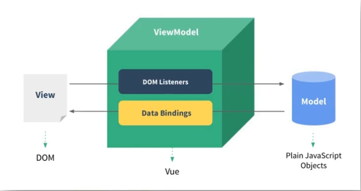

# 一、简介

## 1.1：是什么

Vue (读音 `/vjuː/`，类似于 view) 是一套用于构建用户界面的渐进式框架。与其它大型框架不同的是，Vue 被设计为可以自底向上逐层应用。Vue
的核心库只关注视图层，不仅易于上手，还便于与第三方库或既有项目整合。另一方面，当与现代化的工具链以及各种支持类库结合使用时，Vue
也完全能够为复杂的单页应用提供驱动。

## 1.2：vue3带来了什么

### 1.性能的提升

- 打包大小减少41%

- 初次渲染快55%, 更新渲染快133%

- 内存减少54%

  ......

### 2.源码的升级

- 使用Proxy代替defineProperty实现响应式

- 重写虚拟DOM的实现和Tree-Shaking

  ......

### 3.拥抱TypeScript

- Vue3可以更好的支持TypeScript

### 4.新的特性

1. Composition API（组合API）

   - setup配置
   - ref与reactive
   - watch与watchEffect
   - provide与inject
   - ......
2. 新的内置组件
   - Fragment
   - Teleport
   - Suspense
3. 其他改变

   - 新的生命周期钩子
   - data 选项应始终被声明为一个函数
   - 移除keyCode支持作为 v-on 的修饰符
   - ......

## 1.3：vue周边库

1. vue-cli: vue 脚手架

2. vue-resource

3. axios

4. vue-router: 路由

5. vuex: 状态管理

6. element-ui: 基于 vue 的 UI 组件库(PC 端)

## 1.4：MVVM模型

> 先了解一下vue[再来看](#三、VUE基础（一）)

### 1.简介

1. M：模型(Model) ：对应 data 中的数据

2. V：视图(View) ：模板

3. VM：视图模型(ViewModel) ： Vue 实例对象



### 2.代码

```java
<!DOCTYPE html>
<html>
	<head>
		<meta charset="UTF-8" />
		<title>理解MVVM</title>
		<!-- 引入Vue -->
		<script type="text/javascript" src="../js/vue.js"></script>
	</head>
	<body>
		<!-- 
			MVVM模型
						1. M：模型(Model) ：data中的数据
						2. V：视图(View) ：模板代码
						3. VM：视图模型(ViewModel)：Vue实例
			观察发现：
						1.data中所有的属性，最后都出现在了vm身上。
						2.vm身上所有的属性 及 Vue原型上所有属性，在Vue模板中都可以直接使用。
		-->
		<!-- 准备好一个容器-->
		<div id="root">
			<h1>学校名称：{{name}}</h1>
			<h1>学校地址：{{address}}</h1>
			<!-- <h1>测试一下1：{{1+1}}</h1>
			<h1>测试一下2：{{$options}}</h1>
			<h1>测试一下3：{{$emit}}</h1>
			<h1>测试一下4：{{_c}}</h1> -->
		</div>
	</body>

	<script type="text/javascript">
		Vue.config.productionTip = false //阻止 vue 在启动时生成生产提示。

		const vm = new Vue({
			el:'#root',
			data:{
				name:'尚硅谷',
				address:'北京',
			}
		})
		console.log(vm)
	</script>
</html>
```

### 3.总结

+ data中所有的属性，最后都出现在了vm身上。
+ vm身上所有的属性 及 Vue原型上所有属性，在Vue模板中都可以直接使用。


