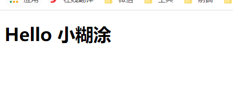

# 二、HelloWord

## 2.1：下载vue.js

vue.js

```java
https://cdn.jsdelivr.net/npm/vue@2
```

vue.min.js

```java
https://cdn.jsdelivr.net/npm/vue@2
```

## 2.2：创建html页面

```html
<!DOCTYPE html>
<html lang="en">
<head>
    <meta charset="UTF-8">
    <title>Title</title>
    <script type="text/javascript" src="../js/vue.js"></script>
</head>
<body>
<div id="app">
    <h1>Hello {{name}}</h1>
</div>
</body>
<script type="text/javascript">
    new Vue({
        el: "#app",
        data: {
            name: "小糊涂"
        }
    });

</script>
</html>
```

## 2.3：页面测试



## 2.4：总结

初识Vue：

1.想让Vue工作，就必须创建一个Vue实例，且要传入一个配置对象；

2.root容器里的代码依然符合html规范，只不过混入了一些特殊的Vue语法；

3.root容器里的代码被称为【Vue模板】；

4.Vue实例和容器是一一对应的；

5.真实开发中只有一个Vue实例，并且会配合着组件一起使用；

6.{{xxx}}中的xxx要写js表达式，且xxx可以自动读取到data中的所有属性；

7.一旦data中的数据发生改变，那么页面中用到该数据的地方也会自动更新；

```java
注意区分：js表达式 和 js代码(语句)
			1.表达式：一个表达式会产生一个值，可以放在任何一个需要值的地方：
						(1). a
						(2). a+b
						(3). demo(1)
						(4). x === y ? 'a' : 'b'

			2.js代码(语句)
						(1). if(){}
						(2). for(){}
```

## 2.5：注意

```java
Vue.config.productionTip = false //阻止 vue 在启动时生成生产提示。
```


