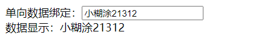

# 三、VUE基础（一）

> 基础既是核心

## 3.1：模板语法

### 1.简介

Vue.js 使用了基于 HTML 的模板语法，允许开发者声明式地将 DOM 绑定至底层 Vue 实例的数据。所有 Vue.js 的模板都是合法的
HTML，所以能被遵循规范的浏览器和 HTML 解析器解析。

在底层的实现上，Vue 将模板编译成虚拟 DOM 渲染函数。结合响应系统，Vue 能够智能地计算出最少需要重新渲染多少组件，并把 DOM
操作次数减到最少。

如果你熟悉虚拟 DOM 并且偏爱 JavaScript 的原始力量，你也可以不用模板，直接写渲染 (render) 函数，使用可选的 JSX 语法。

### 2.插值语法

#### 简介

数据绑定最常见的形式就是使用“Mustache”语法 (双大括号) 的文本插值：

```java
<span>Message: {{ msg }}</span>
```

Mustache 标签将会被替代为对应数据对象上 `msg` property 的值。无论何时，绑定的数据对象上 `msg` property 发生了改变，插值处的内容都会更新。

> 你的站点上动态渲染的任意 HTML
> 可能会非常危险，因为它很容易导致 [XSS 攻击](https://en.wikipedia.org/wiki/Cross-site_scripting)。请只对可信内容使用 HTML
> 插值，**绝不要**对用户提供的内容使用插值。

#### 案例

```java
<!DOCTYPE html>
<html lang="en">
<head>
  <meta charset="UTF-8">
  <title>Title</title>
  <script type="text/javascript" src="../js/vue.js"></script>
</head>
<body>
<div id="app">
  <h1>插值语法 ： {{name}}</h1>
</div>
</body>
<script type="text/javascript">
  new Vue({
    el: "#app",
    data:{
      name: "小糊涂"
    }
  });
</script>
</html>
```

### 3.指令语法

#### 简介

指令 (Directives) 是带有 `v-` 前缀的特殊 attribute。指令 attribute 的值预期是**单个 JavaScript 表达式** (`v-for`
是例外情况，稍后我们再讨论)。指令的职责是，当表达式的值改变时，将其产生的连带影响，响应式地作用于 DOM。回顾我们在介绍中看到的例子：

```java
<p v-if="seen">现在你看到我了</p>
```

这里，`v-if` 指令将根据表达式 `seen` 的值的真假来插入/移除 `<p>` 元素。

#### 案例

```java
<!DOCTYPE html>
<html>
<head>
  <meta charset="UTF-8" />
  <title>模板语法</title>
  <!-- 引入Vue -->
  <script type="text/javascript" src="../js/vue.js"></script>
</head>
<body>
<div id="root">
  <h1>插值语法</h1>
  <h3>你好，{{name}}</h3>
  <hr/>
  <h1>指令语法</h1>
  <a v-bind:href="school.url.toUpperCase()" x="hello">点我去{{school.name}}学习1</a>
  <a :href="school.url" x="hello">点我去{{school.name}}学习2</a>
</div>
</body>

<script type="text/javascript">
  new Vue({
    el:'#root',
    data:{
      name:'jack',
      school:{
        name:'百度',
        url:'http://www.baidu.com',
      }
    }
  })
</script>
</html>
```

### 4.总结

Vue模板语法有2大类：

+ 1.插值语法：
    + 功能：用于解析标签体内容。
    + 写法：{{xxx}}，xxx是js表达式，且可以直接读取到data中的所有属性。

+ 2.指令语法：

    + 功能：用于解析标签（包括：标签属性、标签体内容、绑定事件.....）。

 ```java
举例：v-bind:href="xxx" 或  简写为 :href="xxx"，xxx同样要写js表达式，且可以直接读取到data中的所有属性
 ```

+ 备注：Vue中有很多的指令，且形式都是：v-????，此处我们只是拿v-bind举个例子。

## 3.2：数据绑定

### 1.简介

vue中只有两种数据绑定：

+ 单向绑定(v-bind)：数据只能从data流向页面。
+ 双向绑定(v-model)：数据不仅能从data流向页面，还可以从页面流向data。

> 备注：
>
> + 双向绑定一般都应用在表单类元素上（如：input、select等）
> + v-model:value 可以简写为 v-model，因为v-model默认收集的就是value值。

### 2.单项绑定

#### 简介

> 数据只能从data流向页面。

#### 代码

```java
<!DOCTYPE html>
<html>
<head>
    <meta charset="UTF-8" />
    <title>demo</title>
    <script type="text/javascript" src="../js/vue.js"></script>
</head>
<body>
<div id="root">
<!--  普通写法
  单向数据绑定：<input type="text" v-bind:value="name"><br/>-->

    <!--简写-->
    单向数据绑定：<input type="text" :value="name"><br/>
    数据显示：{{name}}
</div>
</body>

<script type="text/javascript">
    new Vue({
        el:'#root',
        data:{
            name:'小糊涂'
        }
    })
</script>
</html>
```

#### 测试

> 输入框输入内容观察数据显示的数据是否会变化？（不会变）


### 3.双向数据绑定

#### 简介

据不仅能从data流向页面，还可以从页面流向data。

#### 代码

```java
<!DOCTYPE html>
<html>
<head>
    <meta charset="UTF-8" />
    <title>demo</title>
    <script type="text/javascript" src="../js/vue.js"></script>
</head>
<body>
<div id="root">
<!--  普通写法
  单向数据绑定：<input type="text" v-model:value="name"><br/>-->
    <!--简写-->
    双向数据绑定：<input type="text" v-model="name"><br/>
    数据显示：{{name}}
</div>
</body>

<script type="text/javascript">
    new Vue({
        el:'#root',
        data:{
            name:'小糊涂'
        }
    })
</script>
</html>
```

##### 测试

> 输入框输入内容观察数据显示的数据是否会变化？（会变）




### 4.注意

使用双向绑定时：`v-model`不能这样写：

```java
<!-- 如下代码是错误的，因为v-model只能应用在表单类元素（输入类元素）上 -->
<!-- <h2 v-model:x="name">你好啊</h2> -->
```

## 3.3：VUE实例中的写法

### 1.简介


### 2.el的写法

#### 示例

```java
<!DOCTYPE html>
<html>
<head>
    <meta charset="UTF-8"/>
    <title>demo</title>
    <script type="text/javascript" src="../js/vue.js"></script>
</head>
<body>
<div id="root">
    <h1>hello {{name}}</h1>
</div>
</body>

<script type="text/javascript">
    //el的两种写法
    const v = new Vue({
        //el:'#root', //第一种写法
        data: {
            name: '尚硅谷'
        }
    })
    console.log(v)
    v.$mount('#root') //第二种写法
</script>
</html>
```

#### 总结

(1).new Vue时候配置el属性。

(2).先创建Vue实例，随后再通过vm.$mount('#root')指定el的值。

### 3.data写法

#### 示例

```java
<!DOCTYPE html>
<html>
<head>
  <meta charset="UTF-8" />
  <title>demo</title>
  <script type="text/javascript" src="../js/vue.js"></script>
</head>
<body>
<div id="root">
  <h1>hello {{name}}</h1>
</div>
</body>

<script type="text/javascript">
  new Vue({
    el:'#root',
/*    data:{
      name:'小糊涂' 第一种
    }*/
    data(){
      return {
        name: "小糊涂" //第二种
      }
    }
  })
</script>
</html>
```

#### 总结

+ 对象式
+ 函数式
    + 如何选择：目前哪种写法都可以，以后学习到组件时，data必须使用函数式，否则会报错。

### 4.注意

> 由Vue管理的函数，一定不要写箭头函数，一旦写了箭头函数，this就不再是Vue实例了。

## 3.4：数据治理

> 鼎鼎有名的Vue.js实现数据双向绑定的原理就是用的Object.defineProperty，

### 1.Object.defineproperty方法

#### 语法

```java
Object.defineProperty(obj, prop, descriptor)
```

+ obj：需要定义属性的对象
+ prop：需要定义的属性
+ descriptor：属性的描述描述符
+ 返回值：返回此对象

#### 例子

```java
let  obj = Object.create(null);
let descriptor = {
    configurable:false,
    writable:false,
    enumerable:false,
    value:'hello world'
};
Object.defineProperty(obj,'hello',descriptor);
 
console.log(obj.hello);//hello world
```

#### 数据描述符

数据描述符是一个具有值的属性，该值可能是可写的，也可能是不可写的。

它具有以下可选的键值：

+ configurable：表示该属性能否通过delete删除，能否修改属性的特性或者能否修改访问器属性，默认为false。当且仅当该属性的configurable为true时，才能实现上述行为。

+ enumerable：表示该属性是否可以枚举，即可否通过for..in访问属性。默认为false。

+ value：表示该属性的值。可以是任何有效的JS值。默认为undefined。

+ writable：表示该属性的值是否可写，默认为false。当且仅当属性的writable为true时，其值才能被赋值运算符改变。

```java
    var obj = {
        test: "hello"
    }
    for (let objKey in obj) {
        console.log(objKey)
    }
    //对象已有的属性添加特性描述
    Object.defineProperty(obj, "test", {
        configurable: true | false,
        enumerable: true | false,
        value: '任意类型的值',
        writable: true | false
    });
    //对象新添加的属性的特性描述
    Object.defineProperty(obj, "newKey", {
        configurable: true | false,
        enumerable: true | false,
        value: '任意类型的值',
        writable: true | false
    });
    console.log(obj)
    for (let objKey in obj) {
        console.log(objKey)
    }
```

#### **存取器描述**

当使用存取器描述属性的特性的时候，允许设置以下特性属性：

```java
var obj = {};
Object.defineProperty(obj,"newKey",{
    get:function (){} | undefined,
    set:function (value){} | undefined
    configurable: true | false
    enumerable: true | false
});
```

#### 注意

**注意：当使用了getter或setter方法，不允许使用writable和value这两个属性**

#### **getter/setter**

当设置或获取对象的某个属性的值的时候，可以提供getter/setter方法。

- getter 是一种获得属性值的方法
- setter是一种设置属性值的方法。

在特性中使用get/set属性来定义对应的方法。

```java
<!DOCTYPE html>
<html>
<head>
  <meta charset="UTF-8" />
  <title>demo</title>
  <script type="text/javascript" src="../js/vue.js"></script>
</head>
<body>
<div id="root">
  <h1>hello {{name}}</h1>
</div>
</body>

<script>
  var obj = {};
  var initValue = 'hello';
  Object.defineProperty(obj,"newKey",{
    get:function (){
      console.log('当获取值的时候触发的函数')
      return initValue;
    },
    set:function (value){
      console.log('当设置值的时候触发的函数,设置的新值通过参数value拿到')
      initValue = value;
    }
  });
  //获取值
  console.log( obj.newKey );  //hello
  //设置值
  obj.newKey = 'change value';
  console.log( obj.newKey ); //change value

</script>
</html>
```

#### 个人小总结

如果结合java来说这些东西就好比java中的get/set方法

### 2.何为数据代理

数据代理：通过一个对象代理对另一个对象中属性的操作（读/写）

```java
<!DOCTYPE html>
<html>
	<head>
		<meta charset="UTF-8" />
		<title>何为数据代理</title>
	</head>
	<body>
		<!-- 数据代理：通过一个对象代理对另一个对象中属性的操作（读/写）-->
		<script type="text/javascript" >
			let obj = {x:100}
			let obj2 = {y:200}

			Object.defineProperty(obj2,'x',{
				get(){
					return obj.x
				},
				set(value){
					obj.x = value
				}
			})
		</script>
	</body>
</html>
```

### 3.Vue中的数据代理

+ 1.Vue中的数据代理：
    + 通过vm对象来代理data对象中属性的操作（读/写）
+ 2.Vue中数据代理的好处：
    + 更加方便的操作data中的数据
+ 3.基本原理：
    + 通过Object.defineProperty()把data对象中所有属性添加到vm上。
    + 为每一个添加到vm上的属性，都指定一个getter/setter。
    + 在getter/setter内部去操作（读/写）data中对应的属性。

## 3.5：event对象

Event 对象代表事件的状态，比如事件在其中发生的元素、键盘按键的状态、鼠标的位置、鼠标按钮的状态。

事件通常与函数结合使用，函数不会在事件发生前被执行！

详情请看下面：

https://www.cnblogs.com/zxktxj/archive/2012/02/26/2369176.html

https://www.w3school.com.cn/htmldom/dom_obj_event.asp

## 3.6：事件处理

### 1.简介

1.使用v-on:xxx 或 @xxx 绑定事件，其中xxx是事件名；

2.事件的回调需要配置在methods对象中，最终会在vm上；

3.methods中配置的函数，不要用箭头函数！否则this就不是vm了；

4.methods中配置的函数，都是被Vue所管理的函数，this的指向是vm 或 组件实例对象；

5.@click="demo" 和 @click="demo($event)" 效果一致，但后者可以传参；

### 2.代码

```java
<!DOCTYPE html>
<html>
<head>
    <meta charset="UTF-8"/>
    <title>demo</title>
    <script type="text/javascript" src="../js/vue.js"></script>
</head>
<body>
<div id="root">
    <h1>hello {{name}}</h1>
    <button v-on:click="showInfo1">点我提示信息1（不传参）</button>
    <!--简写-->
    <button @click="showInfo2($event,66)">点我提示信息2（传参）</button>
</div>
</body>

<script type="text/javascript">
    new Vue({
        el: '#root',
        data: {
            name: '小糊涂'
        }, methods: {
            showInfo1(event) {
                alert(1)
            },
            showInfo2(event, Number) {
                console.log(event,Number)
                alert(Number)
            }
        }
    })
</script>
</html>
```

### 3.注意

注意：我们使用@click可以使用一些简单的语句

```java
<button @click="isHost=!isHost">点击切换</button>  isHost:是布尔类型
```

## 3.7：事件修饰符

### 1.简介

1.prevent：阻止默认事件（常用）；

2.stop：阻止事件冒泡（常用）；

3.once：事件只触发一次（常用）；

4.capture：使用事件的捕获模式；

5.self：只有event.target是当前操作的元素时才触发事件；

6.passive：事件的默认行为立即执行，无需等待事件回调执行完毕；

### 2.代码

```java
<!DOCTYPE html>
<html>
<head>
    <meta charset="UTF-8" />
    <title>事件修饰符</title>
    <!-- 引入Vue -->
    <script type="text/javascript" src="../js/vue.js"></script>
    <style>
        *{
            margin-top: 20px;
        }
        .demo1{
            height: 50px;
            background-color: skyblue;
        }
        .box1{
            padding: 5px;
            background-color: skyblue;
        }
        .box2{
            padding: 5px;
            background-color: orange;
        }
        .list{
            width: 200px;
            height: 200px;
            background-color: peru;
            overflow: auto;
        }
        li{
            height: 100px;
        }
    </style>
</head>
<body>
<!-- 准备好一个容器-->
<div id="root">
    <h2>欢迎来到{{name}}学习</h2>
   <h3>阻止默认事件（常用）</h3>
    <a href="http://www.baidu.com" @click="showInfo">点我提示信息</a>
    <a href="http://www.baidu.com" @click.prevent="showInfo">点我提示信息.prevent</a>
    <h3>阻止事件冒泡（常用）</h3>
    <div class="demo1" @click="showInfo">
        <button @click.stop="showInfo">点我提示信息</button>
        <button @click="showInfo">点我提示信息.stop</button>
        <!-- 修饰符可以连续写 -->
       <a href="http://www.baidu.com" @click.prevent.stop="showInfo">点我提示信息</a>
       <a href="http://www.baidu.com" @click="showInfo">点我提示信息.prevent.stop</a>
    </div>
   <h3>事件只触发一次（常用）</h3>
    <button @click.once="showInfo">点我提示信息</button>
    <button @click="showInfo">点我提示信息.once</button>
    <h3>使用事件的捕获模式</h3>
    <div class="box1" @click.capture="showMsg(1)">
        div1
        <div class="box2" @click="showMsg(2)">
            div2
        </div>
    </div>
    <div class="box1" @click="showMsg(1)">
        div1.capture
        <div class="box2" @click="showMsg(2)">
            div2.capture
        </div>
    </div>
    <h3>只有event.target是当前操作的元素时才触发事件；</h3>
    <div class="demo1" @click.self="showInfo">
        <button @click="showInfo">点我提示信息</button>
    </div>

    <h3>事件的默认行为立即执行，无需等待事件回调执行完毕；</h3>
    <ul passive="demo" class="list">
        <li>1</li>
        <li>2</li>
        <li>3</li>
        <li>4</li>
    </ul>
    <ul @wheel.passive="demo" class="list">
        <li>1@wheel.</li>
        <li>2@wheel.</li>
        <li>3@wheel.</li>
        <li>4@wheel.</li>
    </ul>
</div>
</body>

<script type="text/javascript">
    Vue.config.productionTip = false //阻止 vue 在启动时生成生产提示。

    new Vue({
        el:'#root',
        data:{
            name:'小糊涂'
        },
        methods:{
            showInfo(e){
                alert('同学你好！')
                // console.log(e.target)
            },
            showMsg(msg){
                console.log(msg)
            },
            demo(){
                for (let i = 0; i < 100000; i++) {
                    console.log('#')
                }
                console.log('累坏了')
            }
        }
    })
</script>
</html>
```

## 3.8：键盘事件

### 1.简介

+ Vue中常用的按键别名：
    + 回车 => enter
    + 删除 => delete (捕获“删除”和“退格”键)
    + 退出 => esc
    + 空格 => space
    + 换行 => tab (特殊，必须配合keydown去使用)
    + 上 => up
    + 下 => down
    + 左 => left
    + 右 => right

+ Vue未提供别名的按键，可以使用按键原始的key值去绑定，但注意要转为kebab-case（短横线命名）

+ 系统修饰键（用法特殊）：ctrl、alt、shift、meta
    + 配合keyup使用：按下修饰键的同时，再按下其他键，随后释放其他键，事件才被触发。
    + 配合keydown使用：正常触发事件。
    + 配合keypress使用：键盘按住时触发

+ 也可以使用keyCode去指定具体的按键（不推荐）
+ Vue.config.keyCodes.自定义键名 = 键码，可以去定制按键别名

### 2.代码

```java
<!DOCTYPE html>
<html>
<head>
    <meta charset="UTF-8"/>
    <title>键盘事件</title>
    <!-- 引入Vue -->
    <script type="text/javascript" src="../js/vue.js"></script>
</head>
<body>
<!-- 准备好一个容器-->
<div id="root">
    <h2>欢迎来到{{name}}学习</h2>
    <input type="text" placeholder="按下回车提示输入" @keyup="showInfo">
    <input type="text" placeholder="按下回车提示输入" @keyup.enter="showInfo">
    <input type="text" placeholder="按下回车提示输入" @keyup.huiche="showInfo">
    <input type="text" placeholder="按下回车提示输入" @keydown="showInfo">
    <input type="text" placeholder="按下回车提示输入" @keydown.enter="showInfo">
    <input type="text" placeholder="按下回车提示输入" @keydown.huiche="showInfo">
    <input type="text" placeholder="按下回车提示输入" @keypress="showInfo">
    <input type="text" placeholder="按下回车提示输入" @keypress.enter="showInfo">
    <input type="text" placeholder="按下回车提示输入" @keypress.huiche="showInfo">
</div>
</body>

<script type="text/javascript">
    Vue.config.keyCodes.huiche = 13 //定义了一个别名按键
    new Vue({
        el: '#root',
        data: {
            name: '尚硅谷'
        },
        methods: {
            showInfo(e) {
                console.log(e.key, e.keyCode,e.target.value)
            }
        },
    })
</script>
</html>
```

### 3.组合键盘

```html
<!--ALT+E-->     
<input type="text" placeholder="按下回车提示输入" @keydown.alt.e="showInfo">
<!--CTRL+E-->    
<input type="text" placeholder="按下回车提示输入" @keydown.ctrl.e="showInfo">
```

## 3.9：计算属性

### 1.姓名案例


当姓输入超过三个字的时候只显示前面三个后面的忽略掉

### 2.插值语法实现

```java
<!DOCTYPE html>
<html>
<head>
    <meta charset="UTF-8"/>
    <title>demo</title>
    <script type="text/javascript" src="../js/vue.js"></script>
</head>
<body>
<div id="root">
    姓：<input type="text" v-model="surname"><br>
    名：<input type="text" v-model="name"><br>
    全名: {{surname.length>=3?surname.substr(0,3):surname}}-{{name}}
</div>
</body>

<script type="text/javascript">
    new Vue({
        el: '#root',
        data: {
            surname: '张',
            name: '三'
        }
    })
</script>
</html>
```

### 3.methods实现

```java
<!DOCTYPE html>
<html>
<head>
  <meta charset="UTF-8"/>
  <title>demo</title>
  <script type="text/javascript" src="../js/vue.js"></script>
</head>
<body>
<div id="root">
  姓：<input type="text" v-model="surname"><br>
  名：<input type="text" v-model="name"><br>
  全名: {{getFullName()}}<br>
  全名: {{getFullName}}  这里是错误的页面打开观看
</div>
</body>

<script type="text/javascript">
  new Vue({
    el: '#root',
    data: {
      surname: '张',
      name: '三'
    },methods:{
      getFullName(){
        return  this.surname.length>=3?this.surname.substr(0,3):this.surname + '-' + this.name
      }
    }
  })
</script>
</html>
```

### 4.计算属性简介

+ 定义：要用的属性不存在，要通过已有属性计算得来。
+ 原理：底层借助了Objcet.defineproperty方法提供的getter和setter。
+ get函数什么时候执行？
    + 初次读取时会执行一次。
    + 当依赖的数据发生改变时会被再次调用。
+ 优势：与methods实现相比，内部有缓存机制（复用），效率更高，调试方便。
+ 备注：
    + 计算属性最终会出现在vm上，直接读取使用即可。
    + 如果计算属性要被修改，那必须写set函数去响应修改，且set中要引起计算时依赖的数据发生改变。

### 5.计算属性实现

```java
<!DOCTYPE html>
<html>
<head>
    <meta charset="UTF-8"/>
    <title>demo</title>
    <script type="text/javascript" src="../js/vue.js"></script>
</head>
<body>
<div id="root">
    姓：<input type="text" v-model="surname"><br>
    名：<input type="text" v-model="name"><br>
    全名: {{getFullName}}
<!--    全名: {{getFullName()}}-->
</div>
</body>

<script type="text/javascript">
    new Vue({
        el: '#root',
        data: {
            surname: '张',
            name: '三'
        }, methods: {}, computed: {
            getFullName: {
                get() {
                    console.log("get被调用")
                    return this.surname.length>=3?this.surname.substr(0,3):this.surname + '-' + this.name;
                },set(value){
                    console.log("set被调用")
                    const arr = value.split('-')
                    this.firstName = arr[0]
                    this.lastName = arr[1]
                }
            }
        }
    })
</script>
</html>
```

### 6.计算属性简写

```java
<!DOCTYPE html>
<html>
<head>
    <meta charset="UTF-8"/>
    <title>demo</title>
    <script type="text/javascript" src="../js/vue.js"></script>
</head>
<body>
<div id="root">
    姓：<input type="text" v-model="surname"><br>
    名：<input type="text" v-model="name"><br>
    全名: {{getFullName}}
    <!--    全名: {{getFullName()}}-->
</div>
</body>

<script type="text/javascript">
    new Vue({
        el: '#root',
        data: {
            surname: '张',
            name: '三'
        }, methods: {}, computed: {
            getFullName: function () {
                console.log("get被调用")
                return this.surname.length >= 3 ? this.surname.substr(0, 3) : this.surname + '-' + this.name;
            }
        }
    })
</script>
</html>
```

### 7.有用吗?

你可能已经注意到我们可以通过在表达式中调用方法来达到同样的效果：

```java
<p>Reversed message: "{{ reversedMessage() }}"</p>
```

```java
// 在组件中
methods: {
  reversedMessage: function () {
    return this.message.split('').reverse().join('')
  }
}
```

我们可以将同一函数定义为一个方法而不是一个计算属性。两种方式的最终结果确实是完全相同的。然而，不同的是*
*计算属性是基于它们的响应式依赖进行缓存的**。只在相关响应式依赖发生改变时它们才会重新求值。这就意味着只要 `message`
还没有发生改变，多次访问 `reversedMessage` 计算属性会立即返回之前的计算结果，而不必再次执行函数。

这也同样意味着下面的计算属性将不再更新，因为 `Date.now()` 不是响应式依赖：

```javascript
computed: {
  now: function () {
    return Date.now()
  }
}
```

相比之下，每当触发重新渲染时，调用方法将**总会**再次执行函数。

我们为什么需要缓存？假设我们有一个性能开销比较大的计算属性 **A**，它需要遍历一个巨大的数组并做大量的计算。然后我们可能有其他的计算属性依赖于
**A**。如果没有缓存，我们将不可避免的多次执行 **A** 的 getter！如果你不希望有缓存，请用方法来替代。

```java
<!DOCTYPE html>
<html>
<head>
    <meta charset="UTF-8"/>
    <title>demo</title>
    <script type="text/javascript" src="../js/vue.js"></script>
</head>
<body>
<div id="root">
    <input type="number" v-model="count">
    <h1>获取结果值testMethods: {{testMethods()}}</h1>
    <h1>获取结果值testMethods: {{testMethods()}}</h1>
    <h1>获取结果值test: {{test}}</h1>
    <h1>获取结果值test: {{test}}</h1>
    <h1>获取结果值test: {{test}}</h1>
</div>
</body>

<script type="text/javascript">
    const vm = new Vue({
            el: '#root',
            data() {
                return {
                    count: 1000
                }
            },
            methods: {
                testMethods(){
                    var result = 0;
                    console.log("testMethods")
                    for (let i = 0; i < this.count; i++) {
                        result += i
                    }
                    return result;
                }
            },
            computed: {
                test: function () {
                    var result = 0;
                    console.log("执行了test")
                    for (let i = 0; i < this.count; i++) {
                        result += i
                    }
                    return result;
                }
            }
        })
    ;
</script>
</html>
```


## 3.10：监视属性

### 1.天气切换案例


点击切换天气，天气为凉爽炎热

### 2.计算属性实现

```java
<!DOCTYPE html>
<html>
<head>
    <meta charset="UTF-8"/>
    <title>demo</title>
    <script type="text/javascript" src="../js/vue.js"></script>
</head>
<body>
<div id="root">
    <h1>今天天气很{{info}}</h1>
    <button @click="changeInfo">点击切换天气</button>
    <!--简写-->
    <button @click="isHost=!isHost">点击切换天气</button>
</div>
</body>

<script type="text/javascript">
    new Vue({
        el: '#root',
        data: {
            isHost: true
        }, computed: {
            info() {
                return this.isHost ? '炎热' : '凉爽';
            }
        }, methods: {
            changeInfo() {
                this.isHost=!this.isHost
            }
        }
    })
</script>
</html>
```

### 3.简介

监视属性watch：
1.当被监视的属性变化时, 回调函数自动调用, 进行相关操作
2.监视的属性必须存在，才能进行监视！！
3.监视的两种写法：
(1).new Vue时传入watch配置
(2).通过vm.$watch监视

### 4.监视属性实现

```java
<!DOCTYPE html>
<html>
<head>
    <meta charset="UTF-8"/>
    <title>监视属性</title>
    <script type="text/javascript" src="../js/vue.js"></script>
</head>
<body>
<div id="root">
    <h1>今天天气很{{info}}</h1>
    <button @click="changeInfo">点击切换天气</button>
    <!--简写-->
    <button @click="isHost=!isHost">点击切换天气</button>
</div>
</body>

<script type="text/javascript">
    new Vue({
        el: '#root',
        data: {
            isHost: true
        }, computed: {
            info() {
                return this.isHost ? '炎热' : '凉爽';
            }
        }, methods: {
            changeInfo() {
                this.isHost = !this.isHost
            }
        }, watch: {
            isHost: {
                handler(newArg,oldArg) {
                    console.log("发生了改变"+newArg,oldArg)
                }
            }
        }
    })
</script>
</html>
```

### 5.监视属性实现二

```java
<!DOCTYPE html>
<html>
<head>
    <meta charset="UTF-8"/>
    <title>监视属性</title>
    <script type="text/javascript" src="../js/vue.js"></script>
</head>
<body>
<div id="root">
    <h1>今天天气很{{info}}</h1>
    <button @click="changeInfo">点击切换天气</button>
    <!--简写-->
    <button @click="isHost=!isHost">点击切换天气</button>
</div>
</body>

<script type="text/javascript">
    const vm = new Vue({
        el: '#root',
        data: {
            isHost: true
        }, computed: {
            info() {
                return this.isHost ? '炎热' : '凉爽';
            }
        }, methods: {
            changeInfo() {
                this.isHost = !this.isHost
            }
        }
    });
    vm.$watch("isHost", function (newArg, oldArg) {
        console.log("发生了改变" + newArg, oldArg)
    })
</script>
</html>
```

### 6.初始化时执行


### 7.深度监视

> 深度监视：
> (1).Vue中的watch默认不监测对象内部值的改变（一层）。
> (2).配置deep:true可以监测对象内部值改变（多层）。
> 备注：
> (1).Vue自身可以监测对象内部值的改变，但Vue提供的watch默认不可以！
> (2).使用watch时根据数据的具体结构，决定是否采用深度监视。

```java
<!DOCTYPE html>
<html>
<head>
    <meta charset="UTF-8"/>
    <title>监视属性</title>
    <script type="text/javascript" src="../js/vue.js"></script>
</head>
<body>
<div id="root">
    <h1>今天天气很{{info}}</h1>
    <button @click="changeInfo">点击切换天气</button>
    <!--简写-->
    <button @click="isHost=!isHost">点击切换天气</button>
    <hr>
    <h3>age的值是:{{users.age}}</h3>
    <button @click="users.age++">点我让age+1</button>
    <h3>money的值是:{{users.money}}</h3>
    <button @click="users.money++">点我让money+1</button>
    <button @click="users = {age:666,money:888}">彻底替换掉users</button>
    {{users.d}}
</div>
</body>

<script type="text/javascript">
    new Vue({
        el: '#root',
        data: {
            isHost: true,
            users:{
                age:18,
                money:100
            }
        }, computed: {
            info() {
                return this.isHost ? '炎热' : '凉爽';
            }
        }, methods: {
            changeInfo() {
                this.isHost = !this.isHost
            }
        }, watch: {
            users: {
                deep: true,
                handler(newArg,oldArg) {
                    console.log("发生了改变"+newArg,oldArg)
                }
            }
        }
    })
</script>
</html>
```

### 8.简写形式

当我们监视的属性很简单，而且只用到了handle属性，那么我们可以简写

```java
<script type="text/javascript">
  const  vm = new Vue({
        el: '#root',
        data: {
            isHost: true
        }, computed: {
            info() {
                return this.isHost ? '炎热' : '凉爽';
            }
        }, methods: {
            changeInfo() {
                this.isHost = !this.isHost
            }
        }, watch: {
            isHost(newArg,oldArg){
                console.log("发生了改变"+newArg,oldArg)
            }
     /*       isHost: {
                handler(newArg,oldArg) {
                    console.log("发生了改变"+newArg,oldArg)
                }
            }*/
        }
    })
    //正常写法
    /* vm.$watch('isHot',{
        immediate:true, //初始化时让handler调用一下
        deep:true,//深度监视
        handler(newValue,oldValue){
            console.log('isHot被修改了',newValue,oldValue)
        }
    }) */

    //简写
    /* vm.$watch('isHot',(newValue,oldValue)=>{
        console.log('isHot被修改了',newValue,oldValue,this)
    }) */
</script>
```


