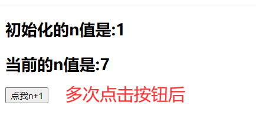
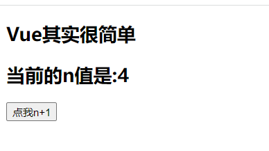

# 五、VUE基础(三)

## 5.1：v-cloak

### 1.简介

这个指令保持在元素上直到关联实例结束编译。和 CSS 规则如 `[v-cloak] { display: none }` 一起用时，这个指令可以隐藏未编译的
Mustache 标签直到实例准备完毕。

1.本质是一个特殊属性，Vue实例创建完毕并接管容器后，会删掉v-cloak属性。
2.使用css配合v-cloak**可以解决网速慢时页面展示出{{xxx}}的问题。**

### 2.代码

```java
<!DOCTYPE html>
<html>
<head>
  <meta charset="UTF-8" />
  <title>v-cloak指令</title>
  <style>
    [v-cloak]{
      display:none;
    }
  </style>
  <!-- 引入Vue -->
</head>
<body>
<!--
        v-cloak指令（没有值）：
                1.本质是一个特殊属性，Vue实例创建完毕并接管容器后，会删掉v-cloak属性。
                2.使用css配合v-cloak可以解决网速慢时页面展示出{{xxx}}的问题。
-->
<!-- 准备好一个容器-->
<div id="root">
  <h2 v-cloak>{{name}}</h2>
</div>
<script type="text/javascript" src="http://localhost:8080/resource/5s/vue.js"></script><!--没有这个服务-->
</body>

<script type="text/javascript">
  console.log(1)
  Vue.config.productionTip = false //阻止 vue 在启动时生成生产提示。

  new Vue({
    el:'#root',
    data:{
      name:'尚硅谷'
    }
  })
</script>
</html>
```

### 3.测试

打开网页一片空白

## 5.2：v-once

### 1.简介

1.v-once所在节点在初次动态渲染后，就视为静态内容了。

2.以后数据的改变不会引起v-once所在结构的更新，可以用于优化性能。

> 只渲染元素和组件**一次**。随后的重新渲染，元素/组件及其所有的子节点将被视为静态内容并跳过。这可以用于优化更新性能。

### 2.代码

```java
<!DOCTYPE html>
<html>
<head>
    <meta charset="UTF-8" />
    <title>v-once指令</title>
    <!-- 引入Vue -->
    <script type="text/javascript" src="../js/vue.js"></script>
</head>
<body>
<!--
    v-once指令：
                1.v-once所在节点在初次动态渲染后，就视为静态内容了。
                2.以后数据的改变不会引起v-once所在结构的更新，可以用于优化性能。
-->
<!-- 准备好一个容器-->
<div id="root">
    <h2 v-once>初始化的n值是:{{n}}</h2>
    <h2>当前的n值是:{{n}}</h2>
    <button @click="n++">点我n+1</button>
</div>
</body>

<script type="text/javascript">
    Vue.config.productionTip = false //阻止 vue 在启动时生成生产提示。

    new Vue({
        el:'#root',
        data:{
            n:1
        }
    })
</script>
</html>
```

### 3.测试



### 4.注意

v-once和@click.once是不一样的，一个是事件修饰符，一个是标签

## 5.3：v-pre

### 1.简介

+ 1.跳过其所在节点的编译过程。
+ 2.可利用它跳过：没有使用指令语法、没有使用插值语法的节点，会加快编译。

### 2.代码

```java
<!DOCTYPE html>
<html>
	<head>
		<meta charset="UTF-8" />
		<title>v-pre指令</title>
		<!-- 引入Vue -->
		<script type="text/javascript" src="../js/vue.js"></script>
	</head>
	<body>
		<!-- 
			v-pre指令：
					1.跳过其所在节点的编译过程。
					2.可利用它跳过：没有使用指令语法、没有使用插值语法的节点，会加快编译。
		-->
		<!-- 准备好一个容器-->
		<div id="root">
			<h2 v-pre>Vue其实很简单</h2>
			<h2 >当前的n值是:{{n}}</h2>
			<button @click="n++">点我n+1</button>
		</div>
	</body>

	<script type="text/javascript">
		Vue.config.productionTip = false //阻止 vue 在启动时生成生产提示。

		new Vue({
			el:'#root',
			data:{
				n:1
			}
		})
	</script>
</html>
```

### 3.测试



## 5.4：自定义指令

### 1.简介

```java
需求1：定义一个v-big指令，和v-text功能类似，但会把绑定的数值放大10倍。
需求2：定义一个v-fbind指令，和v-bind功能类似，但可以让其所绑定的input元素默认获取焦点。
自定义指令总结：
一、定义语法：
(1).局部指令：
new Vue({							new Vue({
directives:{指令名:配置对象}   或   		directives{指令名:回调函数}
}) 									})
(2).全局指令：
Vue.directive(指令名,配置对象) 或   Vue.directive(指令名,回调函数)

二、配置对象中常用的3个回调：
(1).bind：指令与元素成功绑定时调用。
(2).inserted：指令所在元素被插入页面时调用。
(3).update：指令所在模板结构被重新解析时调用。

三、备注：
1.指令定义时不加v-，但使用时要加v-；
2.指令名如果是多个单词，要使用kebab-case命名方式，不要用camelCase命名。
```

### 2.代码

```java
<!DOCTYPE html>
<html>
	<head>
		<meta charset="UTF-8" />
		<title>自定义指令</title>
		<script type="text/javascript" src="../js/vue.js"></script>
	</head>
	<body>
		<!-- 准备好一个容器-->
		<div id="root">
			<h2>{{name}}</h2>
			<h2>当前的n值是：<span v-text="n"></span> </h2>
			<!-- <h2>放大10倍后的n值是：<span v-big-number="n"></span> </h2> -->
			<h2>放大10倍后的n值是：<span v-big="n"></span> </h2>
			<button @click="n++">点我n+1</button>
			<hr/>
			<input type="text" v-fbind:value="n">
		</div>
	</body>
	
	<script type="text/javascript">
		Vue.config.productionTip = false

		//定义全局指令
		/* Vue.directive('fbind',{
			//指令与元素成功绑定时（一上来）
			bind(element,binding){
				element.value = binding.value
			},
			//指令所在元素被插入页面时
			inserted(element,binding){
				element.focus()
			},
			//指令所在的模板被重新解析时
			update(element,binding){
				element.value = binding.value
			}
		}) */

		new Vue({
			el:'#root',
			data:{
				name:'小糊涂',
				n:1
			},
			directives:{
				//big函数何时会被调用？1.指令与元素成功绑定时（一上来）。2.指令所在的模板被重新解析时。
				/* 'big-number'(element,binding){
					// console.log('big')
					element.innerText = binding.value * 10
				}, */
				big(element,binding){
					console.log('big',this) //注意此处的this是window
					// console.log('big')
					element.innerText = binding.value * 10
				},
				fbind:{
					//指令与元素成功绑定时（一上来）
					bind(element,binding){
						element.value = binding.value
					},
					//指令所在元素被插入页面时
					inserted(element,binding){
						element.focus()
					},
					//指令所在的模板被重新解析时
					update(element,binding){
						element.value = binding.value
					}
				}
			}
		})
		
	</script>
</html>
```

## 5.6：生命周期

### 1.简介

每个`Vue`实例在被创建时都要经过一系列的初始化过程，例如：需要设置数据的监听，编译模板，将实例挂载到`DOM`
上，并且在数据变化时更新`DOM`等，这些过程统称为`Vue`实例的`生命周期`。同时在这个过程中也会运行一些叫做**生命周期钩子**
的函数，这给了用户在不同阶段添加自己的代码的机会。

其实`Vue`实例的生命周期，主要分为三个阶段，每个阶段都会执行不同的钩子函数，分别为

- 挂载(初始化相关属性,例如`watch`属性，`method`属性)

    1. `beforeCreate`
    2. `created`
    3. `beforeMount`
    4. `mounted`

- 更新(元素或组件的变更操作)

    1. `beforeUpdate`
    2. `updated`

- 销毁（销毁相关属性）

-
    1. `beforeDestroy`
    2. `destroyed`

### 2.图视


### 3.钩子函数简介

所有生命周期钩子的 `this` 上下文将自动绑定至实例中，因此你可以访问 data、computed 和 methods。这意味着*
*你不应该使用箭头函数来定义一个生命周期方法** (例如 `created: () => this.fetchTodos()`)
。因为箭头函数绑定了父级上下文，所以 `this` 不会指向预期的组件实例，并且`this.fetchTodos` 将会是 undefined。

### 4.beforeCreate

- **类型**：`Function`

- **详细**：

  在实例初始化之后,进行数据侦听和事件/侦听器的配置之前同步调用。

- **参考**：[生命周期图示](#2.图视)

### 5.created

- **类型**：`Function`

- **详细**：

  在实例创建完成后被立即同步调用。在这一步中，实例已完成对选项的处理，意味着以下内容已被配置完毕：数据侦听、计算属性、方法、事件/侦听器的回调函数。然而，挂载阶段还没开始，且 `$el`
  property 目前尚不可用。

- **参考**：[生命周期图示](#2.图视)

### 6.beforeMount

- **类型**：`Function`

- **详细**：

  在挂载开始之前被调用：相关的 `render` 函数首次被调用。

  **该钩子在服务器端渲染期间不被调用。**

- **参考**：[生命周期图示](#2.图视)

### 7.mounted

- **类型**：`Function`

- **详细**：

  实例被挂载后调用，这时 `el` 被新创建的 `vm.$el` 替换了。如果根实例挂载到了一个文档内的元素上，当 `mounted`
  被调用时 `vm.$el` 也在文档内。

  注意 `mounted` **不会**保证所有的子组件也都被挂载完成。如果你希望等到整个视图都渲染完毕再执行某些操作，可以在 `mounted`
  内部使用 [vm.$nextTick](https://cn.vuejs.org/v2/api/#vm-nextTick)：

  ```java
  mounted: function () {
    this.$nextTick(function () {
      // 仅在整个视图都被渲染之后才会运行的代码
    })
  }
  ```

  **该钩子在服务器端渲染期间不被调用。**

- **参考**：[生命周期图示](#2.图视)

### 8.beforeUpdate

- **类型**：`Function`

- **详细**：

  在数据发生改变后，DOM 被更新之前被调用。这里适合在现有 DOM 将要被更新之前访问它，比如移除手动添加的事件监听器。

  **该钩子在服务器端渲染期间不被调用，因为只有初次渲染会在服务器端进行。**

- **参考**：[生命周期图示](#2.图视)

### 9.updated

- **类型**：`Function`

- **详细**：

  在数据更改导致的虚拟 DOM 重新渲染和更新完毕之后被调用。

  当这个钩子被调用时，组件 DOM 已经更新，所以你现在可以执行依赖于 DOM
  的操作。然而在大多数情况下，你应该避免在此期间更改状态。如果要相应状态改变，通常最好使用[计算属性](https://cn.vuejs.org/v2/api/#computed)
  或 [watcher](https://cn.vuejs.org/v2/api/#watch) 取而代之。

  注意，`updated` **不会**保证所有的子组件也都被重新渲染完毕。如果你希望等到整个视图都渲染完毕，可以在 `updated`
  里使用 [vm.$nextTick](https://cn.vuejs.org/v2/api/#vm-nextTick)：

  ```js
  updated: function () {
    this.$nextTick(function () {
      //  仅在整个视图都被重新渲染之后才会运行的代码     
    })
  }
  ```

  **该钩子在服务器端渲染期间不被调用。**

- **参考**：[生命周期图示](#2.图视)

### 10.activated

- **类型**：`Function`

- **详细**：

  被 keep-alive 缓存的组件激活时调用。

  **该钩子在服务器端渲染期间不被调用。**

- **参考**：

    - [构建组件 - keep-alive](https://cn.vuejs.org/v2/api/#keep-alive)
    - [动态组件 - keep-alive](https://cn.vuejs.org/v2/guide/components-dynamic-async.html#在动态组件上使用-keep-alive)

### 11.deactivated

- **类型**：`Function`

- **详细**：

  被 keep-alive 缓存的组件失活时调用。

  **该钩子在服务器端渲染期间不被调用。**

- **参考**：

    - [构建组件 - keep-alive](https://cn.vuejs.org/v2/api/#keep-alive)
    - [动态组件 - keep-alive](https://cn.vuejs.org/v2/guide/components-dynamic-async.html#在动态组件上使用-keep-alive)

### 12.beforeDestroy

- **类型**：`Function`

- **详细**：

  实例销毁之前调用。在这一步，实例仍然完全可用。

  **该钩子在服务器端渲染期间不被调用。**

- **参考:**[生命周期图示](#2.图视)

### 13.destroyed

- **类型**：`Function`

- **详细**：

  实例销毁后调用。该钩子被调用后，对应 Vue 实例的所有指令都被解绑，所有的事件监听器被移除，所有的子实例也都被销毁。

  **该钩子在服务器端渲染期间不被调用。**

- **参考**：[生命周期图示](#2.图视)

### 14.errorCaptured

> 2.5.0+ 新增

- **类型**：`(err: Error, vm: Component, info: string) => ?boolean`

- **详细**：

  在捕获一个来自后代组件的错误时被调用。此钩子会收到三个参数：错误对象、发生错误的组件实例以及一个包含错误来源信息的字符串。此钩子可以返回 `false`
  以阻止该错误继续向上传播。

  你可以在此钩子中修改组件的状态。因此在捕获错误时，在模板或渲染函数中有一个条件判断来绕过其它内容就很重要；不然该组件可能会进入一个无限的渲染循环。

  **错误传播规则**

    - 默认情况下，如果全局的 `config.errorHandler` 被定义，所有的错误仍会发送它，因此这些错误仍然会向单一的分析服务的地方进行汇报。
    - 如果一个组件的 inheritance chain (继承链)或 parent chain (父链)中存在多个 `errorCaptured` 钩子，则它们将会被相同的错误逐个唤起。
    - 如果此 `errorCaptured`
      钩子自身抛出了一个错误，则这个新错误和原本被捕获的错误都会发送给全局的 `config.errorHandler`。
    - 一个 `errorCaptured` 钩子能够返回 `false`
      以阻止错误继续向上传播。本质上是说“这个错误已经被搞定了且应该被忽略”。它会阻止其它任何会被这个错误唤起的 `errorCaptured`
      钩子和全局的 `config.errorHandler`。


