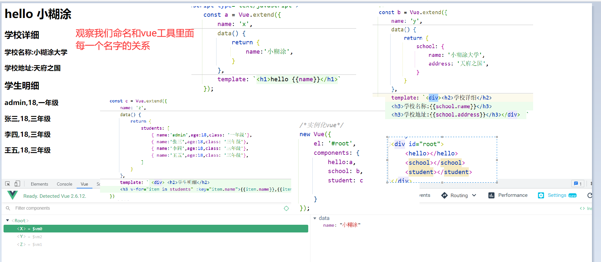
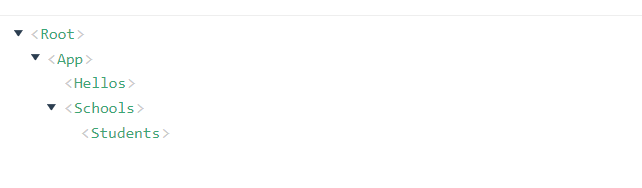

# 六、组件化编程

## 6.1：组件化是什么

vue.js组件化用于将UI页面分割为若干组件进行组合和嵌套；组件化是一种高效的处理复杂应用系统，更好的明确功能模块作用的方式；目的是为了解耦，把复杂系统拆分成多个组件，分离组件边界和责任，便于独立升级和维护。

我们[可以从vue官方视频简介中看到：](https://player.youku.com/embed/XMzMwMTYyODMyNA==?autoplay=true&client_id=37ae6144009e277d)

1. 理解: 向外提供特定功能的 js 程序, 一般就是一个 js 文件

2. 为什么: js 文件很多很复杂

3. 作用: 复用 js, 简化 js 的编写, 提高 js 运行效率

> **<font color='red'>注意</font>**
>
> 1.el不要写，为什么？ ——— 最终所有的组件都要经过一个vm的管理，由vm中的el决定服务哪个容器。
>
> 2.data必须写成函数，为什么？ ———— 避免组件被复用时，数据存在引用关系。

## 6.2：文件组件类别

### 1.非单文件组件

文件中有多个组件

### 2.单文件组件

文件中有一个组件

详情看下：

## 6.3：学习前准备的模板

这个模块我们将拆成组件，共拆分三块：

```java
<!DOCTYPE html>
<html>
<head>
  <meta charset="UTF-8" />
  <title>demo</title>
  <script type="text/javascript" src="../js/vue.js"></script>
</head>
<body>
<div id="root">
  <h1>hello {{name}}</h1>
  <h2>学校详细</h2>
  <h3>学校名称:{{school.name}}</h3>
  <h3>学校地址:{{school.address}}</h3>
  <h2>学生明细</h2>
  <h3 v-for="item in students" :key="item.name">{{item.name}},{{item.age}},{{item.class}}</h3>
</div>
</body>

<script type="text/javascript">
  new Vue({
    el:'#root',
    data:{
      name:'小糊涂',
      school: {
        name:'小糊涂大学',
        address: '天府之国',
      },
      students: [
        { name:'admin',age:18,class: '一年级'},
        { name:'张三',age:18,class: '三年级'},
        { name:'李四',age:18,class: '三年级'},
        { name:'王五',age:18,class: '三年级'},
      ]
    }
  })
</script>
</html>
```

## 6.4：HelloWord

```java
<!DOCTYPE html>
<html>
<head>
    <meta charset="UTF-8"/>
    <title>demo</title>
    <script type="text/javascript" src="../js/vue.js"></script>
</head>
<body>
<div id="root">
    <hello></hello>
</div>
</body>

<script type="text/javascript">
    /*定义一个组件*/
    Vue.component('hello', {
        data: function () {
            return {
                name: '小糊涂'
            }
        },
        template: '<h1>hello {{name}}</h1>'
    })
    /*实例化vue*/
    new Vue({
        el: '#root'
    });

</script>
</html>
```

## 6.5：helloword的另一种写法

```java
<!DOCTYPE html>
<html>
<head>
    <meta charset="UTF-8"/>
    <title>demo</title>
    <script type="text/javascript" src="../js/vue.js"></script>
</head>
<body>
<div id="root">
    <hello></hello>
    <school></school>
</div>
</body>

<script type="text/javascript">
    //定义school组件
    const school = Vue.extend({
        name:'school',
        template:`
				<div>
					<h2>学校名称：{{name}}</h2>
					<h2>学校地址：{{address}}</h2>
					<button @click="showName">点我提示学校名</button>
				</div>
			`,
        data(){
            return {
                name:'尚硅谷',
                address:'北京'
            }
        },
        methods: {
            showName(){
                console.log('showName',this)
            }
        },
    });

    /*定义一个组件*/
    Vue.component('hello', {
        data: function () {
            return {
                name: '小糊涂'
            }
        },
        template: '<h1>hello {{name}}</h1>'
    })
    /*实例化vue*/
    new Vue({
        el: '#root',
        components:{school}
    });

</script>
</html>
```

## 6.6：两种helloworld对比

第一种我们定义的是不需要引用既可以使用（全局注册）

第二种我们定义的需要引用既可以使用（局部注册）

我们推荐使用第二种：**（注意了我们使用下面这种时一定要注意模块代码必须有一个父级元素，负责会出错。）**

```java
   //定义school组件
    const school = Vue.extend({
        name:'school',
        template:`
				<div>
					<h2>学校名称：{{name}}</h2>
					<h2>学校地址：{{address}}</h2>
					<button @click="showName">点我提示学校名</button>
				</div>
			`,
        data(){
            return {
                name:'尚硅谷',
                address:'北京'
            }
        },
        methods: {
            showName(){
                console.log('showName',this)
            }
        },
    });
```

## 6.7：非单文件组件

[模板](#6.3：学习前准备的模板)在上面，我们那模板来拆分

```java
<!DOCTYPE html>
<html>
<head>
    <meta charset="UTF-8"/>
    <title>demo</title>
    <script type="text/javascript" src="../js/vue.js"></script>
</head>
<body>
<div id="root">
    <hello></hello>
    <school></school>
    <student></student>
</div>
</body>

<script type="text/javascript">
    const a = Vue.extend({
        name: 'x',
        data() {
            return {
                name:'小糊涂',
            }
        },
        template: `<h1>hello {{name}}</h1>`
    });
    const b = Vue.extend({
        name: 'y',
        data() {
            return {
                school: {
                    name: '小糊涂大学',
                    address: '天府之国',
                }
            }
        },
        template: `<div><h2>学校详细</h2>
        <h3>学校名称:{{school.name}}</h3>
        <h3>学校地址:{{school.address}}</h3></div>  `
    });
    const c = Vue.extend({
        name: 'z',
        data() {
            return {
                students: [
                    { name:'admin',age:18,class: '一年级'},
                    { name:'张三',age:18,class: '三年级'},
                    { name:'李四',age:18,class: '三年级'},
                    { name:'王五',age:18,class: '三年级'},
                ]
            }
        },
        template: ` <div> <h2>学生明细</h2>
        <h3 v-for="item in students" :key="item.name">{{item.name}},{{item.age}},{{item.class}}</h3></div>  `
    })
    /*实例化vue*/
    new Vue({
        el: '#root',
        components: {
            hello:a,
            school: b,
            student: c

        }
    });

</script>
</html>
```

## 6.8：非单文件组件总结

不要说我上面变量名字的拉跨，观察下面的关系，更好的理解




## 6.9：组件嵌套

[这里的代码我们是根据](#6.7：单文件组件)修改的

我们想要的效果如下：



```java
<!DOCTYPE html>
<html>
<head>
    <meta charset="UTF-8"/>
    <title>demo</title>
    <script type="text/javascript" src="../js/vue.js"></script>
</head>
<body>
<div id="root">
    <app></app>
</div>
</body>

<script type="text/javascript">
    const a = Vue.extend({
        name: 'hellos',
        data() {
            return {
                name: '小糊涂',
            }
        },
        template: `<h1>hello {{ name }}</h1>`
    });
    const c = Vue.extend({
        name: 'students',
        data() {
            return {
                students: [
                    {name: 'admin', age: 18, class: '一年级'},
                    {name: '张三', age: 18, class: '三年级'},
                    {name: '李四', age: 18, class: '三年级'},
                    {name: '王五', age: 18, class: '三年级'},
                ]
            }
        },
        template: `
          <div><h2>学生明细</h2>
          <h3 v-for="item in students" :key="item.name">{{ item.name }},{{ item.age }},{{ item.class }}</h3></div>  `
    });
    const b = Vue.extend({
        name: 'schools',
        data() {
            return {
                school: {
                    name: '小糊涂大学',
                    address: '天府之国',
                }
            }
        },
        template: `
          <div><h2>学校详细</h2>
          <h3>学校名称:{{ school.name }}</h3>
          <h3>学校地址:{{ school.address }}</h3>
          <student></student>
          </div>
        `,
        components: {
            student: c
        }
    });
    const app = Vue.extend({
        components: {
            hello: a,
            school: b
        },
        template:
                `
                  <div>
                  <hello></hello>
                  <school></school>
                  </div>`
    });

    /*实例化vue*/
    new Vue({
        el: '#root',
        components: {app:app}
    });

</script>
</html>
```

## 6.10：关于VueComponent

```java
关于VueComponent：
		1.school组件本质是一个名为VueComponent的构造函数，且不是程序员定义的，是Vue.extend生成的。
 		2.我们只需要写<school/>或<school></school>，Vue解析时会帮我们创建school组件的实例对象，即Vue帮我们执行的：new VueComponent(options)。
		3.特别注意：每次调用Vue.extend，返回的都是一个全新的VueComponent！！！！
		4.关于this指向：
			(1).组件配置中：data函数、methods中的函数、watch中的函数、computed中的函数 它们的this均是【VueComponent实例对象】。
			(2).new Vue(options)配置中：data函数、methods中的函数、watch中的函数、computed中的函数 它们的this均是【Vue实例对象】。

		5.VueComponent的实例对象，以后简称vc（也可称之为：组件实例对象）。
		6.Vue的实例对象，以后简称vm。
```

## 6.11：单文件组件

### 1.创建App.vue

```java
<template>
	<div>
		<School></School>
		<Student></Student>
	</div>
</template>

<script>
	//引入组件
	import School from './School.vue'
	import Student from './Student.vue'

	export default {
		name:'App',
		components:{
			School,
			Student
		}
	}
</script>

```

### 2.创建index.html

```java
<!DOCTYPE html>
<html>
	<head>
		<meta charset="UTF-8" />
		<title>练习一下单文件组件的语法</title>
	</head>
	<body>
		<!-- 准备一个容器 -->
		<div id="root"></div>
		 <script type="text/javascript" src="../js/vue.js"></script>
		 <script type="text/javascript" src="./main.js"></script>
	</body>
</html>

```

### 3.创建main.js

```java
import App from './App.vue'

new Vue({
	el:'#root',
	template:`<App></App>`,
	components:{App},
})
```

### 4.创建School.vue

```java
<template>
  <div><h2>学校详细</h2>
    <h3>学校名称:{{ school.name }}</h3>
    <h3>学校地址:{{ school.address }}</h3>
    <student></student>
  </div>
</template>

<script>
	 export default {
		name:'School',
		data(){
			return {
        school: {
          name: '小糊涂大学',
          address: '天府之国',
        }
			}
		}
	}
</script>

<style>
	.demo{
		background-color: orange;
	}
</style>
```

### 5.创建Student.vue

```java
<template>
  <template>
    <h2>学生明细</h2>
    <h3 v-for="item in students" :key="item.name">{{ item.name }},{{ item.age }},{{ item.class }}</h3>
  </template>
</template>

<script>
export default {
  name: "Students",
  data() {
    return {
      students: [
        {name: 'admin', age: 18, class: '一年级'},
        {name: '张三', age: 18, class: '三年级'},
        {name: '李四', age: 18, class: '三年级'},
        {name: '王五', age: 18, class: '三年级'},
      ]
    }
  }
}
</script>

<style scoped>

</style>
```

### 6.测试

现在是无法执行的，必须配合脚手架


