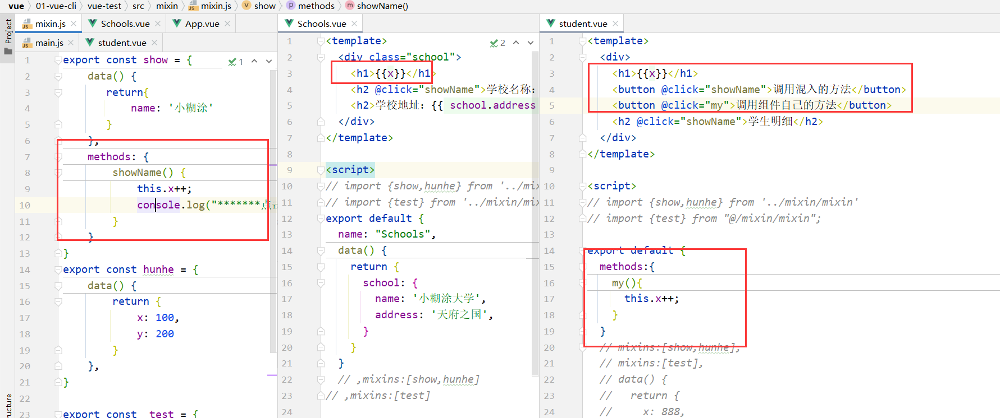

# 七、VUE脚手架(一）

## 7.1：简介

### 1.简介

你可以使用 `vue serve` 和 `vue build` 命令对单个 `*.vue` 文件进行快速原型开发，不过这需要先额外安装一个全局的扩展：

```java
npm install -g @vue/cli-service-global
```

`vue serve` 的缺点就是它需要安装全局依赖，这使得它在不同机器上的一致性不能得到保证。因此这只适用于快速原型开发。

### 2.创建一个项目

```java
vue create vue-test
```

然后选择自己需要的配置即可：


进入项目中运行：

```java
npm run serve
```


### 3.vue-cli目录分析

```java
├── node_modules 
├── public
│   ├── favicon.ico: 页签图标
│   └── index.html: 主页面
├── src
│   ├── assets: 存放静态资源
│   │   └── logo.png
│   │── component: 存放组件
│   │   └── HelloWorld.vue
│   │── App.vue: 汇总所有组件
│   │── main.js: 入口文件
├── .gitignore: git版本管制忽略的配置
├── babel.config.js: babel的配置文件
├── package.json: 应用包配置文件 
├── README.md: 应用描述文件
├── package-lock.json：包版本控制文件
```

## 7.2：修改默认配置项

### 1.显示webpack配置文件

Vue 脚手架隐藏了所有 webpack 相关的配置，若想查看具体的 webpakc 配置，

请执行：

```java
vue inspect > output.js
```

### 2.vue.config.js

`vue.config.js` 是一个可选的配置文件，如果项目的 (和 `package.json` 同级的)
根目录中存在这个文件，那么它会被 `@vue/cli-service` 自动加载。你也可以使用 `package.json` 中的 `vue` 字段，但是注意这种写法需要你严格遵照
JSON 的格式来写。

这个文件应该导出一个包含了选项的对象：

```java
// vue.config.js

/**
 * @type {import('@vue/cli-service').ProjectOptions}
 */
module.exports = {
  // 选项...
}
```

### 3.修改入口函数

我们知道vue脚手架的入口函数是`main.js`，我们现在想修改可以在`vue.conf.js`中这样写

```java
// vue.config.js
module.exports = {
    /*入口js*/
    pages: {
        index: {
            //入口
            entry: 'src/myMain.js',
        },
    },
}
```

### 4.总结

1. 使用vue inspect > output.js可以查看到Vue脚手架的默认配置。
2. 使用vue.config.js可以对脚手架进行个性化定制，详情见：https://cli.vuejs.org/zh/config/

现用现查


## 7.3：组件之间的通信

| 方式                           | 描述                                                                                                                              | 备注                                                        |
|------------------------------|---------------------------------------------------------------------------------------------------------------------------------|-----------------------------------------------------------|
| [ref](#7.4：ref属性(id替代者))     | 我们可以叫他为id的替换者，如果绑定的是html的话，那么可以进行DOM操作，如果绑定的是组件的话是可以修改数据                                                                        | 父组件更改子组件的内容**(只限ref绑定在组件上)**，如果绑定的html，那么就是操作dom元素了       |
| [props](#7.5：props配置项)       | 用于接收父组件传过来的值，并且可以对值的类型做限制                                                                                                       | 不可以修改父组件的值，如若修改数据请复制数据到`data`里面，**但是不会影响父组件的数据**          |
|                              | 用于接收父组件的方法                                                                                                                      | 子组件可以调用父组件的方法，然后父组件去修改自身的数据，**以达到子组件修改父组件的数据**            |
| [mixin](#7.6：mixin混入)        | 可以把多个组件共用的配置提取成一个混入对象                                                                                                           | 可以修改数据，但是只影响当前使用的组件里面的数据，因为混入会进行数据合并，把公共的数据变成组件自己的数据      |
| [插件](#7.7：插件)                | 用于增强Vue                                                                                                                         | 一个库，提供自己的 API，同时提供上面提到的一个或多个功能，例如我们将要学习的插件(elementui)     |
| [scoped](#7.8：scoped(CSS样式)) | 用于css的隔离防止css的定义全局                                                                                                              | 让样式在局部生效，防止冲突。                                            |
| [自定义事件](#7.10：组件间的自定义事件)     | [绑定自定义事件`$on`](#3.绑定自定义事件)<br>[触发自定义事件`$emit`](#4.触发自定义事件)<br>[解绑自定义事件`$off`](#5.解绑自定义事件)<br>[销毁自定义事件](#6.销毁自定义事件)这里的销毁是生命周期里面的 | 只能用于组件上，类似props，将方法传递给子组件，然后子组件把数据给父组件，不同于props的是，不能将数据传递 |

## 7.4：ref属性(id替代者)

> 都已经组件化编码了，你就不要再使用`document.getElementById('')`来获取dom元素了，来使用`ref吧`

### 1.简介

1. 被用来给元素或子组件注册引用信息（id的替代者）
2. 应用在html标签上获取的是真实DOM元素，应用在组件标签上是组件实例对象（vc）
3. 使用方式：
    1. 打标识：```<h1 ref="xxx">.....</h1>``` 或 ```<School ref="xxx"></School>```
    2. 获取：```this.$refs.xxx```

### 2.案例

> (App.vue)

```java
<template>
  <div>
    <h1 v-text="msg" ref="hello"></h1>
    <button @click="show" ref="btn">点击我一下，然后看控制台打印</button>
    <schools ref="school"></schools>
  </div>
</template>
<script>
import schools from "./components/Schools";
export default {
  name: "App",
  components: {schools},
  data() {
    return {
      msg: '小糊涂',
    }
  }, methods: {
    show() {
      let  refs = this.$refs;
      console.log(refs)
      console.log(refs.hello) //真实DOM元素
      console.log(refs.btn) //真实DOM元素
      console.log(refs.school) //School组件的实例对象（vc）
      console.log('this.msg:'+this.msg)
      console.log('refs.hello.innerText:'+refs.hello.innerText)
      console.log('也可以去修改dom的内容但是吧没办法修改vue中的数据')
      refs.hello.innerText = '12312'
      console.log('this.msg:'+this.msg)
      console.log('refs.hello.innerText:'+refs.hello.innerText)
      console.log('获取修改vue组件中的数据')
      refs.school.$data.school=[]
    }
  },
}
</script>
<style scoped></style>
```

### 3.测试


### 4.Schools.vue代码

```java
<template>
  <div class="school">
    <h2>学校名称：{{ school.name }}</h2>
    <h2>学校地址：{{ school.address }}</h2>
  </div>
</template>

<script>
export default {
  name: "Schools",
  data() {
    return {
      school: {
        name: '小糊涂大学',
        address: '天府之国',
      }
    }
  }

}
</script>

<style scoped>
.school {
  background-color: skyblue;
}
</style>
```

## 7.5：props配置项

### 1.简介

1. 功能：让组件接收外部传过来的数据

2. 传递数据：```<Demo name="xxx"/>```

3. 接收数据：

    1. 第一种方式（只接收）：```props:['name'] ```

    2. 第二种方式（限制类型）：```props:{name:String}```

    3. 第三种方式（限制类型、限制必要性、指定默认值）：

       ```js
       props:{
           name:{
           type:String, //类型
           required:true, //必要性
           default:'老王' //默认值
           }
       }
       ```

> 备注：props是只读的，Vue底层会监测你对props的修改，如果进行了修改，就会发出警告，若业务需求确实需要修改，那么请复制props的内容到data中一份，然后去修改data中的数据。

### 2.案例

#### App.vue

```java
<template>
  <div>
    <student :students="students"></student>
  </div>
</template>

<script>
import student from "./components/student";

export default {
  name: "App",
  components: { student},
  data() {
    return {
      msg: '小糊涂',
      students: [
        {name: 'admin', age: 18, class: '一年级'},
        {name: '张三', age: 18, class: '三年级'},
        {name: '李四', age: 18, class: '三年级'},
        {name: '王五', age: 18, class: '三年级'},
      ]
    }
  }, methods: {},
}
</script>

<style scoped>

</style>
```

#### student.vue

```java
<template>
  <div>
    <h2>学生明细</h2>
    <h3 v-for="item in myStudents" :key="item.name">{{ item.name }},{{ item.age }},{{ item.class }}</h3>
  </div>
</template>

<script>
export default {
  name: "student",
  data(){
    return{
      myStudents: this.students
    }
  }
  /* ,props:[ 'students' ]*/
  ,props:{
    students:Array
  }
/*   ,props:{
     students:{
       type:Array,
       default:new  Array()
     }
   }*/
}
</script>
<style scoped>
</style>
```

### 4.props简写

```java
props: ['title', 'likes', 'isPublished', 'commentIds', 'author']
```

### 5.props限制类型

```java
props: {
  title: String,
  likes: Number,
  isPublished: Boolean,
  commentIds: Array,
  author: Object,
  callback: Function,
  contactsPromise: Promise // or any other constructor
}
```

### 6.其它 props 验证

> 我们可以为组件的 prop 指定验证要求，例如你知道的这些类型。如果有一个需求没有被满足，则 Vue
> 会在浏览器控制台中警告你。这在开发一个会被别人用到的组件时尤其有帮助。
>
> 为了定制 prop 的验证方式，你可以为 `props` 中的值提供一个带有验证需求的对象，而不是一个字符串数组。例如：

```java
  props: {
    // 基础的类型检查 (`null` 和 `undefined` 会通过任何类型验证)
    propA: Number,
    // 多个可能的类型
    propB: [String, Number],
    // 必填的字符串
    propC: {
      type: String,
      required: true
    },
    // 带有默认值的数字
    propD: {
      type: Number,
      default: 100
    },
    // 带有默认值的对象
    propE: {
      type: Object,
      // 对象或数组默认值必须从一个工厂函数获取
      default: function () {
        return { message: 'hello' }
      }
    },
    // 自定义验证函数
    propF: {
      validator: function (value) {
        // 这个值必须匹配下列字符串中的一个
        return ['success', 'warning', 'danger'].indexOf(value) !== -1
      }
    }
  }
```

### 7.数据发送的写法

```java
<student username1="userName" passWord2="passWord"></student>     //不推荐
<student v-bind:username1="userName" v-bind:passWord1="passWord"></student> //推荐
<student :username1="userName" :passWord2="passWord"></student>//强烈推荐
```

### 8.注意

+ 当 prop 验证失败的时候，(开发环境构建版本的) Vue 将会产生一个控制台的警告。

+ 注意那些 prop 会在一个组件实例创建**之前**进行验证，所以实例的 property (如 `data`、`computed` 等) 在 `default`
  或 `validator` 函数中是不可用的。**（这句话的意思是，我们prop中是不可以使用vue其他property的，比如data里面的数据，但是data可以去使用prop的）
  **
+ props是只读的，Vue底层会监测你对props的修改，如果进行了修改，就会发出警告，若业务需求确实需要修改，那么请复制props的内容到data中一份，然后去修改data中的数据。

## 7.6：mixin混入

### 1.案例

我们开发的时候应该会有一些公共的方法，比如一些通用的方法，等等如图，那么我们可以使用混入`mixin`


### 2.mixin简介

混入 (mixin) 提供了一种非常灵活的方式，来分发 Vue 组件中的可复用功能。一个混入对象可以包含任意组件选项。当组件使用混入对象时，所有混入对象的选项将被“混合”进入该组件本身的选项。

简单说：

1. 功能：可以把多个组件共用的配置提取成一个混入对象

2. 使用方式：

   第一步定义混合：

   ```
   {
       data(){....},
       methods:{....}
       ....
   }
   ```

   第二步使用混入：

   ​ 全局混入：```Vue.mixin(xxx)```
   ​ 局部混入：```mixins:['xxx']    ```

### 3.案例(局部混入)

#### mixin.js

在`src`目录下面创建一个mixin.js(名字可以自定义)，写入以下代码

```java
export const show = {
    data() {
       return{
           name: '小糊涂'
       }
    },
    methods: {
        showName() {
            console.log("*******点击了**********")
        }
    }
}
export const hunhe = {
    data() {
        return {
            x: 100,
            y: 200
        }
    },
}

```

#### Schools.vue

```java
<template>
  <div class="school">
    <h2 @click="showName">学校名称：{{ school.name }}</h2>
    <h2>学校地址：{{ school.address }}</h2>
  </div>
</template>

<script>
import {show,hunhe} from '../mixin/mixin'
export default {
  name: "Schools",
  data() {
    return {
      school: {
        name: '小糊涂大学',
        address: '天府之国',
      }
    }
  },mixins:[show,hunhe]

}
</script>

<style scoped>
.school {
  background-color: skyblue;
}
</style>
```

#### student.vue

```java
<template>
  <div>
    <h2 @click="showName">学生明细</h2>
  </div>
</template>

<script>
import {show,hunhe} from '../mixin/mixin'
export default {
    mixins:[show,hunhe]
}
</script>

<style scoped>

</style>
```

#### App.vue

```java
<template>
  <div>
    <schools></schools>
    <student></student>
  </div>
</template>

<script>
import student from "./components/student";
import schools from "./components/Schools";

export default {
  name: "App",
  components: {student, schools},
  data() {
    return {
      msg: '小糊涂',
    }
  }, methods: {},
}
</script>

<style scoped>

</style>
```

#### 测试


### 4.案例(全局混入)

[我们根据上一个案例](#3.案例(局部混合))：我们知道了局部混合，那么现在我们修改成全局混合，只需要在`main.js`
引入混入即可,然后把其他组件里面的混入删除掉

```java
import Vue from 'vue'
import App from './App.vue'
import {show,hunhe} from './mixin/mixin'
    
Vue.config.productionTip = false
Vue.mixin(show)
Vue.mixin(hunhe)
    
new Vue({
    render: h => h(App),
}).$mount('#app')
```


### 5.混入和生命周期

当我们使用了混入时，并且还配置了生命周期，如下：

```java
export const  test = {
    data(){
      return{
          count:0
      }
    },
    mounted(){
        console.log('使用生命周期')
    }
}
```

这个时候就分为了两种情况：

+ 局部混入：每一个使用混入组件都会去调用一次生命周期
+ 全局混入：所有组件都会去调用生命周期

> 请谨慎使用全局混入，因为它会影响每个单独创建的 Vue 实例 (包括第三方组件)
> 。大多数情况下，只应当应用于自定义选项，就像上面示例一样。推荐将其作为[插件](#7.7：插件)发布，以避免重复应用混入。

### 6.混入数据合并策略

我们在使用混入的时候，如果变量名相同的情况下比如：


这种的情况下，是以我们的引入方来决定的：


混入的策略也是可以修改的，但是不推荐，如有需要查看一下链接：

https://cn.vuejs.org/v2/guide/mixins.html

### 7.混入数据是否可以修改

这里不写代码了，图片替代：




**当我们使用混入对数据进行修改，那么当前组件内的数据才会改变。并且不影响其他组件内的数据。**如图所示：


## 7.7：插件

### 1.简介

1. 功能：用于增强Vue

2. 本质：包含install方法的一个对象，install的第一个参数是Vue，第二个以后的参数是插件使用者传递的数据。

3. 定义插件：

```java
对象.install = function (Vue, options) {
    // 1. 添加全局过滤器
    Vue.filter(....)

    // 2. 添加全局指令
    Vue.directive(....)

    // 3. 配置全局混入(合)
    Vue.mixin(....)

    // 4. 添加实例方法
    Vue.prototype.$myMethod = function () {...}
    Vue.prototype.$myProperty = xxxx
}
```

4. 使用插件：```Vue.use()```

### 2.案例

#### myPlujns.js

```java
export const obj = {
    install() {
        console.log("==========="+Date.now())
    }
}
```

#### main.js

```java
import Vue from 'vue'
import App from './App.vue'
import {obj} from '@/plujns/myPlujns'

Vue.config.productionTip = false

Vue.use(obj)//应用组件

new Vue({
    render: h => h(App),
}).$mount('#app')

```

#### 测试

启动游览器发现控制台打印输出

### 3.插件传参

#### myPlujns.js

```java
export const obj2 = {
    install(Vue,x,y,z) {
        console.log("==========="+Date.now())
        console.log("==========="+x)
        console.log("==========="+y)
        console.log("==========="+z)
    }
}
```

#### main.js

```java
import Vue from 'vue'
import App from './App.vue'
import {obj,obj2} from '@/plujns/myPlujns'

Vue.config.productionTip = false

Vue.use(obj)//应用组件
Vue.use(obj2,1,2,3)//应用组件

new Vue({
    render: h => h(App),
}).$mount('#app')
```

#### 测试

打开游览器，查看控制台打印

#### 注意

我们插件如果使用传参的话，那么第一个参数就是vue的示例，名字可以自定义

### 4.写一个自己的插件

```java
//当对象只有一个我们这样来写
export default {
	install(Vue,x,y,z){
		console.log(x,y,z)
		//全局过滤器
		Vue.filter('mySlice',function(value){
			return value.slice(0,4)
		})

		//定义全局指令
		Vue.directive('fbind',{
			//指令与元素成功绑定时（一上来）
			bind(element,binding){
				element.value = binding.value
			},
			//指令所在元素被插入页面时
			inserted(element,binding){
				element.focus()
			},
			//指令所在的模板被重新解析时
			update(element,binding){
				element.value = binding.value
			}
		})

		//定义混入
		Vue.mixin({
			data() {
				return {
					x:100,
					y:200
				}
			},
		})

		//给Vue原型上添加一个方法（vm和vc就都能用了）
		Vue.prototype.hello = ()=>{alert('你好啊')}
	}
}
```

## 7.8：scoped(CSS样式)

### 1.简介

1. 作用：让样式在局部生效，防止冲突。
2. 写法：```<style scoped>```

### 2.案例

#### 代码


#### 测试

我们发现样式冲突了


### 3.注意

+ `scoped`让样式在局部生效，防止冲突。
+ 如果使用less

```java
<style lang="less" scoped>
*{
  background: skyblue;
}
</style>
```

+ 安装less cmd命令

```java
# Sass
npm install -D sass-loader sass

# Less
npm install -D less-loader less

# Stylus
npm install -D stylus-loader stylus
```

如果安装过后启动失败请降低版本。

```java
npm uninstall less-loader
npm install less-loader@版本 --save 
```

### 4.来个案例

学到这里我们可以看一下项目练习的： [目的](#目的) 到  [TodoList第一次总结](#TodoList第一次总结)

## 7.9：游览器的存储功能

### 1.简介

1. 存储内容大小一般支持5MB左右（不同浏览器可能还不一样）

2. 浏览器端通过 Window.sessionStorage 和 Window.localStorage 属性来实现本地存储机制。

3. 相关API：

    1. ```xxxxxStorage.setItem('key', 'value');```
       该方法接受一个键和值作为参数，会把键值对添加到存储中，如果键名存在，则更新其对应的值。

    2. ```xxxxxStorage.getItem('person');```

       ​ 该方法接受一个键名作为参数，返回键名对应的值。

    3. ```xxxxxStorage.removeItem('key');```

       ​ 该方法接受一个键名作为参数，并把该键名从存储中删除。

    4. ``` xxxxxStorage.clear()```

       ​ 该方法会清空存储中的所有数据。

4. 备注：

    1. SessionStorage存储的内容会随着浏览器窗口关闭而消失。
    2. LocalStorage存储的内容，需要手动清除才会消失。
    3. ```xxxxxStorage.getItem(xxx)```如果xxx对应的value获取不到，那么getItem的返回值是null。
    4. ```JSON.parse(null)```的结果依然是null。

### 2.localStorage

```java
<!DOCTYPE html>
<html>
	<head>
		<meta charset="UTF-8" />
		<title>localStorage</title>
	</head>
	<body>
		<h2>localStorage</h2>
		<button onclick="saveData()">点我保存一个数据</button>
		<button onclick="readData()">点我读取一个数据</button>
		<button onclick="deleteData()">点我删除一个数据</button>
		<button onclick="deleteAllData()">点我清空一个数据</button>

		<script type="text/javascript" >
			let p = {name:'张三',age:18}

			function saveData(){
				localStorage.setItem('msg','hello!!!')
				localStorage.setItem('msg2',666)
				localStorage.setItem('person',JSON.stringify(p))
			}
			function readData(){
				console.log(localStorage.getItem('msg'))
				console.log(localStorage.getItem('msg2'))

				const result = localStorage.getItem('person')
				console.log(JSON.parse(result))

				// console.log(localStorage.getItem('msg3'))
			}
			function deleteData(){
				localStorage.removeItem('msg2')
			}
			function deleteAllData(){
				localStorage.clear()
			}
		</script>
	</body>
</html>
```

### 3.sessionStorage

```java
<!DOCTYPE html>
<html>
	<head>
		<meta charset="UTF-8" />
		<title>sessionStorage</title>
	</head>
	<body>
		<h2>sessionStorage</h2>
		<button onclick="saveData()">点我保存一个数据</button>
		<button onclick="readData()">点我读取一个数据</button>
		<button onclick="deleteData()">点我删除一个数据</button>
		<button onclick="deleteAllData()">点我清空一个数据</button>

		<script type="text/javascript" >
			let p = {name:'张三',age:18}

			function saveData(){
				sessionStorage.setItem('msg','hello!!!')
				sessionStorage.setItem('msg2',666)
				sessionStorage.setItem('person',JSON.stringify(p))
			}
			function readData(){
				console.log(sessionStorage.getItem('msg'))
				console.log(sessionStorage.getItem('msg2'))

				const result = sessionStorage.getItem('person')
				console.log(JSON.parse(result))

				// console.log(sessionStorage.getItem('msg3'))
			}
			function deleteData(){
				sessionStorage.removeItem('msg2')
			}
			function deleteAllData(){
				sessionStorage.clear()
			}
		</script>
	</body>
</html>
```

### 4.来个案例

查看：[TodoList使用游览器本地缓存](#TodoList使用游览器本地缓存)

## 7.10：组件间的自定义事件

### 1.简介

1. 一种组件间通信的方式，适用于：<strong style="color:red">子组件 ===> 父组件</strong>

2. 使用场景：A是父组件，B是子组件，B想给A传数据，那么就要在A中给B绑定自定义事件（<span style="color:red">
   事件的回调在A中</span>）。

### 2.事先准备的组件

#### student.vue

```java
<template>
  <div>
    <h1>学生明细</h1>
    <h2>学生姓名：{{name}}</h2>
    <h2>学生性别：{{sex}}</h2>
    <h2>当前求和为：{{number}}</h2>
  </div>
</template>
<script>
export default {
  name:'student',
  data() {
    return {
      name:'张三',
      sex:'男',
      number:0
    }
  }
}
</script>
<style scoped>
*{
  background: skyblue;
}
</style>
```

App.vue

```java
<template>
  <div id="root">
    <student ></student>
  </div>
</template>

<script>
import student from "@/components/student";

export default {
  name: "App",
  components: {student},
  data() {
    return {
    }
  },
  methods: {
    test1() {
      console.log("test1")
    },
    test2(obj) {
      console.log("test2", obj)
    },
    test3(obj, obj2, obj3) {
      console.log("test3", obj, obj2, obj3)
    },
    test4(obj, ...params) {
      console.log("test4", obj, params)
    }
  }
}
</script>
<style >
*{
  background: #dddddd;
}
</style>
```

### 3.绑定自定义事件

> 以下代码统一定义在App.vue组件中

#### 第一种

```java
<template>
  <div id="root">
    <student @test1="test1"  v-on:test2="test2"></student>
  </div>
</template>
```

#### 第二种

```java
<template>
  <div id="root">
    <student  ref="test3"></student>
  </div>
</template>
<script>
export default {
  name: "App",
  components: {student},
  data() {
    return {}
  }, methods: {
    test3(obj, obj2, obj3) {
      console.log("test3", obj, obj2, obj3)
    }
  },mounted() {
    this.$refs.test3.$on("test3",this.test3);
  }
}
</script>
```

#### 第三种

```java
<template>
  <div id="root">
    <student  ref="test3"></student>
  </div>
</template>
<script>
export default {
  name: "App",
  components: {student},
  data() {
    return {}
  }
  },mounted() {
   this.$refs.test3.$on("test5", (json) => {
      console.log("test5", json)
    });
  }
}
</script>
```

### 4.触发自定义事件

> 以下代码均在student组件中写

#### 代码

```java
<template>
  <div>
    <h1>学生明细</h1>
    <h2>学生姓名：{{name}}</h2>
    <h2>学生性别：{{sex}}</h2>
    <h2>当前求和为：{{number}}</h2>
    <button @click="test1Btn">触发test1事件</button>
    <button @click="test23Btn">触发test2和test3事件</button>
  </div>
</template>
<script>
export default {
  name:'student',
  data() {
    return {
      name:'张三',
      sex:'男',
      number:0
    }
  },
  methods:{
    test1Btn(){
      this.$emit("test1");
    }
    ,test23Btn(){
      this.$emit("test2","test2的方法调用，我是它的参数");
      this.$emit("test3","test2的方法调用，我是它的参数1","test2的方法调用，我是它的参数2","test2的方法调用，我是它的参数3");
    }
  }
}
</script>
<style scoped>
</style>
```

#### 测试


### 5.解绑自定义事件

> 以下代码均在studen组件中编写

#### 代码

```java
<template>
  <div>
    <h1>学生明细</h1>
    <h2>学生姓名：{{name}}</h2>
    <h2>学生性别：{{sex}}</h2>
    <h2>当前求和为：{{number}}</h2>
    <button @click="test1Btn">触发test1事件</button>
    <button @click="test23Btn">触发test2和test3事件</button>
    <button @click="test3Btn">解绑test3和test4事件和test1事件</button>
  </div>
</template>

<script>

export default {
  name:'student',
  data() {
    return {
      name:'张三',
      sex:'男',
      number:0
    }
  },
  methods:{
    test1Btn(){
      this.$emit("test1");
    }
    ,test23Btn(){
      this.$emit("test2","test2的方法调用，我是它的参数");
      this.$emit("test3","test2的方法调用，我是它的参数1","test2的方法调用，我是它的参数2","test2的方法调用，我是它的参数3");
    },
    test3Btn(){
      this.$off("test1")//解绑一个
      this.$off(["test3","test4"])//解绑多个
      this.$off()//解绑了所有
    }

  }
}
</script>

<style scoped>
*{
  background: skyblue;
}
</style>


```

#### 测试


### 6.销毁自定义事件

> 以下代码均在student组件的method中

这里生命周期的钩子函数

```java
//完全销毁一个实例。清理它与其它实例的连接，解绑它的全部指令及事件监听器。
    death(){
				this.$destroy() //销毁了当前Student组件的实例，销毁后所有Student实例的自定义事件全都不奏效。
			}
```

### 7.问题

我们在app组件中想这样写

```java
 <student @click="test4"></student>
```

发现vue还是把它作为了自定义事件，我们只需要这样来做

```java
<student @click.native="test4"></student>
```

### 8.总结注意

1. 一种组件间通信的方式，适用于：<strong style="color:red">子组件 ===> 父组件</strong>

2. 使用场景：A是父组件，B是子组件，B想给A传数据，那么就要在A中给B绑定自定义事件（<span style="color:red">
   事件的回调在A中</span>）。

3. 绑定自定义事件：

    1. 第一种方式，在父组件中：```<Demo @atguigu="test"/>```  或 ```<Demo v-on:atguigu="test"/>```

    2. 第二种方式，在父组件中：

       ```js
       <Demo ref="demo"/>
       ......
       mounted(){
          this.$refs.xxx.$on('atguigu',this.test)
       }
       ```

    3. 若想让自定义事件只能触发一次，可以使用```once```修饰符，或```$once```方法。

4. 触发自定义事件：```this.$emit('atguigu',数据)```

5. 解绑自定义事件```this.$off('atguigu')```

6. 组件上也可以绑定原生DOM事件，需要使用```native```修饰符。

7. 注意：通过```this.$refs.xxx.$on('atguigu',回调)```绑定自定义事件时，回调<span style="color:red">
   要么配置在methods中</span>，<span style="color:red">要么用箭头函数</span>，否则this指向会出问题！

### 9.来个案例

查看： [TodoLIst使用自定义事件](#TodoLIst使用自定义事件)


