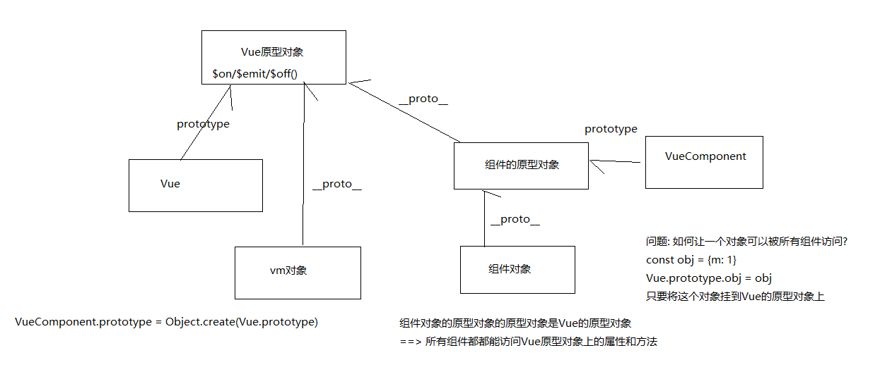
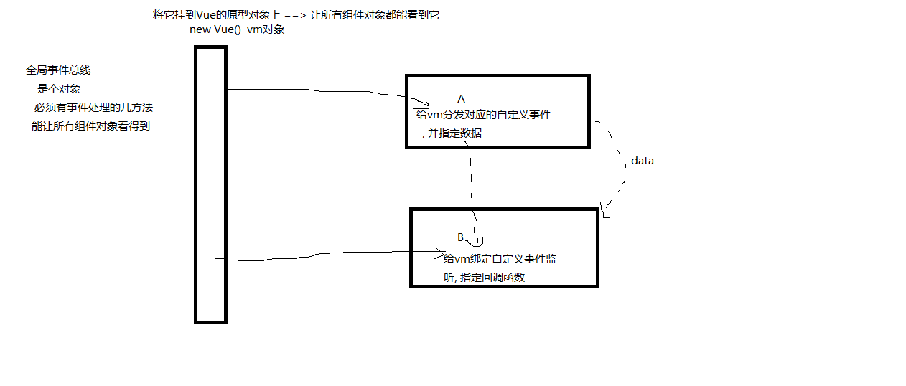
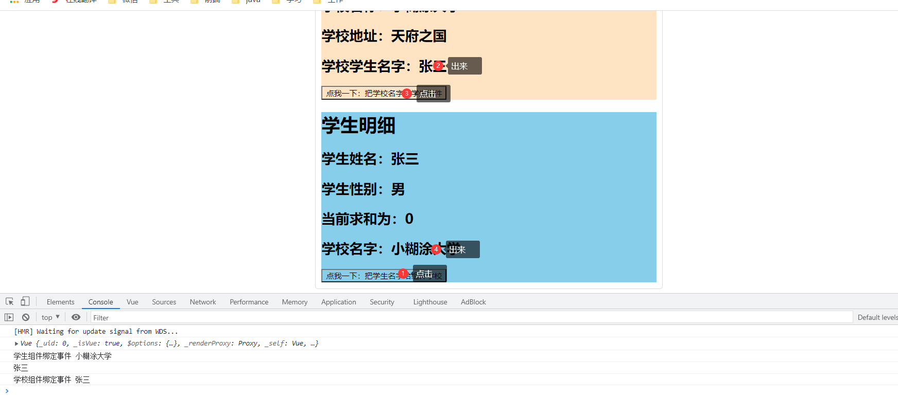
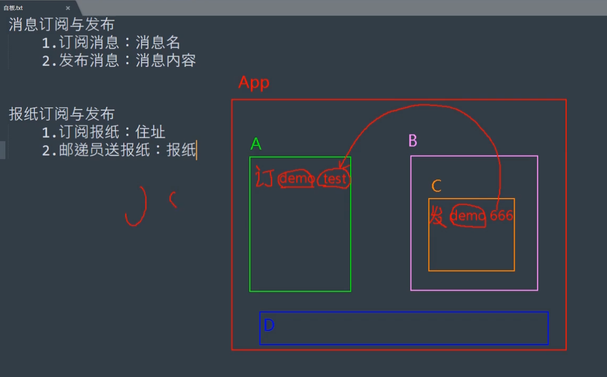
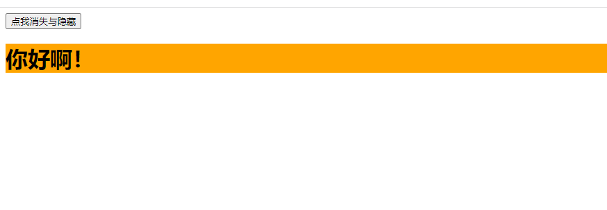

# 八、VUE脚手架(二)

## 8.1：全局事件总线（GlobalEventBus）

### 1.简介

EventBus 又称为事件总线。在Vue中可以使用 EventBus
来作为沟通桥梁的概念，就像是所有组件共用相同的事件中心，可以向该中心注册发送事件或接收事件，所以组件都可以上下平行地通知其他组件，但也就是太方便所以若使用不慎，就会造成难以维护的灾难，因此才需要更完善的
**Vuex**作为状态管理中心，将通知的概念上升到共享状态层次。

### 2.需求分析





### 3.目标

```java
目标: 实现A向B通信

1. 确定全局事件总线: 将vm对象作为事件总线挂载到vue的原型对象上
	new Vue({
		beforeCreate () {
			Vue.prototype.$bus = this
		}
	})
2. A组件: 调用(分发)事件
	this.$bus.$emit('xxx', data)
3. B组件: 绑定事件监听
	this.$bus.$on('xxx', this.fn)
	
	methods{
		fn (data) {
			
		}
	}
功能: 实现任意组件间通信
4.使用完事件后要解绑事件
    this.$bus.$off('xxx')
```

### 4.案例

#### main.js

```java
import Vue from 'vue'
import App from './App.vue'

Vue.config.productionTip = false

window.x = {a: 1, b: 2}
new Vue({
    render: h => h(App),
    beforeCreate() {
        Vue.prototype.$bus = this
    }
}).$mount('#app')

```

#### Stuedent.vue

```java
<template>
  <div>
    <h1>学生明细</h1>
    <h2>学生姓名：{{name}}</h2>
    <h2>学生性别：{{sex}}</h2>
    <h2>当前求和为：{{number}}</h2>
    <h2>学校名字：{{schoolName}}</h2>
    <button @click="sendSchool">点我一下：把学生名字给组件学校</button>
  </div>
</template>
<script>
export default {
  name:'student',
  data() {
    return {
      name:'张三',
      sex:'男',
      number:0,
      schoolName:''
    }
  },methods:{
    sendSchool() {
      this.$bus.$emit('sendSchool',this.name);
    }
  },mounted() {
    this.$bus.$on("sendStudent",(data)=>{
      this.schoolName =data;
      console.log("学生组件绑定事件",data)
    })
 },beforeDestroy() {
    this.$bus.$off("sendStudent")
  }
}
</script>

<style scoped>
*{
  background: skyblue;
}
</style>
```

#### School.vue

```java
<template>
  <div class="school">
    <h2>学校名称：{{ school.name }}</h2>
    <h2>学校地址：{{ school.address }}</h2>
    <h2>学校学生名字：{{ school.studentName }}</h2>
    <button @click="sendStudent">点我一下：把学校名字给学生组件</button>
  </div>
</template>
<script>
export default {
  name: "Schools",
  data() {
    return {
      school: {
        name: '小糊涂大学',
        address: '天府之国',
        studentName: '',
      }
    }
  }, methods: {
    sendStudent() {
      this.$bus.$emit('sendStudent',this.school.name);
    }
  },
  mounted() {
    console.log(this.$bus)
    this.$bus.$on("sendSchool", (data) => {
      console.log(data)
      this.school.studentName = data
      console.log("学校组件绑定事件", data)
    })
   },beforeDestroy() {
    this.$bus.$off("sendSchool")
  }
}
</script>
<style scoped>
* {
  background: bisque;
}
</style>
```

#### 测试

记得再app.vue里面引用一下



### 5.总结

1. 一种组件间通信的方式，适用于<span style="color:red">任意组件间通信</span>。

2. 安装全局事件总线：

   ```js
   new Vue({
   	......
   	beforeCreate() {
   		Vue.prototype.$bus = this //安装全局事件总线，$bus就是当前应用的vm
   	},
       ......
   }) 
   ```

3. 使用事件总线：

    1. 接收数据：A组件想接收数据，则在A组件中给$bus绑定自定义事件，事件的<span style="color:red">回调留在A组件自身。</span>

       ```js
       methods(){
         demo(data){......}
       }
       ......
       mounted() {
         this.$bus.$on('xxxx',this.demo)
       }
       ```

    2. 提供数据：```this.$bus.$emit('xxxx',数据)```

4. 最好在beforeDestroy钩子中，用$off去解绑<span style="color:red">当前组件所用到的</span>事件。

```java
beforeDestroy() {
    this.$bus.$off("xxxx")
  }
```

### 6.来个练习

[TodoList全局时间总线](#TodoList全局时间总线)

### 7.插一句话

这个东西呢？全局消息总线记住比较难，其实就是利用vue的生命周期，在创建vc的时候把vue实例放到全局的Vue.prototype里面

## 8.2：消息订阅发布

### 1.简介

1. 一种组件间通信的方式，适用于<span style="color:red">任意组件间通信</span>。



### 2.怎么使用

1. 安装pubsub：```npm i pubsub-js```

2. 引入: ```import pubsub from 'pubsub-js'```

3. 接收数据：A组件想接收数据，则在A组件中订阅消息，订阅的<span style="color:red">回调留在A组件自身。</span>

   ```js
   methods(){
     demo(data){......}
   }
   ......
   mounted() {
     this.pid = pubsub.subscribe('xxx',this.demo) //订阅消息
   }
   ```

4. 提供数据：```pubsub.publish('xxx',数据)```

5. 最好在beforeDestroy钩子中，用```PubSub.unsubscribe(pid)```去<span style="color:red">取消订阅。</span>

### 3.案例

#### 安装

```java
import pubsub from 'pubsub-js
```

#### student.vue

```java
<template>
  <div>
    <h1>学生明细</h1>
    <h2>学生姓名：{{name}}</h2>
    <h2>学生性别：{{sex}}</h2>
    <h2>当前求和为：{{number}}</h2>
    <h2>学校名字：{{schoolName}}</h2>
    <button @click="sendSchool">点我一下：把学生名字给组件学校</button>
  </div>
</template>

<script>

import pubsub from  'pubsub-js'
export default {
  name:'student',
  data() {
    return {
      name:'张三',
      sex:'男',
      number:0,
      schoolName:''
    }
  },methods:{
    sendSchool() {
      pubsub.publish('sendSchool',this.name,100)
    }
  },mounted() {
    pubsub.subscribe('sendStudent',(msg)=>{
      console.log(msg)
    })
  }
}
</script>
<style scoped>

</style>
```

#### Schools.vue

```java
<template>
  <div class="school">
    <h2>学校名称：{{ school.name }}</h2>
    <h2>学校地址：{{ school.address }}</h2>
    <h2>学校学生名字：{{ school.studentName }}</h2>
    <button @click="sendStudent">点我一下：把学校名字给学生组件</button>
  </div>
</template>

<script>
import pubsub from 'pubsub-js'

export default {
  name: "Schools",
  data() {
    return {
      school: {
        name: '小糊涂大学',
        address: '天府之国',
        studentName: '',
      }
    }
  }, methods: {
    sendStudent() {
      pubsub.publish('sendStudent', this.school.name)
    }
  },
  mounted() {
    pubsub.subscribe('sendSchool', (msg, data) => {
      console.log("收到信息:", msg, data)
    })
  }, beforeDestroy() {
  }

}
</script>
<style scoped>

</style>
```

#### 测试

页面自己点击

### 来个练习

[学完之后看TodoList消息订阅与发布](#TodoList消息订阅与发布)

## 8.3：nextTick

1. 语法：`this.$nextTick(回调函数)`
2. 作用：在下一次 DOM 更新结束后执行其指定的回调。
3. 什么时候用：当改变数据后，要基于更新后的新DOM进行某些操作时，要在nextTick所指定的回调函数中执行。

## 8.4：Vue封装的过度与动画

### 1.简介

1. 作用：在插入、更新或移除 DOM元素时，在合适的时候给元素添加样式类名。

2. 图示：

3. 写法：

    1. 准备好样式：

        - 元素进入的样式：
            1. v-enter：进入的起点
            2. v-enter-active：进入过程中
            3. v-enter-to：进入的终点
        - 元素离开的样式：
            1. v-leave：离开的起点
            2. v-leave-active：离开过程中
            3. v-leave-to：离开的终点

    2. 使用```<transition>```包裹要过度的元素，并配置name属性：

       ```vue
       <transition name="hello">
           <h1 v-show="isShow">你好啊！</h1>
       </transition>
       ```

    3. 备注：若有多个元素需要过度，则需要使用：```<transition-group>```，且每个元素都要指定```key```值。

### 2.动画效果

#### 动画的CSS3写法

这里面的动画效果的命名格式必须如下：

- 元素进入的样式：
    1. **动画名字-enter**：进入的起点
    2. **动画名字-enter-active**：进入过程中
    3. **动画名字-enter-to**：进入的终点
- 元素离开的样式：
    1. **动画名字-leave**：离开的起点
    2. **动画名字-leave-active**：离开过程中
    3. **动画名字-leave-to**：离开的终点

```java
.hello-enter-active{
  animation: donghuaName 1s linear;
}

.hello-leave-active{
  animation: donghuaName 1s linear reverse;
}
@keyframes donghuaName {
  from{
    transform: translateX(-100%);
  }
  to{
    transform: translateX(0px);
  }
}
```

#### vue动画标签

这里的`name`属性和`appear`都是缺一不可

```java
<transition name="动画名字" appear>
</transition>
```

#### 例子

```java
<template>
<div>

  <button @click="isShow=!isShow">点我消失与隐藏</button>
  <transition name="hello" appear>
    <h1 v-show="isShow">你好啊！</h1>
  </transition>
</div>
</template>

<script>
export default {
  name: "Test",
  data(){
     return{
       isShow:true
     }
  }
}
</script>

<style scoped>
h1{
  background-color: orange;
}

.hello-enter-active{
  animation: donghuaName 1s linear;
}

.hello-leave-active{
  animation: donghuaName 1s linear reverse;
}

@keyframes donghuaName {
  from{
    transform: translateX(-100%);
  }
  to{
    transform: translateX(0px);
  }
}
</style>
```

#### 测试



### 3.过度效果

#### 动画的CSS3写法

这里面的动画效果的命名格式必须如下：

- 元素进入的样式：
    1. **动画名字-enter**：进入的起点
    2. **动画名字-enter-active**：进入过程中
    3. **动画名字-enter-to**：进入的终点
- 元素离开的样式：
    1. **动画名字-leave**：离开的起点
    2. **动画名字-leave-active**：离开过程中
    3. **动画名字-leave-to**：离开的终点

```java
<style scoped>
	h1{
		background-color: orange;
	}
	/* 进入的起点、离开的终点 */
	.hello-enter,.hello-leave-to{
		transform: translateX(-100%);
	}
	.hello-enter-active,.hello-leave-active{
		transition: 0.5s linear;
	}
	/* 进入的终点、离开的起点 */
	.hello-enter-to,.hello-leave{
		transform: translateX(0);
	}

</style>
```

#### vue动画标签

这里的`name`属性和`appear`都是缺一不可

```java
	<div>
		<button @click="isShow = !isShow">显示/隐藏</button>
		<transition name="hello" appear>
			<h1 v-show="!isShow" key="1">你好啊！</h1>
		</transition>
	</div>
```

### 4.多个元素同时使用过度或者动画

备注：若有多个元素需要过度，则需要使用：`<transition-group>`，且每个元素都要指定`key`值

```java
	<div>
		<button @click="isShow = !isShow">显示/隐藏</button>
		<transition-group name="hello" appear>
			<h1 v-show="!isShow" key="1">你好啊！</h1>
			<h1 v-show="isShow" key="2">小糊涂！</h1>
		</transition-group>
	</div>
```

### 5.使用第三方的库

#### 简介

我们在开发的时候会使用第三方的动画效果，或者是别人写好的动画效果：

- 元素进入的样式：
    1. **enter-class**：进入的起点
    2. **enter-active-class**：进入过程中
    3. **enter-to-class**：进入的终点
- 元素离开的样式：
    1. **leave-class**：离开的起点
    2. **leave-active-class**：离开过程中
    3. **leave-to-class**：离开的终点

> 使用方式如下：
>
> 1.首先先引入第三方类animated.css
>
> 2.将你所需要动画的标签用包裹起来
>
>
3.在transition元素中添加enter-active-class/leave-active-class入场离场属性但是设置的值前面必须加上animated（当然也可以不在transition上设置animated，可以在你所要进行动画的标签上设置class属性为animated）
>
> 4.也可以加入:duration来统一设置入场和离场时候的时长

#### 案例

```java
<!DOCTYPE html>
<html lang="en">
<head>
    <meta charset="UTF-8">
    <meta name="viewport" content="width=device-width, initial-scale=1.0">
    <meta http-equiv="X-UA-Compatible" content="ie=edge">
    <title>Document</title>
    <script src="lib/vue.js"></script>
    <link rel="stylesheet" href="lib/animate.css">
</head>
<body>
    <div id="app">
        <input type="button" value="toggle" @click="flag=!flag">
        <!-- <transition enter-active-class="animated bounceIn" leave-active-class="animated bounceOut">
                <h3 v-if="flag">这是一个H3</h3>
        </transition> -->
        <transition enter-active-class="bounceIn" leave-active-class="bounceOut" :duration="400">
                <h3 v-if="flag" class="animated">这是一个H3</h3>
        </transition>
    </div>
    <script>
        var vm=new Vue({
            el:'#app',
            data:{
                flag:false
            },
            methods:{

            }
        })
    </script>
</body>
</html>
```

## 8.5：插槽

### 1.简介

让父组件可以向子组件指定位置插入html结构，也是一种组件间通信的方式，适用于 <strong style="color:red">父组件 ===>
子组件</strong> 。

### 2.分类

+ 默认插槽
+ 具名插槽
+ 作用域插槽

### 3.案例：默认插槽

```vue
父组件中：
        <Category>
           <div>html结构1</div>
        </Category>
子组件中：
        <template>
            <div>
               <!-- 定义插槽 -->
               <slot>插槽默认内容...</slot>
            </div>
        </template>
```

### 4.案例：具名插槽

```vue
父组件中：
        <Category>
            <template slot="center">
              <div>html结构1</div>
            </template>

            <template v-slot:footer>
               <div>html结构2</div>
            </template>
        </Category>
子组件中：
        <template>
            <div>
               <!-- 定义插槽 -->
               <slot name="center">插槽默认内容...</slot>
               <slot name="footer">插槽默认内容...</slot>
            </div>
        </template>
```

### 5.案例：作用域插槽

理解：<span style="color:red">数据在组件的自身，但根据数据生成的结构需要组件的使用者来决定。</span>
（games数据在Category组件中，但使用数据所遍历出来的结构由App组件决定）

具体编码：

```vue
父组件中：
		<Category>
			<template scope="scopeData">
				<!-- 生成的是ul列表 -->
				<ul>
					<li v-for="g in scopeData.games" :key="g">{{g}}</li>
				</ul>
			</template>
		</Category>

		<Category>
			<template slot-scope="scopeData">
				<!-- 生成的是h4标题 -->
				<h4 v-for="g in scopeData.games" :key="g">{{g}}</h4>
			</template>
		</Category>
子组件中：
        <template>
            <div>
                <slot :games="games"></slot>
            </div>
        </template>
		
        <script>
            export default {
                name:'Category',
                props:['title'],
                //数据在子组件自身
                data() {
                    return {
                        games:['红色警戒','穿越火线','劲舞团','超级玛丽']
                    }
                },
            }
        </script>
```

### 6.作用域

```java
<common-component :data="[1,2,3]">
    {{ data }}
    <!-- 
    这里的 `data` 会是 undefined，因为数组是 **传递给**  
    <common-component> 的而不是 在 <common-component> 组件
    **内部**定义的
    -->
</common-component >
```

> 父级模板里的所有内容都是在父级作用域中编译的；子模板里的所有内容都是在子作用域中编译的。

简单来说：你不能在写children的时候直接使用父级组件中的数据，考虑当前环境。

### 7.后备内容

在`<slot></slot>`标签中的内容将在没有匹配到插槽内容时渲染

```xml
 <slot>如果没有children，我就会渲染</slot>
```

如果父级模板中声明了插槽，但是应用组件却没有包裹任何内容，它便会渲染为备用内容。

## 8.6：axios

### 1.简介

Vue.js 1.0 我们常使用 vue-resource (官方ajax库), Vue 2.0 发布后作者宣告不再对 vue-resource 进行更新， 推荐我们使用
axios (基于 Promise 的 HTTP 请求客户端，可同时在浏览器和 node.js 中使用)

### 2.安装

```java
npm install --save axios
     -//或者
<script src="https://unpkg.com/axios/dist/axios.min.js"></script>     
```

### 3.axios API

+ 语法

```java
axios(config)
```

+ 案例

```java
// 发送 POST 请求
axios({
  method: 'post',
  url: '/user/12345',
  data: {
    firstName: 'Fred',
    lastName: 'Flintstone'
  }
});
//  GET 请求远程图片
axios({
  method:'get',
  url:'http://bit.ly/2mTM3nY',
  responseType:'stream'
})
  .then(function(response) {
  response.data.pipe(fs.createWriteStream('ada_lovelace.jpg'))
});
```

### 4.请求方法的别名

```c
axios.request(config)
axios.get(url[, config])
axios.delete(url[, config])
axios.head(url[, config])
axios.post(url[, data[, config]])
axios.put(url[, data[, config]])
axios.patch(url[, data[, config]])
```

### 5.请求配置项

下面是创建请求时可用的配置选项，注意只有 url 是必需的。如果没有指定 method，请求将默认使用 get 方法。

```java
{
  // `url` 是用于请求的服务器 URL
  url: "/user",

  // `method` 是创建请求时使用的方法
  method: "get", // 默认是 get

  // `baseURL` 将自动加在 `url` 前面，除非 `url` 是一个绝对 URL。
  // 它可以通过设置一个 `baseURL` 便于为 axios 实例的方法传递相对 URL
  baseURL: "https://some-domain.com/api/",

  // `transformRequest` 允许在向服务器发送前，修改请求数据
  // 只能用在 "PUT", "POST" 和 "PATCH" 这几个请求方法
  // 后面数组中的函数必须返回一个字符串，或 ArrayBuffer，或 Stream
  transformRequest: [function (data) {
    // 对 data 进行任意转换处理

    return data;
  }],

  // `transformResponse` 在传递给 then/catch 前，允许修改响应数据
  transformResponse: [function (data) {
    // 对 data 进行任意转换处理

    return data;
  }],

  // `headers` 是即将被发送的自定义请求头
  headers: {"X-Requested-With": "XMLHttpRequest"},

  // `params` 是即将与请求一起发送的 URL 参数
  // 必须是一个无格式对象(plain object)或 URLSearchParams 对象
  params: {
    ID: 12345
  },

  // `paramsSerializer` 是一个负责 `params` 序列化的函数
  // (e.g. https://www.npmjs.com/package/qs, http://api.jquery.com/jquery.param/)
  paramsSerializer: function(params) {
    return Qs.stringify(params, {arrayFormat: "brackets"})
  },

  // `data` 是作为请求主体被发送的数据
  // 只适用于这些请求方法 "PUT", "POST", 和 "PATCH"
  // 在没有设置 `transformRequest` 时，必须是以下类型之一：
  // - string, plain object, ArrayBuffer, ArrayBufferView, URLSearchParams
  // - 浏览器专属：FormData, File, Blob
  // - Node 专属： Stream
  data: {
    firstName: "Fred"
  },

  // `timeout` 指定请求超时的毫秒数(0 表示无超时时间)
  // 如果请求花费了超过 `timeout` 的时间，请求将被中断
  timeout: 1000,

  // `withCredentials` 表示跨域请求时是否需要使用凭证
  withCredentials: false, // 默认的

  // `adapter` 允许自定义处理请求，以使测试更轻松
  // 返回一个 promise 并应用一个有效的响应 (查阅 [response docs](#response-api)).
  adapter: function (config) {
    /* ... */
  },

  // `auth` 表示应该使用 HTTP 基础验证，并提供凭据
  // 这将设置一个 `Authorization` 头，覆写掉现有的任意使用 `headers` 设置的自定义 `Authorization`头
  auth: {
    username: "janedoe",
    password: "s00pers3cret"
  },

  // `responseType` 表示服务器响应的数据类型，可以是 "arraybuffer", "blob", "document", "json", "text", "stream"
  responseType: "json", // 默认的

  // `xsrfCookieName` 是用作 xsrf token 的值的cookie的名称
  xsrfCookieName: "XSRF-TOKEN", // default

  // `xsrfHeaderName` 是承载 xsrf token 的值的 HTTP 头的名称
  xsrfHeaderName: "X-XSRF-TOKEN", // 默认的

  // `onUploadProgress` 允许为上传处理进度事件
  onUploadProgress: function (progressEvent) {
    // 对原生进度事件的处理
  },

  // `onDownloadProgress` 允许为下载处理进度事件
  onDownloadProgress: function (progressEvent) {
    // 对原生进度事件的处理
  },

  // `maxContentLength` 定义允许的响应内容的最大尺寸
  maxContentLength: 2000,

  // `validateStatus` 定义对于给定的HTTP 响应状态码是 resolve 或 reject  promise 。如果 `validateStatus` 返回 `true` (或者设置为 `null` 或 `undefined`)，promise 将被 resolve; 否则，promise 将被 rejecte
  validateStatus: function (status) {
    return status &gt;= 200 &amp;&amp; status &lt; 300; // 默认的
  },

  // `maxRedirects` 定义在 node.js 中 follow 的最大重定向数目
  // 如果设置为0，将不会 follow 任何重定向
  maxRedirects: 5, // 默认的

  // `httpAgent` 和 `httpsAgent` 分别在 node.js 中用于定义在执行 http 和 https 时使用的自定义代理。允许像这样配置选项：
  // `keepAlive` 默认没有启用
  httpAgent: new http.Agent({ keepAlive: true }),
  httpsAgent: new https.Agent({ keepAlive: true }),

  // "proxy" 定义代理服务器的主机名称和端口
  // `auth` 表示 HTTP 基础验证应当用于连接代理，并提供凭据
  // 这将会设置一个 `Proxy-Authorization` 头，覆写掉已有的通过使用 `header` 设置的自定义 `Proxy-Authorization` 头。
  proxy: {
    host: "127.0.0.1",
    port: 9000,
    auth: : {
      username: "mikeymike",
      password: "rapunz3l"
    }
  },

  // `cancelToken` 指定用于取消请求的 cancel token
  // （查看后面的 Cancellation 这节了解更多）
  cancelToken: new CancelToken(function (cancel) {
  })
}

```

### 6.响应结构

axios请求的响应包含以下信息：

````java
{
  // `data` 由服务器提供的响应
  data: {},
  // `status`  HTTP 状态码
  status: 200,
  // `statusText` 来自服务器响应的 HTTP 状态信息
  statusText: "OK",
  // `headers` 服务器响应的头
  headers: {},
  // `config` 是为请求提供的配置信息
  config: {}
}
````

使用 then 时，会接收下面这样的响应：

```java
axios.get("/user/12345")
  .then(function(response) {
    console.log(response.data);
    console.log(response.status);
    console.log(response.statusText);
    console.log(response.headers);
    console.log(response.config);
  });
```

在使用 `catch`
时，或传递 [rejection callback](https://developer.mozilla.org/en-US/docs/Web/JavaScript/Reference/Global_Objects/Promise/then)
作为 `then` 的第二个参数时，响应可以通过 `error` 对象可被使用。

### 7.配置的默认值

你可以指定将被用在各个请求的配置默认值。

全局的 axios 默认值：

```java
axios.defaults.baseURL = 'https://api.example.com';
axios.defaults.headers.common['Authorization'] = AUTH_TOKEN;
axios.defaults.headers.post['Content-Type'] = 'application/x-www-form-urlencoded';
```

自定义实例默认值：

```java
// 创建实例时设置配置的默认值
var instance = axios.create({
  baseURL: 'https://api.example.com'
});

// 在实例已创建后修改默认值
instance.defaults.headers.common['Authorization'] = AUTH_TOKEN;
instance.get();
```

### 8.配置的优先顺序

配置会以一个优先顺序进行合并。这个顺序是：在 `lib/defaults.js` 找到的库的默认值，然后是实例的 `defaults` 属性，最后是请求的
config 参数。后者将优先于前者。这里是一个例子：

```java
// 使用由库提供的配置的默认值来创建实例
// 此时超时配置的默认值是 `0`
var instance = axios.create();

// 覆写库的超时默认值
// 现在，在超时前，所有请求都会等待 2.5 秒
instance.defaults.timeout = 2500;

// 为已知需要花费很长时间的请求覆写超时设置
instance.get('/longRequest', {
  timeout: 5000
});
```

### 9.拦截器

#### 配置拦截器

在请求或响应被 then 或 catch 处理前拦截它们。

```java
// 添加请求拦截器
axios.interceptors.request.use(function (config) {
    // 在发送请求之前做些什么
    return config;
  }, function (error) {
    // 对请求错误做些什么
    return Promise.reject(error);
  });

// 添加响应拦截器
axios.interceptors.response.use(function (response) {
    // 对响应数据做点什么
    return response;
  }, function (error) {
    // 对响应错误做点什么
    return Promise.reject(error);
  });
```

#### 移除拦截器

```java
var myInterceptor = axios.interceptors.request.use(function () {/*...*/});
axios.interceptors.request.eject(myInterceptor);
```

#### 附录(了解)

可以为自定义 axios 实例添加拦截器。

```java
var instance = axios.create();
instance.interceptors.request.use(function () {/*...*/});
```

### 10.错误处理

````java
axios.get('/user/12345')
  .catch(function (error) {
    if (error.response) {
      // 请求已发出，但服务器响应的状态码不在 2xx 范围内
      console.log(error.response.data);
      console.log(error.response.status);
      console.log(error.response.headers);
    } else {
      // Something happened in setting up the request that triggered an Error
      console.log('Error', error.message);
    }
    console.log(error.config);
  });
````

可以使用 validateStatus 配置选项定义一个自定义 HTTP 状态码的错误范围。

```java
axios.get('/user/12345', {
  validateStatus: function (status) {
    return status < 500; // 状态码在大于或等于500时才会 reject
  }
})
```

## 8.7：封装一个axios工具类

````java
import axios from 'axios'

// Content-Type 响应头
axios.defaults.headers['Content-Type'] = 'application/json;charset=utf-8'
// 创建axios实例
const service = axios.create({
  // axios中请求配置有baseURL选项，表示请求URL公共部分
  baseURL: process.env.VUE_APP_BASE_API,
  // 超时时间设置
  timeout: 10000,
  // true允许跨域
  withCredentials: true
})

// =====================================request拦截器=====================================
service.interceptors.request.use(config => {
  // 是否需要设置 token
  const isToken = (config.headers || {}).isToken === false
  if (getToken() && !isToken) {
    config.headers['Authorization'] = 'Bearer ' + getToken() // 让每个请求携带自定义token 请根据实际情况自行修改
  }
  // get请求映射params参数
  if (config.method === 'get' && config.params) {
    let url = config.url + '?' + tansParams(config.params);
    url = url.slice(0, -1);
    config.params = {};
    config.url = url;
  }
  return config
}, error => {
  console.log(error)
  Promise.reject(error)
})

// =====================================响应拦截器=====================================
service.interceptors.response.use(
  response => {
    // 如果返回的状态码为200，说明接口请求成功，可以正常拿到数据
    // 否则的话抛出错误
    if (response.status === 200) {
      return Promise.resolve(response)
    } else {
      return Promise.reject(response)
    }
  },
  // 服务器状态码不是2开头的的情况
  error => {
    if (error.response.status) {
      return Promise.reject(error.response)
    }
  }
)

/**
   * 封装get方法
   * @param url
   * @param data
   * @returns {Promise}
   */
export function get (url, params = {}, responseType = 'json') {
  return new Promise((resolve, reject) => {
    service.get(url, {
      params: params,
      responseType
    })
      .then(response => {
        resolve(response.data)
      })
      .catch(err => {
        reject(err)
      })
  })
}

/**
   * 封装post请求
   * @param url
   * @param data
   * @returns {Promise}
   */
export function post (url, data = {}) {
  return new Promise((resolve, reject) => {
    service.post(url, data)
      .then(response => {
        resolve(response.data)
      }, err => {
        reject(err)
      })
  })
}

/**
   * 封装delete请求
   * @param url
   * @param data
   * @returns {Promise}
   */
export function deletes (url, data = {}) {
  return new Promise((resolve, reject) => {
    service.delete(url, data)
      .then(response => {
        resolve(response.data)
      }, err => {
        reject(err)
      })
  })
}

/**
   * 封装put请求
   * @param url
   * @param data
   * @returns {Promise}
   */
export function put (url, data = {}) {
  return new Promise((resolve, reject) => {
    service.put(url, data)
      .then(response => {
        resolve(response.data)
      }, err => {
        reject(err)
      })
  })
}


export default service

````

## 8.8：vue-resour

### 1.简介

htps:/github.com/pagekit/vue-rsource/blo/devlop/docs/htp.md

### 2.安装

```java
npm instal vue-rsource -save
```

### 3.使用

```java
// 引入模块
import VueRsource from 'vue-rsource' // 使用插件
Vue.se(VueRsource)
// 通过 vue/组件对象发送 ajx 请求
this.$htp.get('/someUrl').then(response) => {
  // suces calback
  console.og(response.dat) //返回结果数据
}, (response) => {
  // ero calback
  console.og(response.tausText) //错误信息
})
```

### 4.api

vue-resource 提供了 7 种请求 API(REST 风格)：

```java
get(url, [options])
head(url, [options])
delete(url, [options])
jsonp(url, [options])
post(url, [body], [options])
put(url, [body], [options])
patch(url, [body], [options])
```

除了 jsonp 以外，另外 6 种的 API 名称是标准的 HTTP 方法。

+ options 参数说明:

| 参数          | 类型                             | 描述                                                                 |
|:------------|:-------------------------------|:-------------------------------------------------------------------|
| url         | `string`                       | 请求的目标URL                                                           |
| body        | `Object`, `FormData`, `string` | 作为请求体发送的数据                                                         |
| headers     | `Object`                       | 作为请求头部发送的头部对象                                                      |
| params      | `Object`                       | 作为URL参数的参数对象                                                       |
| method      | `string`                       | HTTP方法 (例如GET，POST，...)                                            |
| timeout     | `number`                       | 请求超时（单位：毫秒） (`0`表示永不超时)                                            |
| before      | `function(request)`            | 在请求发送之前修改请求的回调函数                                                   |
| progress    | `function(event)`              | 用于处理上传进度的回调函数 ProgressEvent                                        |
| credentials | `boolean`                      | 是否需要出示用于跨站点请求的凭据                                                   |
| emulateHTTP | `boolean`                      | 是否需要通过设置`X-HTTP-Method-Override`头部并且以传统POST方式发送PUT，PATCH和DELETE请求。 |
| emulateJSON | `boolean`                      | 设置请求体的类型为`application/x-www-form-urlencoded`                       |

+ 通过如下属性和方法处理一个请求获取到的响应对象：

| 属性         | 类型                         | 描述                                   |
|:-----------|:---------------------------|:-------------------------------------|
| url        | `string`                   | 响应的 URL 源                            |
| body       | `Object`, `Blob`, `string` | 响应体数据                                |
| headers    | `Header`                   | 请求头部对象                               |
| ok         | `boolean`                  | 当 HTTP 响应码为 200 到 299 之间的数值时该值为 true |
| status     | `number`                   | HTTP 响应码                             |
| statusText | `string`                   | HTTP 响应状态                            |
| **方法**     | **类型**                     | **描述**                               |
| text()     | `约定值`                      | 以字符串方式返回响应体                          |
| json()     | `约定值`                      | 以格式化后的 json 对象方式返回响应体                |
| blob()     | `约定值`                      | 以二进制 Blob 对象方式返回响应体                  |

## 8.9：跨域

### 1.方法一

​ 在vue.config.js中添加如下配置：

```js
devServer:{
  proxy:"http://localhost:5000"
}
```

说明：

1. 优点：配置简单，请求资源时直接发给前端（8080）即可。
2. 缺点：不能配置多个代理，不能灵活的控制请求是否走代理。
3. 工作方式：若按照上述配置代理，当请求了前端不存在的资源时，那么该请求会转发给服务器 **（优先匹配前端资源）**

### 2.方法二

​ 编写vue.config.js配置具体代理规则：

```js
module.exports = {
	devServer: {
      proxy: {
      '/api1': {// 匹配所有以 '/api1'开头的请求路径
        target: 'http://localhost:5000',// 代理目标的基础路径
        changeOrigin: true,
        pathRewrite: {'^/api1': ''}
      },
      '/api2': {// 匹配所有以 '/api2'开头的请求路径
        target: 'http://localhost:5001',// 代理目标的基础路径
        changeOrigin: true,
        pathRewrite: {'^/api2': ''}
      }
    }
  }
}
/*
   changeOrigin设置为true时，服务器收到的请求头中的host为：localhost:5000
   changeOrigin设置为false时，服务器收到的请求头中的host为：localhost:8080
   changeOrigin默认值为true
*/
```

说明：

1. 优点：可以配置多个代理，且可以灵活的控制请求是否走代理。
2. 缺点：配置略微繁琐，请求资源时必须加前缀。


