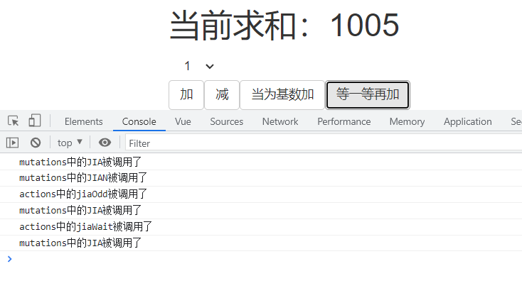

# 九、Vuex

## 9.1：简介

### 1.概念

在Vue中实现集中式状态（数据）管理的一个Vue插件，对vue应用中多个组件的共享状态进行集中式的管理（读/写），也是一种组件间通信的方式，且适用于任意组件间通信。

Vuex 是一个专为 Vue.js 应用程序开发的**状态管理模式**。它采用集中式存储管理应用的所有组件的状态，并以相应的规则保证状态以一种可预测的方式发生变化。

### 2.什么是状态管理模式

让我们从一个简单的 Vue 计数应用开始：

```js
new Vue({
  // state
  data () {
    return {
      count: 0
    }
  },
  // view
  template: `
    <div>{{ count }}</div>
  `,
  // actions
  methods: {
    increment () {
      this.count++
    }
  }
})
```

这个状态自管理应用包含以下几个部分：

- **state**，驱动应用的数据源；
- **view**，以声明方式将 **state** 映射到视图；
- **actions**，响应在 **view** 上的用户输入导致的状态变化。

以下是一个表示“单向数据流”理念的简单示意：


但是，当我们的应用遇到**多个组件共享状态**时，单向数据流的简洁性很容易被破坏：

- 多个视图依赖于同一状态。
- 来自不同视图的行为需要变更同一状态。

对于问题一，传参的方法对于多层嵌套的组件将会非常繁琐，并且对于兄弟组件间的状态传递无能为力。对于问题二，我们经常会采用父子组件直接引用或者通过事件来变更和同步状态的多份拷贝。以上的这些模式非常脆弱，通常会导致无法维护的代码。

因此，我们为什么不把组件的共享状态抽取出来，以一个全局单例模式管理呢？在这种模式下，我们的组件树构成了一个巨大的“视图”，不管在树的哪个位置，任何组件都能获取状态或者触发行为！

通过定义和隔离状态管理中的各种概念并通过强制规则维持视图和状态间的独立性，我们的代码将会变得更结构化且易维护。

这就是 Vuex
背后的基本思想，借鉴了 [Flux (opens new window)](https://facebook.github.io/flux/docs/overview)、[Redux (opens new window)](http://redux.js.org/)
和 [The Elm Architecture (opens new window)](https://guide.elm-lang.org/architecture/)。与其他模式不同的是，Vuex 是专门为
Vue.js 设计的状态管理库，以利用 Vue.js 的细粒度数据响应机制来进行高效的状态更新。

如果你想交互式地学习 Vuex，可以看这个 [Scrimba 上的 Vuex 课程 (opens new window)](https://scrimba.com/g/gvuex)
，它将录屏和代码试验场混合在了一起，你可以随时暂停并尝试。


### 3.何时使用？

​ 多个组件需要共享数据时

Vuex 可以帮助我们管理共享状态，并附带了更多的概念和框架。这需要对短期和长期效益进行权衡。

如果您不打算开发大型单页应用，使用 Vuex 可能是繁琐冗余的。确实是如此——如果您的应用够简单，您最好不要使用
Vuex。一个简单的 [store 模式 (opens new window)](https://cn.vuejs.org/v2/guide/state-management.html#简单状态管理起步使用)
就足够您所需了。但是，如果您需要构建一个中大型单页应用，您很可能会考虑如何更好地在组件外部管理状态，Vuex 将会成为自然而然的选择。引用
Redux 的作者 Dan Abramov 的话说就是：

> Flux 架构就像眼镜：您自会知道什么时候需要它。

### 4.原理图


## 9.2：案例-vue版计数

### 1.代码

````java
<template>
  <div>
    <h1>当前求和：{{ count }}</h1>
    <select class="btn" v-bind:value="n">
      <option v-for="(index) in 5" :key="index">{{ index }}</option>
    </select><br>
    <button class="btn btn-default" @click="increment">加</button>
    <button class="btn btn-default" @click="decrement">减</button>
    <button class="btn btn-default" @click="incrementodd">当为基数加</button>
    <button class="btn btn-default" @click="incrementwait">等一等再加</button>
  </div>

</template>

<script>
export default {
  name: "Count",
  data() {
    return {
      count: 0,
      n: 1
    }
  }, methods: {
    increment() {
      this.count+=this.n
    },
    decrement() {
      this.count-=this.n
    },
    incrementodd() {
      if (this.count%2===0){
        this.count+=this.n
      }
    },
    incrementwait() {
      setTimeout(()=>{
        this.count+=this.n
      },500)
    },
  }
}
</script>

<style scoped>

</style>
````

### 2.测试


## 9.3：安装vuex

```java
npm install vuex --save
```

```java
import Vue from 'vue'
import Vuex from 'vuex'

Vue.use(Vuex)
```


## 9.4：搭建vuex环境

### 1.创建文件：src/store/index.js

   ```js
//该文件用于创建vuex中最为核心的store

//引入Vue和Vuex
import Vue from 'vue'
import Vuex from "vuex";
Vue.use(Vuex)
//准备 actions----用于相应组件中的动作
const actions ={}

//准备 mutations----用于操作数据(CRUD)
const mutations ={}

//准备 state----用于控制数据的状态
const state ={}

//创建并暴露store
export default  new Vuex.Store({
    actions,
    mutations,
    state
})


   ```

### 2.在main.js中创建vm时传入store配置项

   ```js
import Vue from 'vue'
import App from './App.vue'
import store from './store/index'
Vue.config.productionTip = false
new Vue({
    render: h => h(App),
    store,
}).$mount('#app')
   ```

## 9.5：案例-Vux版技术(第一版)

### 1.store/index.js

```java
//该文件用于创建vuex中最为核心的store
//引入Vue和Vuex
import Vue from 'vue'
import Vuex from "vuex";
Vue.use(Vuex)
//准备 actions----用于相应组件中的动作
const actions ={
     jia(context,value){
        console.log('actions中的jia被调用了')
        context.commit('JIAmutations',value)
    },
    jian(context,value){
        console.log('actions中的jian被调用了')
        context.commit('JIANmutations',value)
    },
    jiaOdd(context,value){
        console.log('actions中的jiaOdd被调用了')
        if(context.state.sum % 2){
            context.commit('JIAmutations',value)
        }
    },
    jiaWait(context,value){
        console.log('actions中的jiaWait被调用了')
        setTimeout(()=>{
            context.commit('JIAmutations',value)
        },500)
    }
}

//准备 mutations----用于操作数据(CRUD)
const mutations ={
    JIAmutations(state,value){
        console.log('mutations中的JIA被调用了')
        state.sum += value
    },
    JIANmutations(state,value){
        console.log('mutations中的JIAN被调用了')
        state.sum -= value
    }

}

//准备 state----用于控制数据的状态
const state ={
    sum:1000
}

//创建并暴露store
export default  new Vuex.Store({
    actions,
    mutations,
    state
})
```

### 2.Count.vue

```java
<template>
  <div>
    <h1>当前求和：{{ $store.state.sum }}</h1>
    <select class="btn" v-bind:value="n">
      <option v-for="(index) in 5" :key="index">{{ index }}</option>
    </select><br>
    <button class="btn btn-default" @click="increment">加</button>
    <button class="btn btn-default" @click="decrement">减</button>
    <button class="btn btn-default" @click="incrementodd">当为基数加</button>
    <button class="btn btn-default" @click="incrementwait">等一等再加</button>
  </div>
</template>
<script>
export default {
  name: "Count",
  data() {
    return {
      n: 1
    }
  }, methods: {
    increment() {
     this.$store.dispatch('jia',this.n)
    },
    decrement() {
      this.$store.dispatch('jian',this.n)
    },
    incrementodd() {
     this.$store.dispatch('jiaOdd',this.n)
    },
    incrementwait() {
        this.$store.dispatch('jiaWait',this.n)
    },
  }
}
</script>
<style scoped>
</style>
```

### 3.测试


看打印信息

## 9.6：案例-Vux版技术(第二版)

### 1.store/index.js

不变

### 2.count.vue

```java
<template>
//*************************省略***********************
</template>

<script>
export default {
  name: "Count",
  data() {
    return {
      n: 1
    }
  }, methods: {
    increment() {
     this.$store.commit('JIAmutations',this.n)
    },
    decrement() {
      this.$store.commit('JIANmutations',this.n)
    },
    incrementodd() {
     this.$store.dispatch('jiaOdd',this.n)
    },
    incrementwait() {
        this.$store.dispatch('jiaWait',this.n)
    },
  }
}
</script>
```

### 3.测试



### 4.总结

为什么：看图：我们是不是直接dispatch去调用actions了，但是actions是不是去cmmit了mutation它，这个时候我们可以直接跨过它的


## 9.7：Getters配置项

### 1.简介

有时候我们需要从 store 中的 state 中派生出一些状态，例如对列表进行过滤并计数：

```java
computed: {
  doneTodosCount () {
    return this.$store.state.todos.filter(todo => todo.done).length
  }
}
```

**如果有多个组件需要用到此属性，我们要么复制这个函数，或者抽取到一个共享函数然后在多处导入它——无论哪种方式都不是很理想。**

Vuex 允许我们在 store 中定义“getter”（可以认为是 store 的计算属性）。就像计算属性一样，getter
的返回值会根据它的依赖被缓存起来，且只有当它的依赖值发生了改变才会被重新计算。

Getter 接受 state 作为其第一个参数：

```java
onst store = new Vuex.Store({
  state: {
    todos: [
      { id: 1, text: '...', done: true },
      { id: 2, text: '...', done: false }
    ]
  },
  getters: {
    doneTodos: state => {
      return state.todos.filter(todo => todo.done)
    }
  }
})
```

### 2.通过属性访问

Getter 会暴露为 `store.getters` 对象，你可以以属性的形式访问这些值：

```js
store.getters.doneTodos // -> [{ id: 1, text: '...', done: true }]
```

Getter 也可以接受其他 getter 作为第二个参数：

```js
getters: {
  // ...
  doneTodosCount: (state, getters) => {
    return getters.doneTodos.length
  }
}
store.getters.doneTodosCount // -> 1
```

我们可以很容易地在任何组件中使用它：

```js
computed: {
  doneTodosCount () {
    return this.$store.getters.doneTodosCount
  }
}
```

注意，getter 在通过属性访问时是作为 Vue 的响应式系统的一部分缓存其中的。

### 3.通过方法访问

你也可以通过让 getter 返回一个函数，来实现给 getter 传参。在你对 store 里的数组进行查询时非常有用。

```js
getters: {
  // ...
  getTodoById: (state) => (id) => {
    return state.todos.find(todo => todo.id === id)
  }
}
```

```java
store.getters.getTodoById(2) // -> { id: 2, text: '...', done: false }
```

注意，getter 在通过方法访问时，每次都会去进行调用，而不会缓存结果。

### 4.总结

1. 概念：当state中的数据需要经过加工后再使用时，可以使用getters加工。

2. 在```store.js```中追加```getters```配置

   ```js
   ......
   
   const getters = {
   	bigSum(state){
   		return state.sum * 10
   	}
   }
   
   //创建并暴露store
   export default new Vuex.Store({
   	......
   	getters
   })
   ```

3. 组件中读取数据：```$store.getters.bigSum```

## 9.8：state配置项

和我们的data属性很像这里就是存储我们的数据

+ 取值

```java
$store.state.XXX
```

## 9.9：Mutation配置项

### 1.简介

更改 Vuex 的 store 中的状态的唯一方法是提交 mutation。Vuex 中的 mutation 非常类似于事件：每个 mutation 都有一个字符串的 *
*事件类型 (type)** 和 一个 **回调函数 (handler)**。这个回调函数就是我们实际进行状态更改的地方，并且它会接受 **state**
作为第一个参数：

```js
const store = new Vuex.Store({
  state: {
    count: 1
  },
  mutations: {
    increment (state) {
      // 变更状态
      state.count++
    }
  }
})
```

你不能直接调用一个 mutation handler。这个选项更像是事件注册：“当触发一个类型为 `increment` 的 mutation 时，调用此函数。”要唤醒一个
mutation handler，你需要以相应的 type 调用 **store.commit** 方法：

```js
this.$store.commit('increment')
```

### 2.提交负载(如何调用)

> 第一种：


你可以向 `store.commit` 传入额外的参数，即 mutation 的 **载荷（payload）**：

```js
// ...
mutations: {
  increment (state, n) {
    state.count += n
  }
}
```

+ 调用

```java
store.commit('increment', 10)
```

> 第二种：


在大多数情况下，载荷应该是一个对象，这样可以包含多个字段并且记录的 mutation 会更易读：

```js
// ...
mutations: {
  increment (state, payload) {
    state.count += payload.amount
  }
}

```

+ 调用

```java
store.commit('increment', {
  amount: 10
})
```

### 3.Mutation 必须是同步函数

一条重要的原则就是要记住 **mutation 必须是同步函数**。为什么？请参考下面的例子：

```js
mutations: {
  someMutation (state) {
    api.callAsyncMethod(() => {
      state.count++
    })
  }
}
```

现在想象，我们正在 debug 一个 app 并且观察 devtool 中的 mutation 日志。每一条 mutation 被记录，devtools
都需要捕捉到前一状态和后一状态的快照。然而，在上面的例子中 mutation 中的异步函数中的回调让这不可能完成：**因为当 mutation
触发的时候，回调函数还没有被调用，devtools 不知道什么时候回调函数实际上被调用——实质上任何在回调函数中进行的状态的改变都是不可追踪的。
**

### 4.在组件中提交 Mutation

```java
this.$store.commit('JIANmutations',this.n)
// 任何由 "JIANmutations" 导致的状态变更都应该在此刻完成。
```

## 9.10：Action

### 1.简介

Action 类似于 mutation，不同在于：

- Action 提交的是 mutation，而不是直接变更状态。
- Action 可以包含任意异步操作。

让我们来注册一个简单的 action：

```java
const store = new Vuex.Store({
  state: {
    count: 0
  },
  mutations: {
    increment (state) {
      state.count++
    }
  },
  actions: {
    increment (context) {
      context.commit('increment')
    }
  }
})
```

### 2.提示

Action 函数接受一个与 store 实例具有相同方法和属性的 context 对象，因此你可以调用 `context.commit` 提交一个
mutation，或者通过 `context.state` 和 `context.getters` 来获取 state 和 getters。

### 3.分发 Action

Action 通过 `store.dispatch` 方法触发：

```js
this.$store.dispatch('increment')
```

乍一眼看上去感觉多此一举，我们直接分发 mutation 岂不更方便？实际上并非如此，还记得 **mutation 必须同步执行**这个限制么？Action
就不受约束！我们可以在 action 内部执行**异步**操作：

```js
actions: {
  incrementAsync ({ commit }) {
    setTimeout(() => {
      commit('increment')
    }, 1000)
  }
}
```

Actions 支持同样的载荷方式和对象方式进行分发：

```js
// 以载荷形式分发
store.dispatch('incrementAsync', {
  amount: 10
})

// 以对象形式分发
store.dispatch({
  type: 'incrementAsync',
  amount: 10
})
```

来看一个更加实际的购物车示例，涉及到**调用异步 API** 和**分发多重 mutation**：

```js
actions: {
  checkout ({ commit, state }, products) {
    // 把当前购物车的物品备份起来
    const savedCartItems = [...state.cart.added]
    // 发出结账请求，然后乐观地清空购物车
    commit(types.CHECKOUT_REQUEST)
    // 购物 API 接受一个成功回调和一个失败回调
    shop.buyProducts(
      products,
      // 成功操作
      () => commit(types.CHECKOUT_SUCCESS),
      // 失败操作
      () => commit(types.CHECKOUT_FAILURE, savedCartItems)
    )
  }
}
```

注意我们正在进行一系列的异步操作，并且通过提交 mutation 来记录 action 产生的副作用（即状态变更）。

## 9.11：四个map方法的使用

### 1.mapState方法

<strong>mapState方法：</strong>用于帮助我们映射```state```中的数据为计算属性

```js
 computed: {
   //借助mapState生成计算属性：sum、school、subject（对象写法）
   ...mapState({sum:'sum',school:'school',subject:'subject'}),
            
   //借助mapState生成计算属性：sum、school、subject（数组写法）
   ...mapState(['sum','school','subject']),
},
```

等同于

```java
computed: {
    sum: function () {
      return this.$store.state.sum
    },
    school: function () {
      return this.$store.state.school
    }, subject: function () {
      return this.$store.state.subject
    },
}
```

### 2.mapGetters方法

<strong>mapGetters方法：</strong>用于帮助我们映射```getters```中的数据为计算属性

```js
computed: {
    //借助mapGetters生成计算属性：bigSum（对象写法）
    ...mapGetters({bigSum:'bigSum'}),

    //借助mapGetters生成计算属性：bigSum（数组写法）
    ...mapGetters(['bigSum'])
},
```

等同于

```java
computed: {
    bigSum:function (){
      return this.$store.getters.bigSum
    }
  }
```

### 3.mapActions方法

<strong>mapActions方法：</strong>用于帮助我们生成与```actions```对话的方法，即：包含```$store.dispatch(xxx)```的函数

```js
methods:{
    //靠mapActions生成：incrementOdd、incrementWait（对象形式）
    ...mapActions({incrementOdd:'jiaOdd',incrementWait:'jiaWait'})

    //靠mapActions生成：incrementOdd、incrementWait（数组形式）
    ...mapActions(['jiaOdd','jiaWait'])
}
```

或者

```java
methods:{    
	incrementOdd() {
      this.$store.dispatch('jiaOdd', this.n)
    },    
    incrementWait() {
      this.$store.dispatch('jiaWait', this.n)
    }
}    
```

### 4.mapMutations

<strong>mapMutations方法：</strong>用于帮助我们生成与```mutations```对话的方法，即：包含```$store.commit(xxx)```的函数

```js
methods:{
    //靠mapActions生成：increment、decrement（对象形式）
    ...mapMutations({increment:'JIA',decrement:'JIAN'}),
    
    //靠mapMutations生成：JIA、JIAN（数组形式）
    ...mapMutations(['JIA','JIAN']),
}
```

等同于

```java
methods:{    
	increment() {
      this.$store.commit('JIA', this.n)
    },    
    decrement() {
      this.$store.dispatch('JIAN', this.n)
    }
}    
```

> 备注：mapActions与mapMutations使用时，若需要传递参数需要：在模板中绑定事件时传递好参数，否则参数是事件对象。

```java
<button class="btn btn-default" @click="increment(n)">加</button>
<button class="btn btn-default" @click="decrement(n)">减</button>
```

### 5.注意

**我们推荐使用数组的写法**

## 9.12：模块化

### 1.简介

由于使用单一状态树，应用的所有状态会集中到一个比较大的对象。当应用变得非常复杂时，store 对象就有可能变得相当臃肿。

为了解决以上问题，Vuex 允许我们将 store 分割成模块（module）。每个模块拥有自己的
state、mutation、action、getter、甚至是嵌套子模块——从上至下进行同样方式的分割：

```java
const moduleA = {
  state: () => ({ ... }),
  mutations: { ... },
  actions: { ... },
  getters: { ... }
}

const moduleB = {
  state: () => ({ ... }),
  mutations: { ... },
  actions: { ... }
}

const store = new Vuex.Store({
  modules: {
    a: moduleA,
    b: moduleB
  }
})

store.state.a // -> moduleA 的状态
store.state.b // -> moduleB 的状态
```

### 2.模块的局部状态

#### 对于模块内部的 mutation 和 getter，接收的第一个参数是**模块的局部状态对象**。

```js
const moduleA = {
  state: () => ({
    count: 0
  }),
  mutations: {
    increment (state) {
      // 这里的 `state` 对象是模块的局部状态
      state.count++
    }
  },

  getters: {
    doubleCount (state) {
      return state.count * 2
    }
  }
}
```

#### 同样，对于模块内部的 action，局部状态通过 `context.state` 暴露出来，根节点状态则为 `context.rootState`：

```js
const moduleA = {
  // ...
  actions: {
    incrementIfOddOnRootSum ({ state, commit, rootState }) {
      if ((state.count + rootState.count) % 2 === 1) {
        commit('increment')
      }
    }
  }
}
```

#### 对于模块内部的 getter，根节点状态会作为第三个参数暴露出来：

```js
const moduleA = {
  // ...
  getters: {
    sumWithRootCount (state, getters, rootState) {
      return state.count + rootState.count
    }
  }
}
```

#### 解释一下根节点

上面三小结提的根节点，是可以读取到其他的模块的state

例如：这是一个actions

```js
actions:{
    addPersonWang({ state, rootState },context) {
			console.log(state)
			console.log(rootState)
			console.log(rootState.personAbout.personList)
			console.log(context)
	}
}        
```

那么所说的根节点请看页面打印


### 3.命名空间

#### 简介

默认情况下，模块内部的 action、mutation 和 getter 是注册在**全局命名空间**的——这样使得多个模块能够对同一 mutation 或
action 作出响应。

如果希望你的模块具有更高的封装度和复用性，你可以通过添加 `namespaced: true` 的方式使其成为带命名空间的模块。当模块被注册后，它的所有
getter、action 及 mutation 都会自动根据模块注册的路径调整命名。

#### 开启命名空间

```java
const countAbout = {
  namespaced:true,//开启命名空间
  state:{x:1},
  mutations: { ... },
  actions: { ... },
  getters: {
    bigSum(state){
       return state.sum * 10
    }
  }
}

const personAbout = {
  namespaced:true,//开启命名空间
  state:{ ... },
  mutations: { ... },
  actions: { ... }
}

const store = new Vuex.Store({
  modules: {
    countAbout,
    personAbout
  }
})
```

#### 开启命名空间后，组件中读取state数据：

```js
//方式一：自己直接读取
this.$store.state.personAbout.list
//方式二：借助mapState读取：
...mapState('countAbout',['sum','school','subject']),
```

#### 开启命名空间后，组件中读取getters数据：

```js
//方式一：自己直接读取
this.$store.getters['personAbout/firstPersonName']
//方式二：借助mapGetters读取：
...mapGetters('countAbout',['bigSum'])
```

#### 开启命名空间后，组件中调用dispatch

```js
//方式一：自己直接dispatch
this.$store.dispatch('personAbout/addPersonWang',person)
//方式二：借助mapActions：
...mapActions('countAbout',{incrementOdd:'jiaOdd',incrementWait:'jiaWait'})
```

#### 开启命名空间后，组件中调用commit

```js
//方式一：自己直接commit
this.$store.commit('personAbout/ADD_PERSON',person)
//方式二：借助mapMutations：
...mapMutations('countAbout',{increment:'JIA',decrement:'JIAN'}),
```

### 4.模块重用

有时我们可能需要创建一个模块的多个实例，例如：

- 创建多个 store，他们公用同一个模块 (例如当 `runInNewContext` 选项是 `false` 或 `'once'`
  时，为了[在服务端渲染中避免有状态的单例 (opens new window)](https://ssr.vuejs.org/en/structure.html#avoid-stateful-singletons))
- 在一个 store 中多次注册同一个模块

如果我们使用一个纯对象来声明模块的状态，那么这个状态对象会通过引用被共享，导致状态对象被修改时 store 或模块间数据互相污染的问题。

实际上这和 Vue 组件内的 `data` 是同样的问题。因此解决办法也是相同的——使用一个函数来声明模块状态（仅 2.3.0+ 支持）：

```js
const MyReusableModule = {
  state: () => ({
    foo: 'bar'
  }),
  // mutation, action 和 getter 等等...
}
```

## 9.13：开发中项目结构

Vuex 并不限制你的代码结构。但是，它规定了一些需要遵守的规则：

1. 应用层级的状态应该集中到单个 store 对象中。
2. 提交 **mutation** 是更改状态的唯一方法，并且这个过程是同步的。
3. 异步逻辑都应该封装到 **action** 里面。

只要你遵守以上规则，如何组织代码随你便。如果你的 store 文件太大，只需将 action、mutation 和 getter 分割到单独的文件。

对于大型应用，我们会希望把 Vuex 相关代码分割到模块中。下面是项目结构示例：

```shell
├── index.html
├── main.js
├── api
│   └── ... # 抽取出API请求
├── components
│   ├── App.vue
│   └── ...
└── store
    ├── index.js          # 我们组装模块并导出 store 的地方
    ├── actions.js        # 根级别的 action
    ├── mutations.js      # 根级别的 mutation
    └── modules
        ├── cart.js       # 购物车模块
        └── products.js   # 产品模块
```


