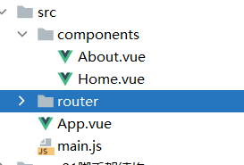
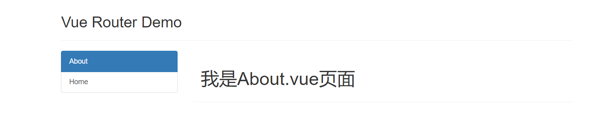
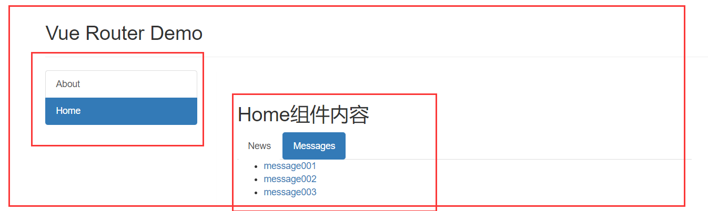

# 十、路由

## 10.1：简介

Vue Router 是 [Vue.js (opens new window)](http://cn.vuejs.org/)官方的路由管理器。它和 Vue.js
的核心深度集成，让构建单页面应用变得易如反掌。包含的功能有：

- 嵌套的路由/视图表
- 模块化的、基于组件的路由配置
- 路由参数、查询、通配符
- 基于 Vue.js 过渡系统的视图过渡效果
- 细粒度的导航控制
- 带有自动激活的 CSS class 的链接
- HTML5 历史模式或 hash 模式，在 IE9 中自动降级
- 自定义的滚动条行为

> 1. 理解： 一个路由（route）就是一组映射关系（key - value），多个路由需要路由器（router）进行管理。
> 2. 前端路由：key是路径，value是组件。

## 10.2：安装

```java
npm install vue-router
```

```java
import Vue from 'vue'
import VueRouter from 'vue-router'

Vue.use(VueRouter)
```

## 10.3：基本使用路由

### 1.main.js

```java
import Vue from 'vue'
import App from './App.vue'
import VueRouter from 'vue-router'
import {router} from "@/router"
import axios from 'axios'
Vue.use(VueRouter)
Vue.config.productionTip = false
new Vue({
    render: h => h(App),
    router:router
}).$mount('#app')
```

### 2.App.vue

```java
<template>
  <div>
    <div class="row">
      <div class="col-xs-offset-2 col-xs-8">
        <div class="page-header"><h2>Vue Router Demo</h2></div>
      </div>
    </div>
    <div class="row">
      <div class="col-xs-2 col-xs-offset-2">
        <div class="list-group">
          <router-link to="/about" active-class="active"  class="list-group-item">About</router-link>
          <router-link to="/home" active-class="active"  class="list-group-item ">Home</router-link>
        </div>
      </div>
      <div class="col-xs-6">
        <div class="panel">
          <div class="panel-body">
            <router-view></router-view>
          </div>
        </div>
      </div>
    </div>
  </div>
</template>
<script>
export default {
  name:'App',
}
</script>
```

### 3.About.vue

```java
<template>
  <div>
    <h1>我是About.vue页面</h1>
  </div>
</template>

<script>
export default {
  name: "About",
  data() {
    return {}
  }
}
</script>

<style scoped>

</style>
```

### 4.Home.vue

```java
<template>
    <div>    
        <h1>我是Home.vue页面</h1>
    </div>
</template>
<script>
export default {
  name: "Home",
  data(){
     return{}
  }
}
</script>
```

### 5.router/index.js

```java
import VueRouter from "vue-router"
import About from "@/components/About"
import Home from "@/components/Home";

export const router = new VueRouter({
        routes: [
            {
                path: '/home',
                component:Home
            },
            {
                path: '/about',
                component:About
            }
        ]
    })
;
```

### 6.项目结构



### 7.测试

http://localhost:8080/#/about

注意地址栏的`#`号



## 10.4：几个注意点

1. 路由组件通常存放在```pages```文件夹，一般组件通常存放在```components```文件夹。
2. 通过切换，“隐藏”了的路由组件，默认是被销毁掉的，需要的时候再去挂载。
3. 每个组件都有自己的```$route```属性，里面存储着自己的路由信息。
4. 整个应用只有一个router，可以通过组件的```$router```属性获取到

## 10.5：多级路由

### 1.效果图



### 2.Message.vue

```java
<template>
  <ul>
    <li>
      <a href="/message1">message001</a>&nbsp;&nbsp;
    </li>
    <li>
      <a href="/message2">message002</a>&nbsp;&nbsp;
    </li>
    <li>
      <a href="/message/3">message003</a>&nbsp;&nbsp;
    </li>
  </ul>
</template>

<script>
export default {
  name: "Message",
  data(){
     return{}
  }
}
</script>
<style scoped>
</style>
```

### 3.News

```java
<template>
  <ul>
    <li>news001</li>
    <li>news002</li>
    <li>news003</li>
  </ul>
</template>

<script>
export default {
  name: "News",
  data(){
     return{}
  }
}
</script>
```

### 4.Home.vue

```java
<template>
  <div class="panel-body">
    <div>
      <h2>Home组件内容</h2>
      <div>
        <ul class="nav nav-tabs">
          <li>
            <router-link active-class="active" class="list-group-item" to="/home/news">News</router-link>
          </li>
          <li>
            <router-link active-class="active" class="list-group-item" to="/home/message">Messages</router-link>
          </li>
        </ul>
        <div>
          <router-view></router-view>
        </div>
      </div>
    </div>
  </div>
</template>

<script>
export default {
  name: "Home",
  data(){
     return{}
  }
}
</script>
<style scoped>
</style>
```

### 5.router/index.js

```java
import VueRouter from "vue-router"
import About from "@/components/About"
import Home from "@/components/Home";
import Message from "@/components/Message";
import News from "@/components/News";

export const router = new VueRouter({
        routes: [
            {
                path: '/home',
                component: Home,
                children: [
                    {
                        path: 'message',
                        component: Message
                    },
                    {
                        path: 'news',
                        component: News
                    }
                ]
            },
            {
                path: '/about',
                component: About
            }
        ]
    })
;
```

### 6.总结

+ 配置路由规则，使用children配置项

```js
routes:[
	{
		path:'/about',
		component:About,
	},
	{
		path:'/home',
		component:Home,
		children:[ //通过children配置子级路由
			{
				path:'news', //此处一定不要写：/news
				component:News
			},
			{
				path:'message',//此处一定不要写：/message
				component:Message
			}
		]
	}
]
```

+ 跳转（要写完整路径）

```vue
<router-link to="/home/news">News</router-link>
```

## 10.6：路由传参(query参数)

### 1.传递参数

```vue
<!-- 跳转并携带query参数，to的字符串写法  不推荐-->
<router-link :to="/home/message/detail?id=666&title=你好">跳转</router-link>
				
<!-- 跳转并携带query参数，to的对象写法 推荐 -->
<router-link 
	:to="{
		path:'/home/message/detail',
		query:{
		   id:666,
            title:'你好'
		}
	}"
>跳转</router-link>
```

### 2.接收参数

```js
$route.query.id
$route.query.title
```

**注意是`$route`不是`$router`**

### 3.案例

#### Message.vue

```java
<template>
  <div>
    <ul>
      <li v-for="(item) in messList" :key="item.id">
<!--        <router-link :to="`/home/message/detail?id=${item.id}&value=${item.value}`">{{item.value}}</router-link>-->
<!-- 推荐这种写法       -->
        <router-link :to="{
          path:'/home/message/detail',
          query:{
            id:item.id,
            value:item.value
          }
        }">{{item.value}}
        </router-link>
      </li>
    </ul>
    <hr>
    <router-view></router-view>
  </div>
</template>

<script>
export default {
  name: "Message",
  data(){
     return{
       messList:[
         {id:"001",value:'message001'},
         {id:"002",value:'message002'},
         {id:"003",value:'message003'}
       ]
     }
  }
}
</script>

```

#### Detail.vue

````java
<template>
<ul>
  <li>id:{{$route.query.id}}</li>
  <li>value:{{$route.query.value}}</li>
  <li>id:{{id}}</li>
  <li>value:{{value}}</li>
</ul>
</template>

<script>
export default {
  name: "Detail",
  data(){
     return{
       id:this.$route.query.id,
       value:this.$route.query.value,
     }
  },
  mounted() {
    console.log(this.$route)
    console.log(this.$router)
  }
}
</script>

<style scoped>

</style>
````

## 10.7：路由命名

### 1.简介

有时候，通过一个名称来标识一个路由显得更方便一些，特别是在链接一个路由，或者是执行一些跳转的时候。你可以在创建 Router
实例的时候，在 `routes` 配置中给某个路由设置名称。

```js
const router = new VueRouter({
  routes: [
    {
      path: '/user/:userId',
      name: 'user',
      component: User
    }
  ]
})
```

要链接到一个命名路由，可以给 `router-link` 的 `to` 属性传一个对象：

```html
<router-link :to="{ name: 'user', params: { userId: 123 }}">User</router-link>
```

### 2.作用

可以简化路由的跳转。

### 3.如何使用

#### 给路由命名

```js
{
	path:'/demo',
	component:Demo,
	children:[
		{
			path:'test',
			component:Test,
			children:[
				{
                      name:'hello' //给路由命名
					path:'welcome',
					component:Hello,
				}
			]
		}
	]
}
```

#### 简化跳转

```vue
<!--简化前，需要写完整的路径 -->
<router-link to="/demo/test/welcome">跳转</router-link>

<!--简化后，直接通过名字跳转 -->
<router-link :to="{name:'hello'}">跳转</router-link>

<!--简化写法配合传递参数 -->
<router-link 
	:to="{
		name:'hello',
		query:{
		   id:666,
            title:'你好'
		}
	}"
>跳转</router-link>
```

### 4.案例

#### router/index.js

```java
import VueRouter from "vue-router"
import About from "@/components/About"
import Home from "@/components/Home";
import Message from "@/components/Message";
import News from "@/components/News";
import Detail from "@/components/Detail";
export const router = new VueRouter({
        routes: [
            {
                path: '/home',
                component: Home,
                children: [
                    {
                        path: 'message',
                        component: Message,
                        children:[
                            {
                                name:'messageDetail',
                                path:'detail',
                                component:Detail
                            }
                        ]
                    },
                    {
                        path: 'news',
                        component: News
                    }
                ]
            },
            {
                name:'gaunyu',
                path: '/about',
                component: About
            }
        ]
    })
;
```

#### Detail.vue

```java
<template>
<ul>
  <li>id:{{$route.query.id}}</li>
  <li>value:{{$route.query.value}}</li>
  <li>id:{{id}}</li>
  <li>value:{{value}}</li>
</ul>
</template>

<script>
export default {
  name: "Detail",
  data(){
     return{
       id:this.$route.query.id,
       value:this.$route.query.value,
     }
  },
  mounted() {
    console.log(this.$route)
    console.log(this.$router)
  }
}
</script>

<style scoped>

</style>
```

## 10.8：路由传参(params)

### 1.配置路由，声明接收params参数

```js
{
	path:'/home',
	component:Home,
	children:[
		{
			path:'news',
			component:News
		},
		{
			component:Message,
			children:[
				{
					name:'xiangqing',
					path:'detail/:id/:title', //使用占位符声明接收params参数
					component:Detail
				}
			]
		}
	]
}
```

### 2.传递参数

```vue
<!-- 跳转并携带params参数，to的字符串写法 -->
<router-link :to="/home/message/detail/666/你好">跳转</router-link>
				
<!-- 跳转并携带params参数，to的对象写法 -->
<router-link 
	:to="{
		name:'xiangqing',
		params:{
		   id:666,
            title:'你好'
		}
	}"
>跳转</router-link>
```

### 3.注意

> 特别注意：路由携带**params参数时**，若使用**to的对象写法**，**则不能使用path配置项，必须使用name配置！**

## 10.9：路由传参

### 1.简介

​ 作用：让路由组件更方便的收到参数

```js
{
	name:'xiangqing',
	path:'detail/:id',
	component:Detail,

	//第一种写法：props值为对象，该对象中所有的key-value的组合最终都会通过props传给Detail组件
	// props:{a:900}

	//第二种写法：props值为布尔值，布尔值为true，则把路由收到的所有params参数通过props传给Detail组件
	// props:true
	
	//第三种写法：props值为函数，该函数返回的对象中每一组key-value都会通过props传给Detail组件
	props(route){
		return {
			id:route.query.id,
			title:route.query.title
		}
	}
}
```

### 2.案例

#### route/index

```java
import VueRouter from "vue-router"
import About from "@/components/About"
import Home from "@/components/Home";
import Message from "@/components/Message";
import News from "@/components/News";
import Detail from "@/components/Detail";
export const router = new VueRouter({
        routes: [
            {
                path: '/home',
                component: Home,
                children: [
                    {
                        path: 'message',
                        component: Message,
                        children:[
                            {
                                name:'messageDetail',
                                path:'detail/:id/:value',
                                component:Detail,
                                props(route){
                                    console.log(route)
                                    return {
                                        id:route.params.id,
                                        value:route.params.value
                                    }
                                }
                            }
                        ]
                    },
                    {
                        path: 'news',
                        component: News
                    }
                ]
            },
            {
                name:'gaunyu',
                path: '/about',
                component: About
            }
        ]
    })
;
```

#### Detail.vue

```java
<template>
<ul>
<li>id:{{ id}}</li>
<li>value:{{ value}}</li>
</ul>
</template>
<script>
export default {
  name: "Detail",
  props:["id","value"],
  data(){
     return{
     }
  },
  computed:{
    ids(){
      return 1
    }
  }
}
</script>
<style scoped>
</style>
```

#### message.vue

```java
<template>
  <div>
    <ul>
      <li v-for="(item) in messList" :key="item.id">
        <router-link :to="{
          name:'messageDetail',
          params:{
            id:item.id,
            value:item.value
          }
        }">{{item.value}}
        </router-link>
      </li>
    </ul>
    <hr>
    <router-view></router-view>
  </div>
</template>
```

## 10.10：router-link标签的的replace属性

1. 作用：控制路由跳转时操作浏览器历史记录的模式
2. 浏览器的历史记录有两种写入方式：分别为```push```和```replace```，```push```是追加历史记录，```replace```
   是替换当前记录。路由跳转时候默认为```push```
3. 如何开启```replace```模式：```<router-link replace .......>News</router-link>```

````java
<router-link replace  active-class="active" to="/home/message">Message</router-link>
````

## 10.11：编程式路由导航

1. 作用：不借助```<router-link> ```实现路由跳转，让路由跳转更加灵活

2. 具体编码：

   ```js
   //$router的两个API
   this.$router.push({
   	name:'xiangqing',
   		params:{
   			id:xxx,
   			title:xxx
   		}
   })
   
   this.$router.replace({
   	name:'xiangqing',
   		params:{
   			id:xxx,
   			title:xxx
   		}
   })
   this.$router.forward() //前进
   this.$router.back() //后退
   this.$router.go() //可前进也可后退
   ```

## 10.12：缓存路由组件

1. 作用：让不展示的路由组件保持挂载，不被销毁。

2. 具体编码：

   ```vue
   <keep-alive include="News"> 
       <router-view></router-view>
   </keep-alive>
   ```

## 10.13：两个新的生命周期钩子

1. 作用：路由组件所独有的两个钩子，用于捕获路由组件的激活状态。
2. 具体名字：
    1. ```activated```路由组件被激活时触发。
    2. ```deactivated```路由组件失活时触发。

## 10.14：路由导航

### 1.简介

正如其名，`vue-router` 提供的导航守卫主要用来通过跳转或取消的方式守卫导航。有多种机会植入路由导航过程中：全局的, 单个路由独享的,
或者组件级的。

记住**参数或查询的改变并不会触发进入/离开的导航守卫**
。你可以通过[观察 `$route` 对象](https://router.vuejs.org/zh/guide/essentials/dynamic-matching.html#响应路由参数的变化)
来应对这些变化，或使用 `beforeRouteUpdate` 的组件内守卫。

### 2.全局前置守卫

你可以使用 `router.beforeEach` 注册一个全局前置守卫：

```js
const router = new VueRouter({ ... })

router.beforeEach((to, from, next) => {
  // ...
})
```

当一个导航触发时，全局前置守卫按照创建顺序调用。守卫是异步解析执行，此时导航在所有守卫 resolve 完之前一直处于 **等待中**
。每个守卫方法接收三个参数：

- **`to: Route`**: 即将要进入的目标 [路由对象](https://router.vuejs.org/zh/api/#路由对象)
- **`from: Route`**: 当前导航正要离开的路由
- **`next: Function`**: 一定要调用该方法来 **resolve** 这个钩子。执行效果依赖 `next` 方法的调用参数。
    - **`next()`**: 进行管道中的下一个钩子。如果全部钩子执行完了，则导航的状态就是 **confirmed** (确认的)。
    - **`next(false)`**: 中断当前的导航。如果浏览器的 URL 改变了 (可能是用户手动或者浏览器后退按钮)，那么 URL
      地址会重置到 `from` 路由对应的地址。
    - **`next('/')` 或者 `next({ path: '/' })`**:
      跳转到一个不同的地址。当前的导航被中断，然后进行一个新的导航。你可以向 `next`
      传递任意位置对象，且允许设置诸如 `replace: true`、`name: 'home'`
      之类的选项以及任何用在 [`router-link` 的 `to` prop](https://router.vuejs.org/zh/api/#to)
      或 [`router.push`](https://router.vuejs.org/zh/api/#router-push) 中的选项。
    - **`next(error)`**: (2.4.0+) 如果传入 `next` 的参数是一个 `Error`
      实例，则导航会被终止且该错误会被传递给 [`router.onError()`](https://router.vuejs.org/zh/api/#router-onerror)
      注册过的回调。

**确保 `next` 函数在任何给定的导航守卫中都被严格调用一次。它可以出现多于一次，但是只能在所有的逻辑路径都不重叠的情况下，否则钩子永远都不会被解析或报错
**。这里有一个在用户未能验证身份时重定向到 `/login` 的示例：

```js
// BAD
router.beforeEach((to, from, next) => {
  if (to.name !== 'Login' && !isAuthenticated) next({ name: 'Login' })
  // 如果用户未能验证身份，则 `next` 会被调用两次
  next()
})
// GOOD
router.beforeEach((to, from, next) => {
  if (to.name !== 'Login' && !isAuthenticated) next({ name: 'Login' })
  else next()
})
```

### 3.全局解析守卫

> 2.5.0 新增

在 2.5.0+ 你可以用 `router.beforeResolve` 注册一个全局守卫。这和 `router.beforeEach` 类似，区别是在导航被确认之前，*
*同时在所有组件内守卫和异步路由组件被解析之后**，解析守卫就被调用。

### 4.全局后置钩子

你也可以注册全局后置钩子，然而和守卫不同的是，这些钩子不会接受 `next` 函数也不会改变导航本身：

```js
router.afterEach((to, from) => {
  // ...
})
```

### 5.路由独享的守卫

你可以在路由配置上直接定义 `beforeEnter` 守卫：

```js
const router = new VueRouter({
  routes: [
    {
      path: '/foo',
      component: Foo,
      beforeEnter: (to, from, next) => {
        // ...
      }
    }
  ]
})
```

这些守卫与全局前置守卫的方法参数是一样的。

### 6.组件内的守卫

最后，你可以在路由组件内直接定义以下路由导航守卫：

- `beforeRouteEnter`
- `beforeRouteUpdate` (2.2 新增)
- `beforeRouteLeave`

```js
const Foo = {
  template: `...`,
  beforeRouteEnter(to, from, next) {
    // 在渲染该组件的对应路由被 confirm 前调用
    // 不！能！获取组件实例 `this`
    // 因为当守卫执行前，组件实例还没被创建
  },
  beforeRouteUpdate(to, from, next) {
    // 在当前路由改变，但是该组件被复用时调用
    // 举例来说，对于一个带有动态参数的路径 /foo/:id，在 /foo/1 和 /foo/2 之间跳转的时候，
    // 由于会渲染同样的 Foo 组件，因此组件实例会被复用。而这个钩子就会在这个情况下被调用。
    // 可以访问组件实例 `this`
  },
  beforeRouteLeave(to, from, next) {
    // 导航离开该组件的对应路由时调用
    // 可以访问组件实例 `this`
  }
}
```

`beforeRouteEnter` 守卫 **不能** 访问 `this`，因为守卫在导航确认前被调用，因此即将登场的新组件还没被创建。

不过，你可以通过传一个回调给 `next`来访问组件实例。在导航被确认的时候执行回调，并且把组件实例作为回调方法的参数。

```js
beforeRouteEnter (to, from, next) {
  next(vm => {
    // 通过 `vm` 访问组件实例
  })
}
```

注意 `beforeRouteEnter` 是支持给 `next` 传递回调的唯一守卫。对于 `beforeRouteUpdate` 和 `beforeRouteLeave` 来说，`this`
已经可用了，所以**不支持**传递回调，因为没有必要了。

```js
beforeRouteUpdate (to, from, next) {
  // just use `this`
  this.name = to.params.name
  next()
}
```

这个离开守卫通常用来禁止用户在还未保存修改前突然离开。该导航可以通过 `next(false)` 来取消。

```js
beforeRouteLeave (to, from, next) {
  const answer = window.confirm('Do you really want to leave? you have unsaved changes!')
  if (answer) {
    next()
  } else {
    next(false)
  }
}
```

### 7.完整的导航解析流程

1. 导航被触发。
2. 在失活的组件里调用 `beforeRouteLeave` 守卫。
3. 调用全局的 `beforeEach` 守卫。
4. 在重用的组件里调用 `beforeRouteUpdate` 守卫 (2.2+)。
5. 在路由配置里调用 `beforeEnter`。
6. 解析异步路由组件。
7. 在被激活的组件里调用 `beforeRouteEnter`。
8. 调用全局的 `beforeResolve` 守卫 (2.5+)。
9. 导航被确认。
10. 调用全局的 `afterEach` 钩子。
11. 触发 DOM 更新。
12. 调用 `beforeRouteEnter` 守卫中传给 `next` 的回调函数，创建好的组件实例会作为回调函数的参数传入。

### 8.总结

1. 作用：对路由进行权限控制

2. 分类：全局守卫、独享守卫、组件内守卫

3. 全局守卫:

 ```js
   //全局前置守卫：初始化时执行、每次路由切换前执行
   router.beforeEach((to,from,next)=>{
   	console.log('beforeEach',to,from)
   	if(to.meta.isAuth){ //判断当前路由是否需要进行权限控制
   		if(localStorage.getItem('school') === 'atguigu'){ //权限控制的具体规则
   			next() //放行
   		}else{
   			alert('暂无权限查看')
   			// next({name:'guanyu'})
   		}
   	}else{
   		next() //放行
   	}
   })
   
   //全局后置守卫：初始化时执行、每次路由切换后执行
   router.afterEach((to,from)=>{
   	console.log('afterEach',to,from)
   	if(to.meta.title){ 
   		document.title = to.meta.title //修改网页的title
   	}else{
   		document.title = 'vue_test'
   	}
   })
 ```

4. 独享守卫:

 ```js
   beforeEnter(to,from,next){
   	console.log('beforeEnter',to,from)
   	if(to.meta.isAuth){ //判断当前路由是否需要进行权限控制
   		if(localStorage.getItem('school') === 'atguigu'){
   			next()
   		}else{
   			alert('暂无权限查看')
   			// next({name:'guanyu'})
   		}
   	}else{
   		next()
   	}
   }
 ```

5. 组件内守卫：

 ```js
   //进入守卫：通过路由规则，进入该组件时被调用
   beforeRouteEnter (to, from, next) {
   },
   //离开守卫：通过路由规则，离开该组件时被调用
   beforeRouteLeave (to, from, next) {
   }
 ```

## 10.15：路由器的两种工作模式

1. 对于一个url来说，什么是hash值？—— #及其后面的内容就是hash值。

2. hash值不会包含在 HTTP 请求中，即：hash值不会带给服务器。

3. hash模式：

    1. 地址中永远带着#号，不美观 。
    2. 若以后将地址通过第三方手机app分享，若app校验严格，则地址会被标记为不合法。
    3. 兼容性较好。

4. history模式：

    1. 地址干净，美观 。
    2. 兼容性和hash模式相比略差。
    3. 应用部署上线时需要后端人员支持，解决刷新页面服务端404的问题。

## 10.16：路由重定向和别名

### 1.重定向

重定向也是通过 `routes` 配置来完成，下面例子是从 `/a` 重定向到 `/b`：

```js
const router = new VueRouter({
  routes: [
    { path: '/a', redirect: '/b' }
  ]
})
```

重定向的目标也可以是一个命名的路由：

```js
const router = new VueRouter({
  routes: [
    { path: '/a', redirect: { name: 'foo' }}
  ]
})
```

甚至是一个方法，动态返回重定向目标：

```js
const router = new VueRouter({
  routes: [
    { path: '/a', redirect: to => {
      // 方法接收 目标路由 作为参数
      // return 重定向的 字符串路径/路径对象
    }}
  ]
})
```

注意[导航守卫](https://router.vuejs.org/zh/guide/advanced/navigation-guards.html)
并没有应用在跳转路由上，而仅仅应用在其目标上。在下面这个例子中，为 `/a` 路由添加一个 `beforeEnter` 守卫并不会有任何效果。

其它高级用法，请参考[例子 (opens new window)](https://github.com/vuejs/vue-router/blob/dev/examples/redirect/app.js)。

### 2.别名

“重定向”的意思是，当用户访问 `/a`时，URL 将会被替换成 `/b`，然后匹配路由为 `/b`，那么“别名”又是什么呢？

**`/a` 的别名是 `/b`，意味着，当用户访问 `/b` 时，URL 会保持为 `/b`，但是路由匹配则为 `/a`，就像用户访问 `/a` 一样。**

上面对应的路由配置为：

```js
const router = new VueRouter({
  routes: [
    { path: '/a', component: A, alias: '/b' }
  ]
})
```

“别名”的功能让你可以自由地将 UI 结构映射到任意的 URL，而不是受限于配置的嵌套路由结构。


