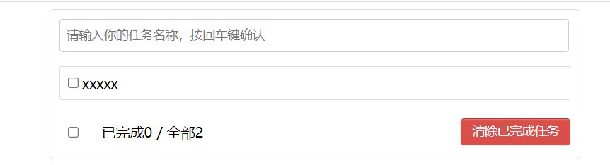
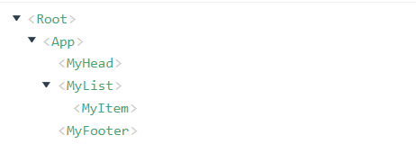
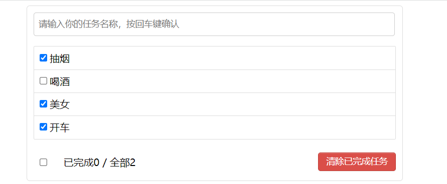
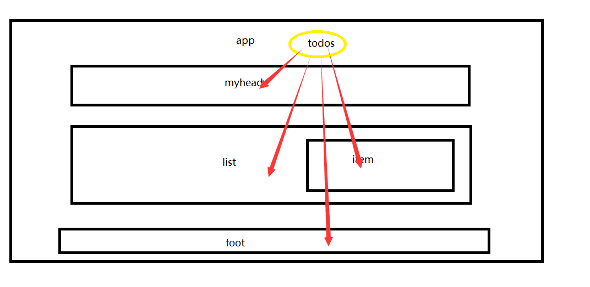
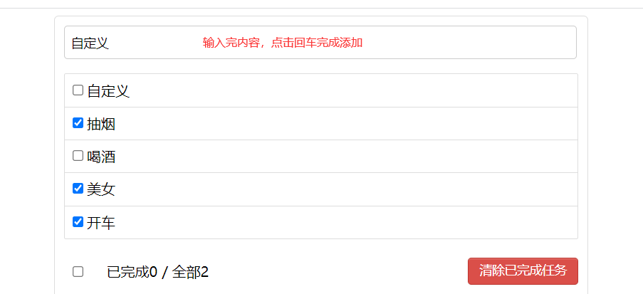
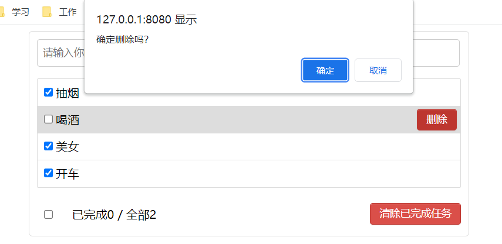

# 项目练习：TodoList

## 目的

**组件化编码流程（通用）**

1.实现静态组件：抽取组件，使用组件实现静态页面效果

2.展示动态数据：

2.1. 数据的类型、名称是什么？

2.2. 数据保存在哪个组件？

3.交互——从绑定事件监听开始

## 要先学到哪里

[学习到7.8：scoped(CSS样式](#7.8：scoped(CSS样式))之前

## 静态页面

### 基本文件

main.js什么的都不要变化

### App.vue

```java
<template>
  <div id="root">
    <div class="todo-container">
      <div class="todo-wrap">
          <MyHead></MyHead>
          <MyList></MyList>
          <MyFooter></MyFooter>
      </div>
    </div>
  </div>
</template>

<script>
import MyList from "@/components/todoList/MyList";
import MyFooter from "@/components/todoList/MyFooter";
import MyHead from "@/components/todoList/MyHeader";


export default {
  name: "App",
  components: {MyList, MyFooter, MyHead},
  data() {
    return {
      msg: '小糊涂',
    }
  }, methods: {},
}
</script>
<style >
/*base*/
body {
  background: #fff;
}

.btn {
  display: inline-block;
  padding: 4px 12px;
  margin-bottom: 0;
  font-size: 14px;
  line-height: 20px;
  text-align: center;
  vertical-align: middle;
  cursor: pointer;
  box-shadow: inset 0 1px 0 rgba(255, 255, 255, 0.2), 0 1px 2px rgba(0, 0, 0, 0.05);
  border-radius: 4px;
}

.btn-danger {
  color: #fff;
  background-color: #da4f49;
  border: 1px solid #bd362f;
}

.btn-danger:hover {
  color: #fff;
  background-color: #bd362f;
}

.btn:focus {
  outline: none;
}

.todo-container {
  width: 600px;
  margin: 0 auto;
}

.todo-container .todo-wrap {
  padding: 10px;
  border: 1px solid #ddd;
  border-radius: 5px;
}

</style>
```

### MyFooter.vue

```java
<template>
  <div class="todo-footer">
    <label>
      <input type="checkbox"/>
    </label>
    <span>
          <span>已完成0</span> / 全部2
        </span>
    <button class="btn btn-danger">清除已完成任务</button>
  </div>
</template>

<script>
export default {
  name: "MyFooter",
  data() {
    return {}
  }
}
</script>

<style scoped>

/*footer*/
.todo-footer {
  height: 40px;
  line-height: 40px;
  padding-left: 6px;
  margin-top: 5px;
}

.todo-footer label {
  display: inline-block;
  margin-right: 20px;
  cursor: pointer;
}

.todo-footer label input {
  position: relative;
  top: -1px;
  vertical-align: middle;
  margin-right: 5px;
}

.todo-footer button {
  float: right;
  margin-top: 5px;
}

</style>
```

### MyHeader.vue

```java
<template>
  <div class="todo-header">
    <input type="text" placeholder="请输入你的任务名称，按回车键确认"/>
  </div>
</template>

<script>
export default {
  name: "MyHead",
  data() {
    return {}
  }
}
</script>

<style scoped>
/*header*/
.todo-header input {
  width: 560px;
  height: 28px;
  font-size: 14px;
  border: 1px solid #ccc;
  border-radius: 4px;
  padding: 4px 7px;
}

.todo-header input:focus {
  outline: none;
  border-color: rgba(82, 168, 236, 0.8);
  box-shadow: inset 0 1px 1px rgba(0, 0, 0, 0.075), 0 0 8px rgba(82, 168, 236, 0.6);
}
</style>
```

### MyItem.vue

```java
<template>
  <li>
    <label>
      <input type="checkbox"/>
      <span>xxxxx</span>
    </label>
    <button class="btn btn-danger" style="display:none">删除</button>
  </li>
</template>

<script>
export default {
  name: "MyItem",
  data() {
    return {}
  }
}
</script>

<style scoped>
/*item*/
li {
  list-style: none;
  height: 36px;
  line-height: 36px;
  padding: 0 5px;
  border-bottom: 1px solid #ddd;
}

li label {
  float: left;
  cursor: pointer;
}

li label li input {
  vertical-align: middle;
  margin-right: 6px;
  position: relative;
  top: -1px;
}

li button {
  float: right;
  display: none;
  margin-top: 3px;
}

li:before {
  content: initial;
}

li:last-child {
  border-bottom: none;
}
</style>
```

### MyList.vue

```java
<template>
  <ul class="todo-main">
      <MyItem></MyItem>
  </ul>
</template>

<script>
import MyItem from "@/components/todoList/MyItem";

export default {
 name: "MyList",
 data(){
    return{}
 },components:{MyItem}
}
</script>

<style scoped>
/*main*/
.todo-main {
  margin-left: 0px;
  border: 1px solid #ddd;
  border-radius: 2px;
  padding: 0px;
}

.todo-empty {
  height: 40px;
  line-height: 40px;
  border: 1px solid #ddd;
  border-radius: 2px;
  padding-left: 5px;
  margin-top: 10px;
}
</style>
```

### 页面展示



### vue开发者工具



## 初始化列表

### MyList.vue

```java
<template>
  <ul class="todo-main">
      <MyItem v-for="(todo,index) in todos" :key="todo.id" :index="index" :todo="todo"></MyItem>
  </ul>
</template>

<script>
import MyItem from "@/components/todoList/MyItem";

export default {
 name: "MyList",
 data(){
    return{
      todos:[
        {id:'001',title:'抽烟',done:true},
        {id:'002',title:'喝酒',done:false},
        {id:'003',title:'美女',done:true},
        {id:'004',title:'开车',done:true}
      ]
    }
 },components:{MyItem}
}
</script>

<style scoped>
/*main*/
.todo-main {
  margin-left: 0px;
  border: 1px solid #ddd;
  border-radius: 2px;
  padding: 0px;
}

.todo-empty {
  height: 40px;
  line-height: 40px;
  border: 1px solid #ddd;
  border-radius: 2px;
  padding-left: 5px;
  margin-top: 10px;
}
</style>
```

### MyItem.vue

```java
<template>
  <li>
    <label>
      <input type="checkbox" v-bind:checked="todo.done"/>
      <span>{{todos.title}}</span>
    </label>
    <button class="btn btn-danger" style="display:none">删除</button>
  </li>
</template>

<script>
export default {
  name: "MyItem",
  data() {
    return {
      todos:this.todo
    }
  },props:['todo']
}
</script>

<style scoped>
/*item*/
li {
  list-style: none;
  height: 36px;
  line-height: 36px;
  padding: 0 5px;
  border-bottom: 1px solid #ddd;
}

li label {
  float: left;
  cursor: pointer;
}

li label li input {
  vertical-align: middle;
  margin-right: 6px;
  position: relative;
  top: -1px;
}

li button {
  float: right;
  display: none;
  margin-top: 3px;
}

li:before {
  content: initial;
}

li:last-child {
  border-bottom: none;
}
</style>
```

### 页面效果



## 安装nanoid(id生成插件)

```java
npm i nanoid
```

接下来可能用到

## 添加一个todo

### 需求分析

我们现在要增加一个todo，但是数据在MyList组件中，所以我们需要把数据换一个位置，因为这样我们通过pops来传递。

然后通过子类类调用父类的方法来传递值



### App.vue

```java
<template>
  <div id="root">
    <div class="todo-container">
      <div class="todo-wrap">
          <MyHead :addTodo="addTodo"></MyHead>
          <MyList :todos="todos"></MyList>
          <MyFooter></MyFooter>
      </div>
    </div>
  </div>
</template>

<script>
import MyList from "@/components/todoList/MyList";
import MyFooter from "@/components/todoList/MyFooter";
import MyHead from "@/components/todoList/MyHeader";
export default {
  name: "App",
  components: {MyList, MyFooter, MyHead},
  data() {
    return {
      msg: '小糊涂',
      todos:[
        {id:'001',title:'抽烟',done:true},
        {id:'002',title:'喝酒',done:false},
        {id:'003',title:'美女',done:true},
        {id:'004',title:'开车',done:true}
      ]
    }
  }, methods: {
    addTodo(x) {
      this.msg = '12312'
      console.log('app组件接收到信息',x)
      this.todos.unshift(x)
    }
  },
}
</script>
<style >
/*css省略*/
</style>
```

### MyHead.vue

```java
<template>
  <div class="todo-header">
    <input type="text" placeholder="请输入你的任务名称，按回车键确认" v-model="title" @keyup.enter="add"/>
  </div>
</template>

<script>

export default {
  name: "MyHead",
  props:['addTodo'],
  data() {
    return {
      title:''
    }
  }, methods: {
    add() {
      this.msg = '12312'
      const todoList = {id:Date.now(),title:this.title,done: false}
      this.addTodo(todoList)
    }
  }
}
</script>

<style scoped>
/*css省略*/
</style>
```

### MList.vue

```java
<template>
  <ul class="todo-main">
    <MyItem v-for="(todo,index) in todos" :key="todo.id" :index="index" :todo="todo"></MyItem>
  </ul>
</template>

<script>
import MyItem from "@/components/todoList/MyItem";

export default {
  name: "MyList",
  props: ['todos'],
  data() {
    return {
      myTodos:this.todos
    }
  }, components: {MyItem}
}
</script>

<style scoped>
/*css省略*/
</style>
```

### 效果



## 勾选切换状态

### 需求分析

按照我们所学的内容，肯定是利用props来传递数据。

App组件—>MyList组件—>MyItem组件

是不是很麻烦，后面我们学习完订阅发布就不会这么麻烦了

### App.vue

```java
<template>
  <div id="root">
    <div class="todo-container">
      <div class="todo-wrap">
          <MyHead :addTodo="addTodo"></MyHead>
          <MyList :todos="todos" :checkTodo="checkTodo"></MyList>
          <MyFooter></MyFooter>
      </div>
    </div>
  </div>
</template>

<script>
import MyList from "@/components/todoList/MyList";
import MyFooter from "@/components/todoList/MyFooter";
import MyHead from "@/components/todoList/MyHeader";


export default {
  name: "App",
  components: {MyList, MyFooter, MyHead},
  data() {
    return {
      msg: '小糊涂',
      todos:[
        {id:'001',title:'抽烟',done:true},
        {id:'002',title:'喝酒',done:false},
        {id:'003',title:'美女',done:true},
        {id:'004',title:'开车',done:true}
      ]
    }
  }, methods: {
    addTodo(x) {
      this.msg = '12312'
      console.log('app组件接收到信息',x)
      this.todos.unshift(x)
    },
    checkTodo(id){
      this.todos.forEach((item)=>{
        if (item.id === id) {
          item.done=!item.done
          return;
        }
      })
    }
  },
}
</script>
<style >
/*****************css省略****************/
</style>
```

### MyList.vue

```java
<template>
  <ul class="todo-main">
    <MyItem v-for="(todo,index) in todos" :key="todo.id" :index="index" :todo="todo" :checkTodo="checkTodo"></MyItem>
  </ul>
</template>

<script>
import MyItem from "@/components/todoList/MyItem";

export default {
  name: "MyList",
  props: ['todos','checkTodo'],
  data() {
    return {
      myTodos:this.todos
    }
  }, components: {MyItem}
}
</script>

<style scoped>
/*****************css省略****************/
</style>
```

### MyItem.vue

```java
<template>
  <li>
    <label>
      <input type="checkbox" v-bind:checked="todo.done" @change="handleChecked(todo.id)"/>
      <span>{{todos.title}}</span>
    </label>
    <button class="btn btn-danger" style="display:none">删除</button>
  </li>
</template>

<script>
export default {
  name: "MyItem",
  data() {
    return {
      todos:this.todo
    }
  },props:['todo','checkTodo']
  ,methods:{
    handleChecked(id){
      this.checkTodo(id)
    }
  }
}
</script>

<style scoped>
/*****************css省略****************/
</style>
```

## 删除

### 需求分析

增加删除按钮

再通过props来传递方法

### App.vue

```java
<template>
  <div id="root">
    <div class="todo-container">
      <div class="todo-wrap">
        <MyHead :addTodo="addTodo"></MyHead>
        <MyList :todos="todos" :checkTodo="checkTodo" :deleteTodo="deleteTodo"></MyList>
        <MyFooter></MyFooter>
      </div>
    </div>
  </div>
</template>

<script>
import MyList from "@/components/todoList/MyList";
import MyFooter from "@/components/todoList/MyFooter";
import MyHead from "@/components/todoList/MyHeader";


export default {
  name: "App",
  components: {MyList, MyFooter, MyHead},
  data() {
    return {
      msg: '小糊涂',
      todos: [
        {id: '001', title: '抽烟', done: true},
        {id: '002', title: '喝酒', done: false},
        {id: '003', title: '美女', done: true},
        {id: '004', title: '开车', done: true}
      ]
    }
  }, methods: {
    addTodo(x) {
      this.msg = '12312'
      console.log('app组件接收到信息', x)
      this.todos.unshift(x)
    },
    checkTodo(id) {
      this.todos.forEach((item) => {
        if (item.id === id) {
          item.done = !item.done
          return;
        }
      })
    }, deleteTodo(id) {
      console.log(id)
      this.todos = this.todos.filter((item) => {
       return  item.id !== id
      });
    }
  },
}
</script>
<style>
/*****************css省略****************/

</style>
```

### MyList.vue

```java
<template>
  <ul class="todo-main">
    <MyItem v-for="(todo,index) in todos" :key="todo.id" :index="index" :todo="todo" :checkTodo="checkTodo" :deleteTodo="deleteTodo"></MyItem>
  </ul>
</template>

<script>
import MyItem from "@/components/todoList/MyItem";

export default {
  name: "MyList",
  props: ['todos','checkTodo','deleteTodo'],
  data() {
    return {
      myTodos:this.todos
    }
  }, components: {MyItem}
}
</script>

<style scoped>
/*****************css省略****************/

</style>
```

### MyItem.vue

```java
<template>
  <li>
    <label>
      <input type="checkbox" v-bind:checked="todo.done" @change="handleChecked(todo.id)"/>
      <span>{{ todos.title }}</span>
    </label>
    <button class="btn btn-danger" @click="handleDelete(todo.id)">删除</button>
  </li>
</template>

<script>
export default {
  name: "MyItem",
  data() {
    return {
      todos: this.todo
    }
  }, props: ['todo', 'checkTodo','deleteTodo']
  , methods: {
    handleChecked(id) {
      this.checkTodo(id)
    }, handleDelete(id) {
      if(confirm('确定删除吗？')){
        this.deleteTodo(id)
      }
    }
  }
}
</script>

<style scoped>
/*****************css省略以下是新增加的****************/

li:hover{
  background-color: #ddd;
}

li:hover button{
  display: block;
}
</style>
```

### 效果



## 底部统计

### 需求分析

页面上统计我们就可以使用到那个计算属性。

### App.vue

```java
<template>
  <div id="root">
    <div class="todo-container">
      <div class="todo-wrap">
        <MyHead :addTodo="addTodo"></MyHead>
        <MyList :todos="todos" :checkTodo="checkTodo" :deleteTodo="deleteTodo"></MyList>
        <MyFooter :todos="todos"></MyFooter>
      </div>
    </div>
  </div>
</template>

<script>
import MyList from "@/components/todoList/MyList";
import MyFooter from "@/components/todoList/MyFooter";
import MyHead from "@/components/todoList/MyHeader";


export default {
  name: "App",
  components: {MyList, MyFooter, MyHead},
  data() {
    return {
      msg: '小糊涂',
      todos: [
        {id: '001', title: '抽烟', done: true},
        {id: '002', title: '喝酒', done: false},
        {id: '003', title: '美女', done: true},
        {id: '004', title: '开车', done: true}
      ]
    }
  }, methods: {
    addTodo(x) {
      this.msg = '12312'
      console.log('app组件接收到信息', x)
      this.todos.unshift(x)
    },
    checkTodo(id) {
      this.todos.forEach((item) => {
        if (item.id === id) {
          item.done = !item.done
          return;
        }
      })
    }, deleteTodo(id) {
      console.log(id)
      this.todos = this.todos.filter((item) => {
       return  item.id !== id
      });
    }
  },
}
</script>
<style>
/*****************css省略****************/

</style>
```

### MyFooter.vue

```java
<template>
  <div class="todo-footer">
    <label>
      <input type="checkbox"/>
    </label>
    <span>
          <span>已完成{{ doneTotal }}</span> / 全部{{ total }}
        </span>
    <button class="btn btn-danger">清除已完成任务</button>
  </div>
</template>

<script>
export default {
  name: "MyFooter",
  props: ['todos'],
  data() {
    return {}
  },
  computed: {
    total() {
      return this.todos.length
    },
    doneTotal() {
      //第一值是上次计算的值，第二个是对象
      return this.todos.reduce((pre, sufix) => {
        return pre + (sufix.done ? 1 : 0)
      }, 0)//设置初始迭代值
    }
  }
}
</script>

<style scoped>

/*****************css省略****************/

</style>
```

## 底部交互

### 需求统计

底部的全选全删除

### App.vue

```java
<template>
  <div id="root">
    <div class="todo-container">
      <div class="todo-wrap">
        <MyHead :addTodo="addTodo"></MyHead>
        <MyList :todos="todos" :checkTodo="checkTodo" :deleteTodo="deleteTodo"></MyList>
        <MyFooter :todos="todos" :checkAllTodo="checkAllTodo" :clearAllTodo="clearAllTodo"></MyFooter>
      </div>
    </div>
  </div>
</template>

<script>
import MyList from "@/components/todoList/MyList";
import MyFooter from "@/components/todoList/MyFooter";
import MyHead from "@/components/todoList/MyHeader";


export default {
  name: "App",
  components: {MyList, MyFooter, MyHead},
  data() {
    return {
      msg: '小糊涂',
      todos: [
        {id: '001', title: '抽烟', done: true},
        {id: '002', title: '喝酒', done: false},
        {id: '003', title: '美女', done: true},
        {id: '004', title: '开车', done: true}
      ]
    }
  }, methods: {
    addTodo(x) {
      this.msg = '12312'
      console.log('app组件接收到信息', x)
      this.todos.unshift(x)
    },
    checkTodo(id) {
      this.todos.forEach((item) => {
        if (item.id === id) {
          item.done = !item.done
          return;
        }
      })
    }, deleteTodo(id) {
      console.log(id)
      this.todos = this.todos.filter((item) => {
       return  item.id !== id
      });
    },
    //全选or取消全选
    checkAllTodo(done){
      this.todos.forEach((todo)=>{
        todo.done = done
      })
    },
  //清除所有已经完成的todo
  clearAllTodo(){
    this.todos = this.todos.filter((todo)=>{
      return !todo.done
    })
  }
  },
}
</script>
<style>
/*****************css省略****************/
</style>
```

### MyFooter.vue

```java
<template>
  <div class="todo-footer">
    <label>
      <input type="checkbox" v-model="isAll"/>
    </label>
    <span>
          <span>已完成{{ doneTotal }}</span> / 全部{{ total }}
        </span>
    <button class="btn btn-danger" @click="clearAll">清除已完成任务</button>
  </div>
</template>

<script>
export default {
  name: "MyFooter",
  props: ['todos','checkAllTodo','clearAllTodo'],
  data() {
    return {}
  },
  computed: {
    total() {
      return this.todos.length
    },
    doneTotal() {
      //第一值是上次计算的值，第二个是对象
      return this.todos.reduce((pre, sufix) => {
        return pre + (sufix.done ? 1 : 0)
      }, 0)//设置初始迭代值
    },
    isAll: {
      get() {
        return this.doneTotal === this.total && this.total > 0
      },
      set(value) {
        this.checkAllTodo(value)
      }
    }
  },methods:{
    //清空所有已完成
    clearAll(){
      this.clearAllTodo()
    }
  }
}
</script>

<style scoped>

/*****************css省略****************/
</style>
```

## TodoList第一次总结

1. 组件化编码流程：

   ​    (1).拆分静态组件：组件要按照功能点拆分，命名不要与html元素冲突。

   ​    (2).实现动态组件：考虑好数据的存放位置，数据是一个组件在用，还是一些组件在用：

   ​ 1).一个组件在用：放在组件自身即可。

   ​ 2). 一些组件在用：放在他们共同的父组件上（<span style="color:red">状态提升</span>）。

   ​    (3).实现交互：从绑定事件开始。

2. props适用于：

   ​    (1).父组件 ==> 子组件 通信

   ​    (2).子组件 ==> 父组件 通信（要求父先给子一个函数）

3. 使用v-model时要切记：v-model绑定的值不能是props传过来的值，因为props是不可以修改的！

4. props传过来的若是对象类型的值，修改对象中的属性时Vue不会报错，但不推荐这样做。

## TodoList使用游览器本地缓存

### 注意

[建议学完7.9：游览器的存储功能](#7.9：游览器的存储功能)

### App.vue

```java
<template>
  <div id="root">
    <div class="todo-container">
      <div class="todo-wrap">
        <MyHead :addTodo="addTodo"></MyHead>
        <MyList :todos="todos" :checkTodo="checkTodo" :deleteTodo="deleteTodo"></MyList>
        <MyFooter :todos="todos" :checkAllTodo="checkAllTodo" :clearAllTodo="clearAllTodo"></MyFooter>
      </div>
    </div>
  </div>
</template>

<script>
import MyList from "@/components/todoList/MyList";
import MyFooter from "@/components/todoList/MyFooter";
import MyHead from "@/components/todoList/MyHeader";


export default {
  name: "App",
  components: {MyList, MyFooter, MyHead},
  data() {
    return {
      msg: '小糊涂',
      //由于todos是MyHeader组件和MyFooter组件都在使用，所以放在App中（状态提升）
      todos:JSON.parse(localStorage.getItem('todos')) || []
    }
  }, methods: {
    addTodo(x) {
      this.msg = '12312'
      console.log('app组件接收到信息', x)
      this.todos.unshift(x)
    },
    checkTodo(id) {
      this.todos.forEach((item) => {
        if (item.id === id) {
          item.done = !item.done
          return;
        }
      })
    }, deleteTodo(id) {
      console.log(id)
      this.todos = this.todos.filter((item) => {
       return  item.id !== id
      });
    },
    //全选or取消全选
    checkAllTodo(done){
      this.todos.forEach((todo)=>{
        todo.done = done
      })
    },
  //清除所有已经完成的todo
  clearAllTodo(){
    this.todos = this.todos.filter((todo)=>{
      return !todo.done
    })
  }
  },watch:{
    todos:{
      deep:true, //开始深度监视
      handler(value){
        console.log(value)
        localStorage.setItem('todos',JSON.stringify(value))
      }
    }
  }
}
</script>
<style>
/*忽略css*/

</style>
```

## TodoLIst使用自定义事件

### 注意

[建议学完7.10：组件间的自定义事件](#7.10：组件间的自定义事件)

### 需求分析

+ 原有的todolist项目页面不用动
+ 我们修改的组件有
    + app
    + MyHeader
    + MyFooter

+ **以下代码为了更好观看只展示修改部分**

### App.vue

```java
<template>
  <div id="root">
    <div class="todo-container">
      <div class="todo-wrap">
        <MyHead @addTodo="addTodo"></MyHead>
        <MyList :todos="todos" :checkTodo="checkTodo" :deleteTodo="deleteTodo"></MyList>
        <MyFooter :todos="todos" @checkAllTodo="checkAllTodo" :clearAllTodo="clearAllTodo"></MyFooter>
      </div>
    </div>
  </div>
</template>

<script>
//没有修改的地方，省略掉
</script>
<style>
//没有修改的地方，省略掉
</style>
```

### MyHeader.vue

```java
<template>
//没有修改的地方，省略掉
</template>
<script>
export default {
  name: "MyHead",
  // props:['addTodo'],
  data() {
    return {
      title:''
    }
  }, methods: {
    add() {
      this.msg = '12312'
      const todoList = {id:Date.now(),title:this.title,done: false}
      // this.addTodo(todoList)
      this.$emit('addTodo',todoList)
    }
  }
}
</script>

<style scoped>
//没有修改的地方，省略掉
</style>
```

### MyFooter

```java
<template>
  //没有修改的地方，省略掉
</template>

<script>
export default {
  name: "MyFooter",
  props: ['todos', 'checkAllTodo', 'clearAllTodo'],
  data() {
    return {}
  },
  computed: {
    total() {
      return this.todos.length
    },
    doneTotal() {
      //第一值是上次计算的值，第二个是对象
      return this.todos.reduce((pre, sufix) => {
        return pre + (sufix.done ? 1 : 0)
      }, 0)//设置初始迭代值
    },
    isAll: {
      get() {
        return this.doneTotal === this.total && this.total > 0
      },
      set(value) {
        // this.checkAllTodo(value)
        this.$emit("checkAllTodo", value)
      }
    }
  }, methods: {
    //清空所有已完成
    clearAll() {
      // this.clearAllTodo()
      this.$emit('clearAllTodo');
    }
  }
}
</script>
<style scoped>
//没有修改的地方，省略掉
</style>
```

## TodoList全局时间总线

### 学到哪里

[我们要学到：全局事件总线（GlobalEventBus）](#8.1：全局事件总线（GlobalEventBus）)

### main,js

```java
import Vue from 'vue'
import App from './App.vue'

Vue.config.productionTip = false

window.x = {a: 1, b: 2}
new Vue({
    render: h => h(App),
    beforeCreate() {
        Vue.prototype.$bus = this
    }
}).$mount('#app')
```

### App.vue

```java
<template>
  <div id="root">
    <div class="todo-container">
      <div class="todo-wrap">
        <MyHead @addTodo="addTodo"></MyHead>
        <MyList :todos="todos" ></MyList>
        <MyFooter :todos="todos" @checkAllTodo="checkAllTodo" :clearAllTodo="clearAllTodo"></MyFooter>
      </div>
    </div>
  </div>
</template>

<script>
import MyList from "@/components/todoList/MyList";
import MyFooter from "@/components/todoList/MyFooter";
import MyHead from "@/components/todoList/MyHeader";

export default {
  name: "App",
  components: {MyList, MyFooter, MyHead},
  data() {
    return {
      msg: '小糊涂',
      //由于todos是MyHeader组件和MyFooter组件都在使用，所以放在App中（状态提升）
      todos: JSON.parse(localStorage.getItem('todos')) || []
    }
  },
  methods: {
    addTodo(x) {
      this.msg = '12312'
      console.log('app组件接收到信息', x)
      this.todos.unshift(x)
    },
    checkTodo(id) {
      this.todos.forEach((item) => {
        if (item.id === id) {
          item.done = !item.done
          return;
        }
      })
    }, deleteTodo(id) {
      console.log(id)
      this.todos = this.todos.filter((item) => {
        return item.id !== id
      });
    },
    //全选or取消全选
    checkAllTodo(done) {
      this.todos.forEach((todo) => {
        todo.done = done
      })
    },
    //清除所有已经完成的todo
    clearAllTodo() {
      this.todos = this.todos.filter((todo) => {
        return !todo.done
      })
    }
  }, watch: {
    todos: {
      deep: true, //开始深度监视
      handler(value) {
        console.log(value)
        localStorage.setItem('todos', JSON.stringify(value))
      }
    }
  },mounted() {
    this.$bus.$on("checkTodo",this.checkTodo)
    this.$bus.$on("deleteTodo",this.deleteTodo)
  },beforeDestroy() {
    this.$bus.$off("checkTodo");
    this.$bus.$off("deleteTodo");
  }
}
</script>
<style>
/*base*/
</style>
```

### MyList.vue

```java
<template>
  <ul class="todo-main">
    <MyItem v-for="(todo,index) in todos" :key="todo.id" :index="index" :todo="todo" ></MyItem>
  </ul>
</template>
<script>
import MyItem from "@/components/todoList/MyItem";
export default {
  name: "MyList",
  props: ['todos'],
  data() {
    return {
      myTodos:this.todos
    }
  }, components: {MyItem}
}
</script>

<style scoped>

</style>
```

### MyItem.vue

```java
<template>
  <li>
    <label>
      <input type="checkbox" v-bind:checked="todo.done" @change="handleChecked(todo.id)"/>
      <span>{{ todos.title }}</span>
    </label>
    <button class="btn btn-danger" @click="handleDelete(todo.id)">删除</button>
  </li>
</template>
<script>
export default {
  name: "MyItem",
  data() {
    return {
      todos: this.todo
    }
  }, props: ['todo']
  , methods: {
    handleChecked(id) {
      // this.checkTodo(id)
      this.$bus.$emit("checkTodo",id)
    }, handleDelete(id) {
      if(confirm('确定删除吗？')){
        // this.deleteTodo(id)
        this.$bus.$emit("deleteTodo",id)
      }
    }
  }
}
</script>

<style scoped>

</style>
```

### 测试

页面测试选中功能和删除功能

## TodoList消息订阅与发布

### 学到哪里

[8.2：消息订阅发布](#8.2：消息订阅发布)

### app.vue

```java
<template>
  <div id="root">
    <div class="todo-container">
      <div class="todo-wrap">
        <MyHead @addTodo="addTodo"></MyHead>
        <MyList :todos="todos"></MyList>
        <MyFooter :todos="todos" @checkAllTodo="checkAllTodo" :clearAllTodo="clearAllTodo"></MyFooter>
      </div>
    </div>
  </div>
</template>

<script>
import MyList from "@/components/todoList/MyList";
import MyFooter from "@/components/todoList/MyFooter";
import MyHead from "@/components/todoList/MyHeader";
import Schools from "@/components/Schools";
import student from "@/components/student";
import pubsub from  'pubsub-js'
export default {
  name: "App",
  components: {MyList, MyFooter, MyHead, Schools, student},
  // components: {MyList, MyFooter, MyHead},
  data() {
    return {
      msg: '小糊涂',
      //由于todos是MyHeader组件和MyFooter组件都在使用，所以放在App中（状态提升）
      todos: JSON.parse(localStorage.getItem('todos')) || []
    }
  },
  methods: {
    addTodo(x) {
      this.msg = '12312'
      console.log('app组件接收到信息', x)
      this.todos.unshift(x)
    },
    checkTodo(id) {
      this.todos.forEach((item) => {
        if (item.id === id) {
          item.done = !item.done
          return;
        }
      })
    }, 
      deleteTodo(methodName,id) {
      console.log(methodName)
      console.log(id)
      this.todos = this.todos.filter((item) => {
        return item.id !== id
      });
    },
    //全选or取消全选
    checkAllTodo(done) {
      this.todos.forEach((todo) => {
        todo.done = done
      })
    },
    //清除所有已经完成的todo
    clearAllTodo() {
      this.todos = this.todos.filter((todo) => {
        return !todo.done
      })
    }
  }, watch: {
    todos: {
      deep: true, //开始深度监视
      handler(value) {
        console.log(value)
        localStorage.setItem('todos', JSON.stringify(value))
      }
    }
  }, mounted() {
    this.$bus.$on("checkTodo", this.checkTodo)
    this.$bus.$on("deleteTodo", this.deleteTodo)
    this.pubId = pubsub.subscribe('deleteTodo',this.deleteTodo)//更新的地方在这
  }, beforeDestroy() {
    this.$bus.$off("checkTodo");
    this.$bus.$off("deleteTodo");
    pubsub.unsubscribe(this.pubId)
  }
}
</script>
<style>


</style>
```

### MyItem.vue

```java
<template>
  <li>
    <label>
      <input type="checkbox" v-bind:checked="todo.done" @change="handleChecked(todo.id)"/>
      <span>{{ todos.title }}</span>
    </label>
    <button class="btn btn-danger" @click="handleDelete(todo.id)">删除</button>
  </li>
</template>

<script>
import pubsub from 'pubsub-js'
export default {
  name: "MyItem",
  data() {
    return {
      todos: this.todo
    }
  }, props: ['todo']
  , methods: {
    handleChecked(id) {
      // this.checkTodo(id)
      this.$bus.$emit("checkTodo",id)
    }, handleDelete(id) {
      if(confirm('确定删除吗？')){
        // this.deleteTodo(id)
        // this.$bus.$emit("deleteTodo",id)
        pubsub.publish('deleteTodo',id)
      }
    }
  }
}
</script>

<style scoped>

</style>
```

## TodoList编辑功能

### app.vue

新增加`updateTodo`方法

```java
<template>
	//******************省略****************************//
</template>

<script>
import MyList from "@/components/todoList/MyList";
import MyFooter from "@/components/todoList/MyFooter";
import MyHead from "@/components/todoList/MyHeader";

import pubsub from  'pubsub-js'
export default {
  name: "App",
  components: {MyList, MyFooter, MyHead},
  // components: {MyList, MyFooter, MyHead},
  data() {
    return {
      msg: '小糊涂',
      //由于todos是MyHeader组件和MyFooter组件都在使用，所以放在App中（状态提升）
      todos: JSON.parse(localStorage.getItem('todos')) || []
    }
  },
  methods: {
  	//******************省略****************************//
    //更新一个todo
    updateTodo(id,title){
      this.todos.forEach((todo)=>{
        if(todo.id === id) todo.title = title
      })
    }
  }, watch: {
   	//******************省略****************************//
  }, mounted() {
	//******************省略****************************//
    this.$bus.$on('updateTodo',this.updateTodo)

  }, beforeDestroy() {
	//******************省略****************************//
    this.$bus.$off('updateTodo')
  }
}
</script>
<style>

</style>
```

### MyItem.vue

```java
<template>
  <li>
    <label>
      <input type="checkbox" v-bind:checked="todo.done" @change="handleChecked(todo.id)"/>
      <span v-show="!todo.isEdit">{{todo.title}}</span>
      <input
          type="text"
          v-show="todo.isEdit"
          :value="todo.title"
          @blur="handleBlur(todo,$event)"
          id="inputTitle"
      >
    </label>
    <button class="btn btn-danger" @click="handleDelete(todo.id)">删除</button>
    <button v-show="!todo.isEdit" class="btn btn-edit" @click="handleEdit(todo)">编辑</button>
  </li>
</template>

<script>
import pubsub from 'pubsub-js'
export default {
  name: "MyItem",
  data() {
    return {
    }
  }, props: ['todo']
  , methods: {
    handleChecked(id) {
      // this.checkTodo(id)
      this.$bus.$emit("checkTodo",id)
    },
    handleDelete(id) {
      if(confirm('确定删除吗？')){
        // this.deleteTodo(id)
        // this.$bus.$emit("deleteTodo",id)
        pubsub.publish('deleteTodo',id)
      }
    },
    //编辑
    handleEdit(todo){
      console.log(todo)
      if(  Object.prototype.hasOwnProperty.call(todo, "isEdit")){
        todo.isEdit = true
      }else{
        // console.log('@')
        this.$set(todo,'isEdit',true)
      }
      this.$nextTick(function(){
       document.getElementById('inputTitle').focus()
      })
    },
    //失去焦点回调（真正执行修改逻辑）
    handleBlur(todo,e){
      todo.isEdit = false
      if(!e.target.value.trim()) return alert('输入不能为空！')
      this.$bus.$emit('updateTodo',todo.id,e.target.value)
    }
  }
}
</script>

<style scoped>

</style>
```


