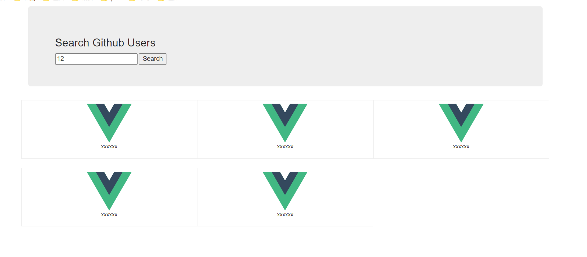
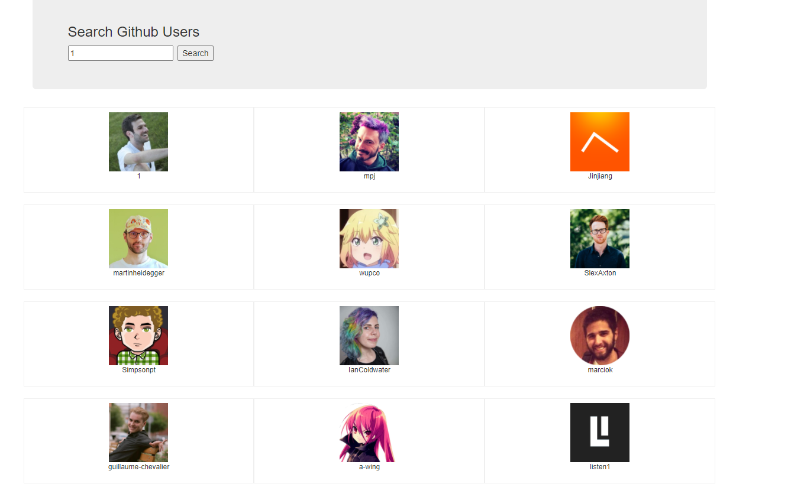

# 项目练习：GitHub搜索

## 静态页面

### css

bootstrap.css需要

index.css

```java
.album {
  min-height: 50rem; /* Can be removed; just added for demo purposes */
  padding-top: 3rem;
  padding-bottom: 3rem;
  background-color: #f7f7f7;
}

.card {
  float: left;
  width: 33.333%;
  padding: .75rem;
  margin-bottom: 2rem;
  border: 1px solid #efefef;
  text-align: center;
}

.card > img {
  margin-bottom: .75rem;
  border-radius: 100px;
}

.card-text {
  font-size: 85%;
}

```

### html

````java
<!DOCTYPE html>
<html lang="en">
<head>
  <meta charset="UTF-8">
  <title>Title</title>
  <link rel="stylesheet" href="./bootstrap.css">
  <link rel="stylesheet" href="./index.css">
</head>
<body>
<div id="app">
  <div class="container">
    <section class="jumbotron">
      <h3 class="jumbotron-heading">Search Github Users</h3>
      <div>
        <input type="text" placeholder="enter the name you search"/>&nbsp;<button>Search</button>
      </div>
    </section>
    <div class="row">
      <div class="card">
        <a href="https://github.com/xxxxxx" target="_blank">
          
        </a>
        <p class="card-text">xxxxxx</p>
      </div>
      <div class="card">
        <a href="https://github.com/xxxxxx" target="_blank">
          
        </a>
        <p class="card-text">xxxxxx</p>
      </div>
      <div class="card">
        <a href="https://github.com/xxxxxx" target="_blank">
          
        </a>
        <p class="card-text">xxxxxx</p>
      </div>
      <div class="card">
        <a href="https://github.com/xxxxxx" target="_blank">
          
        </a>
        <p class="card-text">xxxxxx</p>
      </div>
      <div class="card">
        <a href="https://github.com/xxxxxx" target="_blank">
          
        </a>
        <p class="card-text">xxxxxx</p>
      </div>
    </div>
  </div>
</div>
</body>
</html>
````

### 效果



## 请求地址

https://api.github.com/search/users?q=????

## main.js

```java
import Vue from 'vue'
import App from './App.vue'
import axios from 'axios'
Vue.config.productionTip = false


new Vue({
    render: h => h(App),
    beforeCreate() {
        Vue.prototype.$bus = this
        Vue.prototype.axios = axios
    }
}).$mount('#app')
```

## index.html

```java
<!DOCTYPE html>
<html lang="">
  <head>
    <meta charset="utf-8">
    <meta http-equiv="X-UA-Compatible" content="IE=edge">
    <meta name="viewport" content="width=device-width,initial-scale=1.0">
    <link rel="icon" href="<%= BASE_URL %>favicon.ico">
    <link rel="stylesheet" href="<%= BASE_URL %>css/bootstrap.css">
    <title><%= htmlWebpackPlugin.options.title %></title>
  </head>
  <body>
    <noscript>
      <strong>We're sorry but <%= htmlWebpackPlugin.options.title %> doesn't work properly without JavaScript enabled. Please enable it to continue.</strong>
    </noscript>
    <div id="app"></div>
    <!-- built files will be auto injected -->
  </body>
</html>
```

## app.vue

```java
<template>
  <div class="container">
    <Search></Search>
    <List></List>
  </div>
</template>
<script>
import Search from "@/components/github/Search";
import List from "@/components/github/List";
export default {
  name: 'App',
  components:{Search,List},
  data() {
    return {}
  }, methods: {

  }
}
</script>
```

## search.vue

```java
<template>
  <section class="jumbotron">
    <h3 class="jumbotron-heading">Search Github Users</h3>
    <div>
      <input type="text" placeholder="enter the name you search" v-model="message"/>&nbsp;
      <button @click="search">Search</button>
    </div>
  </section>
</template>

<script>
import axios from "axios";

export default {
  name: "Search",
  data() {
    return {
      message: ''
    }
  }, methods: {
    search() {
      axios.get(`https://api.github.com/search/users?q=${this.message}`)
          .then(
              (response) => {
                console.log('请求成功吧',response.data.items)
                this.$bus.$emit('getUsers',response.data.items)
              },
              (error) => {
                console.log('请求失败了',error)
              }
          )
    }

  }
}
</script>

<style scoped>

</style>
```

## list.vue

```java
<template>
  <div class="row">
    <!-- 展示用户列表 -->
    <div  class="card" v-for="user in users" :key="user.id">
      <a :href="user.html_url" target="_blank">
        
      </a>
      <p class="card-text">{{user.login}}</p>
    </div>
  </div>
</template>

<script>
export default {
  name: "List",
  data() {
    return {
      users:[]
    }
  },mounted() {
    this.$bus.$on('getUsers',(lists)=>{
      console.log('接收到数据了',lists)
      this.users = lists
    })
  }
}
</script>

<style scoped>
.album {
  min-height: 50rem; /* Can be removed; just added for demo purposes */
  padding-top: 3rem;
  padding-bottom: 3rem;
  background-color: #f7f7f7;
}

.card {
  float: left;
  width: 33.333%;
  padding: .75rem;
  margin-bottom: 2rem;
  border: 1px solid #efefef;
  text-align: center;
}

.card > img {
  margin-bottom: .75rem;
  border-radius: 100px;
}

.card-text {
  font-size: 85%;
}
</style>
```

## 测试




